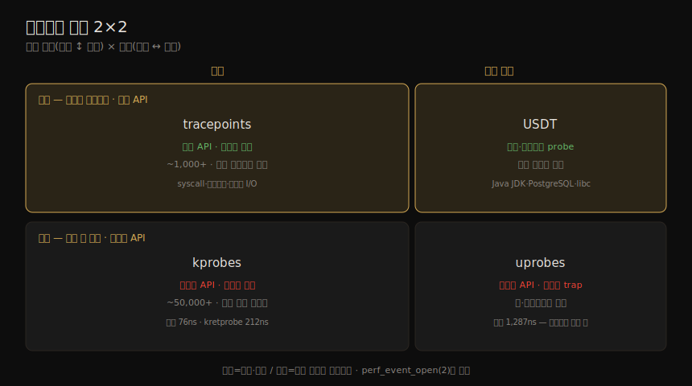

# 관측 도구 (2) — 관측 소스
---
> 이 노트는 4장의 핵심 부분으로, 관측 도구가 *데이터를 어디서 가져오는가* 를 잡습니다. /proc·/sys(카운터)부터 tracepoints·kprobes·uprobes·USDT(트레이싱)·PMC(하드웨어 카운터)까지, Linux의 관측 소스를 하나씩 봅니다. 특히 트레이싱 소스 넷(tracepoints·kprobes·uprobes·USDT)은 정적/동적·커널/유저의 2×2로 나뉘며, 이 책 후반(13~15장 트레이싱 도구)이 모두 이 소스 위에 섭니다.

도구를 분류했으니(04-01), 이제 그 도구들이 *데이터를 길어 올리는 우물* 을 봅니다. 같은 통계라도 어느 소스에서 오느냐에 따라 정확도·오버헤드·안정성이 다릅니다. 저자가 든 핵심 비교 하나가 이 노트를 꿰뚫습니다 — tracepoints는 *안정 API*(수는 적지만 도구가 깨지지 않음), kprobes는 *불안정 API*(거의 무한하지만 커널 버전 간 바뀔 수 있음)입니다.

> 트레이싱 소스의 2×2 구분이 핵심입니다. 정적(소스에 박힘)이냐 동적(실행 중 끼움)이냐, 커널이냐 유저냐로 — tracepoints(정적·커널)·kprobes(동적·커널)·USDT(정적·유저)·uprobes(동적·유저) — 네 칸이 채워집니다. 이 소스들은 04-03 의 트레이서(perf·Ftrace·BPF)가 쓰며 13~15장에서 깊어집니다.


## 1. 관측 소스 한눈에

> Linux 관측 소스는 카운터 계열(/proc·/sys)과 트레이싱 계열(tracepoints·kprobes·uprobes·USDT·PMC 등)로 나뉩니다. 각 소스가 어떤 데이터를 어떤 방식으로 주는지 표로 먼저 잡아 둡니다.

Linux 관측 도구가 데이터를 얻는 인터페이스들입니다.

| 유형 | 소스 |
|------|------|
| 프로세스별 카운터 | /proc |
| system-wide 카운터 | /proc, /sys |
| 장치 설정·카운터 | /sys |
| cgroup 통계 | /sys/fs/cgroup |
| 프로세스별 트레이싱 | ptrace |
| 하드웨어 카운터(PMC) | perf_event |
| 네트워크 통계 | netlink |
| 네트워크 패킷 캡처 | libpcap |
| 스레드별 지연 메트릭 | delay accounting |
| system-wide 트레이싱 | 함수 프로파일링(Ftrace)·tracepoints·software events·kprobes·uprobes·perf_event |

이 중 트레이싱 소스 넷(tracepoints·kprobes·uprobes·USDT)의 정적/동적·커널/유저 구분을 한 장으로 정리하면 다음과 같습니다.




## 2. /proc — 커널 통계 파일시스템

> /proc는 커널 통계를 위한 파일시스템 인터페이스입니다. PID별 디렉토리에 프로세스 정보가, 최상위에 system-wide 통계가 있습니다. 커널이 동적 생성하며 메모리에서 돕니다(디스크 미사용). 대부분 읽기 비용은 미미하나, 일부 메모리 맵 파일은 페이지 테이블을 순회해 비쌉니다.

/proc는 커널 통계를 위한 파일시스템 인터페이스입니다. 프로세스 ID로 이름 붙은 디렉토리마다 그 프로세스의 정보·통계 파일이 커널 자료구조에서 매핑돼 있고, 최상위엔 system-wide 통계가 있습니다. 커널이 *동적 생성* 하며 스토리지가 아닌 메모리에서 돕니다 — 대부분 읽기 전용(관측용)이고 일부는 쓰기 가능(프로세스·커널 제어용)입니다. 파일시스템 인터페이스라 POSIX 호출(open·read·close)로 쓰고, `cd`·`cat`·`grep`·`awk` 로 탐색하며, 파일 권한으로 보안을 줍니다.

| 프로세스별(/proc/PID) | 뜻 |
|----------------------|-----|
| limits | 유효 자원 한도 |
| maps·smaps | 매핑된 메모리 영역(+ 사용 통계) |
| sched·schedstat | CPU 스케줄러 통계·런타임·지연 |
| stat·statm·status | 프로세스 상태·통계(총 CPU·메모리) |
| fd | 파일 디스크립터 심링크 |

| system-wide(/proc) | 뜻 |
|--------------------|-----|
| cpuinfo | 물리 프로세서 정보(모델·클럭·캐시) |
| diskstats | 전 디스크 I/O 통계 |
| interrupts | CPU별 인터럽트 카운터 |
| loadavg | 부하 평균 |
| meminfo | 시스템 메모리 사용 분해 |
| stat | 커널·시스템 자원 통계 요약(CPU·디스크·페이징·프로세스) |

> `top` 은 PID별 디렉토리의 `stat` 파일을 모든 활성 프로세스에 대해 읽습니다 — 프로세스가 많은 시스템에선 이 오버헤드가 눈에 띄어, *`top` 자신이 최대 CPU 소비자* 로 보고되기도 합니다. /proc 파일은 보통 텍스트라 읽기 쉽지만, 커널이 통계를 텍스트로 인코딩하고 유저 도구가 파싱하는 작은 오버헤드가 듭니다 — netlink(§5)가 더 효율적인 바이너리 인터페이스입니다. CPU 사용률 정확도는 커널 CONFIG에 달려 있습니다 — 기본은 clock tick 단위(4ms 정도)지만, 더 높은 정확도 옵션과 MSR·PMC 사용법도 있습니다.


## 3. /sys — sysfs 디렉토리 구조

> /sys(sysfs)는 2.6 커널에서 도입된 디렉토리 기반 커널 통계 인터페이스입니다. 원래 디바이스 드라이버 통계용이었으나 모든 통계 유형으로 확장됐습니다. 수만 개의 읽기 전용 통계와, 커널 상태를 바꾸는 쓰기 가능 파일이 있습니다.

/sys(sysfs, 2.6 커널 도입)는 디렉토리 기반 커널 통계 인터페이스입니다. /proc가 시간에 따라 진화해 system-wide 통계가 최상위에 뒤섞인 것과 달리, sysfs는 원래 디바이스 드라이버 통계용으로 설계됐다가 모든 통계 유형으로 확장됐습니다. 예로 `/sys/devices/system/cpu/cpu0/cache/index*/` 에서 CPU 캐시 정보(level·size)를 봐, CPU 0이 32KB L1 둘·1MB L2·33MB L3를 가짐을 알 수 있습니다.

> /sys는 보통 수만 개의 읽기 전용 통계 파일과, 커널 상태를 바꾸는 쓰기 가능 파일을 가집니다 — 예로 CPU를 online/offline으로 두려면 `online` 파일에 "1"/"0"을 씁니다(`echo 1 > filename`). cgroup 통계는 `/sys/fs/cgroup` 에 있습니다.


## 4. delay accounting — 스레드별 지연

> CONFIG_TASK_DELAY_ACCT 옵션은 태스크별로 네 상태의 대기 시간을 추적합니다 — 스케줄러 지연(on-CPU 대기), 블록 I/O 대기, 스와핑(메모리 압박) 대기, 메모리 회수 대기. taskstats(netlink 기반)로 읽습니다.

`CONFIG_TASK_DELAY_ACCT` 옵션을 켠 시스템은 태스크별로 네 상태의 대기 시간을 추적합니다.

| 상태 | 뜻 |
|------|-----|
| 스케줄러 지연 | on-CPU 차례 대기 |
| 블록 I/O | 블록 I/O 완료 대기 |
| 스와핑 | 페이징(메모리 압박) 대기 |
| 메모리 회수 | 메모리 회수 루틴 대기 |

> taskstats(태스크·프로세스 통계용 netlink 기반 인터페이스)로 읽습니다. 커널 소스의 `getdelays.c` 예제로 PID의 CPU·IO·SWAP·RECLAIM 지연을 볼 수 있습니다(시간은 별도 표기 없으면 나노초). 스케줄러 지연 통계는 기술적으로 schedstats에서 오지만 다른 delay accounting 상태와 함께 노출됩니다.


## 5. netlink — 효율적 바이너리 인터페이스

> netlink는 커널 정보를 가져오는 특수 소켓 주소 패밀리(AF_NETLINK)입니다. 소켓을 열고 send/recv로 바이너리 struct를 주고받습니다. /proc보다 복잡하지만 더 효율적이고 알림도 지원합니다. ss·ip·routel이 씁니다.

netlink는 커널 정보를 가져오는 특수 소켓 주소 패밀리(`AF_NETLINK`)입니다. 이 패밀리로 소켓을 열고 일련의 `send`·`recv` 로 요청·정보를 바이너리 struct로 주고받습니다. /proc보다 쓰기 복잡하지만 더 효율적이고 *알림(notification)* 도 지원합니다.

> `ss(8)` 를 strace로 보면 `NETLINK_SOCK_DIAG`(소켓 정보) 그룹의 `AF_NETLINK` 소켓을 엽니다. netlink 그룹엔 `NETLINK_ROUTE`(경로)·`NETLINK_SOCK_DIAG`(소켓)·`NETLINK_SELINUX`·`NETLINK_AUDIT`·`NETLINK_CRYPTO` 등이 있습니다. `ip`·`ss`·`routel` 과 옛 `ifconfig`·`netstat` 이 netlink를 씁니다.


## 6. tracepoints — 정적·커널·안정 API

> tracepoints는 커널 코드의 논리적 위치에 하드코딩된 정적 계측점입니다(syscall 시작/끝·스케줄러·파일시스템·디스크 I/O). 안정 API라 견고한 도구를 만들 수 있고, 이벤트 발생뿐 아니라 format string으로 컨텍스트 데이터(인자)도 줍니다.

tracepoints는 정적 계측 기반의 Linux 커널 이벤트 소스로, 커널 코드의 논리적 위치에 하드코딩된 계측점입니다(syscall 시작/끝·스케줄러·파일시스템·디스크 I/O 등). 2009년 2.6.32에 도입됐고 **안정 API** 이며 수가 제한적입니다. 성능 분석에 중요한 까닭은, 요약 통계를 넘어 커널 동작의 깊은 통찰을 주는 고급 트레이싱 도구를 떠받치고, *함수 기반 트레이싱(kprobes)과 달리 안정 인터페이스* 라 견고한 도구를 만들 수 있기 때문입니다.

#### 인자와 format string

tracepoint는 이벤트 발생뿐 아니라 *컨텍스트 데이터(인자)* 도 줍니다 — 각 tracepoint의 *format string* 에 인자가 담깁니다(`/sys/kernel/debug/tracing/events/.../format`). 예로 `block:block_rq_issue` 를 추적하면 dev·sector·bytes·rwbs·comm 같은 인자가 나옵니다. 트레이서는 인자를 이름으로 접근해 필터링합니다(예: `bytes > 65536` 인 I/O만).

```
# bpftrace -e 't:block:block_rq_issue { printf("size: %d bytes\n", args->bytes); }'
size: 4096 bytes
size: 49152 bytes
```

> 용어 주의: *tracepoint*(또는 trace point)는 기술적으로 커널 소스의 추적 함수(예: `trace_sched_wakeup()`)이고, "sched:sched_wakeup"으로 계측되는 것은 `TRACE_EVENT` 매크로로 정의된 *trace event* 입니다. 트레이싱 도구는 주로 trace event를 계측하면서 "tracepoint"라 부릅니다.

#### 안정성과 오버헤드

tracepoints는 *tracepoint 이름·format string·인자* 로 이뤄진 **안정 API** 입니다. tracefs 파일이나 `perf_event_open(2)` 로 씁니다. 활성 시 이벤트마다 작은 CPU 오버헤드가 더해집니다 — 저자 경험상 4~128 CPU 시스템에서 *초당 1만 미만은 무시할 만* 하고, 10만을 넘어야 측정될 수준이 됩니다(디스크 이벤트는 보통 1만 미만, 스케줄러 이벤트는 10만 초과로 비쌀 수 있음). 최소 tracepoint 오버헤드는 96나노초로 측정됐고, raw tracepoints(4.7)는 안정 인자 생성 비용을 피해 이를 줄입니다. *비활성* 오버헤드는 x86_64에서 5바이트 nop 명령 정도로 미미합니다.

| 항목 | kprobes | tracepoints |
|------|---------|-------------|
| 유형 | 동적 | 정적 |
| 대략 이벤트 수 | 50,000+ | 1,000+ |
| 커널 유지보수 | 없음 | 필요 |
| 비활성 오버헤드 | 없음 | 작음(NOP+메타데이터) |
| 안정 API | 아니오 | 예 |


## 7. kprobes — 동적·커널·불안정 API

> kprobes는 동적 계측 기반으로, 어떤 커널 함수·명령이든 추적합니다(2.6.9, 2004). 실행 중인 커널 코드의 명령 텍스트를 수정해 계측을 끼웁니다. raw 커널 함수·인자를 노출해 불안정 API지만, 다른 도구로 안 보이는 성능 이슈를 보는 *최후의 수단* 입니다.

kprobes(kernel probes)는 동적 계측 기반의 Linux 커널 이벤트 소스로, *어떤 커널 함수·명령이든* 추적합니다(2.6.9, 2004). raw 커널 함수·인자를 노출해 커널 버전 간 바뀔 수 있는 **불안정 API** 입니다. 표준 방식은 실행 중인 커널 코드의 명령 텍스트를 수정해 계측을 끼우는 것이고, 함수 진입 계측 시엔 오버헤드가 낮은 기존 Ftrace 함수 추적을 쓰는 최적화가 있습니다.

kprobes가 중요한 까닭은, 다른 도구로 안 보이는 성능 이슈를 관찰할 *최후의 수단* — 프로덕션 커널 동작에 대한 거의 무한한 정보원 — 이기 때문입니다. 함수 진입과 함수 안 명령 offset을 추적할 수 있고, *kprobe event* 는 트레이서가 만들 때만 존재합니다(기본은 커널 코드가 미변경으로 실행).

#### 인자·kretprobes·오버헤드

함수 인자는 `arg0..argN` 으로 접근합니다(예: `do_nanosleep` 의 arg1=hrtimer_mode). 함수 *반환과 반환값* 은 **kretprobes** 로 추적합니다 — 진입 kprobe가 trampoline 함수를 끼워 반환을 계측합니다. kprobe+kretprobe와 타임스탬프를 짝지으면 커널 함수 *지속 시간* 을 잴 수 있습니다(예: `do_nanosleep` 지연 히스토그램). 오버헤드는 함수 진입 추적 시(Ftrace 방식) tracepoints와 비슷하고, offset 추적(breakpoint)·kretprobe(trampoline)는 더 높습니다 — 최소 kprobe 76ns, kretprobe 212ns로 측정됐습니다.


## 8. uprobes·USDT — 유저 공간 트레이싱

> uprobes는 kprobes의 유저 공간 판으로, 앱·라이브러리 함수를 동적 계측합니다(3.5, 2012). USDT는 tracepoints의 유저 공간 판으로, 앱이 코드에 박은 정적·안정 probe입니다(Java JDK·PostgreSQL·libc). uprobes는 커널로 trap해 오버헤드가 큽니다.

#### uprobes

uprobes(user-space probes)는 kprobes와 비슷하나 유저 공간용으로, 앱·라이브러리 함수를 동적 계측해 다른 도구로 못 닿는 SW 내부를 봅니다(3.5, 2012). 불안정 API입니다. 예로 bash의 `decode_prompt_string()` 진입을 계측해 첫 인자(프롬프트 문자열)를 찍을 수 있습니다. *uprobe event* 는 필요할 때만 만들어지고 유저 코드는 기본 미변경입니다(디버거가 breakpoint를 더하기 전 함수가 미변경으로 도는 것과 같음). 반환은 **uretprobes** 로 추적하나, 빠른 함수 측정은 그 오버헤드가 크게 왜곡할 수 있습니다.

> uprobes는 현재 *커널로 trap* 해 kprobes·tracepoints보다 CPU 오버헤드가 훨씬 큽니다 — 최소 uprobe 1,287ns, uretprobe 1,931ns로 측정됐습니다(uretprobe는 uprobe+trampoline이라 더 큼).

#### USDT

USDT(user-level statically-defined tracing)는 tracepoints의 유저 공간 판입니다 — uprobes : USDT = kprobes : tracepoints. 일부 앱·라이브러리(Java JDK·PostgreSQL·libc)가 코드에 USDT probe를 더해 앱 레벨 이벤트 추적의 *안정(문서화된) API* 를 줍니다. 커스텀 이벤트 로그와 다른 점은, USDT는 여러 트레이서가 *앱 컨텍스트와 커널 이벤트(디스크·네트워크 I/O)를 결합* 할 수 있다는 것입니다 — 앱 로거가 "쿼리가 파일시스템 I/O로 느림"이라 말할 때, 트레이서는 "디스크 I/O가 아니라 파일시스템 락 경합 때문"임을 드러냅니다.

> USDT probe는 실행파일에 컴파일돼 들어가야 합니다(`--enable-dtrace-probes` 같은 옵션). JIT 컴파일 언어(Java)는 즉석 컴파일이라 불가능해, probe를 공유 라이브러리로 미리 컴파일하는 *dynamic USDT* 가 해법입니다(Java·Node.js 등). USDT는 Linux에서 uprobes로 구현되며, tracepoints처럼 코드에 nop 명령을 둡니다.


## 9. PMC — 하드웨어 성능 카운터

> PMC(performance monitoring counter)는 프로세서의 프로그래머블 하드웨어 레지스터로, CPU 사이클 수준의 저수준 성능 정보를 줍니다. PMC로만 CPU 명령 효율·캐시 적중률·버스 사용률·stall 사이클을 잴 수 있어 성능 분석의 필수 자원입니다.

PMC(performance monitoring counter, CPC·PIC·PMU event로도 불림)는 프로세서의 프로그래머블 하드웨어 레지스터로, CPU 사이클 수준의 저수준 성능 정보를 줍니다. PMC로만 — CPU 명령 효율, CPU 캐시 적중률, 메모리·장치 버스 사용률, 인터커넥트 사용률, stall 사이클 등 — 을 잴 수 있어 성능 분석의 필수 자원입니다. Intel은 일곱 개를 "architectural set"으로 골랐습니다(UnHalted Core Cycles·Instruction Retired·LLC References·LLC Misses·Branch Instruction Retired 등).

예로 `perf stat` 을 이벤트 지정 없이 돌리면 architectural PMC를 계측합니다 — 핵심 메트릭 *IPC(instructions per cycle)* 가 나와, CPU가 명령을 얼마나 효율적으로 실행하는지 보여 줍니다(높을수록 좋음, 6장).

#### 인터페이스·모드·도전

Linux는 `perf_event_open(2)` 로 PMC에 접근합니다(perf가 소비). 수백 개 PMC가 있지만 동시 측정 레지스터는 적어(여섯 개 정도) 어느 PMC를 잴지 골라야 합니다. 두 모드가 있습니다.

| 모드 | 뜻 |
|------|-----|
| counting | 거의 0 오버헤드로 이벤트를 셈 — 문제 정량화 |
| overflow sampling | N 이벤트마다 인터럽트로 상태 포착 — 책임 코드 경로 |

> 두 도전이 있습니다. **정확도** — overflow sampling은 인터럽트 지연("skid")·비순차 실행으로 정확한 instruction pointer를 못 잡을 수 있습니다. 해법은 *precise events*(Intel PEBS·AMD IBS)로, 하드웨어 버퍼로 더 정확한 IP를 기록합니다. **가용성** — 많은 클라우드가 게스트의 PMC 접근을 막습니다(일부는 Nitro·bare-metal에서 활성). PMC는 프로세서별이라 해당 프로세서 매뉴얼에 문서화됩니다.


## 10. 기타 관측 소스

> MSR·ptrace·함수 프로파일링·libpcap·netfilter conntrack·프로세스 어카운팅·software events·시스템 콜 등 다른 소스도 있습니다. 커널 버전·옵션에 따라 더 많을 수 있고, 없으면 디버거(gdb·lldb)로 변수를 들여다볼 수 있습니다.

| 소스 | 뜻 |
|------|-----|
| MSR(model-specific register) | PMC가 MSR로 구현됨. 클럭·사용·온도·전력 등 설정·건강 — 정확한 CPU 사용률 측정 |
| ptrace(2) | 프로세스 추적 제어(gdb 디버깅·strace syscall 추적). breakpoint 기반이라 100배+ 느려짐 |
| 함수 프로파일링 | 비인라인 커널 함수 시작의 `mcount`·`__fentry__` — Ftrace 함수 추적용(평소 nop) |
| libpcap | 네트워크 패킷 캡처(tcpdump) — CPU·저장 오버헤드 |
| netfilter conntrack | 이벤트별 커스텀 핸들러 — 방화벽뿐 아니라 연결 추적·네트워크 흐름 로그 |
| 프로세스 어카운팅 | 프로세스 실행·런타임 기반 — atop이 단명 프로세스를 잡는 데 씀 |
| software events | HW 이벤트 관련이나 SW로 계측(page fault 등) — perf_event_open으로 노출 |
| 시스템 콜 | getrusage(2) 등 — 프로세스가 자기 자원 사용(user/system time·fault·context switch) 조회 |

> 커널 버전·옵션에 따라 I/O accounting·blktrace·lockstat·debugfs 등이 더 있을 수 있습니다. 관측할 커널 코드를 읽어 어떤 통계·tracepoint가 있는지 찾는 게 한 방법입니다. 커널 통계가 아예 없으면, 동적 계측(kprobes·uprobes) 너머로 디버거(gdb·lldb)가 커널·앱 변수를 가져와 단서를 줄 수 있습니다. (Solaris는 다른 방식으로 `module:instance:name:statistic` 4-tuple의 Kstat 프레임워크를 씀 — Linux의 텍스트 파싱 /proc보다 일관적.)


## 학습 점검

> 이 노트의 핵심을 스스로 떠올려 봅니다. 답이 막히면 해당 섹션으로 돌아가 확인합니다.

- 트레이싱 소스 2×2(tracepoints·kprobes·uprobes·USDT)를 정적/동적·커널/유저로 분류해 봅니다. (→ §1, §6~8)
- /proc가 텍스트라 편하지만 netlink가 더 효율적인 이유와, `top` 이 자신을 최대 CPU 소비자로 보고하는 까닭을 설명해 봅니다. (→ §2, §5)
- tracepoints가 안정 API라 견고한 도구를 만들 수 있는 반면 kprobes가 불안정 API인 까닭, 그리고 둘의 이벤트 수·커널 유지보수 차이를 말해 봅니다. (→ §6, §7)
- kprobe/kretprobe와 타임스탬프로 함수 지속 시간을 어떻게 재는지 떠올려 봅니다. (→ §7)
- USDT가 커스텀 앱 로그와 무엇이 다른지(앱 컨텍스트+커널 이벤트 결합), JIT 언어에 dynamic USDT가 필요한 이유를 설명해 봅니다. (→ §8)
- PMC로만 잴 수 있는 것(IPC·캐시 적중률 등)과, overflow sampling의 skid를 precise events가 어떻게 푸는지 말해 봅니다. (→ §9)
