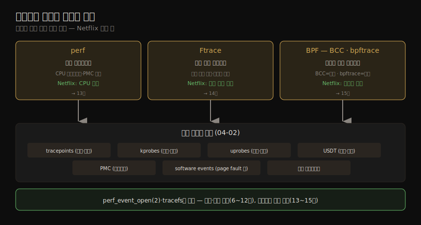

# 관측 도구 (3) — sar·트레이싱 도구·관측의 관측
---
> 이 노트는 4장의 마지막 부분으로, *모니터링의 핵심 도구 sar* 와 *고급 분석의 트레이싱 도구* 를, 그리고 도구 자체를 의심하는 태도(관측의 관측)를 잡습니다. sar는 BPF 트레이싱의 화려함에 가려지기 쉽지만 그 자체로 많은 성능 이슈를 푸는 필수 도구입니다. 트레이싱 도구(perf·Ftrace·BPF)는 04-02 의 이벤트 소스를 써 고급 분석을 합니다. 마지막으로, 모든 도구·통계·문서가 틀릴 수 있음을 잊지 말라는 장입니다.

저자는 BPF 트레이싱의 "초능력"에 자신도 한몫했지만 *sar의 효용을 간과하지 말라* 고 합니다 — sar는 그 자체로 많은 성능 이슈를 푸는 필수 도구이고, Linux판은 자기 설명적 열 머리말·네트워크 메트릭 그룹·상세 man page로 잘 설계됐습니다. 이 노트는 그 sar와, 04-02 의 소스를 쓰는 트레이서들, 그리고 도구를 *건강한 회의* 로 대하는 태도로 4장을 마무리합니다.

> 이 노트의 트레이싱 도구(perf·Ftrace·BPF)는 13~15장에서 깊어집니다. 책은 의도적으로 *사용·성능 이득을 먼저* 보이고(6~12장), 트레이서 자체는 나중에 다룹니다.


## 1. sar — 시스템 활동 리포터

> sar는 카운터 기반 모니터링 도구로, cron 에이전트가 정해진 시각에 system-wide 카운터를 기록합니다. CPU·메모리·디스크·네트워크·인터럽트·전력·팬까지 폭넓게 봅니다. 옵션별로 통계 그룹을 보고하며, 여러 옵션을 함께 쓸 수 있습니다.

sar(System Activity Reporter)는 카운터 기반 모니터링 도구로, sysstat 패키지로 제공됩니다. 폭넓은 커널·장치 커버리지(심지어 팬까지)를 가지며, 옵션별로 통계 그룹을 봅니다.

| 옵션 | 통계 그룹 |
|------|----------|
| -u | CPU |
| -r | 메모리 |
| -d | 디스크 |
| -n DEV / -n TCP / -n ETCP | 네트워크 장치 / TCP / TCP 에러 |
| -q | 런큐·부하 평균 |
| -B | 페이징 |
| -m | 전력 관리(전압·온도·USB) |

#### 모니터링 설정과 보고

sar 데이터 수집이 이미 켜져 있을 수 있고, 아니면 켜야 합니다(옵션 없이 `sar` 실행해 확인). Ubuntu에선 `/etc/default/sysstat` 의 `ENABLED="true"` 로 켜고 `service sysstat restart` 합니다. 수집 스케줄은 `/etc/cron.d/sysstat` 의 crontab에 있습니다 — `5-55/10` 은 매시 5~55분에 10분마다 기록입니다. 저자는 흔히 `*/5 ... -S ALL` 로 5분마다 *모든* 통계 그룹을 기록하게 바꿉니다(기본은 대부분만 기록). 보고는 여러 옵션을 함께 줄 수 있습니다.

```
$ sar -u -n TCP,ETCP        # CPU + TCP + TCP 에러
$ sar -A                    # 모든 통계 덤프
```

#### 출력 형식·라이브 모드

sysstat의 `sadf(1)` 로 다른 형식 — JSON(`-j`, 다른 SW 위에 구축 시)·SVG(`-g`, 브라우저 대시보드)·CSV(`-d`, DB 임포트) — 으로 봅니다. interval·count를 주면 *라이브 보고* 가 돼, 데이터 수집이 꺼져 있어도 초 단위 변동을 봅니다(예: `sar -n TCP 1 5`). 데이터 수집은 5·10분 같은 긴 간격용, 라이브는 초 단위 변동용입니다. 서드파티 모니터링 제품은 흔히 sar나 그것이 쓰는 같은 관측 통계 위에 구축돼 메트릭을 네트워크로 노출합니다. man page는 개별 통계를 SNMP 이름과 함께 문서화합니다(예: `active/s` = `[tcpActiveOpens]`).


## 2. 트레이싱 도구 — perf·Ftrace·BPF

> Linux 트레이싱 도구는 04-02 의 이벤트 인터페이스(tracepoints·kprobes·uprobes·USDT)를 써 고급 성능 분석을 합니다. perf는 공식 프로파일러, Ftrace는 공식 내장 트레이서, BPF(BCC·bpftrace)는 차세대 고급 트레이싱을 떠받칩니다.

Linux 트레이싱 도구는 앞서 본 이벤트 인터페이스(tracepoints·kprobes·uprobes·USDT)를 써 고급 성능 분석을 합니다. 도구들이 같은 이벤트 소스 위에서 어떻게 나뉘는지(Netflix 분업 예 포함)를 한 장으로 정리하면 다음과 같습니다.



| 도구 | 성격 |
|------|------|
| perf | 공식 Linux 프로파일러 — CPU 프로파일링(스택 표집)·PMC 분석에 탁월, 다른 이벤트도 계측해 출력 파일로 후처리 |
| Ftrace | 공식 Linux 트레이서 — 여러 추적 유틸의 multi-tool. 커널 코드 경로 분석·의존성 없는 자원 제약 시스템에 적합 |
| BPF(BCC·bpftrace) | 고급 트레이싱 — BCC는 강력한 도구, bpftrace는 커스텀 one-liner·짧은 프로그램용 고수준 언어 |
| SystemTap | 고수준 언어·트레이서(많은 tapset). 최근 BPF 백엔드 개발 중 |
| LTTng | 블랙박스 기록 최적화 — 많은 이벤트를 최적 기록해 나중 분석 |

> 앞 셋(perf·Ftrace·BPF)은 각각 13·14·15장에서 다룹니다. 저자는 Netflix에서 *perf로 CPU 분석, Ftrace로 커널 코드 파기, BCC/bpftrace로 나머지 전부*(메모리·파일시스템·디스크·네트워킹·앱 추적)를 합니다. 뒤 장(5~12장)은 이 트레이서들의 구체적 명령·해석을 먼저 보이고, 트레이서 자체의 상세는 나중(13~15장)에 다룹니다 — *사용·성능 이득을 우선* 하는 의도적 순서입니다.


## 3. 관측의 관측 — 도구를 의심하라

> 관측 도구·통계·문서는 모두 SW라 버그가 있을 수 있습니다. 새 통계는 *건강한 회의* 로 대해, 정말 무엇을 뜻하고 정말 맞는지 물어야 합니다. 도구·측정·man page가 틀릴 수 있고, 메트릭이 불완전하거나 잘못 설계됐을 수 있습니다.

관측 도구와 그 통계는 SW로 구현되며, 모든 SW엔 버그 가능성이 있습니다 — 그것을 설명하는 문서도 마찬가지입니다. 처음 보는 통계는 *건강한 회의(healthy skepticism)* 로 대해, 정말 무엇을 뜻하고 정말 맞는지 물어야 합니다.

메트릭이 겪을 수 있는 문제입니다.

- 도구·측정이 틀릴 때가 있음
- man page가 늘 맞진 않음
- 가용 메트릭이 불완전할 수 있음
- 가용 메트릭이 잘못 설계돼 혼란스러울 수 있음
- 메트릭 수집기(도구 출력 파싱)에 버그가 있을 수 있음
- 메트릭 처리(알고리즘·스프레드시트)가 오류를 낼 수 있음

> 저자가 든 사례 — 한 벤치마킹 회사의 셸 스크립트가 `fio` 출력 "100KB/s"에서 정규식으로 비숫자를 지워 "100"으로 만들었는데, fio가 단위(bytes·KB·MB)를 섞어 보고해 1024배 오류가 났고, 소수점도 지워 "1.6"이 "16"이 됐습니다.

#### 검증 기법

여러 도구의 커버리지가 겹치면 *서로 교차 검증* 합니다 — 이상적으로 다른 계측 프레임워크를 써 프레임워크 버그도 점검합니다(동적 계측이 이에 유용 — 커스텀 도구로 재확인). 또 *알려진 워크로드* 를 걸어 도구가 기대 결과와 맞는지 봅니다(마이크로벤치마크 활용). 때로는 도구·통계가 아니라 *문서(man page)* 가 틀립니다 — SW가 진화했는데 문서가 안 따라온 것입니다.

현실적으로 모든 측정을 일일이 재확인할 시간은 없어, 이상한 결과나 회사에 결정적인 결과일 때만 합니다. 재확인을 안 하더라도 *안 했음을 인식하고 도구가 맞다고 가정했음을 아는 것* 만으로 가치가 있습니다. 메트릭의 *부재* 는 나쁜 메트릭의 *존재* 보다 식별하기 어렵습니다 — 2장의 방법론(성능 분석에 답이 필요한 질문 연구)이 빠진 메트릭을 찾는 데 도움이 됩니다.


## 학습 점검

> 이 노트의 핵심을 스스로 떠올려 봅니다. 답이 막히면 해당 섹션으로 돌아가 확인합니다.

- sar의 데이터 수집(긴 간격)과 라이브 모드(초 단위 변동)의 차이, `sadf` 의 세 출력 형식(JSON·SVG·CSV) 용도를 설명해 봅니다. (→ §1)
- perf·Ftrace·BPF 각각의 강점과, 저자가 Netflix에서 셋을 어떻게 나눠 쓰는지 떠올려 봅니다. (→ §2)
- 책이 트레이서 사용(6~12장)을 트레이서 상세(13~15장)보다 먼저 다루는 의도를 말해 봅니다. (→ §2)
- 메트릭이 겪을 수 있는 문제 여섯 가지 중 셋을 들고, "건강한 회의"가 왜 필요한지 설명해 봅니다. (→ §3)
- 도구 교차 검증과 알려진 워크로드 검증이 어떻게 도구 버그를 잡는지, 메트릭의 부재가 왜 식별하기 더 어려운지 떠올려 봅니다. (→ §3)
