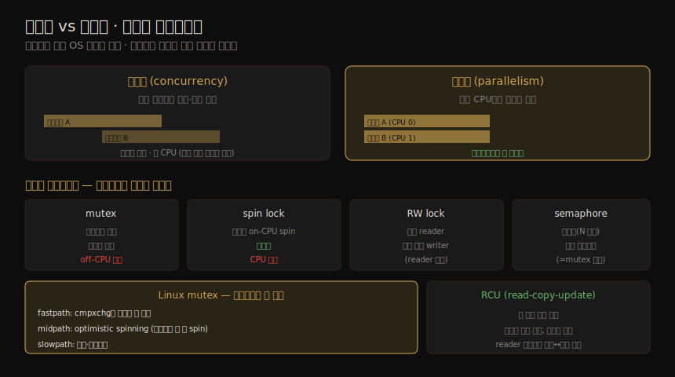

# 애플리케이션 (1) — 기초와 성능 기법
---
> 이 노트는 5장의 첫 부분으로, 애플리케이션 성능의 *기초와 흔히 쓰는 기법* 을 잡습니다. 성능은 일이 수행되는 곳 — 애플리케이션 — 에 가장 가까이서 튜닝할 때 가장 효과적입니다(02-01 §5). 여기서는 애플리케이션을 이해하는 출발 질문, 성능 목표, 공통 경로 최적화, Big O 표기, 그리고 I/O 크기·캐싱·버퍼링·동시성/병렬성·동기화·논블로킹 I/O 같은 성능 기법을 봅니다.

뒤따르는 6~10장이 애플리케이션을 *자원 관점*(CPU·메모리·파일시스템·디스크·네트워크)에서 본다면, 이 장은 *애플리케이션 수준* 을 직접 봅니다. 시스템 성능 분석가에게 애플리케이션 성능 분석이란 — 시스템 자원을 잘 쓰도록 설정하고, 앱이 시스템을 어떻게 쓰는지 특성 파악하고, 흔한 병리를 분석하는 것입니다.

> 이 노트는 *기초와 기법* 입니다. 언어(컴파일·VM·GC)와 방법론(프로파일링·스레드 상태 분석)은 05-02, 관측 도구(perf·bpftrace)와 gotchas는 05-03 이 이어받습니다.


## 1. 애플리케이션 기초 — 맥락을 먼저 이해

> 성능에 뛰어들기 전, 애플리케이션의 역할·기본 특성·생태계를 이해해야 합니다. 역할·연산·성능 요구(SLO)·설정·호스트·메트릭·로그·버전·버그·소스·커뮤니티를 묻는 출발 질문이 그 맥락을 줍니다.

성능 분석에 들어가기 전, 애플리케이션을 *고수준* 에서 이해해야 합니다 — 무엇을 하고, 어떻게 동작하며, 어떻게 성능이 나오는지입니다. 다음 질문이 그 맥락을 채웁니다.

| 질문 | 무엇을 보나 |
|------|-----------|
| 역할(function) | DB·웹·로드밸런서·파일·오브젝트 스토어 중 무엇인가 |
| 연산(operation) | 어떤 요청을 처리하나(쿼리·HTTP), 그 *비율* 은(부하·용량 계획) |
| 성능 요구 | SLO가 있나(예: 99.9% 요청이 <100ms) |
| CPU 모드 | 유저 레벨인가 커널 레벨인가(대부분 유저, NFS·BPF는 커널) |
| 설정 | 어떻게·왜 설정됐나(버퍼·캐시 크기·병렬성 튜너블 변경됐나) |
| 호스트·메트릭·로그 | 무엇이 호스팅하나, 앱 메트릭·로그는(MySQL 느린 쿼리 로그) |
| 버전·버그·소스 | 최신인가, 버그 DB의 "performance" 이슈는, 오픈소스인가 |
| 커뮤니티·책·전문가 | 성능 지식을 공유하는 곳·책·인정받는 전문가는 |

> 출처와 무관하게, 가능하면 *애플리케이션 내부를 그린 기능 다이어그램* 이 더없이 유용합니다. 이 맥락이 활동을 이해할 틀이 되고, 흔한 성능 이슈·튜닝과 추가 학습 경로를 줍니다.


## 2. 목표 — 분석의 방향

> 성능 목표는 분석에 방향을 줘, "낚시 원정"으로 흐르는 걸 막습니다. 지연·처리량·자원 사용·가격 중에서 고르고, 비즈니스·QoS 요구에서 나온 메트릭으로 정량화합니다. 일단 목표가 정해지면 그 한계 요인을 공략합니다.

성능 목표는 분석 작업에 방향을 줘, 어떤 활동을 할지 고르게 합니다 — 명확한 목표가 없으면 분석이 무작위 *낚시 원정* 으로 흐릅니다. 목표는 넷 중 하나일 수 있습니다.

| 목표 | 뜻 |
|------|-----|
| 지연(latency) | 낮거나 일관된 응답 시간 |
| 처리량(throughput) | 높은 연산률·전송률 |
| 자원 사용(utilization) | 주어진 워크로드에 대한 효율 |
| 가격(price) | 성능/가격 비 개선·비용 절감 |

이를 비즈니스·QoS 요구에서 나온 메트릭으로 *정량화* 하면 좋습니다 — "평균 5ms", "95%가 100ms 이하", "1,000ms 넘는 요청 0건", "서버당 초당 1만 요청" 등입니다. 목표가 정해지면 그 *한계 요인* 을 공략합니다 — 지연이면 디스크·네트워크 I/O, 처리량이면 CPU일 수 있습니다. 처리량 목표라면 연산마다 비용이 달라, *어떤 유형* 의 연산인지도 명시해야 합니다.

#### Apdex

일부 회사는 *Apdex(application performance index)* 를 목표·메트릭으로 씁니다 — 고객 경험을 더 잘 전합니다. 고객 이벤트를 만족·허용·불만으로 분류해 계산합니다.

```
Apdex = (만족 + 0.5×허용 + 0×불만) / 전체 이벤트
```

0(만족 고객 없음)에서 1(전원 만족) 사이 값이 나옵니다.


## 3. 공통 경로 최적화·관측·Big O

> 가장 흔한 코드 경로를 찾아 먼저 개선하는 게 효율적입니다. 관측 도구가 풍부한 앱이 장기적으로 낫습니다 — 불필요한 일을 보고 없앨 수 있기 때문입니다. Big O 표기는 알고리즘이 규모에 따라 어떻게 동작할지 모델링합니다.

#### 공통 경로 최적화(optimize the common case)

SW 내부는 코드 경로가 많아, 무작위로 골라 최적화하면 큰 노력에 비해 이득이 적습니다. 효율적인 방법은 *프로덕션 워크로드의 가장 흔한 코드 경로* 를 찾아 거기부터 개선하는 것입니다 — CPU-bound면 자주 on-CPU인 경로, I/O-bound면 자주 I/O로 이어지는 경로입니다(스택 트레이스·플레임 그래프로 파악, 05-02·05-03).

#### 관측(observability)

가장 큰 성능 이득은 *불필요한 일을 없애는* 데서 옵니다. 이 사실은 성능으로 앱을 고를 때 간과되곤 합니다 — 벤치마크에서 앱 A가 B보다 10% 빨라도, A가 불투명하고 B가 풍부한 관측 도구를 주면 *장기적으로 B가 낫습니다.* 관측 도구로 불필요한 일을 보고 없애 얻는 이득이 처음의 10% 차이를 압도하기 때문입니다. 언어·런타임 선택도 마찬가지 — 성숙하고 관측 도구가 많은 Java·C가 새 언어보다 나을 수 있습니다.

#### Big O 표기

Big O 표기는 알고리즘의 복잡도를 분석하고 입력 데이터가 커질 때 어떻게 동작할지 모델링합니다 — *O* 는 함수의 차수(증가율)입니다.

| 표기 | 예 |
|------|-----|
| O(1) | boolean 테스트 |
| O(log n) | 정렬 배열 이진 탐색 |
| O(n) | 연결 리스트 선형 탐색 |
| O(n log n) | quick sort(평균) |
| O(n²) | bubble sort(평균) |
| O(2ⁿ) | 수 인수분해 |
| O(n!) | 외판원 문제 brute force |

> 100개 정렬 배열에서 선형 탐색과 이진 탐색의 차는 21배(100/log 100)입니다. 이 분류는 *어떤 알고리즘이 규모에서 크게 나빠지는지* 알려 줍니다 — 사용자·데이터가 전례 없이 늘면 O(n²) 같은 알고리즘이 병리적이 되고, 해법은 더 효율적 알고리즘이나 다른 분할입니다. 단 Big O는 알고리즘마다의 상수 비용을 무시하므로, n이 작으면 그 비용이 지배할 수 있습니다.


## 4. I/O 크기·캐싱·버퍼링·폴링

> I/O엔 고정 비용("초기화 세금")이 있어, I/O당 더 많이 옮길수록 효율적입니다 — 단 앱이 큰 I/O를 안 쓰면 낭비입니다. 캐싱은 비싼 연산 결과를 저장해 읽기를, 버퍼링은 쓰기를 모아 효율을 높입니다. 폴링은 루프로 상태를 확인하는데 오버헤드가 큽니다.

#### I/O 크기 선택

I/O 비용엔 버퍼 초기화·시스템 콜·모드/컨텍스트 전환·커널 메타데이터 할당·권한 확인·커널/드라이버 실행 등이 듭니다 — *초기화 세금* 은 작든 크든 똑같이 냅니다. 그래서 I/O당 더 많이 옮길수록 효율적입니다 — 128KB를 한 번에 옮기는 게 1KB×128번보다 훨씬 효율적입니다(특히 seek 비용 큰 회전 디스크). I/O 크기 키우기는 처리량 향상의 흔한 전략입니다. 단 *앱이 큰 I/O를 안 쓰면 역효과* 입니다 — 8KB 랜덤 읽기 DB가 128KB I/O면 120KB가 낭비돼 지연·캐시 공간이 늘어납니다.

#### 캐싱·버퍼링

캐싱은 비싼 연산을 늘 하는 대신 흔한 연산 결과를 로컬 캐시에 저장해 *읽기* 성능을 높입니다(DB 버퍼 캐시). 어떤 캐시가 제공·활성 가능한지 확인하고 크기를 맞추는 게 흔한 작업입니다. 캐시 저장소는 *쓰기* 성능을 위한 버퍼로도 쓰입니다 — 데이터를 버퍼에 모아 다음 계층으로 보내 I/O 크기·효율을 높입니다(쓰기 지연은 늘 수 있음). *링 버퍼(circular buffer)* 는 컴포넌트 간 비동기 연속 전송용 고정 버퍼로, start·end 포인터로 구현됩니다.

#### 폴링

폴링은 루프로 이벤트 상태를 확인하며 사이사이 쉬는 기법인데, 할 일이 적을 때 성능 문제가 있습니다 — 반복 확인의 CPU 오버헤드와, 이벤트 발생부터 다음 확인까지의 높은 지연입니다. 해법은 이벤트를 *listen* 해 즉시 통지받는 것입니다. `poll(2)` 시스템 콜은 비슷한 기능이나 이벤트 기반이라 폴링 비용이 없습니다 — 단 fd 배열을 스캔해 O(n)이라 규모에서 문제가 됩니다. Linux `epoll(2)` 는 스캔을 피해 O(1)입니다(BSD는 `kqueue(2)`).


## 5. 동시성과 병렬성

> 동시성은 여러 프로그램을 적재해 실행 시작하는 능력(런타임 겹침), 병렬성은 여러 CPU에서 *동시에* 실행하는 것입니다. 병렬성은 멀티프로세스나 멀티스레드로 얻으며, 스레드가 더 효율적입니다. 커널 스케줄링 대신 유저 모드가 직접 스케줄링하는 fiber·co-routine·이벤트 기반도 있습니다.

시분할 시스템(Unix 계열)은 *동시성(concurrency)* — 여러 실행 가능 프로그램을 적재해 실행 시작하는 능력 — 을 줍니다(런타임이 겹쳐도 같은 순간 on-CPU는 아님). 멀티프로세서를 활용하려면 앱이 *동시에 여러 CPU에서* 실행돼야 하는데, 이것이 *병렬성(parallelism)* 으로 멀티프로세스나 멀티스레드로 얻습니다(스레드가 더 효율적, 6장). 멀티스레드는 CPU 처리량 외에, I/O로 블록된 스레드를 두고 다른 스레드가 도는 *I/O 동시 수행* 도 줍니다(다른 방법은 비동기 I/O).

커널 스케줄링(컨텍스트 전환 비용) 대신 유저 모드가 직접 스케줄링하는 방식도 있습니다.

| 방식 | 뜻 |
|------|-----|
| fiber(경량 스레드) | 유저 모드 스레드 — 앱이 자체 로직으로 어느 fiber를 돌릴지 선택(Windows) |
| co-routine | fiber보다 가벼운 서브루틴 — 유저 모드가 스케줄링 |
| 이벤트 기반 | 프로그램을 이벤트 핸들러로 쪼개 큐에서 실행(Node.js 단일 워커 스레드 — 병목 가능) |

> 이 방식들도 I/O는 커널이 처리하므로 OS 스레드 전환은 대개 불가피하고, 병렬성엔 여러 OS 스레드가 필요합니다. Go 런타임은 OS 스레드 풀 위에 goroutine(co-routine)을 써, goroutine이 블로킹 호출을 하면 같은 스레드의 다른 goroutine을 다른 스레드로 옮깁니다. 멀티스레드 모델 셋 — 서비스 스레드 풀(연결당 한 스레드)·CPU 스레드 풀(CPU당 한 스레드, 배치)·SEDA(요청을 스테이지로 분해) — 이 흔합니다.


## 6. 동기화 프리미티브

> 멀티스레드는 같은 주소 공간을 공유해 메모리를 직접 읽고 쓰지만, 무결성을 위해 동기화 프리미티브로 접근을 관리합니다 — 신호등처럼 흐름을 멈춰 대기(지연)를 일으킵니다. mutex·spin lock·RW lock·세마포어가 흔하고, mutex는 하이브리드로 구현되기도 합니다.

멀티스레드는 프로세스와 같은 주소 공간을 공유해, IPC 같은 비싼 인터페이스 없이 메모리를 직접 읽고 씁니다 — 단 여러 스레드의 동시 읽기·쓰기로 데이터가 깨지지 않게 *동기화 프리미티브* 로 접근을 관리합니다. 신호등이 교차로 접근을 규제하듯, 흐름을 멈춰 대기 시간(지연)을 일으킵니다. 동시성·병렬성의 차이와 동기화 프리미티브 네 종류를 한 장으로 정리하면 다음과 같습니다.



| 프리미티브 | 뜻 |
|-----------|-----|
| mutex(상호 배제) | 락 보유자만 동작, 나머지는 블록돼 off-CPU 대기 |
| spin lock | 보유자만 동작, 나머지는 on-CPU 타이트 루프로 spin(저지연이나 CPU 낭비) |
| RW lock | 다수 reader 또는 단일 writer만(reader 없이) — 무결성 보장 |
| semaphore | 카운팅(주어진 수 병렬) 또는 바이너리(mutex 효과) |

mutex는 라이브러리·커널이 *spin과 mutex의 하이브리드* 로 구현하기도 합니다 — 보유자가 다른 CPU에서 돌면 spin, 아니면(또는 spin 임계 도달 시) 블록합니다. Linux mutex는 세 경로 — *fastpath*(cmpxchg로 미보유 시 획득)·*midpath*(optimistic spinning, 보유자가 돌 때 spin)·*slowpath*(블록·디스케줄) — 를 가집니다. Linux **RCU(read-copy-update)** 는 또 다른 동기화로, *락 없이 읽기* 를 허용해 성능을 높입니다 — 쓰기는 보호 데이터 사본을 만들어 갱신하고 in-flight 읽기는 원본에 접근하다가, reader가 없어지면 원본을 사본으로 교체합니다.

> 락 관련 성능 이슈 조사는 시간이 들고 앱 소스 지식이 필요해, 보통 개발자의 일입니다.


## 7. 해시 테이블 — 락의 최적 개수

> 많은 자료구조에 최적 개수의 락을 쓰려면 락의 해시 테이블을 씁니다. 전역 락 하나(경합)와 자료구조마다 락(오버헤드)의 중간으로, 고정 개수 락을 해싱으로 선택합니다. 버킷 수는 CPU 수 이상이 좋고, 인접 락의 false sharing을 패딩으로 막습니다.

많은 자료구조에 *최적 개수* 의 락을 쓰는 방법이 **락의 해시 테이블** 입니다. 두 극단의 중간입니다.

| 접근 | 문제 |
|------|------|
| 전역 mutex 하나 | 단순하나 동시 접근 시 경합·직렬화 |
| 자료구조마다 mutex | 경합은 줄지만 락 생성·소멸·저장 오버헤드 |

해시 테이블은 *고정 개수* 락을 만들고 해싱 알고리즘으로 어느 락을 쓸지 고릅니다 — 경합이 가벼울 때 적합합니다. 해시 충돌(둘 이상이 같은 버킷에 해싱)은 *체인* 으로 풀지만, 체인이 길어 직렬 순회되면 한 락의 보유 시간이 길어져 성능 문제가 됩니다 — 해시 함수·테이블 크기로 자료구조를 버킷에 고르게 퍼뜨려야 합니다. 버킷 수는 *최대 병렬성을 위해 CPU 수 이상* 이 좋고, 해싱은 주소의 하위(또는 중간) 비트를 인덱스로 쓰는 단순·빠른 방식이면 됩니다.

> 인접한 락이 메모리에서 *같은 cache line* 에 들면 성능 문제가 생깁니다 — 두 CPU가 같은 line의 다른 락을 갱신하면 서로의 캐시를 무효화하는 cache coherency 오버헤드가 듭니다. 이 *false sharing* 은 락을 미사용 바이트로 패딩해 line당 락 하나만 두게 해 막습니다.


## 8. 논블로킹 I/O와 프로세서 바인딩

> 블로킹 I/O 모델은 I/O마다 스레드를 소비하고 잦은 컨텍스트 전환 비용이 듭니다. 논블로킹 I/O는 현재 스레드를 막지 않고 비동기로 발행해 다른 일을 하게 합니다(Node.js 핵심). 프로세서 바인딩은 NUMA에서 메모리 지역성을 높이나, 공유 시스템에선 위험합니다.

#### 논블로킹 I/O

블로킹·sleep 모델엔 두 성능 문제가 있습니다 — I/O마다 스레드(또는 프로세스)를 소비해(동시 I/O 많으면 스레드 생성·소멸·스택 비용), 잦은 단명 I/O의 컨텍스트 전환이 CPU와 지연을 먹습니다. *논블로킹 I/O* 는 현재 스레드를 막지 않고 비동기로 I/O를 발행해 다른 일을 하게 합니다 — Node.js의 핵심 기능입니다.

| 메커니즘 | 뜻 |
|----------|-----|
| `open(2)` O_ASYNC | fd에 I/O 가능 시 시그널로 통지 |
| `io_submit(2)` | Linux 비동기 I/O(AIO) |
| `sendfile(2)` | fd→fd 복사, I/O를 커널로 위임(Netflix CDN 비디오 전송) |
| `io_uring_enter(2)` | Linux io_uring — 유저·커널 공유 링 버퍼로 비동기 I/O |

#### 프로세서 바인딩

NUMA 환경에선 프로세스·스레드가 *같은 CPU* 에 머물러 I/O 후에도 이전 CPU에서 돌면 메모리 지역성이 좋아져 성능이 오릅니다 — OS가 이를 알아 CPU affinity로 스레드를 같은 CPU에 두려 합니다(7장). 일부 앱은 스스로 CPU에 바인딩해 성능을 크게 높이기도 하나, 다른 CPU 바인딩(장치 인터럽트 매핑 등)과 충돌하면 성능을 *떨어뜨립니다.*

> 다른 테넌트·앱이 같은 시스템에 있으면 바인딩이 특히 위험합니다 — 컨테이너 환경에서 앱이 전 CPU를 보고 자기가 유일하다 가정해 일부에 바인딩하면, 여러 테넌트가 모르게 같은 CPU에 바인딩해 다른 CPU가 유휴인데도 경합·스케줄러 지연이 생깁니다. 호스트가 바뀌어 바인딩이 갱신 안 되면(예: 여러 소켓에 걸친 불필요 바인딩) 도움 대신 해가 됩니다. 추가 기법은 *성능 만트라*(02-02 §9) — 아예 하지 마라·다시 하지 마라·덜 하라… — 를 참조합니다.


## 학습 점검

> 이 노트의 핵심을 스스로 떠올려 봅니다. 답이 막히면 해당 섹션으로 돌아가 확인합니다.

- 애플리케이션을 이해하는 출발 질문 중 다섯을 들고, 기능 다이어그램이 왜 유용한지 설명해 봅니다. (→ §1)
- 성능 목표 네 가지와, 관측 도구가 풍부한 앱이 10% 느려도 장기적으로 나은 이유를 말해 봅니다. (→ §2, §3)
- I/O 크기를 키우는 게 처리량에 좋지만 앱이 작은 I/O를 쓰면 역효과인 까닭을 설명해 봅니다. (→ §4)
- 동시성과 병렬성의 차이, fiber·co-routine·이벤트 기반이 커널 스케줄링과 무엇이 다른지 떠올려 봅니다. (→ §5)
- mutex·spin lock·RW lock·세마포어를 구분하고, mutex 세 경로(fast·mid·slow)와 RCU의 "락 없는 읽기"를 설명해 봅니다. (→ §6)
- 락의 해시 테이블이 두 극단(전역 락·자료구조마다 락)의 어떤 문제를 푸는지, false sharing을 패딩으로 막는 이유를 말해 봅니다. (→ §7)
- 논블로킹 I/O가 블로킹 모델의 어떤 문제를 푸는지, 프로세서 바인딩이 공유 시스템에서 왜 위험한지 떠올려 봅니다. (→ §8)
