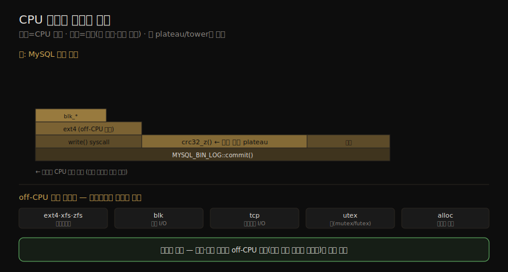

# 애플리케이션 (2) — 언어·방법론
---
> 이 노트는 5장의 중간 부분으로, 프로그래밍 언어 유형별 성능 특성과 애플리케이션 분석 방법론을 잡습니다. 언어는 컴파일·인터프리터·VM으로 나뉘며 관측 난이도가 다릅니다(컴파일이 가장 쉽고 VM이 가장 어려움). GC는 편리하나 메모리 증가·CPU 비용·지연 이상치를 낳습니다. 방법론으로는 CPU/off-CPU 프로파일링, syscall 분석, 스레드 상태 9가지 분석, 락 분석, 정적 튜닝, 분산 트레이싱을 봅니다.

05-01 이 기초·기법(목표·캐싱·동시성·락)이었다면, 이 노트는 *언어가 성능 분석을 어떻게 좌우하는가* 와 *어떤 방법론으로 앱을 분석하는가* 입니다. 저자가 "모든 성능 이슈에 가장 먼저 쓴다"는 *스레드 상태 분석* 이 이 노트의 중심입니다.

> 이 노트의 방법론을 실제로 수행하는 도구(perf·profile·offcputime·bpftrace)와, 그때 마주칠 심볼·스택 누락 문제는 05-03 이 이어받습니다.

## 1. 컴파일·인터프리터·VM 언어

> 언어는 컴파일·인터프리터·VM으로 나뉩니다. 컴파일은 사전에 기계어를 만들어 고성능이고 관측이 쉽습니다(심볼 테이블이 주소를 함수명에 매핑). 인터프리터는 런타임에 번역해 느리고 관측이 어렵습니다. VM은 바이트코드를 실행하며 가장 관측하기 어렵습니다.

언어의 "성능 최적화" 기능은 엄밀히는 언어 자체가 아니라 *언어를 실행하는 SW* 의 기능입니다(예: Java HotSpot VM의 JIT 컴파일러).

#### 컴파일 언어

컴파일은 런타임 *전에* 기계어를 만들어 바이너리(Linux ELF·Windows PE)에 저장합니다 — C·C++·어셈블리가 예입니다. 컴파일 코드는 추가 번역 없이 CPU가 실행해 *고성능* 입니다(Linux 커널이 대부분 C). 성능 분석도 보통 단순합니다 — 컴파일 시 *심볼 테이블* 이 주소를 함수·객체명에 매핑해, 프로파일링·트레이싱이 그것을 함수명으로 매핑하고 스택 트레이스로 호출 경로를 보여 줍니다. 컴파일러는 *컴파일러 최적화*(CPU 명령 선택·배치)로 성능을 높입니다.

> gcc는 일곱 수준의 최적화(0·1·2·3·s·fast·g)를 줍니다 — 숫자가 클수록 더 최적화하고, s는 크기·g는 디버깅·fast는 표준 무시 추가 최적화입니다. 한 옵션 `-fomit-frame-pointer` 는 frame pointer를 레지스터에 안 둬 명령을 아끼지만 *스택 프로파일러를 망가뜨립니다* — 이는 트레이드오프로, 나중에 못 찾을 성능 이득이 처음 이득을 압도할 수 있어 `-fno-omit-frame-pointer` 와 `-g`(debuginfo) 가 권장됩니다(05-03 §스택 누락). 성능 이슈에 최적화 수준을 낮춰(–O3→–O2) 재컴파일하는 건 단순치 않습니다 — 출력이 크게 바뀌어 원래 이슈의 동작이 달라질 수 있습니다.

#### 인터프리터 언어

인터프리터는 런타임에 프로그램을 동작으로 번역해 실행 오버헤드를 더합니다 — 고성능을 기대하지 않고 프로그래밍·디버깅 편의가 더 중요할 때 씁니다(셸 스크립트). 관측 도구가 없으면 분석이 어렵습니다 — CPU 프로파일링은 인터프리터 동작(파싱·번역·실행)은 보여도 *원 프로그램 함수명* 은 못 보여 줄 수 있습니다. 보통 print문·타임스탬프로 연구하며, 엄밀한 분석은 드뭅니다(애초에 고성능용이 아니므로).

#### VM(언어 가상 머신)

언어 VM은 컴퓨터를 시뮬레이션하는 SW입니다 — Java·Erlang이 VM으로 실행돼 플랫폼 독립 환경을 줍니다. 프로그램은 VM 명령 집합(바이트코드)으로 컴파일돼 VM이 실행합니다 — 컴파일 객체의 *이식성* 을 줍니다. Java HotSpot VM은 인터프리테이션과 *JIT 컴파일*(바이트코드를 기계어로 컴파일해 직접 실행)을 지원해, 컴파일 코드의 성능과 VM의 이식성을 함께 줍니다. VM은 *가장 관측하기 어려운* 유형입니다 — on-CPU 실행 시점엔 여러 단계의 컴파일·인터프리테이션을 지나 원 프로그램 정보를 바로 얻기 어렵습니다. 보통 VM 제공 툴셋(다수가 USDT probe 제공)과 서드파티 도구에 의존합니다.

## 2. 가비지 컬렉션(GC)

> GC는 자동 메모리 관리로 프로그래밍을 쉽게 하나, 세 단점이 있습니다 — 메모리 증가(통제 약화), CPU 비용(스캔), 지연 이상치(GC 중 앱 일시 정지). GC는 CPU 비용·지연 이상치를 줄이는 튜닝의 흔한 대상입니다.

일부 언어는 *자동 메모리 관리* — 할당 메모리를 명시적으로 해제하지 않고 비동기 GC에 맡김 — 를 씁니다. 프로그래밍은 쉬워지나 단점이 있습니다.

| 단점 | 뜻 |
|------|-----|
| 메모리 증가 | 앱 메모리 사용 통제가 약해져, 자동으로 해제 대상이 안 되면 증가(자체 한계·시스템 페이징 도달 시 성능 급락) |
| CPU 비용 | GC가 간헐 실행돼 메모리 객체를 스캔 — CPU 소비. 메모리가 커지면 GC CPU도 커져 한 CPU를 다 먹기도 |
| 지연 이상치 | GC 실행 중 앱이 일시 정지 — 가끔 높은 지연 응답(stop-the-world·incremental·concurrent에 따라 다름) |

> GC는 CPU 비용·지연 이상치를 줄이는 튜닝의 흔한 대상입니다 — Java VM은 GC 유형·스레드 수·최대 힙·목표 free 비율 등 많은 튜너블을 줍니다. 튜닝이 안 통하면 앱이 *garbage를 너무 만들거나 참조를 누수* 하는 것일 수 있습니다 — 개발자가 풀 일로, 객체를 덜 할당하는 게 한 방법입니다(객체 할당과 코드 경로를 보는 관측 도구로 제거 대상 찾기).

## 3. CPU 프로파일링과 플레임 그래프

> CPU 프로파일링은 앱 성능 분석의 필수 활동으로, 타이머 기반 표집으로 CPU 소비 코드 경로를 파악합니다. 커널 기반 프로파일러(perf·profile)가 커널·유저 스택을 모두 잡아 mixed-mode 프로파일을 줍니다. 플레임 그래프가 표본을 시각화하는 핵심 도구입니다.

CPU 프로파일링은 앱 성능 분석의 필수 활동입니다(6장 §6.5.4). 커널 모드 프로파일러(perf·profile)는 커널·유저 스택을 모두 잡아 *mixed-mode 프로파일* — CPU 사용의 거의 완전한 가시성 — 을 줍니다. 앱·런타임이 주는 유저 모드 프로파일러는 커널 CPU를 못 보고, 커널이 앱을 디스케줄한 시점을 몰라 CPU 시간을 왜곡할 수 있어 *최후의 수단* 으로 씁니다. 표본은 많이 나옵니다 — Netflix의 전형적 CPU 프로파일은 32 CPU에서 49Hz로 30초 표집해 총 47,040 표본입니다.

#### CPU 플레임 그래프

저자가 발명한 플레임 그래프가 표집된 스택 트레이스의 핵심 시각화입니다. 두 축은 — 가로(너비)는 프로파일 내 *존재 비율*(=CPU 시간), 세로(y축)는 코드 흐름(위가 현재 함수·아래로 조상) — 입니다. 가로 순서는 의미 없습니다(알파벳 정렬). *큰 plateau·tower* 를 찾으면 거기에 CPU 시간 대부분이 쓰입니다.

CPU 플레임 그래프와, 그 안에서 off-CPU 흔적(file system·disk·network·lock)을 읽는 법을 한 장으로 정리하면 다음과 같습니다.

> 저자도 `crc32_z()`·`MYSQL_BIN_LOG::commit()` 이 뭔지 미리 알지 못했습니다 — CPU 프로파일은 앱 내부를 드러내며, 개발자가 아니면 함수가 뭔지 몰라도 *검색해 조치 가능한 개선* 으로 발전시킵니다(MySQL 바이너리 로깅 튜닝·zlib CRC 명령 활용 등). 성능 만트라(02-02 §9) 사고방식입니다.

#### off-CPU 흔적

CPU 프로파일은 CPU 사용 외 *다른 off-CPU 이슈의 흔적* 도 보여 줍니다 — 디스크 I/O는 파일시스템 접근·블록 I/O 초기화의 CPU 사용으로 일부 보입니다(곰을 못 봐도 발자국으로 존재를 앎). 검색어 — "ext4/xfs/zfs"(파일시스템)·"blk"(블록 I/O)·"tcp"(네트워크)·"utex"(락 mutex/futex)·"alloc"(메모리 할당) — 로 활동의 *존재* 를 찾습니다(크기는 아님). 크기·차단 시간은 off-CPU 분석이 직접 잽니다.

## 4. off-CPU 분석

> off-CPU 분석은 CPU에서 안 도는 스레드를 연구합니다 — 디스크/네트워크 I/O·락 경합·sleep·선점 등 모든 차단 이유입니다. 표집·스케줄러 추적·앱 계측으로 하며, 스케줄러 추적이 흔히 쓰입니다. off-CPU 시간 플레임 그래프로 시각화하나 wait time이 지배할 수 있습니다.

off-CPU 분석은 현재 CPU에서 안 도는(*off-CPU*) 스레드를 연구합니다 — 디스크/네트워크 I/O·락 경합·명시적 sleep·스케줄러 선점 등 모든 차단 이유입니다. 한 도구로 이 모두를 분석할 수 있습니다.

| 방법 | 뜻 |
|------|-----|
| 표집(sampling) | off-CPU 스레드(또는 전 스레드=wallclock)의 타이머 표본 |
| 스케줄러 추적 | 커널 스케줄러를 계측해 off-CPU 지속 시간·스택 기록 |
| 앱 계측 | 앱 내장 계측(디스크 I/O 등) — off-CPU 이벤트(선점·page fault)엔 보통 맹목 |

> 표집·스케줄러 추적이 모든 앱·이벤트에 통하나 오버헤드가 큽니다 — 49Hz 표집도 off-CPU는 *CPU 풀이 아니라 스레드 풀* 을 표집해야 해, 1만 스레드면 오버헤드가 1,000배 늘 수 있습니다. 스케줄러 추적이 흔히 쓰이며(offcputime), 최적화로 *작은 지속 시간 이벤트만* 기록하고 BPF로 커널에서 스택을 집계해 오버헤드를 줄입니다. 프로덕션에선 조심하고 테스트 환경에서 오버헤드를 먼저 평가합니다.

#### off-CPU 시간 플레임 그래프와 wait time

off-CPU 프로파일은 *off-CPU 시간 플레임 그래프* 로 시각화합니다 — 해석은 CPU 것과 같습니다(가장 넓은 tower부터). CPU와 off-CPU 플레임 그래프를 함께 쓰면 코드 경로별 on·off-CPU 시간의 완전한 뷰가 됩니다(저자는 별도로 표시 — hot/cold로 합치면 off-CPU 스레드가 두 자릿수 많아 CPU 시간이 얇아짐). 다만 off-CPU 프로파일은 *wait time*(스레드가 일을 기다리는 시간)이 지배할 수 있습니다 — 풀려면 (a) 앱 요청 처리 함수(MySQL `do_command()`)로 zoom/필터하거나 (b) 수집 시 커널 필터로 흥미롭지 않은 스레드 상태를 제외(Linux `TASK_UNINTERRUPTIBLE` 매칭)합니다. 락을 기다리는 경우엔 *waker 이벤트* 를 계측해 보유자가 왜 오래 걸렸는지 파고듭니다(offwaketime).

## 5. syscall 분석과 USE 방법

> syscall은 자원 기반 성능 이슈 연구에 계측됩니다 — 새 프로세스 추적(execve)·I/O 프로파일링(read/write)·커널 시간 분석(%sys). 잘 문서화된 API이고 앱과 동기로 호출돼 스택이 책임 코드 경로를 보여 줍니다. USE 방법은 SW 자원에도 적용됩니다.

#### syscall 분석

시스템 콜은 자원 기반 성능 이슈 연구에 계측됩니다 — syscall 시간이 어디에·왜 쓰이는지 찾습니다.

| 대상 | 뜻 |
|------|-----|
| 새 프로세스 추적 | `execve` 추적으로 단명 프로세스 이슈 분석(execsnoop) |
| I/O 프로파일링 | read/write/send/recv의 크기·플래그·코드 경로 — 작은 I/O 다발 식별 |
| 커널 시간 분석 | "%sys" 높을 때 syscall 계측으로 원인 찾기(syscount) — page fault·비동기 커널 스레드·인터럽트는 예외 |

> syscall은 잘 문서화된 API(man page)라 연구하기 쉽고, 앱과 *동기로* 호출돼 스택을 잡으면 책임 앱 코드 경로가 보입니다(플레임 그래프로 시각화).

#### USE 방법

USE 방법(02-02 §3)은 모든 HW 자원의 사용률·포화·에러를 점검하는데, *SW 자원* 에도 적용됩니다 — 앱 내부 컴포넌트의 기능 다이어그램이 있으면 각 SW 자원에 세 메트릭을 정의합니다. 예로 워커 스레드 풀 — 사용률(바쁜 스레드 평균 %)·포화(요청 큐 길이 평균)·에러(거부·실패 요청) — 나, 파일 디스크립터 — 사용률(사용 중/한계 %)·포화(fd 대기 차단 스레드)·에러(EFILE "Too many open files") — 입니다. 이 메트릭을 어떻게 잴지 찾는 게 과제이며, 앱 health 점검 체크리스트가 됩니다.

## 6. 스레드 상태 분석 — 9가지 상태

> 저자가 모든 성능 이슈에 가장 먼저 쓰는 방법으로, 앱 스레드 시간을 의미 있는 상태로 나눠 어디에 쓰이는지 고수준에서 식별합니다. 최소 on-CPU/off-CPU 둘이지만, 9가지(User·Kernel·Runnable·Swapping·Disk·Net·Sleeping·Lock·Idle)로 나누면 더 효과적입니다.

스레드 상태 분석은 저자가 *모든 성능 이슈에 가장 먼저 쓰는* 방법(Linux에선 고급 활동)으로, 앱 스레드 시간을 의미 있는 상태로 나눠 *어디에 쓰이는지* 고수준에서 식별합니다 — 일부 이슈를 즉시 풀고 나머지 조사 방향을 줍니다. 최소 on-CPU·off-CPU 둘이지만, 9가지로 나누면 더 효과적입니다.

| 상태 | 뜻 | 더 볼 것 |
|------|-----|---------|
| User | 유저 모드 on-CPU | CPU 프로파일링 |
| Kernel | 커널 모드 on-CPU | CPU 프로파일링(spin lock 포함) |
| Runnable | off-CPU, CPU 차례 대기 | 시스템 CPU 부하·CPU 한계 |
| Swapping | runnable이나 익명 page-in 차단 | 메모리 사용·한계(7장) |
| Disk | 블록 I/O 대기(읽기/쓰기·page-in) | syscall 분석·8·9장·워크로드 특성 |
| Net | 네트워크 I/O 대기(소켓 읽기/쓰기) | syscall 분석·10장·워크로드 특성 |
| Sleeping | 자발적 sleep | sleep 이유(코드 경로)·지속 시간 |
| Lock | 동기화 락 획득 대기 | 락·보유 스레드·보유 이유(offwaketime) |
| Idle | 일 대기 | 일 대기 코드 경로 |

> idle을 뺀 모든 상태의 시간을 줄이면 앱 요청 지연이 낮아지고 더 많은 부하를 감당합니다. 앱이 일을 기다리는 방식 때문에 Net I/O·Lock 상태가 실제로는 *idle 시간* 일 때가 많습니다(다음 요청을 keep-alive로 기다리거나 조건 변수로 깨어나길 기다림).

#### Linux 측정 — 세 접근

Linux 커널 상태는 `task_struct` 의 state 멤버 기반입니다 — Runnable=`TASK_RUNNING`(R), Disk=`TASK_UNINTERRUPTIBLE`(D), Sleep=`TASK_INTERRUPTIBLE`(S)로 ps·top이 R·D·S로 보여 줍니다. 단 9상태로 나누기엔 정보가 부족해 세 접근을 씁니다.

| 접근 | 방법 |
|------|------|
| 단서 기반(clue-based) | pidstat(%usr·%system·iodelay)·vmstat(r·si·so)·sar로 어디에 시간이 쓰이는지 시사 |
| off-CPU 분석 | User·Kernel 외 모든 상태가 off-CPU라 off-CPU 분석 적용(§4) |
| 직접 측정 | /proc/PID/schedstat(Runnable ns)·delay accounting(Swapping)·pidstat -d(Disk iodelay)·tcptop(Net)·klockstat(Lock) 등으로 정확히 |

> 앱이 완전히 잠든 듯 보이면(I/O·이벤트 없이 off-CPU) pstack·gdb·`/proc/PID/stack` 으로 스택을 봐 어느 상태인지 확인합니다 — 단 디버거는 대상 앱을 멈춰 성능 문제를 일으킬 수 있어 위험을 알고 써야 합니다. 저자는 Solaris의 microstate accounting(8상태 기록)에서 영감을 받아 이 방법을 개발했습니다.

## 7. 락 분석·정적 튜닝·분산 트레이싱

> 락은 멀티스레드의 병목이 될 수 있어, 경합과 과도한 보유 시간을 점검합니다 — CPU 프로파일링만으로 풀리기도 합니다. 정적 튜닝은 설정 환경의 이슈를, 분산 트레이싱은 여러 시스템에 걸친 앱을 봅니다.

#### 락 분석

멀티스레드 앱에서 락은 병렬성·확장성을 막는 병목이 될 수 있습니다(단일 스레드 앱도 커널 락에 막힘). *경합*(지금 문제인가)과 *과도한 보유 시간*(미래 병렬 부하에서 문제 될까)을 점검합니다 — 각각 락 이름·코드 경로를 식별합니다. 전용 도구도 있지만 *CPU 프로파일링만으로* 풀리기도 합니다 — spin lock 경합은 CPU 사용으로, adaptive mutex 경합은 spinning으로 스택 트레이스에 나타납니다(단 차단·sleep한 부분은 CPU 프로파일에 안 보임).

#### 정적 성능 튜닝

설정된 환경의 이슈에 초점을 둡니다 — 앱 버전·의존성·알려진 이슈·설정 이유·캐시 크기·동시성 설정·디버그 모드·시스템 라이브러리·메모리 할당자·large page·컴파일러 옵션·고급 명령(SIMD)·degraded 모드·자원 제어를 점검합니다. 답하다 보면 간과된 설정 선택이 드러납니다.

#### 분산 트레이싱

분산 환경에선 앱이 여러 시스템의 서비스로 구성돼, 전체를 함께 봐야 합니다 — *분산 트레이싱* 이 각 서비스 요청 정보를 로깅해 나중에 결합합니다. 한 앱 요청을 의존 요청들로 분해해, 높은 지연·에러의 책임 서비스를 식별합니다(고유 ID·의존 계층 위치·시작/끝 시각·에러 상태). 도전은 *로그 양* 입니다 — *head-based 표집*(시작에서 추적 여부 결정, 예: 1만 중 1)은 대부분 요청 분석엔 충분하나 간헐 에러·이상치엔 부족하고, *tail-based*(다 잡은 뒤 지연·에러 기준으로 결정)도 있습니다.

## 학습 점검

> 이 노트의 핵심을 스스로 떠올려 봅니다. 답이 막히면 해당 섹션으로 돌아가 확인합니다.

- 컴파일·인터프리터·VM 언어의 성능과 관측 난이도 차이를 설명하고, `-fomit-frame-pointer` 가 왜 트레이드오프인지 말해 봅니다. (→ §1)
- GC의 세 단점(메모리 증가·CPU 비용·지연 이상치)과, 튜닝이 안 통할 때 무엇을 의심하는지 떠올려 봅니다. (→ §2)
- 플레임 그래프의 두 축이 무엇을 뜻하고, CPU 프로파일에서 off-CPU 흔적(검색어 ext4·tcp·utex 등)을 어떻게 찾는지 설명해 봅니다. (→ §3)
- off-CPU 분석의 오버헤드가 왜 큰지(스레드 풀 표집), wait time이 지배할 때 푸는 두 방법을 말해 봅니다. (→ §4)
- syscall 분석의 세 대상(새 프로세스·I/O·커널 시간)과, USE 방법을 SW 자원(스레드 풀·fd)에 어떻게 적용하는지 떠올려 봅니다. (→ §5)
- 스레드 상태 9가지를 들고, Net I/O·Lock 상태가 실제로는 idle일 때가 많은 이유를 설명해 봅니다. (→ §6)
- 락 분석이 CPU 프로파일링만으로 풀리는 경우와, 분산 트레이싱의 head-based vs tail-based 표집 차이를 말해 봅니다. (→ §7)
