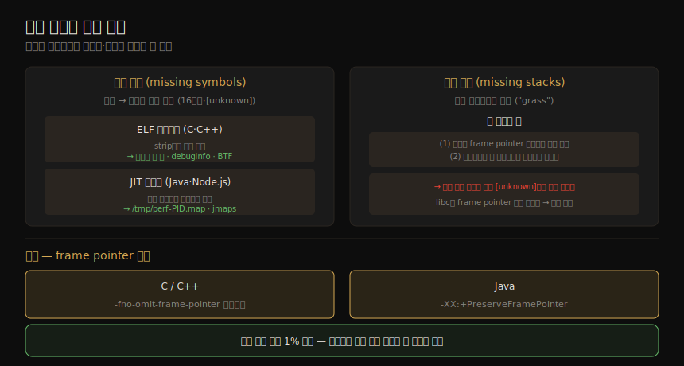

# 애플리케이션 (3) — 관측 도구·gotchas
---
> 이 노트는 5장의 마지막 부분으로, 05-02 의 방법론을 *실제로 수행하는 도구* 와, 그때 자주 마주치는 *함정(gotchas)* 을 잡습니다. perf로 CPU 프로파일링·플레임 그래프·syscall 추적을, profile·offcputime으로 CPU/off-CPU 프로파일링을, strace·execsnoop·syscount·bpftrace로 syscall·새 프로세스·락을 봅니다. 마지막으로 플레임 그래프에서 함수명·스택이 빠지는 두 문제(심볼 누락·스택 누락)와 그 해결을 봅니다.

05-02 가 *무엇을 어떻게 분석하는가*(방법론)였다면, 이 노트는 *어떤 도구로 손을 쓰는가* 입니다. 도구 다수가 BPF 기반(BCC·bpftrace)이며, 04-02 의 이벤트 소스 위에 섭니다. 그리고 이 도구들로 스택을 잡을 때 "[unknown]" 프레임이나 비현실적으로 짧은 스택을 만나면 — 그게 gotchas 절의 주제입니다.

> 이 도구들은 04-02 의 관측 소스(tracepoints·kprobes·uprobes·USDT)와 15장 BPF의 토대 위에 섭니다. 자원별 도구(CPU·메모리·디스크)는 6~10장이 다룹니다.


## 1. perf — CPU 프로파일링·플레임 그래프·syscall 추적

> perf는 표준 Linux 프로파일러로, CPU 프로파일링에 핵심입니다. record로 스택을 표집해 script·report로 보거나 플레임 그래프로 시각화합니다. trace 서브커맨드는 strace의 perf판으로, per-CPU 버퍼로 오버헤드가 훨씬 낮습니다.

perf는 표준 Linux 프로파일러로 여러 용도의 multi-tool입니다(13장). CPU 프로파일링이 앱 분석에 결정적이라 여기 요약합니다.

#### CPU 프로파일링·플레임 그래프

`perf record` 로 모든 CPU(`-a`)에서 49Hz(`-F 49`)로 스택(`-g`)을 표집한 뒤 `perf script` 로 표본을 봅니다.

```
# perf record -F 49 -a -g -- sleep 30
# perf script               # 표본별 스택 출력
# perf report               # 코드 경로 계층 요약
```

플레임 그래프는 오픈소스로 만듭니다 — `perf script` 출력을 FlameGraph의 `stackcollapse-perf.pl` 로 접고 `flamegraph.pl` 로 SVG를 냅니다(Java는 `--color=java`).

```
# perf record -F 49 -a -g -- sleep 10; perf script --header > out.stacks
# ./stackcollapse-perf.pl < out.stacks | ./flamegraph.pl --hash > out.svg
```

#### syscall 추적·I/O 프로파일링

`perf trace` 는 기본으로 syscall을 추적하는 perf판 strace입니다 — *per-CPU 버퍼로 오버헤드가 훨씬 낮아* strace보다 안전하고, system-wide 추적이 가능하며 syscall 외 이벤트도 봅니다(단 strace만큼 인자 번역이 많진 않음). `-s` 로 스레드별 syscall 횟수·시간을 요약하고, `-e sendto` 필터로 특정 syscall만 봅니다 — 작은 send 다발이 보이면 coalescing이나 DONTWAIT 플래그 회피로 개선할지 검토합니다.


## 2. profile·offcputime — CPU/off-CPU 프로파일링

> profile은 BCC의 타이머 기반 CPU 프로파일러로, BPF로 커널에서 스택을 집계해 고유 스택·횟수만 유저 공간에 보내 오버헤드를 줄입니다. offcputime은 그 짝으로, 스레드가 차단돼 off-CPU인 시간을 스택과 함께 요약합니다. 둘이 스레드의 전체 시간을 보여 줍니다.

#### profile

profile은 BCC의 타이머 기반 CPU 프로파일러입니다(15장) — BPF로 *커널에서 스택을 집계* 해 고유 스택과 횟수만 유저 공간에 보내 오버헤드를 줄입니다. `profile -F 49 10` 은 49Hz로 10초 표집해, 각 고유 스택이 몇 번 on-CPU로 표집됐는지 보여 줍니다(6장 §6.6.14, 플레임 그래프 생성법 포함).

#### offcputime

offcputime은 BCC·bpftrace 도구로, 스레드가 차단돼 off-CPU인 시간을 스택과 함께 요약합니다(off-CPU 분석, 05-02 §4) — profile의 *짝* 으로, 둘이 스레드가 시스템에서 쓴 전체 시간을 보여 줍니다. 출력은 고유 스택과 off-CPU 시간(마이크로초)입니다.

```
# offcputime 5     # 5초 추적
# offcputime -f 5 | ./flamegraph.pl --bgcolors=blue \
    --title="Off-CPU Time Flame Graph" > out.svg
```

> 효율을 위해 커널에서 스택을 집계하고 고유 스택만 내보내며, *임계값(기본 1μs) 초과 off-CPU 시간만* 기록합니다(`-m` 으로 조정). `-M 900000` 으로 900ms 넘는 지속 시간을 제외하면 — 일을 기다리며 초 단위로 차단되는 *흥미롭지 않은 스레드* 를 걸러 냅니다. off-CPU 플레임 그래프는 *파란 배경* 으로 CPU 것과 구분합니다.


## 3. strace — 시스템 콜 추적기 (오버헤드 주의)

> strace는 Linux 시스템 콜 추적기로, syscall마다 한 줄 요약을 찍고 -c로 카운트·리포트를 냅니다. 인자를 사람이 읽을 형태로 번역해 ioctl 이해에 유용합니다. 단 현재 구현은 breakpoint 기반이라 syscall이 잦은 앱을 수십 배 느리게 합니다.

strace는 Linux 시스템 콜 추적기로, syscall마다 한 줄 요약을 찍습니다. 주요 옵션 — `-ttt`(epoch 이후 시각·마이크로초)·`-T`(syscall 지속 시간)·`-p PID`(추적 대상)·`-f`(자식 스레드)·`-c`(syscall 활동 요약) — 가 있습니다. 인자를 *사람이 읽을 형태로 번역* 해 특히 `ioctl(2)` 이해에 유용합니다.

> **경고:** 현재 strace는 Linux `ptrace(2)` 의 breakpoint 기반 추적을 써, 모든 syscall 진입·반환에 breakpoint를 겁니다(`-e` 로 일부만 골라도) — 침습적이라 syscall이 잦은 앱은 성능이 한 자릿수 배 나빠질 수 있습니다. 저자 예에서 `dd` 가 strace로 *73배* 느려졌습니다(2.7GB/s → 37.3MB/s). 짧은 시간 syscall 유형 파악엔 쓸 만하나, perf·Ftrace·BCC·bpftrace는 *buffered tracing*(이벤트를 커널 링 버퍼에 쓰고 주기적으로 읽음)으로 오버헤드를 크게 줄입니다. 미래 strace는 `perf trace` 의 별칭이 될 수 있습니다.


## 4. execsnoop·syscount — 새 프로세스·syscall 카운트

> execsnoop은 system-wide로 새 프로세스 실행을 추적해(execve), 단명 프로세스 이슈와 시작 스크립트 디버깅에 유용합니다. syscount는 system-wide로 syscall을 카운트해, 가장 빈번한 syscall과 프로세스별 횟수를 보여 줍니다.

#### execsnoop

execsnoop은 BCC·bpftrace 도구로, system-wide로 *새 프로세스 실행* 을 추적합니다 — `execve(2)` 를 추적해 한 줄씩 요약하며, CPU를 먹는 단명 프로세스 이슈와 앱 시작 스크립트 디버깅에 유용합니다. 저자는 이걸 DB 시스템에 돌려, 며칠째 루프로 도는 read/write 마이크로벤치마크(`oltp_read_write`)를 우연히 발견했습니다 — 다른 메트릭으론 안 드러난 것입니다. `-t` 로 타임스탬프를 더합니다.

#### syscount

syscount는 BCC·bpftrace 도구로, system-wide로 *syscall을 카운트* 합니다. 가장 빈번한 syscall(예: `recvfrom` 114,746회)을 보여 주고, `-P` 로 프로세스별 횟수를 냅니다 — 이후 perf trace·bpftrace로 그 syscall의 인자·지연·스택을 더 파고듭니다.


## 5. bpftrace — 커스텀 앱 분석

> bpftrace는 고수준 언어를 주는 BPF 트레이서로, 다른 도구의 단서를 바탕으로 커스텀 분석에 적합합니다 — 시그널 추적, I/O 프로파일링(크기·지연·반환값·스택), 락 추적입니다. uprobes로 pthread 함수를, tracepoints로 futex를 계측합니다.

bpftrace는 고수준 프로그래밍 언어를 주는 BPF 트레이서로, 강력한 one-liner·짧은 스크립트를 만듭니다(15장) — 다른 도구의 단서를 바탕으로 한 *커스텀 앱 분석* 에 적합합니다.

| 용도 | 방법 |
|------|------|
| 시그널 추적 | `sys_enter_kill` 추적 — 소스/대상 PID·시그널 번호(killsnoop) |
| I/O 프로파일링 | `sys_enter_recvfrom` 의 size를 히스토그램으로, exit의 ret와 비교(버퍼 과대 할당 식별) |
| I/O 지연 | enter·exit를 함께 추적해 `(nsecs-@ts)/1000` 히스토그램 — 반환값·스택별 분해 가능 |
| 락 추적 | uprobes로 `pthread_mutex_lock` 지속 시간(pmlock), lock→unlock 보유 시간(pmheld) |

> I/O 프로파일링 예 — recvfrom 버퍼가 절반은 4~7바이트, 나머지는 16~32KB로 갈리고, 지연은 8μs 미만이 잦고 32~256μs의 느린 mode와 8~16ms 이상치가 있었습니다. `@usecs[args->ret]`(반환값별)·`@usecs[ustack]`(스택별)로 더 분해하고, `/comm == "mysqld"/` 필터로 특정 프로세스만 봅니다. 락 추적은 uprobes 오버헤드가 크고 이벤트가 잦아(04-02 §8), 대안으로 *CPU 프로파일링*(샘플 비율에 묶여 오버헤드 작음 — 무거운 락 경합은 CPU 사이클로 드러남)을 씁니다. 앱 내부는 USDT가 있으면 그것을, 없으면 uprobes를 씁니다(JIT는 dynamic USDT — Java는 uprobes로 JVM 런타임, USDT로 고수준 이벤트, dynamic USDT로 메서드 실행).


## 6. gotchas — 심볼 누락과 스택 누락

> 플레임 그래프에서 함수명·스택이 빠지는 두 문제가 흔합니다. 심볼 누락은 주소를 함수명으로 못 풀어 16진수나 "[unknown]"으로 나오는 것이고, 스택 누락은 스택이 한두 프레임으로 짧게 끊기는 것입니다. 둘 다 frame pointer 문제가 핵심 원인입니다.

CPU 프로파일(플레임 그래프)에서 함수명·스택이 빠지는 두 문제가 흔합니다. 두 문제의 원인과 해결을 한 장으로 정리하면 다음과 같습니다.



#### 심볼 누락(missing symbols)

프로파일러가 명령 주소를 함수명(심볼)으로 못 풀면 16진수나 "[unknown]"으로 찍습니다 — 해결은 컴파일러·런타임·튜닝에 달려 있습니다.

| 유형 | 원인·해결 |
|------|----------|
| ELF 바이너리(C·C++) | `strip(1)` 으로 심볼 제거됨 — 스트립 안 하거나, debuginfo·BTF 같은 다른 심볼 소스 사용 |
| JIT 런타임(Java·Node.js) | JIT 심볼 테이블이 런타임에 바뀌어 바이너리에 없음 — 런타임이 생성하는 보조 심볼 파일(`/tmp/perf-<PID>.map`) 사용 |

> Java는 Netflix가 `perf-map-agent` 로 라이브 프로세스에 붙어 심볼 파일을 덤프하고, 저자의 `jmaps` 로 자동화합니다 — *프로파일 직후·심볼 변환 전* 에 돌립니다(`perf record ...; jmaps`). 표본과 덤프 사이 심볼 매핑이 바뀌는 *symbol churn* 은 jmaps를 record 직후 돌려 줄입니다. JIT는 precompiled 컴포넌트(JVM의 libjvm·libc)도 있어 ELF 절도 함께 적용합니다.

#### 스택 누락(missing stacks)

스택이 한두 프레임으로 짧게 끊기거나(플레임 그래프의 "grass" — 바닥의 얇은 단일 프레임들) 단일 프레임만 나오는 문제입니다. 두 요인의 합이 원인입니다 — (1) 관측 도구가 *frame pointer 기반* 으로 스택을 읽고, (2) 대상 바이너리가 frame pointer 레지스터(x86_64 RBP)를 *예약하지 않고* 범용 레지스터로 재사용(컴파일러 최적화)하는 것입니다. 도구가 그 레지스터를 frame pointer로 읽는데 실제론 아무 값(숫자·주소·포인터)이라, 운 좋으면 "[unknown]", 나쁘면 *무관한 심볼* 로 풀려 틀린 함수명을 보입니다. libc는 보통 frame pointer 없이 컴파일돼 그것을 지나는 스택(`pthread_cond_timedwait`·`send`)이 흔히 깨집니다.

| 해결 | 방법 |
|------|------|
| frame pointer 복구(가장 쉬움) | C/C++: `-fno-omit-frame-pointer` 재컴파일 / Java: `-XX:+PreserveFramePointer` |
| 다른 stack walking | perf의 DWARF·ORC·LBR 기반(단 BPF에선 DWARF·LBR 미지원, ORC는 유저 레벨 미지원 — 집필 시점) |

> frame pointer 복구는 성능 비용(흔히 1% 미만)이 있으나, 스택 트레이스로 성능 이득을 찾는 가치가 보통 그 비용을 압도합니다.


## 학습 점검

> 이 노트의 핵심을 스스로 떠올려 봅니다. 답이 막히면 해당 섹션으로 돌아가 확인합니다.

- perf로 CPU 플레임 그래프를 만드는 흐름(record→script→stackcollapse→flamegraph)과, `perf trace` 가 strace보다 안전한 이유를 설명해 봅니다. (→ §1)
- profile과 offcputime이 어떻게 짝을 이뤄 스레드의 전체 시간을 보여 주는지, BPF 커널 집계가 왜 오버헤드를 줄이는지 말해 봅니다. (→ §2)
- strace가 왜 syscall 잦은 앱을 수십 배 느리게 하는지(breakpoint 기반), buffered tracing이 어떻게 이를 푸는지 떠올려 봅니다. (→ §3)
- execsnoop이 단명 프로세스를 어떻게 드러내는지, syscount 결과로 다음에 무엇을 하는지 설명해 봅니다. (→ §4)
- bpftrace로 recvfrom 버퍼 크기와 실제 반환값을 비교하면 무엇을 알 수 있는지, 락 추적 대신 CPU 프로파일링을 쓰는 이유를 말해 봅니다. (→ §5)
- 심볼 누락의 두 경우(ELF strip·JIT)와 각 해결, 스택 누락의 핵심 원인(frame pointer 재사용)과 복구법을 떠올려 봅니다. (→ §6)
