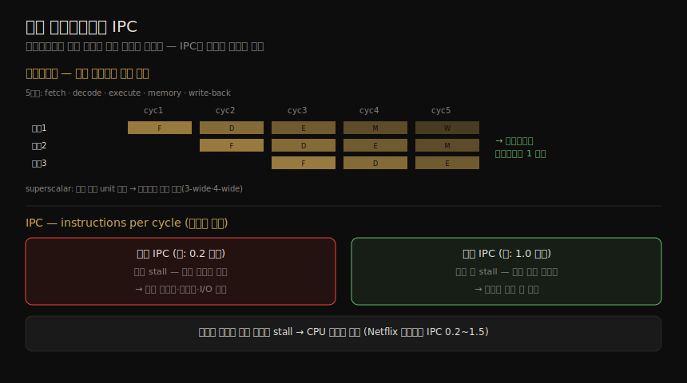

# CPU (1) — 용어·모델·핵심 개념
---
> 이 노트는 6장(이 책에서 가장 큰 장)의 첫 부분으로, CPU 분석의 토대가 될 용어·모델·개념을 잡습니다. CPU는 모든 소프트웨어를 구동하며 흔히 성능 분석의 첫 표적입니다. 여기서는 프로세서·코어·하드웨어 스레드 같은 용어, CPU 아키텍처·캐시·런큐의 단순 모델, 그리고 클럭·명령·파이프라인·IPC·사용률·포화·우선순위 역전·멀티스레딩 등 핵심 개념을 봅니다.

CPU 분석은 여러 수준에서 이뤄집니다 — 고수준에선 system-wide CPU 사용률을 모니터링하고 프로세스·스레드별 사용을 보며, 저수준에선 앱·커널의 코드 경로를 프로파일링하고, 가장 낮은 수준에선 CPU 명령 실행과 사이클 동작을 분석합니다. 이 노트는 그 모든 수준의 *공통 어휘와 멘탈 모델* 입니다 — 특히 뒤에서 핵심이 될 IPC(instructions-per-cycle) 지표를 이해하기 위한 배경입니다.

> 이 책의 CPU 설명은 "성능 분석가 관점"입니다. 같은 02_os의 [linux-kernel-programming](../linux-kernel-programming/10-01.CPU%20스케줄러%20(1)%20—%20스케줄링%20기초와%20흐름%20시각화.md)(커널 개발자 관점의 스케줄러)와 교차참조합니다. 아키텍처·스케줄러 구현은 06-02 가 이어받습니다.

## 1. 핵심 용어

> CPU 관련 핵심 어휘입니다. 프로세서·코어·하드웨어 스레드·논리 CPU의 계층과, 스케줄러·런큐를 먼저 잡아 둡니다.

| 용어 | 뜻 |
|------|-----|
| 프로세서(processor) | 소켓에 꽂히는 물리 칩 — 코어·하드웨어 스레드로 구현된 CPU를 하나 이상 담음 |
| 코어(core) | 멀티코어 프로세서의 독립 CPU 인스턴스. 프로세서 확장 방식 CMP(chip-level multiprocessing) |
| 하드웨어 스레드(hardware thread) | 한 코어에서 여러 스레드를 병렬 실행하는 아키텍처(Intel Hyper-Threading) — 각각 독립 CPU. 확장 방식 SMT |
| CPU 명령(instruction) | 명령 집합의 단일 CPU 연산(산술·메모리 I/O·제어 로직) |
| 논리 CPU(logical CPU) | OS의 CPU 인스턴스(스케줄링 가능 단위) — 하드웨어 스레드·코어·단일코어 프로세서로 구현 |
| 스케줄러(scheduler) | 스레드를 CPU에 배정하는 커널 서브시스템 |
| 런큐(run queue) | CPU 서비스를 기다리는 실행 가능 스레드의 큐(현대 커널은 red-black tree 등도 쓰나 여전히 런큐라 부름) |

## 2. 세 가지 모델

> 단순 모델 셋이 CPU의 기본 원리를 보여 줍니다. CPU 아키텍처(코어·하드웨어 스레드가 논리 CPU로 보임), CPU 메모리 캐시(CPU에 가까울수록 작고 빠름), CPU 런큐(스케줄러가 관리, 큐 길이가 포화 지표)입니다.

#### CPU 아키텍처

4코어·8 하드웨어 스레드 프로세서를 예로 들면, 각 하드웨어 스레드가 논리 CPU로 주소 지정돼 *OS에는 8개 CPU* 로 보입니다. OS는 어느 CPU가 같은 코어에 있고 캐시를 어떻게 공유하는지 같은 토폴로지 지식으로 스케줄링을 개선합니다(Linux `lstopo(1)` 가 이 그림을 생성).

#### CPU 메모리 캐시

프로세서는 메모리 I/O 성능을 위해 여러 하드웨어 캐시를 둡니다 — CPU에 가까울수록 *작고 빠른*(트레이드오프) 캐시입니다. 어떤 캐시가 있고 통합(on-chip)인지 외부인지는 프로세서 유형에 달려 있습니다(06-02 §캐시).

#### CPU 런큐

스케줄러가 관리하는 런큐는 *실행 가능(ready-to-run) 스레드 수* 가 CPU 포화를 가리키는 중요 지표입니다. 런큐에서 기다린 시간을 *런큐 지연(run-queue latency)* 또는 *스케줄러 지연* 이라 합니다. 멀티프로세서에선 보통 CPU마다 런큐를 두고 스레드를 같은 런큐에 유지하려 합니다 — 같은 CPU에서 돌면 캐시에 데이터가 남아(*cache warmth*) 성능이 오르는데, 이를 *CPU affinity* 라 합니다. NUMA에선 메모리 지역성도 좋아지고, 전역 공유 런큐의 동기화(mutex) 비용도 피합니다.

## 3. 클럭과 명령

> 클럭은 프로세서 로직을 구동하는 디지털 신호로, 각 명령은 한 사이클 이상이 듭니다. 클럭 속도가 마케팅의 핵심이나 오해의 소지가 있습니다 — 빠른 사이클이 메모리 대기 stall이면 더 빨리 실행해도 명령률·처리량이 안 오릅니다. 명령은 fetch·decode·execute·메모리 접근·write-back 단계를 거칩니다.

클럭은 모든 프로세서 로직을 구동하는 디지털 신호입니다 — 각 CPU 명령은 한 사이클 이상(CPU 사이클)이 듭니다. 4GHz CPU는 초당 40억 사이클을 수행합니다. 일부 프로세서는 클럭 속도를 *가변* 합니다 — 성능을 위해 올리거나 전력을 위해 내립니다(idle 스레드가 throttle down 요청). 클럭 속도는 프로세서의 주 마케팅 특성이지만 오해의 소지가 있습니다 — CPU가 완전히 사용 중(병목)으로 보여도, 그 빠른 사이클이 *대부분 메모리 접근 대기 stall* 이면 더 빨리 실행해도 명령률·처리량이 안 오릅니다.

CPU는 명령 집합에서 고른 명령을 실행하며, 각 명령은 *functional unit* 이 처리하는 단계를 거칩니다.

| 단계 | 비고 |
|------|------|
| Instruction fetch | 명령 가져오기 |
| Instruction decode | 명령 해독 |
| Execute | 실행 |
| Memory access | 메모리 접근 (선택 — 가장 느림, 수십 사이클 *stall*) |
| Register write-back | 레지스터 기록 (선택) |

> 메모리 접근은 메인 메모리 읽기·쓰기에 수십 사이클이 들어 그동안 명령 실행이 *stall* 합니다(stall cycle). 이것이 CPU 캐싱이 중요한 이유입니다(06-02 §캐시) — 메모리 접근 사이클을 크게 줄입니다.

## 4. 파이프라인·분기 예측·명령 폭·크기

> 명령 파이프라인은 서로 다른 명령의 다른 단계를 동시에 실행해 병렬화합니다(공장 조립 라인). 분기 예측은 조건 분기 결과를 추측해 처리하고, 명령 폭(superscalar)은 같은 단계의 functional unit을 여럿 둬 사이클당 여러 명령을 완료합니다.

#### 명령 파이프라인

파이프라인은 서로 다른 명령의 *다른 단계* 를 동시에 실행해 여러 명령을 병렬 처리합니다 — 공장 조립 라인처럼 생산 단계를 병렬화해 처리량을 높입니다. 파이프라인의 단계 병렬과, 뒤(§5)에서 볼 IPC 지표를 한 장으로 정리하면 다음과 같습니다.

 5단계 명령이 단계마다 한 사이클이면 완료에 5사이클이 들고 각 단계에 functional unit 하나만 활성인데, 파이프라이닝으로 여러 unit이 동시에 다른 명령을 처리해 *이상적으로 사이클마다 한 명령* 을 완료합니다. (명령을 micro-operation(uOp)으로 쪼개 back-end가 실행하기도 합니다 — front-end는 명령 fetch·분기 예측 담당.)

#### 분기 예측

현대 프로세서는 *out-of-order 실행* — 앞 명령이 stall이면 뒤 명령을 먼저 완료 — 으로 처리량을 높이는데, *조건 분기* 가 문제입니다(뒤 명령이 뭔지 모름). *분기 예측(branch prediction)* 으로 테스트 결과를 추측해 처리를 시작하고, 추측이 틀리면 파이프라인 진행을 버려 성능을 해칩니다. 추측 적중률을 높이려 코드에 힌트를 둡니다(Linux `likely()`·`unlikely()` 매크로).

#### 명령 폭과 크기

같은 유형의 functional unit을 여럿 두면 사이클마다 더 많은 명령이 전진합니다 — 이 아키텍처가 *superscalar* 로, 파이프라이닝과 함께 높은 처리량을 냅니다. *명령 폭(instruction width)* 은 병렬 처리 목표 명령 수로, 현대 프로세서는 3-wide·4-wide(사이클당 3~4 명령)입니다. *명령 크기(instruction size)* 는 — x86(CISC)은 최대 15바이트 가변, ARM(RISC)은 4바이트(A32) 또는 2/4바이트(Thumb) — 아키텍처마다 다릅니다.

## 5. SMT와 IPC·CPI

> SMT는 superscalar와 하드웨어 멀티스레딩으로 병렬성을 높여, 한 코어가 명령 stall 시 다른 스레드로 전환합니다. IPC(instructions per cycle)는 CPU가 사이클을 어떻게 쓰는지 보여 주는 핵심 지표입니다 — 낮으면 자주 stall(메모리 접근), 높으면 명령 처리량이 높습니다.

#### SMT(simultaneous multithreading)

SMT는 superscalar 아키텍처와 하드웨어 멀티스레딩 지원으로 병렬성을 높입니다 — 한 코어가 한 스레드 이상을 돌려, 한 명령이 메모리 I/O로 stall하면 스레드 간 전환합니다. 커널은 이 하드웨어 스레드를 가상 CPU로 보고 스레드·프로세스를 평소처럼 스케줄링합니다(Intel Hyper-Threading=코어당 2 하드웨어 스레드, POWER8=8). 하드웨어 스레드 성능은 별도 코어와 같지 않고 워크로드에 달려 있습니다 — 커널은 코어당 하드웨어 스레드 하나만 바쁘게 해 *하드웨어 스레드 경합* 을 피하기도 합니다. stall 많은(낮은 IPC) 워크로드가 명령 많은(높은 IPC)보다 성능이 나을 수 있습니다(stall이 코어 경합을 줄임).

#### IPC, CPI

IPC(instructions per cycle)는 CPU가 사이클을 어떻게 쓰는지 보여 주는 고수준 지표입니다(역수가 CPI — cycles per instruction). Linux·perf는 IPC를, Intel은 CPI를 더 씁니다.

| IPC | 뜻 |
|-----|-----|
| 낮음(예: 0.2 이하) | 자주 stall — 보통 메모리 접근 |
| 높음(예: 1.0 초과) | 자주 안 stall — 높은 명령 처리량 |

> 메모리 집약 워크로드는 빠른 메모리(DRAM)·메모리 지역성 개선·메모리 I/O 감소로 나아집니다 — 클럭만 높은 CPU는 같은 시간 메모리 I/O를 기다려 기대만큼 안 빨라집니다(빠른 CPU = stall cycle 더 많음, 같은 초당 완료 명령). Netflix 클라우드 워크로드는 IPC 0.2(느림)~1.5(좋음) 범위입니다. 단 IPC는 명령 *처리* 효율이지 명령 *자체* 효율은 아닙니다 — 레지스터만 쓰는 비효율 루프를 더하면 IPC는 *올라가도* CPU 사용·사용률이 함께 오릅니다.

## 6. 사용률·user/kernel 시간·포화

> CPU 사용률은 idle 스레드가 아닌 일을 한 시간 비율입니다 — 높다고 꼭 문제는 아니며 ROI 지표로도 봅니다. 단 메모리 stall 사이클도 포함해 오해의 소지가 있습니다. 포화는 100% 사용률에서 스레드가 스케줄러 지연을 겪는 것입니다.

#### 사용률(utilization)

CPU 사용률은 간격 동안 CPU가 일을 한 시간 비율입니다 — idle 스레드가 아닌 유저·커널 스레드를 돌리거나 인터럽트를 처리한 시간입니다. *높은 사용률이 꼭 문제는 아니고* 시스템이 일하는 신호이며, ROI 지표로도 봅니다(높으면 좋은 ROI, idle은 낭비). 디스크와 달리 CPU는 우선순위·선점·시분할 덕에 고사용률에서 성능이 급락하진 않습니다. 단 사용률은 *메모리 stall 사이클도 포함* 해 오해의 소지가 있습니다 — CPU가 메모리 I/O 대기로 stall해 고사용률일 수 있습니다(Netflix 클라우드가 그런 경우).

#### user/kernel 시간

유저 레벨 SW 실행 시간이 *user time*, 커널 레벨이 *kernel time*(시스템 콜·커널 스레드·인터럽트 포함)입니다. 비율이 워크로드 유형을 가리킵니다.

| 워크로드 | user/kernel 비 |
|----------|---------------|
| 계산 집약(이미지 처리·ML·유전체·데이터 분석) | ~99/1 |
| I/O 집약(웹서버 네트워크 I/O) | ~70/30 |

#### 포화(saturation)

100% 사용률 CPU는 *포화* 상태로, 스레드가 on-CPU 차례를 기다리며 *스케줄러 지연* 을 겪어 전체 성능이 떨어집니다. 클라우드의 *CPU 자원 제어(쿼터)* 도 포화의 한 형태입니다 — CPU가 100%가 아니어도 한도에 닿으면 실행 가능 스레드가 기다립니다. 포화 CPU는 다른 자원보다 덜 문제인데, 높은 우선순위 일이 현재 스레드를 *선점* 할 수 있기 때문입니다.

## 7. 우선순위 역전·멀티프로세스/멀티스레딩

> 우선순위 역전은 저우선 스레드가 자원을 쥐어 고우선 스레드를 막는 것으로, 우선순위 상속으로 풉니다. 멀티프로세스·멀티스레딩은 앱을 여러 CPU에 확장하는 두 기법으로, 멀티스레딩이 대체로 우수하나 구현이 복잡합니다.

#### 우선순위 역전(priority inversion)

저우선 스레드가 자원을 쥐어 고우선 스레드 실행을 막는 것입니다. *우선순위 상속(priority inheritance)* 으로 풉니다 — 예: 저우선 A가 락 보유 → 고우선 C가 그 락에 막힘 → 중우선 B가 A를 선점해 실행(C가 B에 막힌 셈, 역전) → 상속으로 A에 C의 높은 우선순위를 줘 B를 선점하고 락을 풀게 함. Linux는 2.6.18부터 우선순위 상속 지원 유저 mutex를 줍니다(실시간 워크로드용).

#### 멀티프로세스·멀티스레딩

앱을 여러 CPU에 확장하는 두 기법입니다(*확장성* = CPU 수 증가에 앱이 효과적으로 확장되는 정도). 둘 다 Linux에선 태스크로 구현됩니다.

| 속성 | 멀티프로세스 | 멀티스레딩 |
|------|------------|-----------|
| 개발 | 더 쉬움(fork/clone) | threads API(pthreads) |
| 메모리 오버헤드 | 프로세스마다 별도 주소 공간(COW로 일부 경감) | 작음(스택·레지스터·thread-local만) |
| CPU 오버헤드 | fork/clone/exit 비용(MMU 작업) | 작음(API 호출) |
| 통신 | IPC(컨텍스트 전환 비용, 공유 메모리면 경감) | 가장 빠름(공유 메모리 직접 접근, 동기화로 무결성) |
| 크래시 내성 | 높음(프로세스 독립) | 낮음(한 버그가 전체 앱 크래시) |

> 멀티스레딩이 대체로 우수하나(공유 메모리 직접 접근·낮은 오버헤드) 개발이 복잡합니다. 어느 기법이든 원하는 CPU 수만큼 프로세스·스레드를 만들어야 하며, 일부 앱은 동기화 비용·메모리 지역성(NUMA) 저하가 이득을 넘으면 *더 적은 CPU* 에서 더 빠릅니다. *워드 크기*(32/64비트)·*컴파일러 최적화* 도 CPU 성능에 영향을 줍니다(64비트 x86은 레지스터 증가·효율적 호출 규약으로 보통 더 빠름).

## 학습 점검

> 이 노트의 핵심을 스스로 떠올려 봅니다. 답이 막히면 해당 섹션으로 돌아가 확인합니다.

- 프로세서·코어·하드웨어 스레드·논리 CPU의 계층을 설명하고, 4코어·8 HW스레드가 OS에 몇 CPU로 보이는지 말해 봅니다. (→ §1, §2)
- 클럭 속도가 마케팅의 핵심이지만 오해의 소지가 있는 이유(stall cycle)를 떠올려 봅니다. (→ §3)
- 명령 파이프라인·분기 예측·명령 폭(superscalar)이 각각 처리량을 어떻게 높이는지 설명해 봅니다. (→ §4)
- IPC가 낮을 때·높을 때 각각 무엇을 뜻하는지, "IPC는 명령 처리 효율이지 명령 자체 효율은 아니다"가 무슨 뜻인지 말해 봅니다. (→ §5)
- CPU 사용률이 메모리 stall을 포함해 오해의 소지가 있는 이유와, 포화가 왜 다른 자원보다 덜 문제인지 떠올려 봅니다. (→ §6)
- 우선순위 역전을 예로 설명하고 우선순위 상속이 어떻게 푸는지, 멀티프로세스 vs 멀티스레딩의 크래시 내성·통신 차이를 말해 봅니다. (→ §7)
