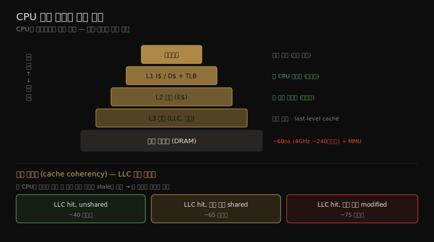

# CPU (2) — 아키텍처·스케줄러
---
> 이 노트는 6장의 아키텍처 부분으로, CPU 하드웨어와 소프트웨어의 구현을 잡습니다. 하드웨어로는 프로세서 구성 요소·P/C-state·CPU 캐시(L1/L2/L3·연관성·캐시 라인·일관성)·MMU/TLB·인터커넥트·PMC·GPU를, 소프트웨어로는 커널 스케줄러·스케줄링 클래스(RT·CFS·Deadline)·idle 스레드·NUMA 그룹화를 봅니다. 성능 분석의 배경 지식입니다.

06-01 이 개념(클럭·IPC·사용률)이었다면, 이 노트는 그 개념이 *어떻게 구현되는가* 입니다. CPU 캐시·인터커넥트가 왜 IPC를 좌우하는지, PMC로 사이클 수준을 어떻게 보는지, 스케줄러가 스레드를 어떻게 CPU에 배치하는지가 핵심입니다.

> 스케줄러 구현은 같은 02_os의 [linux-kernel-programming](../linux-kernel-programming/10-02.CPU%20스케줄러%20(2)%20—%20모듈식%20스케줄링%20클래스와%20CFS.md)(커널 개발자 관점)이 더 깊이 다룹니다. 방법론·관측 도구는 06-03·06-04 가 이어받습니다.

## 1. 프로세서와 P/C-state

> 프로세서는 control unit(명령 fetch·decode·실행 관리)을 중심으로 functional unit·캐시·클럭·온도 센서 등으로 이뤄집니다. ACPI는 P-state(정상 실행 중 주파수 가변)와 C-state(idle 시 전력 절약)를 정의합니다.

프로세서의 control unit이 CPU의 심장으로, 명령 fetch·decode·실행 관리·결과 저장을 합니다. 그 밖에 functional unit·공유 FPU·공유 L3 캐시·prefetch/write 캐시·클럭·timestamp counter·microcode ROM·온도 센서·(on-chip이면) 네트워크 인터페이스가 있을 수 있습니다. 일부는 온도 센서를 입력으로 개별 코어를 *동적 오버클럭*(Intel Turbo Boost) — 온도 범위 안에서 클럭을 올림 — 합니다.

ACPI 표준은 두 상태를 정의합니다.

| 상태 | 뜻 |
|------|-----|
| P-state(성능) | 정상 실행 중 CPU 주파수 가변 — P0이 최고(turbo), P1...N이 저주파. HW·SW로 제어 |
| C-state(전력) | 실행 정지 시 idle 상태 — C0이 정상, C1+ 가 idle(번호 클수록 깊은 sleep·높은 wakeup 지연) |

> C-state 예 — C0(실행)·C1(hlt 명령, 캐시 유지, 최저 wakeup 지연)·C3(더 깊은 절약, 캐시가 snooping 중단)·C6+(더 많은 기능 전력 차단). 일부 Intel은 C10까지 정의(캐시 내용까지 전력 차단). P-state는 MSR로 관측합니다(showboost, 06-04).

## 2. CPU 캐시 — 계층과 지연

> CPU 캐시는 빠른 메모리로 읽기 캐싱·쓰기 버퍼링을 합니다 — L1 명령/데이터·TLB·L2·(선택) L3 순으로 커지고 느려집니다. L1 접근은 몇 사이클, L2는 십여 사이클, 메인 메모리는 ~60ns(4GHz에서 ~240사이클)입니다. 수가 늘고 on-chip으로 통합되는 추세입니다.

CPU 캐시는 더 빠른 메모리 유형으로 읽기를 캐싱하고 쓰기를 버퍼링해 메모리 성능을 높입니다 — 보통 프로세서에 통합(on-chip·on-die)되거나 외부에 있습니다. 캐시 계층과 각 접근 지연, 캐시 일관성의 LLC 페널티를 한 장으로 정리하면 다음과 같습니다.

| 캐시 | 뜻 |
|------|-----|
| L1 명령 캐시(I$) / 데이터 캐시(D$) | 가장 빠르고 작음 — 코어당 |
| TLB(translation lookaside buffer) | 주소 변환 캐시 |
| L2 캐시(E$) | 중간 — 보통 코어당 |
| L3 캐시(선택) | 가장 큼 — 보통 코어 공유, LLC(last-level cache) |

#### 지연

여러 캐시 레벨로 크기·지연의 최적 구성을 냅니다.

| 접근 | 지연 |
|------|------|
| L1 캐시 | 몇 CPU 사이클 |
| L2 캐시 | 약 십여 사이클 |
| 메인 메모리(DRAM) | ~60ns (4GHz에서 ~240사이클) + MMU 변환 지연 |

> 캐시는 수와 크기가 늘고 *on-chip 통합* 되는 추세입니다(접근 지연 최소화). 1978 8086(캐시 없음)부터 2019 Xeon Platinum 9282(L1 64KB·L2 1MB·L3 77MB·56코어)까지 꾸준히 커졌습니다. 멀티코어/SMT에선 일부 캐시가 코어·스레드 간 공유됩니다(보통 L1·L2는 코어당, L3 공유).

#### 연관성·캐시 라인·일관성

| 개념 | 뜻 |
|------|-----|
| 연관성(associativity) | 새 항목을 캐시 어디에 둘지의 제약 — fully associative(어디든)·direct mapped(한 곳)·set associative(부분집합 내, 균형) |
| 캐시 라인(cache line) | 한 단위로 저장·전송되는 바이트 범위(x86 보통 64바이트) — 컴파일러·프로그래머가 고려 |
| 캐시 일관성(cache coherency) | 한 CPU가 메모리를 수정하면 다른 캐시의 사본을 stale로 표시·폐기 — CPU가 늘 올바른 메모리 상태에 접근하게 |

> 캐시 일관성은 확장 가능한 멀티프로세서 설계의 가장 큰 난제입니다. LLC 접근 페널티 예 — LLC hit unshared ~40사이클, 다른 코어 shared ~65사이클, 다른 코어 modified ~75사이클.

## 3. MMU·인터커넥트

> MMU는 가상→물리 주소 변환을 담당하며, on-chip TLB로 변환을 캐싱합니다. TLB 미스는 메인 메모리의 page table로 채웁니다. 멀티프로세서는 공유 시스템 버스(front-side bus, 확장성 문제)나 전용 인터커넥트(QPI·UPI·HyperTransport)로 연결됩니다.

#### MMU(memory management unit)

MMU는 가상→물리 주소 변환을 담당합니다 — on-chip *TLB* 로 변환을 캐싱하고, TLB 미스는 메인 메모리(DRAM)의 *page table*(MMU가 직접 읽고 커널이 유지)로 채웁니다. 옛 프로세서는 TLB 미스를 커널 SW로 처리(자체 TSB 캐시 유지)했으나, 신 프로세서는 HW로 처리해 비용을 크게 줄입니다.

#### 인터커넥트

멀티프로세서는 *공유 시스템 버스* 나 *전용 인터커넥트* 로 연결되며, 시스템 메모리 구조(UMA·NUMA, 7장)와 관련됩니다.

| 방식 | 뜻 |
|------|-----|
| 공유 시스템 버스(front-side bus) | 옛 Intel — 프로세서 수 늘면 공유 버스 경합으로 확장성 문제 |
| 전용 인터커넥트 | QPI·UPI(Intel)·HyperTransport(AMD)·CoreLink(ARM)·CAPI(IBM) — 비경합·고대역폭 |

> 예 — FSB(2007) 12.8GB/s, QPI(2008) 25.6GB/s, UPI(2017) 41.6GB/s. QPI는 double-pumped(클럭 상승·하강 edge 모두 전송)로 3.2GHz×2=6.4GT/s, ×2바이트×2방향=25.6GB/s입니다. 인터커넥트는 고대역폭으로 설계돼 병목이 안 되게 하지만, 병목이 되면 remote 메모리 I/O로 stall cycle이 생겨 *IPC가 떨어집니다* — PMC로 분석합니다.

## 4. PMC — 하드웨어 성능 카운터

> PMC는 저수준 CPU 활동을 세도록 프로그래밍하는 하드웨어 레지스터입니다 — 사이클·명령(retired)·캐시 접근(hit/miss)·FPU·메모리 I/O·stall cycle을 셉니다. CPU마다 레지스터가 적어(2~8개) 어느 이벤트를 셀지 골라야 합니다. event-select MSR로 프로그래밍합니다.

PMC(performance monitoring counter)는 저수준 CPU 활동을 세도록 프로그래밍하는 하드웨어 레지스터입니다(4장 §4.3.9). 보통 다음을 셉니다.

| 대상 | 셈 |
|------|-----|
| CPU 사이클 | stall cycle·stall 유형 포함 |
| CPU 명령 | retired(실행됨) |
| L1/L2/L3 캐시 접근 | hit·miss |
| FPU | 연산 |
| 메모리·자원 I/O | 읽기·쓰기·stall cycle |

> 각 CPU는 레지스터가 적어(보통 2~8개) 어느 이벤트를 셀지 골라야 합니다 — 프로세서 유형·모델에 달려 있고 매뉴얼에 문서화됩니다. Intel P6는 4개 MSR(2개 카운터 read-only, 2개 event-select read-write)로 구현하며, event-select MSR의 OS/USR 비트로 커널/유저 모드만 세고 CMASK로 임계값을 둘 수 있습니다. Skylake는 하드웨어 스레드당 고정 3개 + 코어당 프로그래머블 8개를 줍니다. PMC 예 — `INST_RETIRED`(명령 retired)·`L2_IFETCH`(L2 명령 fetch)·`BR_MISS_PRED_RETIRED`(분기 오예측)·`RESOURCE_STALLS`(자원 stall)·`CPU_CLK_UNHALTED`(비정지 사이클).

## 5. GPU와 기타 가속기

> GPU는 그래픽 외에 AI·ML·분석·암호화폐 채굴에 쓰입니다 — 워크로드의 일부(compute kernel)를 고도 병렬 처리합니다. CPU가 코어 수십 개라면 GPU는 작은 코어 수백~수천 개(SP)를 가집니다. FPGA·TPU 같은 다른 가속기도 있습니다.

GPU(graphics processing unit)는 그래픽 외에 AI·ML·분석·이미지 처리·암호화폐 채굴에 쓰입니다 — 서버·클라우드에선 워크로드의 일부(*compute kernel*, 행렬 변환 같은 고도 병렬 처리에 적합)를 실행하는 프로세서형 자원입니다(Nvidia CUDA가 널리 채택). CPU가 코어 수십 개라면 GPU는 작은 코어 수백~수천 개 *SP(streaming processor)* 를 가져 각각 스레드를 실행합니다.

| 속성 | CPU | GPU |
|------|-----|-----|
| 패키지 | 소켓에 꽂힘(시스템 버스·인터커넥트) | 확장 카드(PCIe) 또는 on-chip |
| 코어 | 2~64개 | 비슷한 수의 SM(streaming multiprocessor) |
| 스레드 | 코어당 2 하드웨어 스레드 | SM당 SP 수십~수백, 각 SP가 1 스레드 |
| 클럭 | 높음(예: 3.4GHz) | 상대적 낮음(예: 1.0GHz) |

> GPU 관측은 커스텀 도구가 필요합니다 — IPC·캐시 적중률·메모리 버스 사용률 등. FPGA·TPU 같은 다른 가속기도 CPU와 함께 분석하나 보통 커스텀 도구가 필요합니다. GPU·FPGA는 암호화폐 채굴 성능 향상에 쓰입니다.

## 6. 스케줄러와 스케줄링 클래스

> 커널 스케줄러의 핵심 기능은 시분할(우선순위 높은 실행 가능 스레드 먼저)·선점·로드 밸런싱입니다. Linux는 시스템 타이머 인터럽트로 시분할을 구동하고, CFS는 런큐 대신 red-black tree를 씁니다. 스케줄링 클래스(RT·CFS·Deadline)가 우선순위·시간 슬라이스를 관리합니다.

#### 스케줄러 핵심 기능

| 기능 | 뜻 |
|------|-----|
| 시분할(time sharing) | 실행 가능 스레드 간 멀티태스킹 — 우선순위 높은 것 먼저 |
| 선점(preemption) | 고우선 스레드가 실행 가능해지면 현재 스레드를 선점해 즉시 실행 |
| 로드 밸런싱(load balancing) | 실행 가능 스레드를 idle·덜 바쁜 CPU의 런큐로 이동 |

> Linux는 시스템 타이머 인터럽트가 `scheduler_tick()` 을 불러 시분할을 구동합니다 — 우선순위와 *time slice*(시간 단위) 만료를 관리합니다. 선점은 스레드가 실행 가능해질 때 `check_preempt_curr()`, 스레드 전환은 `__schedule()`(`pick_next_task()` 로 최고 우선 선택), 로드 밸런싱은 `load_balance()` 가 합니다. 비용이 이득을 넘으면 이주를 피해(CPU affinity) busy 스레드를 같은 CPU(캐시 warm)에 둡니다(`idle_balance()`·`task_hot()`). 런큐는 원래 구현이고, CFS는 실제로 *future task 실행의 red-black tree* 를 씁니다.

#### 스케줄링 클래스

스케줄링 클래스가 실행 가능 스레드의 우선순위·시간 슬라이스를 관리하고, *스케줄링 정책* 으로 같은 우선순위 스레드 간 스케줄링을 제어합니다. 유저 스레드 우선순위는 *nice 값*(중요치 않은 일의 우선순위를 낮춤)이 영향을 줍니다(static priority, 스케줄러 계산 dynamic priority와 별개).

| 클래스 | 뜻 |
|--------|-----|
| RT | 실시간 — 고정·높은 우선순위(0~99), 유저·커널 선점으로 저지연 dispatch |
| O(1) | 2.6 도입 시분할 기본(이후 CFS로 대체) — O(1) 복잡도, I/O-bound 우선순위 동적 향상 |
| CFS | 2.6.23 시분할 기본 — task CPU 시간 키의 red-black tree, 저소비자 우선 실행 |
| Idle | 가장 낮은 우선순위 |
| Deadline | 3.14 — EDF(earliest deadline first), runtime·period·deadline 파라미터 |

> 정책 — RR(SCHED_RR, time quantum 후 큐 끝으로)·FIFO(SCHED_FIFO, 자발적 떠남까지 계속)·NORMAL(SCHED_NORMAL, 시분할 기본)·BATCH(CPU-bound, I/O 인터랙티브 방해 안 함)·IDLE·DEADLINE. `sched_setscheduler(2)`·`chrt(1)` 로 선택합니다.

#### idle 스레드·NUMA·자원 인식

실행할 스레드가 없으면 *idle 스레드*(가장 낮은 우선순위)가 placeholder로 돌며, 보통 CPU에 halt(또는 throttle down)를 알려 전력을 아낍니다(다음 인터럽트에 깨어남). *NUMA 그룹화* — 커널을 NUMA-aware로 만들어 스케줄링·메모리 배치 결정을 개선합니다(Linux *scheduling domain*, root domain에서 시작하는 토폴로지). 관리자가 프로세스를 CPU에 바인딩하거나 exclusive CPU set을 만들 수도 있습니다(06-03 §CPU 바인딩). 커널은 CPU 자원 토폴로지도 이해해 전력 관리·캐시 사용·로드 밸런싱 결정을 개선합니다.

## 학습 점검

> 이 노트의 핵심을 스스로 떠올려 봅니다. 답이 막히면 해당 섹션으로 돌아가 확인합니다.

- P-state와 C-state의 차이를 설명하고, C1과 C6+ 의 차이를 떠올려 봅니다. (→ §1)
- CPU 캐시 계층(L1 I$/D$·TLB·L2·L3)과 각 접근 지연, 캐시 일관성이 왜 멀티프로세서 설계의 난제인지 말해 봅니다. (→ §2)
- MMU/TLB가 주소 변환을 어떻게 하고, 인터커넥트 병목이 왜 IPC를 떨어뜨리는지 설명해 봅니다. (→ §3)
- PMC가 무엇을 세고, CPU마다 레지스터가 적어 어떤 제약이 있는지 떠올려 봅니다. (→ §4)
- CPU와 GPU의 코어·스레드·클럭 차이와, GPU가 어떤 워크로드에 적합한지 말해 봅니다. (→ §5)
- 스케줄러 세 핵심 기능(시분할·선점·로드 밸런싱)과, RT·CFS·Deadline 클래스의 차이를 설명해 봅니다. (→ §6)
