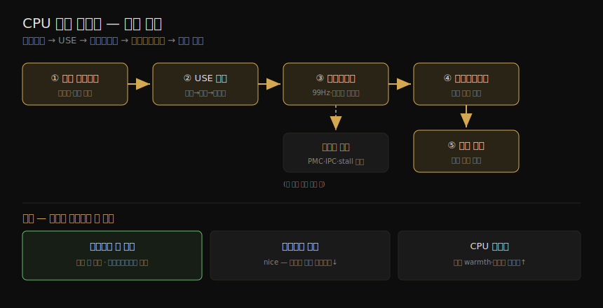

# CPU (3) — 방법론·실험·튜닝
---
> 이 노트는 6장의 방법론·실험·튜닝 부분으로, CPU를 *어떻게 분석하고 무엇을 조정하는가* 를 잡습니다. 방법론으로는 USE 방법·워크로드 특성 파악·프로파일링·사이클 분석·우선순위 튜닝·CPU 바인딩을, 실험으로는 마이크로벤치마킹을, 튜닝으로는 컴파일러·스케줄러·scaling governor·CPU 바인딩·cgroups·BIOS를 봅니다.

저자가 권하는 순서는 — *성능 모니터링 → USE 방법 → 프로파일링 → 마이크로벤치마킹 → 정적 성능 튜닝* 입니다. 이 노트는 그 방법론들과, CPU에서 가장 큰 성능 이득(불필요한 일 제거)을 찾는 튜닝을 다룹니다. 권장 흐름과 튜닝의 핵심을 한 장으로 정리하면 다음과 같습니다.

> 이 방법론을 수행하는 실제 도구(uptime·mpstat·perf·profile·flame graph)는 06-04 가 이어받습니다. 개념·아키텍처 전제는 06-01·06-02 입니다.

## 1. USE 방법과 워크로드 특성 파악

> USE 방법은 각 CPU의 사용률·포화·에러를 점검해 병목을 일찍 찾습니다 — 에러를 먼저(빠름), 사용률은 CPU별로(확장성), 자원 제어가 있으면 한도 대비로 봅니다. 워크로드 특성 파악은 가해진 부하(불필요한 일)를 식별합니다.

#### USE 방법

각 CPU에 대해 점검합니다 — *사용률*(idle 스레드가 아닌 시간)·*포화*(실행 가능 스레드가 큐에서 기다리는 정도)·*에러*(정정 가능 에러 포함). 에러를 먼저 점검합니다(빠르고 해석 쉬움 — 정정 가능 ECC 에러가 늘면 CPU를 offline하기도, 모든 CPU가 online인지 확인). 사용률은 *CPU별로* 봐 확장성 이슈를 찾습니다 — 클라우드처럼 CPU 한도/쿼터가 있으면 *물리 한도 외에 부과된 한도 대비* 로도 측정합니다(물리 100% 전에 쿼터로 포화). 포화는 보통 system-wide(load average 일부)로 제공됩니다.

#### 워크로드 특성 파악

가해진 부하를 특성 파악하면 불필요한 일을 식별해 큰 이득을 얻습니다 — *전달된 성능이 아니라 가해진 부하* 가 의도입니다.

| 속성 | 뜻 |
|------|-----|
| CPU load average | 사용률 + 포화 |
| user/system 시간 비 | 부하 유형 |
| syscall 비율 | 시스템 시간 이해 |
| 자발적 컨텍스트 전환 비율 | I/O-bound 신호 |
| 인터럽트 비율 | 시스템 시간 일부 |

> 예 — "48-CPU 앱 서버, load average 30~40, user/system 95/5(CPU 집약), 325K syscall/s, 80K 자발적 컨텍스트 전환/s." 심화 체크리스트 — system-wide/CPU별/코어별 사용률, CPU 부하의 병렬성(스레드 수), 어느 앱·유저·커널 스레드가 CPU를 쓰나, 인터럽트 CPU 사용, 인터커넥트 사용률, 왜 쓰나(call path), 어떤 stall cycle인가. 마지막 둘은 프로파일링·사이클 분석으로 답합니다.

## 2. 프로파일링

> CPU 프로파일링은 보통 타이머 기반 표집(99Hz로 현재 함수·스택 표집)이나 함수 추적으로 합니다. 99Hz를 쓰는 까닭은 100Hz lockstep을 피하기 위해서입니다. 표본은 많이 나와(Netflix 47,040) 플레임 그래프로 시각화합니다.

CPU 프로파일링은 대상의 그림을 그립니다 — 보통 두 방식입니다.

| 방식 | 뜻 |
|------|-----|
| 타이머 기반 표집 | 현재 함수·스택을 일정 비율(보통 99Hz)로 표집 — 거친 뷰, 오버헤드 작음(production 적합) |
| 함수 추적 | 일부·전체 함수 호출 계측해 지속 시간 측정 — 세밀하나 오버헤드 큼(10%+) |

대부분 production 프로파일러는 *타이머 기반 표집* 을 씁니다 — 99Hz를 쓰는 까닭은 100Hz로 대상 활동과 *lockstep* 표집해 왜곡되는 걸 피하기 위해서입니다. 커널은 보통 프로세스마다 두 스택(유저·커널)을 유지해, 완전한 프로파일엔 둘 다 기록합니다. 표본 처리엔 두 도전이 있습니다 — *저장 I/O*(많은 표본을 파일에 쓰면 production 교란, BPF profile은 커널 메모리에서 요약해 해결)와 *이해*(47,040 스택을 일일이 못 읽어 플레임 그래프로 시각화). 플레임 그래프 해석은 06-04 §시각화를 참조합니다.

#### 프로파일 해석 — 성능 이득 찾기

> 저자의 방법 — (1) top-down(leaf→root)으로 큰 *plateau* 를 찾음(한 함수가 많은 표본에 on-CPU, 빠른 이득). (2) bottom-up으로 코드 계층 이해(더 큰 이득 — 예: execve 자체를 피함). (3) top-down으로 흩어진 공통 사용(락 경합 등 — leaf→root 병합 icicle graph가 도움).

## 3. 사이클 분석·성능 모니터링·정적 튜닝

> 사이클 분석은 PMC로 사이클 수준의 CPU 사용을 이해합니다 — IPC를 먼저 재고, 낮으면 stall 유형을, 높으면 명령 감소를 봅니다. 성능 모니터링은 사용률·포화를 시간에 따라 추적하고, 정적 튜닝은 설정 환경을 점검합니다.

#### 사이클 분석(cycle analysis)

PMC로 사이클 수준 CPU 사용을 이해합니다 — L1/L2/L3 캐시 미스·메모리/자원 I/O·FPU 연산에 쓰인 사이클을 드러냅니다. *IPC(CPI 역수)부터 측정* 합니다 — 낮으면 stall 유형을 조사하고, 높으면 코드의 명령 감소를 봅니다("낮음" <0.2, "높음" >1, 알려진 워크로드로 감 잡기). PMC는 값 측정 외에 *overflow 시 커널 인터럽트* 로 설정할 수 있어(예: L3 미스 1만 번마다 스택 수집), 모든 미스를 재는 과한 오버헤드 없이 캐시 미스 코드 경로 프로파일을 만듭니다. overflow 표집은 skid·out-of-order 실행으로 잘못된 명령을 기록할 수 있어, Intel PEBS로 해결합니다(perf 지원). 사이클 분석은 며칠이 걸리는 고급 활동으로, Intel vTune·AMD uprof가 시간을 아낍니다.

#### 성능 모니터링·정적 튜닝

성능 모니터링은 *사용률*(percent busy)·*포화*(런큐 길이 또는 스케줄러 지연)를 시간에 따라 추적합니다 — 사용률은 CPU별로(확장성), 자원 제어가 있으면 한도 대비로. 간격이 도전입니다 — 5분 간격은 짧은 버스트를 숨기므로 초당 측정이 낫고, 초 안의 버스트는 FlameScope(06-04)로 봅니다. *정적 성능 튜닝* 은 설정 환경을 점검합니다 — CPU 수(코어·하드웨어 스레드), GPU 유무, 단일/멀티프로세서, 캐시 크기·공유, 클럭(Turbo Boost·BIOS 활성?), 프로세서 버그(errata), microcode 버전(Spectre/Meltdown 완화?), SW CPU 한도.

## 4. 우선순위 튜닝·자원 제어·CPU 바인딩

> 우선순위 튜닝은 nice 값으로 저우선 일(모니터링·백업)의 우선순위를 낮춰 고우선 일의 스케줄러 지연을 줄입니다. 자원 제어는 CPU 사이클을 프로세스에 할당합니다. CPU 바인딩은 프로세스를 특정 CPU에 묶어 캐시 warmth·메모리 지역성을 높입니다.

#### 우선순위 튜닝

Unix는 `nice(2)` 로 우선순위를 조정합니다 — 양수 nice는 우선순위 낮춤(nicer), 음수는 높임(root만). CPU 경합으로 고우선 일이 스케줄러 지연을 겪을 때 가장 효과적입니다 — *저우선 일*(모니터링 에이전트·예약 백업)을 찾아 nice로 시작하게 합니다. nice 너머로 스케줄러 클래스·정책을 바꿀 수도 있습니다 — Linux 실시간 클래스는 다른 모든 일을 선점하나, 버그로 무한 루프에 빠지면 *모든 CPU를 점유* 해 관리 셸조차 못 쓰게 됩니다(2.6.25부터 RLIMIT_RTTIME으로 한도).

#### 자원 제어·CPU 바인딩

*자원 제어* 는 프로세스(그룹)에 CPU 사이클을 할당합니다 — 고정 한도와 share(idle 사이클을 share 값 기반으로 소비)가 있습니다(§튜닝). *CPU 바인딩* 은 프로세스·스레드를 개별 CPU(또는 집합)에 묶어 캐시 warmth·메모리 지역성(NUMA)을 높입니다.

| 방식 | 뜻 |
|------|-----|
| CPU 바인딩 | 프로세스를 단일 CPU(또는 정의된 집합의 한 CPU)에서만 실행 |
| Exclusive CPU set | CPU 집합을 분할해 배정된 프로세스만 사용 — idle 시 다른 프로세스가 못 써 캐시 warmth↑(대신 시스템 가용 CPU↓) |

> Linux는 exclusive CPU set을 *cpuset* 으로 구현합니다(§튜닝).

## 5. 마이크로벤치마킹

> CPU 마이크로벤치마킹은 단순 연산을 여러 번 수행하는 시간을 잽니다 — CPU 명령·메모리 접근·고수준 언어·OS 연산 기반입니다. 시스템 간 비교 시 무엇을 정말 테스트하는지 알아야 합니다 — 종종 CPU 속도가 아니라 컴파일러 최적화 차이를 테스트합니다.

CPU 마이크로벤치마크는 단순 연산을 여러 번 수행하는 시간을 잽니다.

| 기반 | 예 |
|------|-----|
| CPU 명령 | 정수 산술·부동소수점·메모리 load/store·분기 |
| 메모리 접근 | 캐시별 지연·메인 메모리 처리량 |
| 고수준 언어 | 인터프리터/컴파일 언어로 작성 |
| OS 연산 | CPU-bound 시스템 콜·라이브러리(getpid·프로세스 생성) |

> 초기 예 — Whetstone(1972, 과학 워크로드)·Dhrystone(1984, 정수)·UnixBench. 시스템 간 비교 시 *무엇을 정말 테스트하는지* 알아야 합니다 — 종종 CPU 속도가 아니라 *컴파일러 버전 간 최적화 차이* 를 테스트하고, 단일 스레드 벤치마크는 멀티 CPU 시스템에서 의미를 잃습니다(4-CPU가 8-CPU보다 약간 빠를 수 있으나, 후자가 병렬 스레드 충분하면 훨씬 큰 처리량). SysBench의 CPU 벤치마크(소수 계산)가 한 예입니다.

## 6. 튜닝 — 컴파일러·스케줄러·governor·바인딩·자원 제어

> CPU의 가장 큰 이득은 불필요한 일 제거입니다. 튜닝은 컴파일러 옵션·스케줄링 우선순위/클래스·scaling governor·전력 상태·CPU 바인딩·exclusive CPU set·자원 제어(cgroups)·BIOS로 합니다. governor는 환경 비용을 고려해 신중히 바꿉니다.

CPU의 가장 큰 성능 이득은 *불필요한 일 제거* 입니다. 튜닝 옵션은 프로세서·OS·워크로드에 달려 있습니다.

| 영역 | 튜닝 |
|------|------|
| 컴파일러 옵션 | 64비트 컴파일·최적화 수준(5장) |
| 스케줄링 우선순위/클래스 | `nice(1)`(−20~+19)·`chrt(1)`(클래스·정책)·`setpriority(2)`·`sched_setscheduler(2)` |
| 스케줄러 옵션 | CONFIG(CONFIG_PREEMPT·CONFIG_HZ 등)·sysctl(sched_latency_ns·sched_migration_cost_ns 등) |
| scaling governor | `/sys/.../scaling_governor` — performance(최대 주파수) vs powersave(전력 절약) |
| 전력 상태 | `cpupower` 로 deep sleep 상태 활성/비활성(높은 exit 지연 상태 비활성 가능) |
| CPU 바인딩 | `taskset`(CPU 마스크)·`numactl`(CPU+메모리 노드) |
| exclusive CPU set | cpuset(cgroup) — CPU 집합 분할 + cpu_exclusive |
| 자원 제어 | cgroups — share·CFS bandwidth(간격당 CPU 사이클 마이크로초 한도) |
| 보안 부트 옵션 | nospectre_v1·nospectre_v2(완화 비활성 — 성능↑이나 보안 위험, 비권장) |
| 프로세서 옵션(BIOS) | Turbo Boost 등 — 보통 기본이 최대 성능 |

> **scaling governor 주의** — CPU를 늘 최대 주파수로 두면 환경 비용이 막대할 수 있습니다. 성능 향상이 크지 않으면 지구를 위해 powersave를 유지하는 걸 고려하고, 전력 MSR로 max 주파수 설정의 환경 비용을 정량화할 수 있습니다. 실시간 클래스는 무한 루프 버그 시 모든 CPU 점유 위험을 알고 써야 합니다. Meltdown/Spectre 완화 비활성은 보안 위험이라 비권장입니다.

## 학습 점검

> 이 노트의 핵심을 스스로 떠올려 봅니다. 답이 막히면 해당 섹션으로 돌아가 확인합니다.

- USE 방법으로 CPU를 점검하는 순서(에러→포화→사용률)와, 자원 제어가 있으면 왜 한도 대비로도 측정하는지 설명해 봅니다. (→ §1)
- 프로파일링이 99Hz를 쓰는 이유와, 플레임 그래프에서 성능 이득을 찾는 세 방법(plateau·bottom-up·흩어진 사용)을 떠올려 봅니다. (→ §2)
- 사이클 분석에서 IPC를 먼저 재는 이유와, PMC overflow 표집이 캐시 미스 코드 경로를 어떻게 프로파일하는지 말해 봅니다. (→ §3)
- 우선순위 튜닝이 언제 가장 효과적인지, 실시간 클래스의 위험(무한 루프)을 설명해 봅니다. (→ §4)
- CPU 마이크로벤치마크가 종종 CPU 속도가 아니라 무엇을 테스트하는지 떠올려 봅니다. (→ §5)
- scaling governor의 performance vs powersave 트레이드오프와, 왜 환경 비용을 고려해야 하는지 말해 봅니다. (→ §6)
