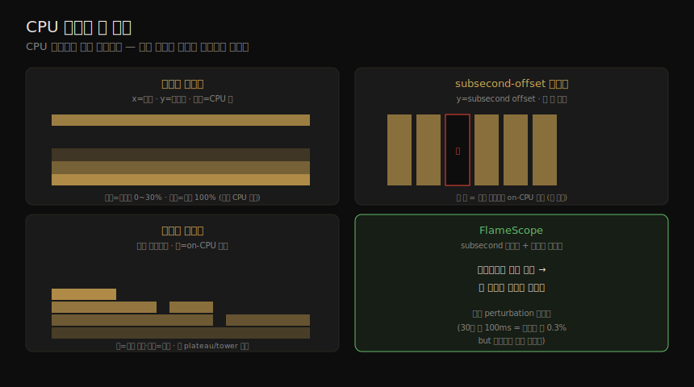

# CPU (4) — 관측 도구·시각화
---
> 이 노트는 6장의 마지막 부분으로, CPU 성능을 보는 *실제 도구* 와 *시각화* 를 잡습니다. 전통 도구(uptime·vmstat·mpstat·sar·ps·top·pidstat)부터 클럭/사이클 도구(turbostat·showboost·pmcarch·tlbstat), 프로파일링·트레이싱(perf·profile·cpudist·runqlat·runqlen·softirqs·hardirqs·bpftrace), 그리고 시각화(사용률 히트맵·subsecond-offset 히트맵·플레임 그래프·FlameScope)까지입니다.

06-03 의 방법론을 손에 든 연장으로 옮기는 노트입니다. 도구는 전통 통계 → 사이클 분석 → 프로파일링·트레이싱 순으로 깊어집니다. 핵심 비교 하나 — load average는 system-wide 부하(CPU·디스크 등 모두)이고, PSI는 자원별 stall 시간 비율입니다.

> BPF 기반 도구(profile·cpudist·runqlat·runqlen·softirqs·hardirqs)는 04-02 의 이벤트 소스 위에 서며 15장에서 깊어집니다. sar·perf는 04-03 과 교차참조합니다.

## 1. uptime — load average와 PSI

> uptime은 1·5·15분 load average를 찍습니다 — 셋을 비교해 부하가 느는지 줍니다. Linux load average는 CPU만이 아니라 system-wide 수요(CPU·디스크 등, TASK_UNINTERRUPTIBLE 포함)입니다. PSI는 자원별(CPU·메모리·I/O) stall 시간 비율을 줍니다.

uptime(1)은 1·5·15분 load average를 찍습니다 — 셋을 비교해 부하가 느는지·주는지·일정한지 봅니다(5분 이상 고민하지 말고 다른 지표로). **Linux load average** 는 1993년부터 CPU만이 아니라 *system-wide 수요*(CPU·디스크 등, `TASK_UNINTERRUPTIBLE` "D" 상태 포함)를 보입니다 — 현재 사용(사용률) + 큐 요청(포화)입니다. 지수 감쇠 이동 평균이라 1·5·15분 시간을 넘는 부하도 반영합니다(CPU-bound 스레드 하나로 1·5·15분에 약 61%에 도달).

> 예 — 64-CPU 시스템 load average 128은 CPU만이면 각 CPU에 1 스레드 실행 + 1 대기를, load average 20은 큰 여유를 뜻합니다(정규화 load average = load/CPU 수).

#### PSI(pressure stall information)

Linux 4.20부터 자원별 분해를 줍니다.

| 속성 | load average | PSI |
|------|-------------|-----|
| 자원 | system-wide | cpu·memory·io 각각 |
| 지표 | busy + 큐 task 수 | stall(대기) 시간 % |
| 시간 | 1·5·15분 | 10·60·300초 |

> `/proc/pressure/cpu` 의 `some avg10=50.00` 은 스레드가 50% 시간 stall했다는 뜻입니다(io·memory는 모든 비-idle 스레드가 stall한 "full" 줄도 있음). PSI는 "task가 자원을 기다릴 확률이 얼마인가"에 답합니다.

## 2. vmstat·mpstat·sar·ps·top·pidstat — 전통 통계

> vmstat은 system-wide CPU 평균과 런큐 길이(r)를, mpstat은 CPU별 통계(hot CPU 식별)를, sar는 이력을, ps/top/pidstat은 프로세스별 CPU를 보여 줍니다. mpstat의 CPU별 %usr·%sys·%idle이 hot CPU(단일 스레드·인터럽트 매핑)를 드러냅니다.

| 도구 | 보는 것 |
|------|--------|
| vmstat | system-wide CPU 평균(us·sy·id·wa·st) + 런큐 길이(r=실행+대기) |
| mpstat -P ALL | CPU별 %usr·%nice·%sys·%iowait·%irq·%soft·%steal·%idle — *hot CPU* 식별 |
| sar | 이력 통계(-u·-P ALL·-q 런큐·load average) |
| ps | 프로세스별 TIME(누적 CPU)·%CPU(수명 평균) |
| top | 프로세스별 실시간 — TIME·%CPU(현재 간격, Irix/Solaris 모드) |
| pidstat | 프로세스/스레드별 %usr·%system 분해(rolling) |

> mpstat의 *hot CPU* — 한 CPU만 100%(%usr+%sys)이고 나머지는 한가하면 단일 스레드 워크로드나 장치 인터럽트 매핑 탓입니다. top은 /proc를 스냅샷해 단명 프로세스를 놓치고(빌드 시), top 자신이 최대 CPU 소비자로 보고되기도 합니다(atop은 process accounting으로 단명 프로세스 포착). ps의 Linux %CPU는 *수명 평균*(전 CPU 합산, 2스레드 CPU-bound면 200%)이고, 현재 사용은 top으로 봅니다.

## 3. turbostat·showboost·pmcarch·tlbstat — 클럭·사이클

> turbostat·showboost는 MSR로 CPU 클럭 속도·C-state를 보여 줍니다 — 클럭이 비정상으로 낮은지 확인합니다. pmcarch는 PMC로 고수준 사이클 성능(IPC·분기 오예측률·LLC 적중률)을, tlbstat은 TLB 사이클을 보여 줍니다.

| 도구 | 보는 것 |
|------|--------|
| turbostat | MSR — CPU별 평균 MHz·busy%·C-state·온도·전력 |
| showboost | MSR — CPU 클럭 속도·turbo boost 단계(클럭이 비정상 낮은지 확인) |
| pmcarch | PMC architectural set — K_CYCLES·K_INSTR·IPC·BMR%(분기 오예측률)·LLC%(LLC 적중률) |
| tlbstat | PMC — TLB 사이클(DTLB%·ITLB% — KPTI Meltdown 완화의 TLB walk 영향 측정) |

> pmcarch의 IPC가 낮으면 BMR%(분기 오예측)·LLC%(캐시 적중)가 *왜 낮은지·stall이 어디인지* 단서를 줍니다. tlbstat은 KPTI worst-case를 드러냅니다 — CPU가 시간 절반을 TLB walk에 쓰면 앱이 절반 속도로 돕니다. showboost·pmcarch·tlbstat은 저자의 cloud-tools repo 도구로, 프로세서 차이로 환경에 따라 안 될 수 있으나 perf로 직접 쓸 PMC 예를 줍니다.

## 4. perf — 프로파일링·PMC 분석

> perf는 공식 Linux 프로파일러입니다. record로 스택을 표집(99Hz)해 report·플레임 그래프로 보고, stat으로 PMC(IPC·캐시 미스)를 셉니다. sched로 스케줄러 지연을, software event로 컨텍스트 전환을 추적합니다.

perf(1)는 공식 Linux 프로파일러(13장)입니다. CPU 분석 핵심 용법입니다.

| 용법 | 명령 |
|------|------|
| system-wide CPU 프로파일링 | `perf record -F 99 -a -g -- sleep 10` → `perf report --stdio` |
| CPU 플레임 그래프 | `perf script report flamegraph`(5.8+) 또는 stackcollapse-perf.pl+flamegraph.pl |
| 프로세스 프로파일링 | `perf record -F 99 -g command` 또는 `-p PID` |
| 스케줄러 지연 | `perf sched record` → `perf sched latency`(프로세스별 run queue 지연)·`timehist` |
| PMC(하드웨어 이벤트) | `perf stat`(기본 사이클·명령·IPC)·`-e instructions,cycles,L1-dcache-load-misses,...` |
| software 추적 | `perf record -e sched:sched_switch -a -g`(컨텍스트 전환 스택) |

> `perf stat` 의 IPC가 핵심 — gzip 예에서 1.6("좋음"), Shopify NUMA 튜닝에서 0.72→0.89(24% 향상, 최종 win과 일치). 하드웨어 이벤트 — L1-dcache-load-misses(L1 후 메모리 부하)·LLC-load-misses(메인 메모리 부하)·dTLB-load-misses(MMU 효과·워킹셋 크기). 스케줄러 이벤트는 잦아(10초에 125MB) 오버헤드 큼 — production 주의. `perf list` 로 이벤트를 나열합니다.

## 5. profile·cpudist·runqlat·runqlen — BPF 기반

> profile은 BPF로 커널에서 스택을 집계해 오버헤드를 줄인 CPU 프로파일러로, CPU 소비 이해에 가장 유용합니다. cpudist는 on-CPU 시간 분포를, runqlat은 스케줄러 지연을, runqlen은 런큐 길이를 보여 줍니다.

| 도구 | 보는 것 |
|------|--------|
| profile | BPF 타이머 기반 CPU 프로파일러(49Hz) — 커널에서 스택 집계, perf보다 오버헤드 작음. `-f` 로 플레임 그래프 |
| cpudist | wakeup당 on-CPU 시간 분포(히스토그램) — `-O` off-CPU·`-P` 프로세스별 |
| runqlat | 스케줄러 지연(run queue 지연) — CPU 포화 정량화. wakeup·컨텍스트 전환 계측(오버헤드 큼, 주의) |
| runqlen | 런큐 길이 표집(99Hz) — 오버헤드 작음. `-C` CPU별·`-O` occupancy |
| softirqs / hardirqs | soft/hard IRQ 서비스 시간(이벤트 수가 아닌 *시간*) — 프로파일러가 못 잡는 CPU 소비자 |

> profile은 CPU 소비 이해에 *가장 유용* 합니다 — 거의 모든 CPU 소비 코드 경로를 요약합니다. runqlat 예에서 한가한 시스템(15% 사용률)인데 65~131ms 지연이 88건 — 하이퍼바이저 CPU throttling 신호였습니다. runqlat은 컨텍스트 전환마다 표집(초당 수백만)해 오버헤드가 크니 runqlen(99Hz 표집)을 대안으로 고려합니다. softirqs·hardirqs는 CPU 프로파일러가 못 잡는(인터럽트 불가) 소비자를 드러냅니다 — 예에서 net_rx 12ms, ens5 네트워크 IRQ 5.9ms.

## 6. bpftrace와 시각화

> bpftrace는 고수준 언어로 커스텀 CPU 분석을 합니다(새 프로세스·syscall·스택 표집). CPU 사용률은 히트맵(많은 CPU)·subsecond-offset 히트맵(초 안 활동)·플레임 그래프(스택 프로파일)·FlameScope(둘의 결합)로 시각화합니다.

#### bpftrace one-liner

| 용도 | one-liner |
|------|-----------|
| 새 프로세스(인자) | `tracepoint:syscalls:sys_enter_execve { join(args->argv); }` |
| 프로세스별 syscall | `tracepoint:raw_syscalls:sys_enter { @[pid, comm] = count(); }` |
| 프로세스명 표집(99Hz) | `profile:hz:99 { @[comm] = count(); }` |
| 스택 표집(49Hz) | `profile:hz:49 { @[kstack, ustack, comm] = count(); }` |
| 컨텍스트 전환 off-CPU 스택 | `tracepoint:sched:sched_switch { @[kstack] = count(); }` |

> 스케줄러 내부는 `tracepoint:sched:*`(5.3에서 24개)부터 시도하고, 부족하면 kprobe(`kprobe:sched*` 104개)를 씁니다 — 스케줄러 이벤트는 잦아 map으로 요약하고 최소 이벤트만 추적해 오버헤드를 줄입니다.

#### 시각화

CPU 성능을 보는 네 시각화를 한 장으로 정리하면 다음과 같습니다.

| 시각화 | 뜻 |
|--------|-----|
| 사용률 히트맵 | CPU 사용률 vs 시간 — 픽셀 농도가 그 사용률·시간의 CPU 수(수천 CPU에 적합, 라인 그래프는 페인트 됨) |
| subsecond-offset 히트맵 | 초 안 활동 — y축이 subsecond offset, 농도가 비-idle CPU 수(초 단위 평균이 지우는 정보를 드러냄) |
| 플레임 그래프 | 스택 프로파일 — 박스=스택 프레임, y축=스택 깊이(위 현재·아래 조상), x축=표본 비율(폭=on-CPU 시간), 큰 plateau/tower 먼저 |
| FlameScope | 둘의 결합 — subsecond-offset 히트맵에서 범위(subsecond 포함)를 선택하면 그 범위만 플레임 그래프 |

> CPU 사용률은 흔히 *이중모드*(일부 idle·일부 100%)라 평균·표준편차로는 안 보이고 *전체 분포* 가 필요해 히트맵이 효과적입니다. subsecond-offset 히트맵의 *흰 칸*(DB 스레드가 아무도 on-CPU 아님)이 수백 ms 락 이슈를 드러낸 사례가 있습니다. 플레임 그래프 색은 hue(코드 유형)·saturation(함수명 해시)·배경색(그래프 유형)으로 구분하고, 인터랙티브(클릭 zoom·Ctrl-F 검색, 검색 시 누적 %)합니다. FlameScope는 작은 perturbation(30초 중 100ms는 플레임 그래프 폭 0.3%지만 히트맵엔 세로 줄무늬)을 드러냅니다.

#### GPU·기타 도구

GPU는 표준 도구가 없어 벤더별 도구(nvidia-smi·nvperf·intel_gpu_top·radeontop)를 씁니다 — GPU는 스택 트레이스가 없어 API·메모리 전송 호출과 타이밍을 계측합니다. 기타 Linux 도구 — oprofile·atop·/proc/cpuinfo·lscpu·lstopo(HW 토폴로지)·cpupower(전력 상태)·valgrind(callgrind·cachegrind).

## 학습 점검

> 이 노트의 핵심을 스스로 떠올려 봅니다. 답이 막히면 해당 섹션으로 돌아가 확인합니다.

- Linux load average가 CPU만이 아닌 이유(TASK_UNINTERRUPTIBLE)와, PSI가 load average와 무엇이 다른지 설명해 봅니다. (→ §1)
- mpstat의 hot CPU가 무엇을 뜻하고, top이 단명 프로세스를 놓치는 이유를 떠올려 봅니다. (→ §2)
- pmcarch의 IPV가 낮을 때 BMR%·LLC%가 어떤 단서를 주는지, tlbstat이 KPTI 영향을 어떻게 드러내는지 말해 봅니다. (→ §3)
- perf stat의 IPC가 왜 핵심 지표인지(Shopify 0.72→0.89 예), 스케줄러 이벤트 추적의 오버헤드 주의점을 설명해 봅니다. (→ §4)
- profile이 CPU 소비 이해에 가장 유용한 이유와, runqlat 대신 runqlen을 쓰는 경우를 떠올려 봅니다. (→ §5)
- CPU 사용률 히트맵이 라인 그래프보다 나은 이유(이중모드), FlameScope가 작은 perturbation을 어떻게 드러내는지 말해 봅니다. (→ §6)
