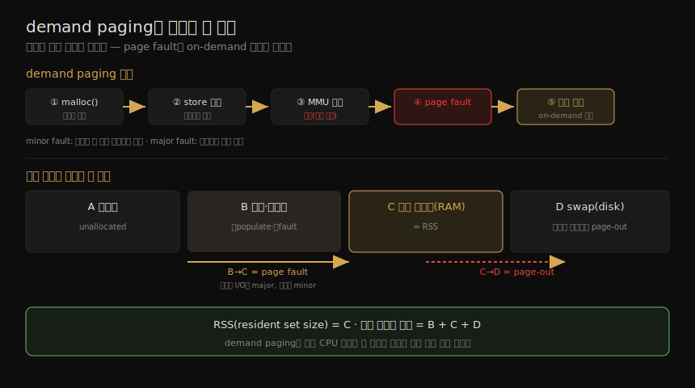

# 메모리 (1) — 용어·핵심 개념
---
> 이 노트는 7장의 첫 부분으로, 메모리 분석의 토대가 될 용어·개념을 잡습니다. 메인 메모리는 앱·커널 명령과 작업 데이터, 파일시스템 캐시를 저장합니다 — 가득 차면 메인 메모리와 스토리지 사이로 데이터를 옮기는데(느린 과정, 흔히 병목), 가장 큰 프로세스를 종료(OOM)하기도 합니다. 여기서는 가상 메모리·페이징·demand paging·overcommit·프로세스 스와핑·파일시스템 캐시·WSS 등 핵심 개념을 봅니다.

메모리 성능의 핵심 함정은 메인 메모리가 가득 찰 때입니다 — 메인 메모리와 스토리지(수백~수천 배 느림) 사이로 데이터를 옮기는 *느린 과정* 이 시스템 병목이 되고, 가장 큰 메모리 소비 프로세스를 종료해 앱 장애를 일으키기도 합니다. 그 밖에 메모리 할당·해제·복사·주소 공간 매핑의 CPU 비용, NUMA의 메모리 지역성도 성능 요인입니다. 이 노트는 그 모든 것의 *공통 어휘와 멘탈 모델* 입니다.

> 이 책의 메모리 설명은 "성능 분석가 관점"입니다. 같은 02_os의 [linux-kernel-programming](../linux-kernel-programming/09-03.메모리%20할당%20(5)%20—%20demand%20paging과%20OOM%20killer.md)(커널 개발자 관점의 메모리 할당)과 교차참조합니다. on-CPU 메모리 캐시(L1/L2/L3·TLB)는 6장이 다룹니다. 아키텍처·할당자는 07-02 가 이어받습니다.

## 1. 핵심 용어

> 메모리 관련 핵심 어휘입니다. 메인/가상/resident/anonymous 메모리의 구분과, 페이지·페이지 폴트·페이징·스와핑·swap을 먼저 잡아 둡니다.

| 용어 | 뜻 |
|------|-----|
| 메인 메모리(physical memory) | 컴퓨터의 빠른 데이터 저장 영역(보통 DRAM) |
| 가상 메모리(virtual memory) | 메인 메모리의 추상 — 거의 무한·비경합. 실제 메모리가 아님 |
| resident memory | 현재 메인 메모리에 있는 메모리 |
| anonymous memory | 파일시스템 위치·경로 없는 메모리 — 프로세스 주소 공간의 작업 데이터(heap) 포함 |
| address space | 메모리 컨텍스트 — 프로세스마다·커널마다 가상 주소 공간이 있음 |
| segment | 특정 목적(실행·쓰기 페이지)으로 표시된 가상 메모리 영역 |
| OOM | out of memory — 커널이 가용 메모리 부족을 감지 |
| page | OS·CPU가 쓰는 메모리 단위(역사적으로 4·8KB, 현대는 더 큰 크기도) |
| page fault | 무효 메모리 접근 — on-demand 가상 메모리에선 정상 |
| paging | 메인 메모리와 스토리지 사이 페이지 전송 |
| swapping | (Linux) swap 장치로의 anonymous 페이징. (Unix) 프로세스 전체 전송 — 이 책은 Linux 정의를 씀 |
| swap | 페이징된 anonymous 데이터의 디스크 영역(스토리지=physical swap device, 파일=swap file) |

## 2. 가상 메모리

> 가상 메모리는 각 프로세스·커널에 크고 선형이며 사적인 주소 공간을 줍니다 — SW 개발을 단순화하고, 멀티태스킹(주소 공간 분리)과 oversubscription(사용 메모리가 메인 메모리를 넘어섬)을 지원합니다. 커널은 오버서브스크립션에 한도를 둘 수도, overcommit으로 한도 없이 둘 수도 있습니다.

가상 메모리는 각 프로세스와 커널에 크고 선형이며 *사적인* 주소 공간을 주는 추상입니다 — 물리 메모리 배치를 OS가 관리하게 해 SW 개발을 단순화합니다. 멀티태스킹(가상 주소 공간이 설계상 분리됨)과 *oversubscription*(사용 중 메모리가 메인 메모리를 넘어 확장)을 지원합니다. 프로세스 주소 공간은 가상 메모리 서브시스템이 메인 메모리와 physical swap device로 매핑하며, 커널이 필요에 따라 페이지를 옮깁니다(Linux는 *swapping*, 다른 OS는 anonymous paging이라 부름) — 이로써 메인 메모리를 오버서브스크립션합니다.

> 커널은 오버서브스크립션에 한도(흔히 메인 메모리 + physical swap 크기)를 둘 수 있어, 넘으면 할당을 실패시킵니다("out of virtual memory" 에러는 가상 메모리가 추상 자원이라 처음엔 헷갈립니다). Linux는 한도 없이 두는 *overcommit* 도 허용합니다(§5).

## 3. 페이징 — 파일시스템 vs anonymous

> 페이징은 페이지를 메인 메모리로 들이고(page-in) 내보내는(page-out) 것으로, 프로그램 일부 적재·메인 메모리보다 큰 프로그램 실행을 가능케 합니다. 파일시스템 페이징("좋은" 페이징)과 anonymous 페이징(스와핑, "나쁜" 페이징)으로 나뉩니다.

페이징은 페이지를 메인 메모리로 들이고(page-in) 내보내는(page-out) 것입니다 — 1962년 Atlas Computer가 도입해 *부분 적재 프로그램 실행*·*메인 메모리보다 큰 프로그램 실행*·*효율적 이동* 을 가능케 했습니다. 프로그램 전체를 스왑하던 옛 기법과 달리, 페이지 단위(예: 4KB)라 *세밀합니다.* page cache(파일시스템 페이지 공유, 8장) 추가로 두 유형이 생겼습니다.

| 유형 | 뜻 |
|------|-----|
| 파일시스템 페이징("좋은") | 메모리 매핑 파일의 읽기·쓰기 — dirty(수정됨)면 page-out에 디스크 쓰기, clean(미수정)이면 즉시 메모리 해제(디스크에 사본 있음) |
| anonymous 페이징=스와핑("나쁜") | 프로세스 사적 데이터(heap·stack) — page-out은 physical swap device로 이동 |

> anonymous 페이징은 성능을 해쳐 "나쁜" 페이징입니다 — page-out된 페이지에 접근하면 다시 읽는 디스크 I/O에 블록돼(*anonymous page-in*, 동기 지연), 앱에 지연을 줍니다(page-out은 비동기라 직접 영향 적음). 성능은 *anonymous 페이징(스와핑)이 없을 때* 가장 좋습니다 — 앱을 가용 메인 메모리 안에 두고 page scanning·사용률·anonymous 페이징을 모니터링해 메모리 부족 징후가 없게 합니다. (3D XPoint 같은 sub-10μs swap이면 스와핑이 "나쁜" 페이징이 아니라 메인 메모리 확장 수단이 될 수 있습니다.)

## 4. demand paging와 페이지 상태

> demand paging은 가상 메모리 페이지를 *요청 시에만* 물리 메모리에 매핑합니다 — 매핑 CPU 비용을 실제 접근 때로 미룹니다. 매핑이 없어 page fault가 나면 커널이 on-demand 매핑을 만드는데, 메모리로 풀면 minor fault, 디스크 접근이면 major fault입니다.

demand paging(대부분 지원)은 가상 메모리 페이지를 *요청 시에만* 물리 메모리에 매핑합니다 — 매핑 생성 CPU 비용을 메모리 범위 첫 할당 때가 아니라 *실제 접근 때* 로 미룹니다. 흐름 — malloc()이 메모리 할당(① 매핑 없음) → store 명령(②) → MMU 가상→물리 조회(③ 실패) → *page fault*(④) → 커널이 on-demand 매핑 생성(⑤) → 나중에 메모리 압박 시 swap으로 page-out(⑥). 이 흐름과 페이지의 네 상태를 한 장으로 정리하면 다음과 같습니다.

| fault | 뜻 |
|-------|-----|
| minor fault | 메모리 안 다른 페이지로 매핑 충족(가용 메모리에서 새 페이지·공유 라이브러리 읽기) |
| major fault | 스토리지 접근 필요(캐시 안 된 메모리 매핑 파일) |

가상 메모리 페이지는 네 상태 중 하나입니다.

| 상태 | 뜻 |
|------|-----|
| A | 미할당 |
| B | 할당됐으나 미매핑(미populate·미fault) |
| C | 할당·메인 메모리(RAM) 매핑 |
| D | 할당·physical swap device(disk) 매핑 |

> B→C 전환이 page fault입니다(디스크 I/O 필요면 major, 아니면 minor). D는 메모리 압박으로 page-out된 상태입니다. 두 메모리 용어가 정의됩니다 — *RSS(resident set size)* = 할당된 메인 메모리 페이지 크기(C), *가상 메모리 크기* = 모든 할당 영역(B+C+D).

## 5. overcommit·프로세스 스와핑·파일시스템 캐시

> overcommit은 시스템이 저장할 수 있는 것보다 많은 메모리 할당을 허용합니다 — demand paging과 "할당해도 다 안 쓰는" 경향에 기댑니다. 프로세스 스와핑은 프로세스 전체를 옮기는 옛 Unix 기법으로 Linux는 안 씁니다. 파일시스템 캐시 증가는 정상입니다.

#### overcommit

Linux는 *overcommit* — 시스템이 저장할 수 있는 것(물리 메모리 + swap)보다 많은 메모리 할당 허용 — 을 지원합니다. demand paging과 *앱이 할당한 메모리를 다 안 쓰는 경향* 에 기댑니다. malloc 요청이 (원래는 실패할) 성공하므로, 프로그래머가 넉넉히 할당하고 나중에 드물게 씁니다(튜너블로 동작 설정, §튜닝).

#### 프로세스 스와핑

프로세스 전체를 메인 메모리와 swap 사이로 옮기는 것으로, *swap* 용어의 기원인 옛 Unix 기법입니다 — 사적 데이터 전체(heap·open file table·메타데이터)를 swap에 써야 해 성능을 심하게 해칩니다(다시 돌리려면 수많은 디스크 I/O). PDP-11 시절(프로세스 최대 64KB)엔 합리적이었습니다. **Linux는 프로세스를 전혀 스왑하지 않고 페이징만 씁니다.**

#### 파일시스템 캐시·utilization·saturation

부팅 후 OS가 가용 메모리로 파일시스템을 캐싱해 메모리 사용이 느는 건 정상입니다 — *여유 메모리가 있으면 유용하게 쓴다* 는 원칙입니다(앱이 필요하면 커널이 빠르게 해제). 메인 메모리 *utilization* = 사용 메모리/전체(파일시스템 캐시는 재사용 가능하므로 미사용으로 취급). 수요가 메인 메모리를 넘으면 *saturation* — OS가 페이징·(지원 시)프로세스 스와핑·OOM killer로 메모리를 해제하며, 이들이 곧 saturation 지표입니다.

## 6. 할당자·공유 메모리·WSS·워드 크기

> 할당자는 가상 주소 공간 안 실제 할당·배치를 맡습니다(malloc·free) — 성능에 큰 영향. 공유 메모리는 프로세스 간 공유(시스템 라이브러리)로 PSS로 측정합니다. WSS는 프로세스가 자주 쓰는 메모리량으로, 캐시에 맞으면 성능이 크게 오릅니다.

#### 할당자(allocators)

가상 메모리가 물리 메모리 멀티태스킹을 맡는다면, 가상 주소 공간 안 *실제 할당·배치* 는 할당자가 맡습니다 — 유저랜드 라이브러리나 커널 루틴으로 쉬운 인터페이스(malloc·free)를 줍니다. 성능에 큰 영향을 주며(per-thread 객체 캐싱 등으로 개선, 단편화로 악화), 여러 유저 레벨 할당자 중 고를 수 있습니다(07-02 §할당자).

#### 공유 메모리·WSS

*공유 메모리* 는 프로세스 간 공유로, 시스템 라이브러리의 읽기 전용 명령 텍스트 한 사본을 모든 프로세스가 공유해 메모리를 아낍니다 — 프로세스별 메모리 보고가 어려워, Linux는 *PSS(proportional set size)*(사적 메모리 + 공유 메모리/사용자 수)를 제공합니다. *WSS(working set size)* 는 프로세스가 일하느라 자주 쓰는 메인 메모리량입니다 — CPU 캐시에 맞으면 성능이 크게 오르고, 메인 메모리를 넘어 스왑하면 크게 떨어집니다(개념은 유용하나 측정이 어려움 — 도구는 보통 RSS만 보고, 07-04 §wss).

#### 워드 크기

프로세서는 여러 워드 크기(32·64비트)를 지원합니다 — 주소 공간 크기가 워드 크기로 제한돼, 4GB 넘는 메모리가 필요한 앱은 64비트로 컴파일해야 합니다(32비트 PAE 워크어라운드 있음). 커널·프로세서에 따라 주소 공간 일부가 커널용으로 예약됩니다(32비트 Windows 2GB·Linux 1GB, 64비트는 충분히 커 비이슈). 큰 비트 폭이 메모리 성능을 높이기도(명령이 큰 워드 처리) 하나, 데이터 타입의 미사용 비트로 메모리를 약간 낭비할 수 있습니다.

## 학습 점검

> 이 노트의 핵심을 스스로 떠올려 봅니다. 답이 막히면 해당 섹션으로 돌아가 확인합니다.

- 메인/가상/resident/anonymous 메모리를 구분하고, Linux에서 paging과 swapping의 차이를 설명해 봅니다. (→ §1)
- 가상 메모리가 멀티태스킹과 oversubscription을 어떻게 지원하는지, overcommit이 무엇인지 떠올려 봅니다. (→ §2, §5)
- 파일시스템 페이징("좋은")과 anonymous 페이징("나쁜")의 차이와, 왜 후자가 앱 성능을 직접 해치는지 말해 봅니다. (→ §3)
- demand paging의 목적과, minor fault·major fault의 차이를 설명해 봅니다. (→ §4)
- 가상 메모리 페이지의 네 상태(A~D)와, RSS·가상 메모리 크기가 어느 상태에 대응하는지 떠올려 봅니다. (→ §4)
- Linux가 프로세스 스와핑을 안 쓰고 페이징만 쓰는 이유와, 파일시스템 캐시 증가가 왜 정상인지 말해 봅니다. (→ §5)
- WSS가 무엇이고 왜 측정이 어려운지, 공유 메모리를 PSS로 측정하는 이유를 설명해 봅니다. (→ §6)
