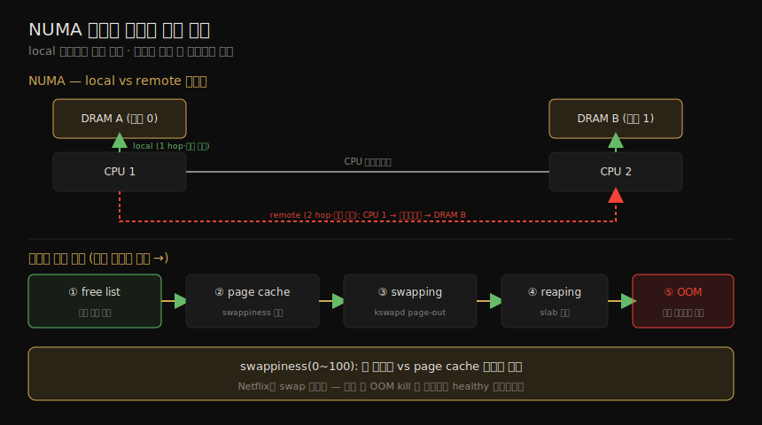

# 메모리 (2) — 아키텍처·할당자
---
> 이 노트는 7장의 아키텍처 부분으로, 메모리 하드웨어와 소프트웨어의 구현을 잡습니다. 하드웨어로는 DRAM·UMA/NUMA 메모리 구조·DDR SDRAM·버스·MMU/TLB를, 소프트웨어로는 메모리 해제(free list·page scanning·kswapd)·프로세스 주소 공간·할당자(slab·SLUB·glibc·TCMalloc·jemalloc)를 봅니다. 성능 분석의 배경 지식입니다.

07-01 이 개념(가상 메모리·페이징·demand paging)이었다면, 이 노트는 그 개념이 *어떻게 구현되는가* 입니다. NUMA의 local/remote 메모리가 왜 지연을 가르는지, 커널이 메모리 부족 시 어떤 순서로 해제하는지, 할당자가 왜 성능을 좌우하는지가 핵심입니다.

> 할당자(특히 slab) 구현은 같은 02_os의 [linux-kernel-programming](../linux-kernel-programming/08-02.메모리%20할당%20(2)%20—%20slab%20할당자와%20kmalloc%20낭비.md)(커널 개발자 관점)이 더 깊이 다룹니다. 방법론·튜닝은 07-03, 관측 도구는 07-04 가 이어받습니다.

## 1. 메인 메모리와 지연

> 메인 메모리는 보통 DRAM(휘발성)으로, 비트마다 커패시터·트랜지스터 둘로 구현돼 고밀도입니다. 접근 시간은 CAS 지연(주소 전송부터 데이터 가용까지)으로 재며 DDR4는 ~10~20ns입니다. 읽기는 CPU 캐시에서 반환되면, 쓰기는 write-back 캐싱이면 이 지연을 피합니다.

메인 메모리는 보통 *DRAM(dynamic random-access memory)* 으로, 휘발성(전원 끊기면 내용 소실)입니다 — 비트마다 커패시터·트랜지스터 둘로 구현돼 고밀도이며, 커패시터는 주기적 refresh가 필요합니다. 엔터프라이즈 서버는 1GB~1TB+, 클라우드 인스턴스는 512MB~256GB가 보통입니다(클라우드는 인스턴스 풀로 더 많은 DRAM을 모으나 일관성 비용↑).

접근 시간은 *CAS(column address strobe) 지연* — 메모리 모듈에 원하는 주소(컬럼)를 보낸 뒤 데이터가 읽기 가능해질 때까지의 시간 — 으로 잽니다(DDR4 ~10~20ns). cache line(64바이트) 전송엔 메모리 버스(64비트) 지연이 여러 번 들고 CPU·MMU 지연도 더해집니다. 읽기는 CPU 캐시에서 반환되면, 쓰기는 프로세서가 write-back 캐싱을 지원하면(Intel) 이 지연을 피합니다.

## 2. UMA·NUMA 메모리 구조

> UMA는 공유 시스템 버스로 모든 CPU가 메모리에 균일 지연으로 접근합니다(SMP). NUMA는 CPU 인터커넥트가 메모리 구조의 일부가 돼, local 메모리(자기 메모리 버스, 낮은 지연)와 remote 메모리(인터커넥트 경유, 높은 지연)로 갈립니다.

| 구조 | 뜻 |
|------|-----|
| UMA(uniform memory access) | 공유 시스템 버스로 모든 CPU가 메모리에 *균일 지연* 접근 — 한 커널이 모든 프로세서에 균일하게 돌면 SMP |
| NUMA(non-uniform memory access) | CPU 인터커넥트가 메모리 구조의 일부 — 접근 시간이 CPU 상대 위치에 따라 다름 |

NUMA의 local/remote 메모리와, 뒤(§4)에서 볼 메모리 해제 순서를 한 장으로 정리하면 다음과 같습니다.

> NUMA에서 CPU 1은 DRAM A에 자기 메모리 버스로 직접 I/O하고(*local 메모리*, 낮은 지연), DRAM B엔 CPU 2와 인터커넥트를 거쳐 I/O합니다(*remote 메모리*, 두 hop, 높은 지연). 각 CPU에 붙은 메모리 뱅크를 *메모리 노드(node)* 라 합니다 — OS는 노드 토폴로지를 알아 메모리 지역성에 맞춰 메모리를 배정하고 스레드를 스케줄링해(가능한 한 local 우선) 성능을 높입니다.

#### 버스와 DDR SDRAM

메인 메모리 접근 방식 — 공유 시스템 버스(UMA, 메모리 브리지 컨트롤러 경유)·direct(단일 프로세서 직결)·interconnect(NUMA, CPU 인터커넥트). 메모리 버스 속도는 프로세서·시스템 보드가 지원하는 *DDR SDRAM* 표준이 좌우합니다 — *double data rate*(클럭 상승·하강 모두 전송)·*synchronous*(CPU와 동기 클럭). 예 — DDR-200(2000, 1.6GB/s)·DDR4-3200(2012, 25.6GB/s)·DDR5-6400(2020, 51.2GB/s). *멀티채널*(dual·triple·quad)로 여러 메모리 버스를 병렬화해 대역폭을 높입니다(Core i7 quad-channel DDR3-1600 = 51.2GB/s).

## 3. MMU·TLB·multiple page sizes

> MMU는 가상→물리 주소 변환을 페이지 단위로 하며, TLB(translation lookaside buffer)를 1차 변환 캐시로 쓰고 메인 메모리의 page table이 뒤를 받칩니다. 큰 페이지 크기는 TLB의 reach를 넓혀 미스를 줄입니다 — Linux huge pages가 2MB·1GB를 지원합니다.

MMU(memory management unit)는 가상→물리 주소 변환을 *페이지 단위* 로 합니다(페이지 안 offset은 직접 매핑). TLB(translation lookaside buffer)를 1차 변환 캐시로 쓰고, 그 뒤를 메인 메모리의 page table이 받칩니다. TLB는 명령·데이터 페이지용으로 나뉘기도 합니다.

현대 프로세서는 *multiple page sizes*(4KB·2MB·1GB)를 지원합니다 — Linux huge pages가 2MB·1GB 같은 큰 페이지를 지원합니다. TLB는 항목 수가 제한돼, 큰 페이지를 쓰면 *변환 가능한 메모리 범위(reach)* 가 넓어져 TLB 미스가 줄고 성능이 오릅니다. TLB는 페이지 크기별로 나뉘어 큰 매핑 유지 확률을 높이기도 합니다.

> 예 — Intel Core i7의 TLB는 넷 — 명령 4K(스레드당 64·코어당 128)·명령 large(스레드당 7)·데이터 4K(64)·데이터 large(32). Core 마이크로아키텍처는 메인 메모리 캐시처럼 *두 레벨* TLB를 지원합니다(정확한 구성은 프로세서별).

## 4. 메모리 해제 — free list·kswapd·OOM

> 가용 메모리가 낮아지면 커널은 순서대로 메모리를 해제합니다 — free list(즉시 할당 가능)·page cache(swappiness가 균형 제어)·swapping(kswapd page-out)·reaping(slab 축소)·OOM killer(희생 프로세스 종료). swappiness는 page cache 회수 vs 앱 페이징의 균형을 정합니다.

가용 메모리가 낮아지면 커널은 페이지를 free list에 더해 해제합니다 — 가용 메모리가 줄수록 다음 순서로 씁니다.

| 방법 | 뜻 |
|------|-----|
| free list | 미사용(idle)·즉시 할당 가능 페이지 목록(보통 locality group=NUMA마다) |
| page cache | 파일시스템 캐시 — *swappiness* 가 page cache 해제 vs 스와핑의 선호도를 정함 |
| swapping | page-out 데몬 kswapd가 최근 미사용 페이지를 free list에 더함(swap file·device 필요) |
| reaping(shrinking) | 저메모리 임계 시 커널 모듈·slab 할당자가 쉽게 해제 가능한 메모리를 즉시 해제 |
| OOM killer | 희생 프로세스를 찾아(`select_bad_process()`) 종료(`oom_kill_process()`) — /var/log/messages에 "Out of memory: Kill process" |

> *swappiness*(0~100, 기본 60)는 앱 페이징 vs page cache 회수의 균형을 정합니다 — 높을수록 페이징 선호. warm 파일시스템 캐시를 보존하며 cold 앱 메모리를 page-out해 처리량을 높입니다. swap이 없으면 가상 메모리가 제한돼 OOM이 더 일찍 옵니다. Netflix 클라우드는 보통 swap을 안 써, 메모리 소진 시 앱을 OOM kill합니다 — 한 인스턴스가 스와핑으로 느리게 도는 것보다 트래픽을 다른 healthy 인스턴스로 돌리는 게 낫기 때문입니다. cgroup 메모리도 같은 기법으로 관리됩니다(호스트 메모리가 충분해도 cgroup 한도 소진 시 스와핑·OOM).

#### free list와 buddy 할당자

원래 Unix는 memory map + first-fit 스캔을 썼고, BSD가 free list와 page-out 데몬을 더했습니다 — 해제 메모리는 list 머리에(미래 할당), page-out 데몬이 해제한(유용한 캐시 페이지 포함 가능) 메모리는 꼬리에 더해, 재사용 전 요청이 오면 reclaim합니다. Linux는 페이지 관리에 *buddy 할당자* 를 씁니다 — power-of-two 방식의 여러 free list로, 이웃 페이지(buddy)를 찾아 함께 할당합니다. 계층 — 노드(NUMA)→zone(DMA·normal·highmem)→migration type→size(power-of-two). 노드 free list 안에서 할당해 메모리 지역성을 높입니다.

#### reaping과 page scanning

*reaping* 은 주로 커널 slab 할당자 캐시에서 메모리를 해제합니다(slab 크기 청크로 재사용 대기). *page scanning* — free list가 임계 아래로 떨어지면 page-out 데몬 *kswapd* 가 시작합니다(필요할 때만, 보통 짧은 버스트). kswapd는 inactive·active LRU 페이지 list를 스캔해 페이지를 해제하며, 두 임계로 hysteresis를 둡니다. 가장 낮은 임계(`vm.min_free_kbytes`)에 닿으면 kswapd가 foreground로 동기 해제(*direct-reclaim*)합니다.

## 5. 프로세스 주소 공간

> 프로세스 가상 주소 공간은 스레드 스택·실행파일·라이브러리·heap을 저장하는 segment로 나뉩니다 — 실행 텍스트(읽기 전용)·실행 데이터(읽기/쓰기·private)·heap(anonymous, malloc)·stack. heap의 끝없는 증가는 보통 메모리 누수가 아니라, 단순 할당자가 free 시 메모리를 OS에 안 돌려주기 때문입니다.

프로세스 가상 주소 공간은 *segment* 로 나뉩니다.

| segment | 뜻 |
|---------|-----|
| 실행 텍스트(executable text) | 프로세스 CPU 명령 — 바이너리 text segment에서 매핑, 읽기 전용+실행 권한 |
| 실행 데이터(executable data) | 초기화 변수 — data segment에서 매핑, 읽기/쓰기+private(수정이 디스크에 flush 안 됨) |
| heap | 프로그램 작업 메모리·anonymous(파일시스템 위치 없음) — malloc로 할당, 필요 시 증가 |
| stack | 실행 스레드 스택 — 읽기/쓰기 매핑 |

> 라이브러리 text segment는 같은 라이브러리를 쓰는 다른 프로세스와 공유되고, 데이터 segment는 프로세스마다 private 사본입니다.

#### heap 증가

heap의 끝없는 증가는 *메모리 누수일까* 가 흔한 혼란입니다 — 단순 할당자는 free 시 메모리를 OS에 *안 돌려주고* 미래 할당에 쓰려 보관하므로, 프로세스 resident 메모리가 *늘기만 하는 게 정상* 입니다. 시스템 메모리 사용을 줄이는 법 — *re-exec*(execve로 빈 주소 공간 시작)·*memory mapping*(mmap/munmap으로 OS에 메모리 반환). glibc(Linux 흔함)는 mmap 모드와 `malloc_trim(3)`(top-of-heap free 메모리가 크면 free가 자동 호출, sbrk로 해제)을 지원합니다.

## 6. 할당자 — slab·SLUB·glibc·TCMalloc·jemalloc

> 할당자는 simple API·효율적 메모리 사용·성능·관측성을 제공합니다. 커널은 slab(객체 캐시, per-CPU magazine)·SLUB(slab 단순화, Linux 기본)을, 유저는 glibc(dlmalloc 기반)·TCMalloc(per-thread 캐시)·jemalloc(multiple arena·per-thread)을 씁니다.

할당자 기능 — *simple API*(malloc·free)·*효율적 메모리 사용*(미사용 영역 coalesce로 단편화↓)·*성능*(락 절약·per-thread/per-CPU 캐시로 지역성↑)·*관측성*(통계·디버그 모드). 커널·유저 할당자입니다.

| 할당자 | 뜻 |
|--------|-----|
| slab(커널) | 특정 크기 객체 캐시 관리 — 페이지 할당 오버헤드 없이 빠르게 재활용(고정 크기 struct에 효과적). Solaris 2.4 개발, per-CPU magazine으로 강화. BSD는 UMA |
| SLUB(커널) | slab 기반·복잡성 해결 — 객체 큐·per-CPU 캐시 제거(NUMA 최적화는 page 할당자에 위임). Linux 2.6.23 기본 |
| glibc(유저) | dlmalloc 기반 — 작은 할당은 bin·buddy coalesce, 큰 건 tree, 가장 큰 건 mmap |
| TCMalloc(유저) | thread caching malloc — 작은 할당에 per-thread 캐시로 락 경합↓ |
| jemalloc(유저) | multiple arena·per-thread 캐시·small object slab으로 확장성↑·단편화↓. mmap·sbrk(mmap 선호). Facebook 사용 |

> slab 할당자는 per-CPU 캐시 *magazine*(자동 소총 비유 — 각 CPU가 M개 객체를 reload 없이 할당)으로 강화됐고, 디버그·감사(할당 추적·스택 트레이스) 기능도 가집니다. SLUB는 slab의 복잡성을 줄이려 객체 큐를 제거하고 NUMA 최적화를 page 할당자에 맡깁니다.

## 학습 점검

> 이 노트의 핵심을 스스로 떠올려 봅니다. 답이 막히면 해당 섹션으로 돌아가 확인합니다.

- DRAM이 왜 고밀도·휘발성인지, CAS 지연이 무엇을 재는지 설명해 봅니다. (→ §1)
- UMA와 NUMA의 차이, local 메모리와 remote 메모리의 지연 차를 떠올려 봅니다. (→ §2)
- TLB가 무엇이고, 큰 페이지 크기가 왜 TLB 미스를 줄이는지(reach) 말해 봅니다. (→ §3)
- 커널이 메모리를 해제하는 순서(free list→page cache→swapping→reaping→OOM)와, swappiness가 무엇을 조절하는지 설명해 봅니다. (→ §4)
- kswapd의 page scanning과 direct-reclaim의 차이, buddy 할당자가 무엇인지 떠올려 봅니다. (→ §4)
- 프로세스 주소 공간의 네 segment와, heap의 끝없는 증가가 왜 보통 메모리 누수가 아닌지 말해 봅니다. (→ §5)
- slab과 SLUB의 차이, TCMalloc·jemalloc이 어떻게 멀티스레드 성능을 높이는지 설명해 봅니다. (→ §6)
