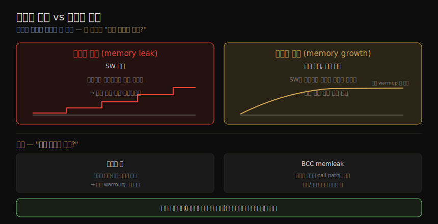

# 메모리 (3) — 방법론·튜닝
---
> 이 노트는 7장의 방법론·튜닝 부분으로, 메모리를 *어떻게 분석하고 무엇을 조정하는가* 를 잡습니다. 방법론으로는 USE 방법·사용 특성화·사이클 분석·leak 탐지·정적 튜닝·WSS 추정(메모리 shrinking)을, 튜닝으로는 튜너블 파라미터(swappiness·overcommit·min_free_kbytes)·huge pages·할당자·NUMA 바인딩·자원 제어를 봅니다.

저자가 권하는 순서는 — *성능 모니터링 → USE 방법 → 사용 특성화* 입니다. 메모리 튜닝에서 가장 중요한 것은 *앱을 메인 메모리에 두고 페이징·스와핑이 잦지 않게* 하는 것입니다. 이 노트는 그 방법론과 튜닝을 다룹니다.

> 이 방법론을 수행하는 실제 도구(vmstat·PSI·sar·numastat·perf·drsnoop·wss)는 07-04 가 이어받습니다. 개념·아키텍처 전제는 07-01·07-02 입니다.

## 1. USE 방법과 사용 특성화

> USE 방법은 메모리의 사용률(물리·가상 사용/가용)·포화(page scanning·페이징·스와핑·OOM kill)·에러(SW/HW)를 점검합니다 — 포화를 먼저 봅니다(지속 포화가 메모리 이슈 신호). 사용 특성화는 어디에 얼마나 메모리가 쓰이는지 식별합니다.

#### USE 방법

system-wide로 점검합니다.

| 항목 | 뜻 |
|------|-----|
| 사용률 | 얼마나 사용·가용한가(물리·가상 메모리 모두) |
| 포화 | page scanning·페이징·스와핑·OOM kill의 정도(메모리 압박 완화 수단) |
| 에러 | SW(할당 실패·OOM killer)·HW(ECC 에러) |

> *포화를 먼저* 봅니다 — 지속 포화가 메모리 이슈 신호입니다(vmstat·sar 스와핑, dmesg OOM kill, swap device I/O, Linux PSI). 물리 메모리 사용률은 도구마다 다르게 보고합니다(파일시스템 캐시·inactive 페이지 포함 여부) — "가용 10MB"로 보여도 실제론 회수 가능한 파일시스템 캐시 10GB일 수 있습니다(도구 문서 확인). HW 에러는 진단이 어렵습니다 — ECC 정정 가능 에러(dmidecode·edac-utils·ipmitool sel)를 USE 에러 지표로 쓸 수 있고(곧 정정 불가 에러의 전조), 정정 불가 에러는 설명 안 되는·재현 안 되는 크래시(segfault·bus error)로 나타납니다. 자원 제어(클라우드)가 있으면 SW 한도에서 스와핑할 수 있습니다(호스트 물리 메모리가 충분해도).

#### 사용 특성화

어디에 얼마나 메모리가 쓰이는지 식별합니다 — capacity planning·벤치마킹·misconfiguration 교정(DB 캐시가 너무 작아 hit율 낮거나, 너무 커 스와핑)에 중요합니다.

| 속성 | 뜻 |
|------|-----|
| system-wide 물리·가상 사용률 | 전체 |
| 포화 정도 | 스와핑·OOM kill |
| 커널·파일시스템 캐시 사용 | 커널 메모리·캐시 |
| 프로세스별 물리·가상 사용 | per-process |
| 자원 제어 사용 | 있으면 |

> 예 — "256GB 메인 메모리, 프로세스 1% 사용·파일시스템 캐시 30%, 최대 프로세스는 DB(2GB RSS, 이전 시스템 설정 한도)." 심화 체크리스트 — 앱 WSS, 커널 메모리(slab별), 파일시스템 캐시 active/inactive 비, 프로세스 메모리 위치(명령·캐시·버퍼·객체), 왜 할당하나(call path), 라이브러리 매핑 이상, 스와핑되는·됐던 프로세스, 누수 가능성, NUMA 노드 분포, IPC·메모리 stall cycle, 메모리 버스 균형, local vs remote 메모리 I/O.

## 2. 사이클 분석·성능 모니터링·정적 튜닝

> 사이클 분석은 PMC로 메모리 버스 부하·stall cycle을 봅니다(IPC부터). 성능 모니터링은 사용률·포화를 시간에 따라 추적해 누수 존재·속도를 식별합니다. 정적 튜닝은 설정 환경(메모리 양·속도·NUMA·huge pages·overcommit·자원 제어)을 점검합니다.

#### 사이클 분석

메모리 버스 부하는 PMC로 봅니다 — 메모리 stall cycle·메모리 버스 사용을 셉니다. *IPC(instructions per cycle)부터* 봅니다 — CPU 부하가 얼마나 메모리 의존적인지 반영합니다(6장).

#### 성능 모니터링

*사용률*(percent used, 가용 메모리로 추론)·*포화*(스와핑·OOM kill)를 시간에 따라 추적합니다 — 자원 제어가 있으면 한도 관련 통계도, 에러도 모니터링합니다. *프로세스별 메모리 사용을 시간에 따라* 보면 누수의 존재·속도를 식별할 수 있습니다.

#### 정적 성능 튜닝

설정 환경을 점검합니다 — 총 메인 메모리, 앱 설정 사용량, 할당자, 메모리 속도(DDR5?), 메모리 테스트(memtester), 시스템 구조(NUMA·UMA), OS NUMA-aware·튜너블, 메모리 소켓 분포, 메모리 버스 수, 캐시·TLB 크기, BIOS 설정, huge pages 설정·사용, overcommit 설정, 자원 제어.

## 3. leak 탐지·자원 제어·WSS 추정

> leak 탐지는 끝없이 메모리가 느는 문제를 봅니다 — 메모리 누수(미사용인데 미해제, 코드 수정 필요)와 메모리 증가(정상이나 과한 속도, 설정 변경)를 구분합니다. "원래 그러는 건가?"가 첫 질문입니다. WSS 추정은 메모리 shrinking으로 합니다.

#### leak 탐지

앱·커널 모듈이 끝없이 자라 free list·파일시스템 캐시·다른 프로세스의 메모리까지 소비하는 문제입니다(스와핑 시작·OOM kill로 먼저 발견). 두 원인을 구분합니다. 둘의 차이와 판별을 한 장으로 정리하면 다음과 같습니다.

| 원인 | 뜻 |
|------|-----|
| 메모리 누수(memory leak) | SW 버그 — 메모리가 미사용인데 미해제. 코드 수정·패치·업그레이드로 fix |
| 메모리 증가(memory growth) | SW가 정상 소비하나 *과한 속도.* 설정 변경·개발자의 소비 방식 변경으로 fix |

> 메모리 증가가 누수로 오인되곤 합니다 — 첫 질문은 *"원래 그러는 건가?"* 입니다(메모리 사용·설정·할당자 동작 확인, 캐시 warmup일 수 있음). 분석은 SW·언어 유형에 따라 다릅니다 — 할당자 디버그 모드(할당 세부 기록)·heap dump·전용 도구. BCC `memleak(8)` 은 할당을 추적해 간격 동안 미해제된 것을 call path와 함께 보여 줍니다(누수인지 정상 증가인지는 사용자가 판단 — 높은 할당률엔 오버헤드 큼).

#### 자원 제어·WSS 추정

*자원 제어* — 프로세스(그룹)에 메인/가상 메모리 한도를 둡니다(§튜닝·11장). *메모리 shrinking* 은 WSS 추정의 *부정 실험* 입니다(swap 필요) — 앱 가용 메인 메모리를 점진 줄이며 성능·스와핑을 측정해, 성능이 급락하고 스와핑이 급증하는 점이 WSS가 가용 메모리를 넘는 지점입니다. 단 의도적으로 성능을 해쳐 production 비권장입니다(다른 WSS 추정은 07-04 §wss).

## 4. 튜닝 — 튜너블·huge pages·할당자·NUMA·자원 제어

> 메모리의 가장 중요한 튜닝은 앱을 메인 메모리에 두고 페이징·스와핑을 막는 것입니다. 튜너블(swappiness·overcommit·min_free_kbytes), huge pages(TLB reach↑), 할당자(LD_PRELOAD), NUMA 바인딩(numactl), 자원 제어(cgroups)로 합니다.

메모리의 가장 중요한 튜닝은 *앱을 메인 메모리에 두고 페이징·스와핑이 잦지 않게* 하는 것입니다.

#### 튜너블 파라미터

`Documentation/sysctl/vm.txt` 의 튜너블을 sysctl로 설정합니다.

| 튜너블 | 기본 | 뜻 |
|--------|------|-----|
| `vm.swappiness` | 60 | 페이징(스와핑) vs page cache 회수 선호(0~100). 0이면 앱 메모리를 최대한 보존 |
| `vm.overcommit_memory` | 0 | 0=휴리스틱·1=항상 overcommit·2=overcommit 안 함(OOM 회피) |
| `vm.min_free_kbytes` | dynamic | 원하는 free 메모리량. 낮추면 앱 메모리↑이나 OOM이 빨라짐, 높이면 OOM 회피 |
| `vm.dirty_*` | — | dirty 메모리 write-back 임계(background·ratio·bytes·expire) |
| `vm.vfs_cache_pressure` | 100 | 디렉토리·inode 객체 회수 정도(낮으면 더 보존, 0은 OOM 위험) |
| `kernel.numa_balancing` | 1 | 자동 NUMA 페이지 밸런싱(과도하면 CPU 소비 — Netflix는 옛 커널에서 0) |

> `vm.swappiness` 는 원치 않게 일찍 앱 메모리를 스와핑하면 성능에 큰 영향을 줍니다 — 0으로 두면 page cache를 희생해 앱 메모리를 최대한 보존합니다(여전히 메모리 부족 시 스와핑은 함). `vm.min_free_kbytes` 는 메인 메모리의 비선형 분수로 동적 설정됩니다. overcommit을 2로 두면 비활성화해 OOM 케이스를 피합니다.

#### huge pages·할당자·NUMA·자원 제어

| 튜닝 | 뜻 |
|------|-----|
| huge pages | 큰 페이지로 TLB hit율↑(reach↑). `nr_hugepages` 설정·hugetlbfs 마운트·THP(transparent huge pages, 자동 승격) |
| 할당자 | `LD_PRELOAD` 로 다른 유저 레벨 할당자 선택(libtcmalloc 등) — 멀티스레드 성능↑ |
| NUMA 바인딩 | `numactl --membind=0 PID` 로 프로세스를 NUMA 노드에 바인딩(`--physcpubind` 와 함께 단일 소켓 제한) |
| 자원 제어 | `ulimit`(기본)·cgroups 메모리 서브시스템(memory.limit_in_bytes·memsw·kmem·swappiness·oom_control) |

> huge pages는 shmget·hugetlbfs 마운트·mmap MAP_HUGETLB·libhugetlbfs로 쓰고, THP는 앱 지정 없이 자동 승격합니다(과거 성능 이슈가 있었음). NUMA 바인딩은 단일 NUMA 노드 메모리로 충분한 앱의 성능을 높이며, CPU 바인딩과 함께 단일 소켓에 제한해 인터커넥트 접근 페널티를 피합니다.

## 학습 점검

> 이 노트의 핵심을 스스로 떠올려 봅니다. 답이 막히면 해당 섹션으로 돌아가 확인합니다.

- USE 방법으로 메모리를 점검할 때 왜 포화를 먼저 보는지, 물리 메모리 사용률이 도구마다 다르게 보고되는 이유를 설명해 봅니다. (→ §1)
- 사용 특성화의 다섯 속성을 들고, 심화 체크리스트의 NUMA·WSS 항목을 떠올려 봅니다. (→ §1)
- 성능 모니터링이 어떻게 메모리 누수의 존재·속도를 식별하는지 말해 봅니다. (→ §2)
- 메모리 누수와 메모리 증가의 차이, "원래 그러는 건가?"가 왜 첫 질문인지 설명해 봅니다. (→ §3)
- 메모리 shrinking이 어떻게 WSS를 추정하는지, 왜 production 비권장인지 떠올려 봅니다. (→ §3)
- `vm.swappiness` 와 `vm.overcommit_memory` 가 각각 무엇을 조절하는지, huge pages가 왜 TLB reach를 높이는지 말해 봅니다. (→ §4)
