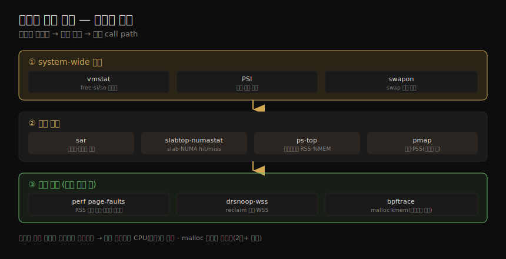

# 메모리 (4) — 관측 도구
---
> 이 노트는 7장의 마지막 부분으로, 메모리 성능을 보는 *실제 도구* 를 잡습니다. 전통 도구(vmstat·PSI·swapon·sar·slabtop·numastat·ps·top·pmap)부터 프로파일링·트레이싱(perf·drsnoop·wss·bpftrace)까지입니다. system-wide 통계에서 시작해 프로세스별·할당 추적으로 내려갑니다.

07-03 의 방법론을 손에 든 연장으로 옮기는 노트입니다. 도구는 system-wide 메모리 통계 → 프로세스별 → 할당 추적 순으로 깊어집니다. 핵심 흐름 하나 — vmstat·PSI로 포화를 빠르게 보고, 누수 의심 시 perf·bpftrace로 할당 call path를 잡습니다.

> BPF 기반 도구(drsnoop·bpftrace)는 04-02 의 이벤트 소스 위에 서며 15장에서 깊어집니다. sar·perf는 04-03·06-04 와 교차참조하고, 페이지 폴트 플레임 그래프는 메모리용이라 *초록 배경* 으로 CPU 것(노랑)과 구분합니다.

## 1. vmstat·PSI·swapon — system-wide 포화

> vmstat은 system-wide 메모리 health(free·buff·cache·si·so)와 페이징 통계를 봅니다 — si·so가 계속 0이 아니면 메모리 압박입니다. PSI는 메모리 포화의 시간 변화를, swapon은 swap 장치 설정·사용을 봅니다.

메모리 관측 도구가 범위에 따라 어떻게 깊어지는지를 한 장으로 정리하면 다음과 같습니다.

| 도구 | 보는 것 |
|------|--------|
| vmstat | system-wide — swpd(스왑아웃)·free·buff(버퍼 캐시)·cache(page cache)·si(스왑인)·so(스왑아웃) |
| PSI(/proc/pressure/memory) | 메모리 포화 시간 변화(some=일부 task stall·full=모든 task stall, 10·60·300초) |
| swapon | swap 장치 설정·사용(NAME·TYPE·SIZE·USED) |

> vmstat의 *si·so가 계속 0이 아니면* 메모리 압박으로 swap 중입니다(top·ps로 소비자 조사). free 메모리가 부팅 후 줄어 캐시로 쓰이는 건 정상(필요 시 해제). `-Sm` 으로 MB 단위, `-a` 로 inactive/active 분해를 봅니다. PSI(`some avg10=2.84 ... avg300=0.32`)는 압박이 *증가 중*(10초 평균>300초 평균)임을 보입니다 — task가 메모리 stall한 시간 %입니다. swapon이 출력이 없으면 swap 미설정입니다(요즘 흔함). swap I/O는 vmstat si·so·iostat에서 보입니다.

## 2. sar·slabtop·numastat — 상세 통계

> sar는 페이징(-B)·huge pages(-H)·메모리 사용률(-r)·swap(-S·-W) 통계를 이력으로 봅니다. slabtop은 커널 slab 캐시 사용을, numastat은 NUMA 시스템의 노드별 메모리 할당 hit/miss를 봅니다.

| 도구 | 보는 것 |
|------|--------|
| sar -B | 페이징 — pgpgin/out·fault·majflt·pgscank(kswapd)·pgscand(direct)·%vmeff(page reclaim 효율) |
| sar -r | 메모리 사용률 — kbmemfree·kbavail·kbmemused·%memused·kbcommit·%commit·kbslab |
| sar -S / -W | swap 공간 / 스와핑(pswpin/out) |
| slabtop | 커널 slab 캐시(OBJS·ACTIVE·USE·OBJ SIZE·CACHE SIZE, `-sc` 캐시 크기 정렬) |
| numastat | NUMA 노드별 — numa_hit·numa_miss·numa_foreign·local_node·other_node |

> sar의 *%vmeff*(page steal/scan 비)는 page reclaim 효율입니다 — 100% 근처면 healthy(inactive list에서 성공적으로 steal), 30% 미만이면 struggling. *pgscand*(direct reclaim 진입률, 높으면 나쁨)는 앱이 메모리 할당에 블록되는 비율을 보입니다(drsnoop로 시간 측정, §4). slabtop은 ext4_inode_cache·dentry 같은 커널 캐시 소비를 보입니다(/proc/slabinfo, vmstat -m). numastat의 numa_hit가 다른 통계보다 훨씬 높으면 NUMA 정책이 잘 동작하는 것입니다 — 낮으면 sysctl NUMA 튜너블·워크로드 분할·NUMA 적은 시스템을 고려합니다.

## 3. ps·top·pmap — 프로세스별

> ps는 프로세스별 %MEM·RSS·VSZ를, top은 실시간 정렬을, pmap은 프로세스의 메모리 매핑(크기·권한·매핑 객체)을 봅니다. RSS는 공유 메모리를 중복 계산하므로, pmap의 PSS가 더 현실적인 값을 줍니다.

| 도구 | 보는 것 |
|------|--------|
| ps | 프로세스별 %MEM(물리 메모리 %)·RSS(resident, KB)·VSZ(가상, KB), maj_flt·min_flt |
| top | 실시간 — %MEM·VIRT·RES, 요약(total·used·free·buffers·cached). `-o %MEM` 정렬 |
| pmap | 프로세스 메모리 매핑 — Address·Kbytes·RSS·Dirty·Mode·Mapping. `-x` 확장·`-X`/`-XX` 더 상세 |

> RSS는 시스템 라이브러리 같은 *공유 메모리 segment를 포함* 해, RSS 열을 더하면 시스템 메모리를 넘을 수 있습니다(공유 메모리 중복 계산). pmap의 `-X`/`-XX` 가 주는 *PSS(proportional set size)* — 사적 메모리 + 공유 메모리/사용자 수 — 가 더 현실적인 메인 메모리 값입니다. pmap 예에서 MySQL은 라이브러리 매핑이 대부분 읽기 전용(r-...)이라 공유 가능하고, 메모리 대부분은 heap([ anon ])에 있습니다.

## 4. perf·drsnoop·wss — 프로파일링·추적

> perf는 page fault를 스택과 함께 표집해(RSS 증가 원인) 페이지 폴트 플레임 그래프를 만듭니다. drsnoop은 direct reclaim 지연을(메모리 부족의 앱 영향), wss는 PTE accessed 비트로 WSS를 추정합니다.

#### perf

| 용법 | 명령 |
|------|------|
| page fault 표집(RSS 증가) | `perf record -e page-faults -a -g` → `perf script` |
| heap 증가(brk) 기록 | `perf record -e syscalls:sys_enter_brk -a -g` |
| kmem·vmscan 이벤트 카운트 | `perf stat -e 'kmem:*' -a -I 1000`·`'vmscan:*'` |
| 메모리 접근 프로파일 | `perf mem record command` → `perf mem report` |

> *page fault* 는 프로세스 RSS가 늘 때 발생하므로, 스택과 함께 추적하면 *메모리가 왜 느는지* 설명합니다. *페이지 폴트 플레임 그래프* 로 시각화하며 — MySQL 예에서 JOIN::optimize()가 메모리 증가의 절반(3,226 page fault ≈ 12MB) — *초록 배경*(`--bgcolor=green --count=pages`)으로 CPU 플레임 그래프(노랑)와 구분합니다.

#### drsnoop·wss

| 도구 | 보는 것 |
|------|--------|
| drsnoop | direct reclaim 추적 — 영향받은 프로세스·지연(LAT(ms))·PAGES. 메모리 부족의 앱 영향 정량화 |
| wss | PTE "accessed" 비트로 WSS 추정 — RSS·PSS·Ref(자주 접근한 메모리, MB) |

> drsnoop은 vmscan `mm_vmscan_direct_reclaim_begin/end` tracepoint를 추적합니다(저빈도·보통 버스트, 오버헤드 작음) — Java가 1~7ms direct reclaim을 겪는 식입니다. wss는 PTE accessed 비트를 리셋·간격 후 확인해 WSS를 추정합니다 — **경고:** `/proc/PID/clear_refs`·`smaps` 가 앱 지연을 약간(예: 10%, 큰 프로세스는 1초+) 일으키고, referenced 플래그를 리셋해 커널 reclaim을 혼란시킬 수 있어 lab에서 먼저 테스트합니다.

## 5. bpftrace — 할당·내부 추적

> bpftrace는 고수준 언어로 커스텀 메모리 분석을 합니다 — malloc 요청 바이트(스택별)·kmem 할당·brk 증가·page fault·vmscan·swapin을 추적합니다. 유저 할당 추적은 초당 수백만 번이라 오버헤드가 커, CPU 프로파일링·page fault 추적을 먼저 씁니다.

bpftrace one-liner입니다.

| 용도 | one-liner |
|------|-----------|
| malloc 요청 바이트(스택별, 높은 오버헤드) | `uprobe:.../libc.so.6:malloc { @[ustack, comm] = sum(arg0); }` |
| kmem 캐시 할당 바이트(커널 스택별) | `t:kmem:kmem_cache_alloc { @bytes[kstack] = sum(args->bytes_alloc); }` |
| heap 증가(brk) call path | `tracepoint:syscalls:sys_enter_brk { @[ustack, comm] = count(); }` |
| 프로세스별 page fault | `software:page-fault:1 { @[comm, pid] = count(); }` |
| 유저 page fault(스택별) | `t:exceptions:page_fault_user { @[ustack, comm] = count(); }` |
| 프로세스별 swapin | `kprobe:swap_readpage { @[comm, pid] = count(); }` |

> 유저 할당 추적(malloc)은 *할당 요청 크기 히스토그램*(스택별)을 만들어 어디서 큰 할당이 오는지 봅니다 — MySQL 예에서 32~64K 676회·64~128K 338회. **경고:** 유저 할당은 초당 수백만 번이라, uprobe 오버헤드(4장 §4.3.7)에 곱해지면 대상이 2배+ 느려질 수 있어 *드물게* 씁니다 — 먼저 CPU 프로파일링(저비용)이나 page fault 추적으로 할당 경로를 잡습니다. bpftrace는 page fault 스택을 *커널에서 집계* 해 perf보다 효율적으로 플레임 그래프를 만듭니다. 메모리 내부는 kmem tracepoint(12개)·mm_* tracepoint(47개)·libc USDT(33개)로 탐색합니다.

#### 기타 도구

dmesg("Out of memory")·dmidecode(BIOS 메모리 뱅크 — DDR4/5 타입)·tiptop(PMC top)·valgrind(memcheck 누수 탐지, 20~30배 느림)·iostat(swap 장치 I/O)·/proc/zoneinfo·/proc/buddyinfo·/proc/pagetypeinfo(단편화 디버그)·SysRq m(메모리 정보 콘솔 덤프). 6장의 pmcarch(LLC 미스)·tlbstat(TLB), 8장의 free·cachestat(page cache)도 메모리 분석에 유용합니다.

## 학습 점검

> 이 노트의 핵심을 스스로 떠올려 봅니다. 답이 막히면 해당 섹션으로 돌아가 확인합니다.

- vmstat의 si·so가 무엇을 뜻하고, PSI가 메모리 압박이 증가 중인지 어떻게 보이는지 설명해 봅니다. (→ §1)
- sar의 %vmeff와 pgscand가 각각 무엇을 가리키는지, numastat의 numa_hit가 높으면 무슨 뜻인지 떠올려 봅니다. (→ §2)
- RSS가 공유 메모리를 중복 계산하는 이유와, pmap의 PSS가 왜 더 현실적인 값인지 말해 봅니다. (→ §3)
- page fault를 추적하면 왜 메모리 증가 원인을 알 수 있는지, 페이지 폴트 플레임 그래프를 초록 배경으로 하는 이유를 설명해 봅니다. (→ §4)
- drsnoop이 무엇을 측정하고, wss의 경고(앱 지연·reclaim 혼란)가 무엇인지 떠올려 봅니다. (→ §4)
- 유저 할당(malloc) 추적의 오버헤드 주의점과, 대신 먼저 무엇을 쓰는지 말해 봅니다. (→ §5)
