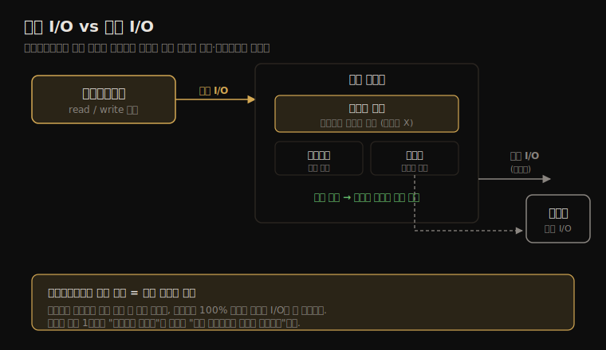

# 파일 시스템 (1) — 배경·핵심 개념
---
> 이 노트는 8장의 출발점으로, 파일 시스템 성능을 *왜 디스크가 아니라 파일 시스템에서 봐야 하는가* 라는 질문으로 엽니다. 응답 시간을 결정하는 건 디스크 I/O가 아니라 파일 시스템입니다 — 캐시·버퍼링·미리읽기·되쓰기가 그 사이에 끼어 디스크 지연을 숨기거나 키우기 때문입니다.

성능 분석에서 디스크보다 파일 시스템을 먼저 보는 까닭이 이 장의 전제입니다. 애플리케이션은 디스크가 아니라 파일 시스템에 요청을 겁니다. 그 사이 캐시가 읽기를 메모리 속도로 끝내거나, 되쓰기가 쓰기를 비동기로 미뤄 디스크 지연을 가립니다. 그래서 같은 디스크라도 파일 시스템이 어떻게 매개하느냐에 따라 애플리케이션이 체감하는 지연이 달라집니다.

> 이 노트는 8.1~8.3의 배경을 다룹니다. 용어와 모델을 먼저 잡고, 지연·캐싱·순차 vs 랜덤·미리읽기·되쓰기·동기 쓰기·raw/direct I/O·mmap·메타데이터·논리 vs 물리 I/O 같은 핵심 개념 16종을 "왜 성능에 중요한가" 중심으로 정리합니다.

## 1. 용어와 모델 — 무엇을 보는가

> 파일 시스템은 애플리케이션과 저장 장치 사이의 추상화 층입니다. VFS가 여러 파일 시스템 유형을 같은 인터페이스로 묶고, 그 아래 캐시·블록 I/O·디스크가 놓입니다. 성능을 볼 때는 이 층층 어디서 지연이 생기는지를 따집니다.

파일 시스템 성능을 이야기할 때 자주 나오는 용어부터 맞춰 둡니다.

| 용어 | 의미 |
|------|------|
| 파일 시스템(file system) | 파일·디렉터리로 데이터를 조직하는 방식·구현. POSIX 인터페이스(open·read·write·close)로 접근 |
| VFS | 가상 파일 시스템. 여러 파일 시스템 유형을 같은 커널 인터페이스로 추상화 |
| 논리 I/O(logical I/O) | 애플리케이션이 파일 시스템에 거는 I/O |
| 물리 I/O(physical I/O) | 파일 시스템이 디스크에 직접 거는 I/O |
| 페이지 캐시(page cache) | 파일 내용을 메모리에 캐시 — 읽기를 디스크 없이 끝냄 |
| 되쓰기(write-back) | 쓰기를 캐시에 먼저 반영하고 디스크 반영은 나중에 비동기로 |
| 메타데이터(metadata) | 데이터에 관한 데이터 — inode·디렉터리·슈퍼블록·블록 맵 |

파일 시스템 성능 모델은 두 층의 I/O로 나뉩니다. 애플리케이션이 거는 *논리 I/O* 와, 그것이 캐시를 거치고 남은 만큼 디스크로 내려가는 *물리 I/O* 입니다. 둘의 차이가 캐시·미리읽기·되쓰기가 한 일의 크기입니다. 이 관계를 한 장으로 정리하면 다음과 같습니다.

> 핵심은 "애플리케이션이 보는 지연 = 파일 시스템 지연"이라는 점입니다. 디스크가 빨라도 파일 시스템 캐시 미스·락 경합·메타데이터 갱신이 끼면 애플리케이션은 느립니다. 반대로 디스크가 느려도 캐시 적중률이 높으면 빠르게 느낍니다. 그래서 분석의 1순위는 파일 시스템 지연입니다.

## 2. 파일 시스템 지연 — 1순위 지표

> 파일 시스템 지연은 논리 파일 시스템 요청 하나가 끝나기까지의 시간입니다 — 큐 대기·락·캐시 조회·디스크 I/O를 모두 포함합니다. 애플리케이션이 실제로 기다린 시간이라, 디스크 지연보다 애플리케이션 영향을 직접 보여줍니다.

파일 시스템 지연이 1순위인 까닭은 그것이 *애플리케이션이 멈춰 기다린 시간* 이기 때문입니다. 디스크 IOPS·처리량은 디스크가 얼마나 바쁜지를 보여 주지만, 그 바쁨이 애플리케이션을 실제로 얼마나 기다리게 했는지는 알려 주지 않습니다.

예를 들어 디스크가 100% 바빠도 그 I/O가 모두 비동기 되쓰기·미리읽기라면 애플리케이션은 전혀 기다리지 않을 수 있습니다. 반대로 디스크가 한가해 보여도 동기 쓰기 한 건이 애플리케이션을 수 밀리초 멈출 수 있습니다.

> 그래서 분석은 "디스크가 바쁜가"가 아니라 "애플리케이션이 파일 시스템에서 얼마나 기다렸나"부터 봅니다. 측정 위치도 중요합니다 — syscall 층(애플리케이션 체감)에서 재느냐, VFS 층에서 재느냐, 특정 파일 시스템 층에서 재느냐에 따라 같은 요청도 다른 지연으로 잡힙니다. BPF 도구(ext4slower 등)가 이 층별 측정을 가능하게 합니다.

## 3. 캐싱 — 읽기를 디스크 없이 끝내기

> 파일 시스템은 여러 캐시를 둬 읽기를 메모리 속도로 돌립니다. 페이지 캐시(파일 내용)·dentry 캐시(디렉터리 조회)·inode 캐시(메타데이터)가 대표적입니다. 캐시 적중률이 파일 시스템 읽기 성능을 좌우합니다.

캐싱은 파일 시스템 성능의 가장 큰 지렛대입니다. 메모리는 디스크보다 수만 배 빠르므로, 자주 읽는 데이터가 캐시에 있으면 디스크 I/O 자체가 사라집니다. 리눅스는 남는 메모리를 페이지 캐시로 적극 활용해 — `free`에서 buff/cache로 잡히는 그 메모리입니다 — 읽기를 흡수합니다.

| 캐시 | 담는 것 | 효과 |
|------|--------|------|
| 페이지 캐시(page cache) | 파일 내용 페이지 | 반복 읽기를 메모리로 |
| dentry 캐시(directory entry) | 경로→inode 매핑 | 경로 탐색(lookup) 가속 |
| inode 캐시 | inode(파일 메타데이터) | stat·권한 확인 가속 |

> 캐시 적중(hit)은 메모리 속도, 미스(miss)는 디스크 속도라 둘의 차이가 큽니다. 적중률 99%와 99.9%도 평균 지연이 10배 차이 날 수 있습니다 — 미스 한 건의 비용이 워낙 크기 때문입니다. 그래서 파일 시스템 분석에서 캐시 적중률·캐시 크기는 핵심 튜닝 대상입니다. 첫 읽기(cold cache)는 느리고 둘째부터(warm cache) 빠른 현상도 여기서 옵니다.

## 4. 랜덤 vs 순차 I/O — 디스크 특성이 새어 나온다

> 파일 내 오프셋 기준으로 I/O가 이어지면 순차, 흩어지면 랜덤입니다. 회전 디스크에서 랜덤 I/O는 탐색 시간 때문에 느립니다. 파일 시스템은 데이터를 디스크에 어떻게 배치하느냐로 이 특성을 바꿉니다.

순차 vs 랜덤 구분은 디스크의 물리 특성이 파일 시스템 위로 새어 나오는 지점입니다. 회전 자기 디스크(HDD)는 헤드를 움직이는 탐색(seek)과 회전 대기가 들어, 랜덤 접근이 순차보다 훨씬 느립니다. SSD는 탐색이 없어 격차가 작지만 여전히 순차가 유리합니다(되쓰기·내부 병렬성).

파일 시스템은 데이터·메타데이터를 디스크에 배치하는 방식(할당 정책)으로 이 특성을 조절합니다. 한 파일의 블록을 가까이 모으면(낮은 단편화) 순차 읽기가 살고, 흩어지면(높은 단편화) 순차 읽기조차 디스크에선 랜덤이 됩니다.

> 핵심은 "애플리케이션의 순차 읽기가 디스크에서도 순차인가"입니다. 논리적으로 순차여도 파일이 단편화돼 있으면 물리 I/O는 랜덤이 됩니다. 그래서 파일 시스템의 단편화·할당 정책이 성능에 직접 영향을 줍니다. 미리읽기(read-ahead)는 이 순차성을 가정해 미리 당겨 오는 최적화입니다.

## 5. 미리읽기와 되쓰기 — 지연을 숨기는 두 장치

> 미리읽기(prefetch/read-ahead)는 순차 읽기를 예측해 다음 블록을 미리 캐시에 당겨 옵니다. 되쓰기(write-back)는 쓰기를 캐시에 먼저 반영하고 디스크 반영을 비동기로 미룹니다. 둘 다 애플리케이션에서 디스크 지연을 가리는 장치입니다.

미리읽기와 되쓰기는 파일 시스템이 디스크 지연을 애플리케이션에서 숨기는 두 핵심 기법입니다.

**미리읽기(read-ahead/prefetch)** 는 파일 시스템이 순차 읽기 패턴을 감지하면, 애플리케이션이 요청하기 전에 다음 블록들을 미리 디스크에서 캐시로 당겨 옵니다. 애플리케이션이 그 블록에 도달할 때면 이미 캐시에 있어, 디스크 지연 없이 읽습니다. 다만 랜덤 접근에 미리읽기가 잘못 발동하면 안 쓸 데이터를 당겨 와 낭비입니다.

**되쓰기(write-back)** 는 쓰기를 페이지 캐시에 반영하고 즉시 성공을 돌려줍니다. 실제 디스크 반영은 나중에 커널 플러시 스레드가 비동기로 모아서 합니다. 애플리케이션은 디스크 쓰기 지연을 기다리지 않아 빠릅니다. 대신 디스크 반영 전 장애가 나면 그 데이터를 잃을 위험이 있습니다.

> 둘의 대가는 명확합니다. 미리읽기는 *틀린 예측이면 낭비*, 되쓰기는 *반영 전 장애면 데이터 손실 위험* 입니다. 그래서 데이터 무결성이 중요한 경우 동기 쓰기(다음 절)로 되쓰기를 우회합니다. 성능 분석에서 "쓰기가 빠른데 가끔 멈춘다"면 되쓰기 버퍼가 차서 플러시가 동기적으로 막는 상황을 의심합니다.

## 6. 동기 쓰기·raw·direct I/O — 캐시를 우회하는 길

> 동기 쓰기는 디스크 반영까지 기다려 무결성을 보장하지만 느립니다. raw I/O는 파일 시스템을 통째로 건너뛰고, direct I/O는 파일 시스템은 쓰되 캐시만 건너뜁니다. 모두 캐시의 이득을 포기하고 제어·무결성을 얻는 선택입니다.

캐시·되쓰기는 빠르지만, 데이터베이스처럼 자기 캐시·무결성 정책을 직접 관리하는 애플리케이션은 파일 시스템 캐시를 오히려 방해로 봅니다. 그래서 캐시를 우회하는 세 가지 길이 있습니다.

| 방식 | 무엇을 우회하나 | 쓰는 이유 |
|------|---------------|----------|
| 동기 쓰기(synchronous write) | 되쓰기(O_SYNC/fsync) | 디스크 반영 보장 — 무결성. 느림 |
| raw I/O | 파일 시스템 전체 | DB가 블록 장치 직접 관리 |
| direct I/O(O_DIRECT) | 페이지 캐시만 | 파일 시스템 기능은 쓰되 이중 캐싱 회피 |

direct I/O는 특히 데이터베이스가 자주 씁니다. DB는 자체 버퍼 풀로 캐싱하므로, 파일 시스템 페이지 캐시까지 같은 데이터를 또 캐시하면(이중 캐싱) 메모리만 낭비합니다. O_DIRECT로 페이지 캐시를 건너뛰면 메모리를 아끼고 DB가 I/O를 직접 제어합니다.

> 우회의 공통 대가는 "캐시·미리읽기·되쓰기의 자동 최적화를 모두 포기"입니다. 그래서 애플리케이션이 그만큼의 최적화를 스스로 해야 합니다 — DB의 버퍼 풀·미리읽기 로직이 그것입니다. 성능 분석에서 O_DIRECT를 쓰는 워크로드는 파일 시스템 캐시 통계가 의미 없으므로, 디스크 층(9장)에서 봐야 합니다.

## 7. mmap·메타데이터·논리 vs 물리 I/O — 나머지 개념들

> mmap은 파일을 주소 공간에 매핑해 read/write 없이 메모리처럼 접근합니다. 메타데이터 연산은 데이터 없이도 I/O를 만듭니다. 논리 I/O와 물리 I/O의 불일치("operations are not equal")는 한 논리 연산이 여러 물리 I/O를 부르거나 그 반대일 수 있음을 뜻합니다.

남은 핵심 개념들을 묶어 정리합니다.

**mmap(memory-mapped files)** 은 파일을 프로세스 주소 공간에 매핑해, read/write syscall 없이 메모리 접근(load/store)만으로 파일을 읽고 씁니다. syscall 오버헤드가 사라져 빠르지만, 페이지 폴트로 디스크 I/O가 일어나는 지점이 코드에서 안 보여 분석이 어려워집니다.

**메타데이터 연산** 은 파일 데이터를 건드리지 않고도 I/O를 만듭니다. `stat`(파일 정보)·디렉터리 읽기·권한 확인이 그것입니다. 작은 파일 수백만 개를 다루는 워크로드는 데이터보다 메타데이터 I/O가 병목입니다.

**"연산은 동등하지 않다(operations are not equal)"** 는 한 파일 시스템 연산이 디스크에서 같은 비용이 아니라는 뜻입니다. 캐시에 적중한 읽기는 디스크 I/O 0건, 미스는 1건 이상입니다. 한 번의 큰 쓰기가 여러 물리 I/O로 쪼개지기도, 여러 작은 쓰기가 되쓰기로 한 물리 I/O에 합쳐지기도 합니다.

> 그래서 "IOPS가 높다 = 느리다"가 항상 성립하진 않습니다. 논리 IOPS와 물리 IOPS, 그리고 그 각각의 지연을 따로 봐야 합니다. 접근 타임스탬프(atime) 갱신처럼 읽기가 몰래 쓰기를 부르는 경우도 있어(relatime·noatime 마운트 옵션으로 끔), 논리·물리 I/O의 불일치는 분석에서 늘 염두에 둘 함정입니다.

## 학습 점검

> 이 노트의 핵심을 스스로 떠올려 봅니다. 답이 막히면 해당 섹션으로 돌아가 확인합니다.

- 디스크 지연이 아니라 파일 시스템 지연을 1순위로 보는 까닭을 설명해 봅니다. (→ §2)
- 페이지 캐시·dentry 캐시·inode 캐시가 각각 무엇을 가속하는지, 적중률 99%와 99.9%의 평균 지연이 크게 다른 까닭을 떠올려 봅니다. (→ §3)
- 미리읽기와 되쓰기가 각각 무엇을 숨기며 그 대가가 무엇인지 말해 봅니다. (→ §5)
- direct I/O(O_DIRECT)를 데이터베이스가 쓰는 까닭과 무엇을 포기하는지 설명해 봅니다. (→ §6)
- "operations are not equal"이 분석에서 함정이 되는 구체적 상황 하나를 들어 봅니다. (→ §7)
