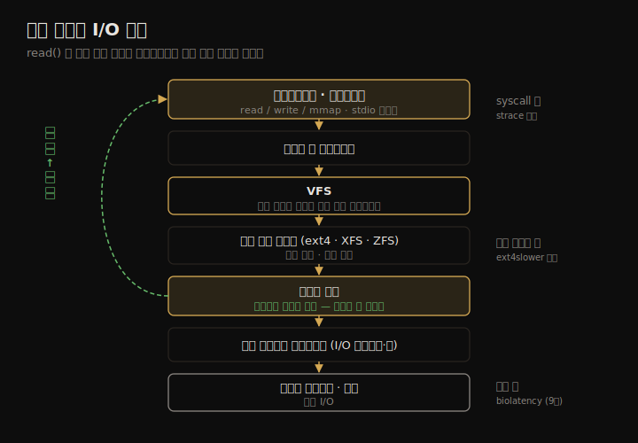

# 파일 시스템 (2) — 아키텍처·캐시·파일시스템 유형
---
> 이 노트는 8.4 아키텍처를 다룹니다. 파일 시스템 I/O가 애플리케이션에서 디스크까지 거치는 스택, VFS가 그것을 묶는 방식, 그 사이 네 캐시(buffer·page·dentry·inode), 그리고 저널링·COW 같은 기능과 ext4·XFS·ZFS·btrfs 같은 유형을 봅니다.

08-01이 *개념* 이었다면 이 노트는 *구조* 입니다. 같은 read() 한 줄이 커널에서 어떤 층을 거쳐 디스크에 닿는지, 그 길에 어떤 캐시가 끼는지, 파일 시스템마다 그 길을 어떻게 다르게 깔았는지를 봅니다. 구조를 알면 "왜 이 파일 시스템이 이 워크로드에 빠른가"를 설명할 수 있습니다.

> I/O 스택 → VFS → 캐시 네 종류 → 파일 시스템 기능(저널링·COW·스크러빙) → 유형 비교(ext4·XFS·ZFS·btrfs) → 볼륨과 풀 순으로 갑니다. 각 층이 성능에 어떤 레버를 주는지가 초점입니다.

## 1. 파일 시스템 I/O 스택 — read() 한 줄의 여정

> 애플리케이션의 논리 I/O는 syscall → VFS → 파일 시스템 → (캐시 적중이면 여기서 끝) → 블록 I/O → 디스크 순으로 내려갑니다. 캐시에 적중하면 디스크까지 안 가고, 미스면 끝까지 내려가 물리 I/O가 됩니다.

read()/write() 한 줄이 데이터에 닿기까지의 경로가 I/O 스택입니다. 위에서 아래로 따라가면 각 층이 무엇을 하는지 보입니다.

| 층 | 역할 |
|----|------|
| 애플리케이션·라이브러리 | read/write/mmap 호출. stdio 버퍼링 |
| 시스템 콜 인터페이스 | 유저→커널 진입 |
| VFS | 파일 시스템 유형을 추상화한 공통 인터페이스 |
| 개별 파일 시스템(ext4·XFS 등) | 실제 구현. 캐시 조회·블록 매핑 |
| 페이지 캐시 | 적중이면 여기서 반환(물리 I/O 없음) |
| 블록 디바이스 인터페이스 | I/O 스케줄러·큐 |
| 디스크 드라이버·장치 | 물리 I/O |

핵심은 *분기점* 입니다. 페이지 캐시에 적중하면 읽기는 캐시에서 바로 돌아와 블록 층·디스크를 건너뜁니다. 미스일 때만 끝까지 내려가 물리 I/O가 발생합니다. 그래서 같은 read()라도 적중이냐 미스냐에 따라 거치는 층이 전혀 다릅니다.

> 분석에서 이 스택은 "어느 층을 재느냐"의 지도입니다. syscall 층에서 재면 애플리케이션 체감(캐시 포함), 블록 층에서 재면 물리 I/O만 보입니다. 08-04의 도구들이 각 층에 붙습니다 — strace는 syscall 층, ext4slower는 파일 시스템 층, biolatency(9장)는 블록 층입니다.

## 2. VFS — 파일 시스템 유형을 묶는 추상화

> VFS(Virtual File System)는 ext4·XFS·NFS 등 서로 다른 파일 시스템을 같은 커널 인터페이스(vfs_read·vfs_write 등)로 묶습니다. 덕분에 애플리케이션은 파일 시스템 유형을 몰라도 같은 syscall로 접근합니다.

VFS는 커널이 여러 파일 시스템을 한 인터페이스로 다루게 하는 추상화 층입니다. 애플리케이션이 read()를 부르면 VFS가 그 파일이 속한 파일 시스템(ext4든 XFS든 NFS든)의 구현 함수로 넘깁니다. 객체 지향의 인터페이스/구현 분리와 같은 구조입니다.

성능 관점에서 VFS의 의미는 *공통 계측 지점* 입니다. vfs_read·vfs_write 같은 VFS 함수에 트레이서를 걸면 파일 시스템 유형과 무관하게 모든 파일 시스템 I/O를 한자리에서 잡습니다. 반대로 특정 파일 시스템 동작을 보려면 그 아래(ext4_*)에 걸어야 합니다.

> VFS 층 측정은 "전체 파일 시스템 활동"을, 개별 파일 시스템 층 측정은 "그 파일 시스템의 내부 동작"을 봅니다. 둘은 보완 관계입니다 — VFS에서 느린 파일 시스템을 찾고, 그 파일 시스템 층으로 내려가 원인을 봅니다.

## 3. 캐시 네 종류 — buffer·page·dentry·inode

> 리눅스 파일 시스템은 네 캐시를 둡니다. 페이지 캐시(파일 내용)·버퍼 캐시(블록 디바이스, 지금은 페이지 캐시에 통합)·dentry 캐시(경로 조회)·inode 캐시(메타데이터)입니다. 각각 다른 종류의 미스를 막습니다.

08-01에서 캐시가 읽기를 흡수한다고 했는데, 리눅스는 종류별로 캐시를 나눠 둡니다.

| 캐시 | 담는 것 | 막는 미스 |
|------|--------|----------|
| 페이지 캐시(page cache) | 파일 데이터 페이지 | 데이터 읽기 디스크 I/O |
| 버퍼 캐시(buffer cache) | 블록 디바이스 블록 | 블록 단위 I/O(현재 페이지 캐시에 통합) |
| dentry 캐시(directory entry cache) | 경로명→inode 매핑 | 경로 탐색(lookup) 반복 |
| inode 캐시 | inode(메타데이터) | stat·권한 확인 반복 |

리눅스에서 버퍼 캐시는 따로 있던 것을 페이지 캐시에 통합했습니다 — 같은 데이터를 두 캐시가 중복 보관하던 비효율을 없앤 결과입니다. 그래서 지금 `free`의 buff/cache는 사실상 한 덩어리입니다.

dentry·inode 캐시는 메타데이터 캐시입니다. 작은 파일이 많은 워크로드(빌드·메일 서버)는 데이터 I/O보다 경로 탐색·stat이 잦아, 이 두 캐시의 적중률이 성능을 가릅니다. `find` 같은 대량 탐색 후엔 이 캐시가 채워져 둘째 실행이 빨라집니다.

> 네 캐시를 나눠 본 이유는 *튜닝 대상이 다르기 때문* 입니다. 데이터 읽기가 느리면 페이지 캐시(메모리 더 주기)를, 경로 탐색이 느리면 dentry/inode 캐시(vfs_cache_pressure 조절)를 봅니다. slabtop으로 dentry·inode 캐시 크기를, cachestat으로 페이지 캐시 적중률을 봅니다(08-04).

## 4. 파일 시스템 기능 — 저널링·COW·스크러빙

> 저널링은 쓰기를 먼저 로그에 기록해 장애 후 일관성을 복구합니다. COW(copy-on-write)는 덮어쓰지 않고 새 위치에 써 원본을 보존합니다. 스크러빙은 백그라운드로 데이터 무결성을 검사합니다. 모두 무결성을 위한 기능이며 성능 대가가 따릅니다.

파일 시스템마다 무결성·기능을 위해 추가하는 메커니즘이 있고, 각각 성능에 흔적을 남깁니다.

**저널링(journaling)** 은 데이터·메타데이터 변경을 실제 위치에 쓰기 전에 저널(로그)에 먼저 기록합니다. 장애로 쓰기가 중간에 끊겨도 저널을 재생해 일관성을 복구합니다. 대가는 *쓰기가 두 번* 일어난다는 점입니다(저널 + 본위치). ext3/ext4는 모드(data=writeback/ordered/journal)로 무엇까지 저널링할지 고릅니다.

**COW(copy-on-write)** 는 기존 블록을 덮어쓰지 않고 새 블록에 쓴 뒤 포인터를 바꿉니다. 원본이 그대로 남아 스냅숏·장애 일관성이 자연스럽고, 랜덤 덮어쓰기를 순차 쓰기로 바꾸는 이점도 있습니다. 대가는 *단편화* 입니다 — 계속 새 위치에 쓰니 한 파일 블록이 디스크에 흩어집니다. ZFS·btrfs가 COW입니다.

**스크러빙(scrubbing)** 은 백그라운드로 전체 데이터의 체크섬을 검사해 조용한 손상(bit rot)을 찾아 고칩니다. 무결성은 높아지지만 백그라운드 I/O가 워크로드와 경합합니다.

> 기능 선택은 *무결성과 성능의 교환* 입니다. 저널링 모드를 낮추면 빠르지만 장애 시 데이터 위험이 커지고, COW는 스냅숏을 거의 공짜로 주지만 단편화로 순차 읽기가 느려질 수 있습니다. 워크로드가 무결성을 얼마나 요구하느냐로 고릅니다.

## 5. 파일 시스템 유형 — ext4·XFS·ZFS·btrfs

> ext4는 리눅스 기본의 안정적 선택, XFS는 대용량·병렬 I/O에 강하고, ZFS·btrfs는 COW 기반으로 스냅숏·체크섬·풀 관리를 통합합니다. 워크로드 특성(파일 크기·병렬성·무결성 요구)으로 고릅니다.

대표 파일 시스템의 성능 성격을 비교합니다.

| 유형 | 성격 | 강점 |
|------|------|------|
| ext4 | 리눅스 기본. extent 기반(블록 맵 개선) | 안정·범용. 작은~중간 워크로드 |
| XFS | 대용량·고병렬. allocation group으로 병렬 I/O | 대용량 파일·다수 스레드 동시 I/O |
| ZFS | COW. 체크섬·스냅숏·압축·풀 통합 | 데이터 무결성·스토리지 관리 통합 |
| btrfs | COW(리눅스 네이티브). 스냅숏·체크섬 | ZFS 유사 기능을 리눅스 메인라인으로 |

ext4는 ext3에서 extent(연속 블록 범위를 하나로 표현)를 도입해 대용량 파일의 메타데이터 오버헤드를 줄였습니다. 대부분의 워크로드에서 안전한 기본값입니다.

XFS는 디스크를 여러 allocation group으로 나눠 각 그룹을 독립적으로 할당·관리합니다. 그래서 여러 스레드가 동시에 다른 그룹에 쓰면 락 경합이 적어, 고병렬·대용량 워크로드에서 ext4보다 확장성이 좋습니다.

ZFS·btrfs는 파일 시스템과 볼륨 관리(다음 절)를 한데 묶어, 체크섬·스냅숏·압축·RAID를 파일 시스템 안에서 제공합니다. 무결성·관리 편의가 크지만 COW 단편화·메모리 사용(특히 ZFS ARC)을 감안해야 합니다.

> 유형 선택에 "정답"은 없고 *워크로드 매칭* 만 있습니다. 범용·안정이면 ext4, 대용량 병렬이면 XFS, 무결성·스냅숏·스토리지 통합이면 ZFS/btrfs입니다. 같은 디스크라도 파일 시스템을 바꾸면 성능 성격이 달라지므로, 마이크로벤치마킹(08-03)으로 실제 워크로드에 대 봐야 합니다.

## 6. 볼륨과 풀 — 파일 시스템 아래의 추상화

> 볼륨 매니저(LVM 등)는 여러 디스크를 묶어 하나의 논리 볼륨으로 보이게 합니다. 스토리지 풀(ZFS)은 그 위에 파일 시스템을 동적으로 얹습니다. 둘 다 디스크와 파일 시스템 사이에 또 한 층을 둬 유연성을 주고, 그만큼 I/O 경로가 길어집니다.

파일 시스템 아래에는 디스크를 묶고 나누는 또 한 층이 있을 수 있습니다.

**볼륨(volume)** 은 LVM(Logical Volume Manager) 같은 도구로 여러 물리 디스크를 묶어 하나의 논리 볼륨처럼 보이게 한 것입니다. 디스크를 더 붙이거나 크기를 바꾸기 쉽고, 스트라이핑(RAID 0)으로 여러 디스크에 I/O를 분산할 수도 있습니다.

**풀(pool)** 은 ZFS가 쓰는 모델로, 디스크들을 풀에 넣고 그 위에 파일 시스템을 동적으로 만듭니다. 전통적 "디스크→파티션→파일 시스템" 고정 배치 대신, 풀의 공간을 여러 파일 시스템이 유연하게 나눠 씁니다.

> 볼륨·풀의 대가는 *I/O 경로가 길어지고 분석이 복잡해진다* 는 점입니다. 한 논리 볼륨의 I/O가 여러 물리 디스크에 흩어지므로, 파일 시스템 층 통계와 디스크 층 통계(9장)가 1:1로 안 맞습니다. 스트라이핑은 처리량을 늘리지만 한 디스크가 느리면 전체가 느려지는 의존도 생깁니다. 그래서 볼륨·풀 환경에선 파일 시스템·볼륨·디스크 세 층을 함께 봐야 합니다.

## 학습 점검

> 이 노트의 핵심을 스스로 떠올려 봅니다. 답이 막히면 해당 섹션으로 돌아가 확인합니다.

- read() 한 줄이 캐시에 적중할 때와 미스일 때, 거치는 I/O 스택 층이 어떻게 달라지는지 설명해 봅니다. (→ §1)
- VFS 층 측정과 개별 파일 시스템 층 측정이 각각 무엇을 보여 주며 어떻게 보완하는지 떠올려 봅니다. (→ §2)
- 페이지·dentry·inode 캐시가 각각 어떤 미스를 막는지, 작은 파일이 많은 워크로드에서 중요한 캐시가 무엇인지 말해 봅니다. (→ §3)
- 저널링과 COW가 각각 무엇을 위한 기능이며 어떤 성능 대가가 따르는지 설명해 봅니다. (→ §4)
- ext4·XFS·ZFS를 워크로드 특성으로 고른다면 각각 어떤 경우에 맞는지 떠올려 봅니다. (→ §5)
