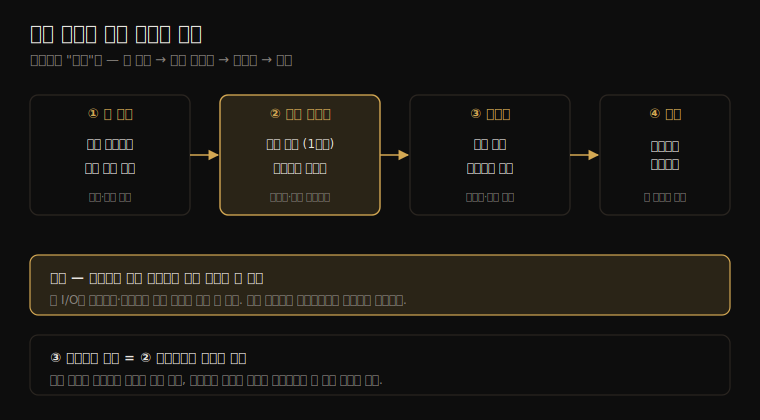

# 파일 시스템 (3) — 방법론·실험·튜닝
---
> 이 노트는 8.5 방법론·8.7 실험·8.8 튜닝을 다룹니다. 파일 시스템 성능을 *어떤 순서로 분석하고*(방법론 8종), *어떻게 의도적으로 부하를 걸어 재고*(실험 도구), *어떤 손잡이를 돌리는가*(튜너블)를 잡습니다.

08-01·08-02가 개념·구조였다면 이 노트는 *행동* 입니다. 파일 시스템이 느리다는 신고가 들어왔을 때 무엇부터 보는지(방법론), 그 가설을 어떻게 재현·측정하는지(실험), 원인을 찾았을 때 무엇을 바꾸는지(튜닝)의 순서입니다.

> 방법론 8종(디스크 분석·지연 분석·워크로드 특성화·성능 모니터링·정적 튜닝·캐시 튜닝·워크로드 분리·마이크로벤치마킹) → 실험 도구(dd·Bonnie·fio·FileBench·캐시 플러시) → 튜닝(애플리케이션 호출·ext4·ZFS) 순으로 갑니다.

## 1. 방법론 8종 — 무엇부터 보는가

> 파일 시스템 분석 방법론은 8가지입니다. 빠른 점검용(디스크 분석·성능 모니터링)부터 원인 추적용(지연 분석·워크로드 특성화), 개선용(캐시 튜닝·워크로드 분리·정적 튜닝), 검증용(마이크로벤치마킹)까지 목적이 다릅니다.

8가지 방법론을 목적별로 묶어 봅니다. 2장의 일반 방법론(USE·드릴다운 등)을 파일 시스템에 적용한 것입니다. 큰 그림에서 검증까지의 순서를 한 장으로 정리하면 다음과 같습니다.

| 방법론 | 무엇을 하나 | 언제 |
|--------|-----------|------|
| 디스크 분석(disk analysis) | 디스크 층 지표로 간접 추론 | 빠른 1차 점검(단, 파일 시스템 지연과 불일치 주의) |
| 지연 분석(latency analysis) | 파일 시스템 요청 지연을 층별로 측정 | 느림의 원인 추적(1순위) |
| 워크로드 특성화(characterization) | 누가·무엇을·얼마나 거나 파악 | 부하의 성격 이해 |
| 성능 모니터링(monitoring) | 지표를 시계열로 추적 | 추세·이상 탐지 |
| 정적 성능 튜닝(static tuning) | 설정·버전·하드웨어 점검 | 부하 없이도 가능한 점검 |
| 캐시 튜닝(cache tuning) | 캐시 크기·정책 조정 | 적중률 개선 |
| 워크로드 분리(separation) | 서로 다른 워크로드를 다른 장치로 | 경합 제거 |
| 마이크로벤치마킹(micro-benchmarking) | 합성 부하로 한 요소만 측정 | 가설 검증·비교 |

이 중 **지연 분석** 이 1순위입니다. 08-01에서 봤듯 파일 시스템 지연이 애플리케이션 체감을 직접 보여 주기 때문입니다. 디스크 분석은 빠르지만 캐시·되쓰기 때문에 파일 시스템 지연과 어긋날 수 있어 보조로 씁니다.

> 방법론은 "순서"입니다. 모니터링·정적 튜닝으로 큰 그림을 잡고, 지연 분석·워크로드 특성화로 원인을 좁히고, 캐시 튜닝·워크로드 분리로 고치고, 마이크로벤치마킹으로 검증합니다. 한 가지 함정 — 디스크가 바빠 보인다고 바로 디스크 탓을 하면, 실은 미리읽기·되쓰기가 만든 무해한 I/O일 수 있습니다.

## 2. 지연 분석·워크로드 특성화 — 원인 좁히기

> 지연 분석은 파일 시스템 요청을 층(VFS·파일 시스템·블록)별로 재 어디서 느려지는지 짚습니다. 워크로드 특성화는 I/O의 방향·유형·크기·랜덤성·파일 수를 파악해 부하의 성격을 그립니다.

**지연 분석** 은 느린 요청이 *어느 층에서* 시간을 쓰는지를 봅니다. 같은 read()의 지연을 syscall 층·VFS 층·파일 시스템 층에서 각각 재면, 예컨대 VFS는 빠른데 ext4 층에서 느리다면 그 파일 시스템 내부(블록 매핑·락)를 의심합니다. ext4slower(08-04) 같은 도구가 임계값 넘는 느린 요청만 골라 보여 줍니다.

**워크로드 특성화** 는 부하의 다섯 축을 묻습니다 — 읽기/쓰기 비율, 동기/비동기, I/O 크기, 랜덤/순차, 접근하는 파일 수와 크기 분포입니다. 이 그림이 있어야 "왜 느린가"의 가설을 세웁니다. 작은 랜덤 읽기가 많으면 캐시·디스크 탐색이, 큰 순차 쓰기가 많으면 되쓰기·대역폭이 후보입니다.

> 둘은 짝입니다 — 워크로드 특성화로 "어떤 부하인지"를 그리고, 지연 분석으로 "그 부하가 어디서 막히는지"를 짚습니다. 워크로드 특성화는 또한 *불필요한 I/O 제거* 의 출발점입니다. 가장 빠른 I/O는 아예 안 하는 I/O라, 부하를 그려 보면 줄일 수 있는 요청(중복 읽기·과한 atime 갱신)이 보입니다.

## 3. 캐시 튜닝·워크로드 분리 — 고치기

> 캐시 튜닝은 적중률을 높이려 캐시 크기·정책을 조정합니다. 워크로드 분리는 경합하는 워크로드를 다른 파일 시스템·디스크로 떼어 서로 방해하지 않게 합니다.

원인을 찾았을 때 쓰는 두 개선 방법입니다.

**캐시 튜닝** 은 파일 시스템 성능의 가장 큰 레버인 캐시를 손봅니다. 메모리를 더 줘 페이지 캐시를 키우면 적중률이 오르고, vfs_cache_pressure로 dentry/inode 캐시 회수 정도를 조절합니다. 다만 무작정 캐시를 키우는 게 답은 아닙니다 — 워크로드가 캐시보다 크면(자주 안 쓰는 데이터를 한 번씩 훑는 패턴) 캐시가 무용하고, 그 메모리를 다른 데 쓰는 게 낫습니다.

**워크로드 분리** 는 성격이 다른 워크로드를 물리적으로 떼어 놓습니다. 예를 들어 순차 로그 쓰기와 랜덤 DB 읽기가 같은 디스크에 있으면 서로의 탐색 패턴을 망칩니다. 둘을 다른 디스크·파일 시스템으로 분리하면 각자의 접근 패턴이 살아납니다.

> 두 방법의 공통 전제는 *워크로드를 알아야 한다* 는 것입니다(2절). 캐시 튜닝은 워킹셋이 캐시에 맞을 때만 효과 있고, 워크로드 분리는 어떤 워크로드가 경합하는지 알아야 떼어 놓습니다. 그래서 특성화 없이 캐시부터 키우는 건 종종 헛수고입니다.

## 4. 실험 도구 — 의도적으로 부하 걸기

> 실험(마이크로벤치마킹)은 합성 부하로 한 요소만 분리해 측정합니다. dd(단순 순차)·Bonnie(여러 연산)·fio(유연한 설정)·FileBench(워크로드 모델)가 도구이며, 캐시 플러시로 cold/warm을 구분해야 결과가 정확합니다.

실험은 관측의 반대 손입니다(1장). 부하가 올 때까지 기다리지 않고 *직접 만들어* 재현·측정·비교합니다.

| 도구 | 성격 |
|------|------|
| dd | 가장 단순. 순차 읽기/쓰기 처리량 빠른 측정 |
| Bonnie/Bonnie++ | 여러 연산(순차·랜덤·생성/삭제)을 한 번에 |
| fio | 가장 유연. I/O 크기·깊이·랜덤성·동기성 세밀 설정 |
| FileBench | 워크로드를 모델로 기술(웹서버·메일서버 등 흉내) |

dd는 `dd if=/dev/zero of=file bs=1M count=1000`처럼 단순 순차 처리량을 잰다는 점에서 빠르지만, 순차·단일 스레드라 실제 워크로드를 대표하지 못합니다. fio는 큐 깊이·랜덤 비율·동기 여부를 정해 실제 워크로드에 가깝게 흉내 낼 수 있어 가장 널리 쓰입니다.

> 실험의 최대 함정은 *캐시* 입니다. 첫 실행(cold cache)과 둘째 실행(warm cache)의 결과가 전혀 다릅니다 — 둘째는 페이지 캐시에서 읽어 디스크를 안 거치니까요. 그래서 디스크 성능을 재려면 매 실행 전 캐시를 비워야(`echo 3 > /proc/sys/vm/drop_caches`) 하고, 반대로 캐시 성능을 재려면 일부러 워밍업합니다. 무엇을 재려는지 정하고 캐시 상태를 통제하는 게 실험 설계의 핵심입니다.

## 5. 튜닝 — 어떤 손잡이를 돌리나

> 튜닝은 세 층에서 합니다. 애플리케이션은 posix_fadvise/madvise로 커널에 접근 패턴 힌트를 주고, ext4는 마운트 옵션·저널 모드를, ZFS는 ARC 크기·recordsize 등을 조정합니다. 모두 워크로드에 맞춰 캐시·무결성·접근 패턴을 조율합니다.

원인을 찾고 검증까지 했으면 실제로 손잡이를 돌립니다.

**애플리케이션 호출** 은 커널에 접근 의도를 알려 줍니다. `posix_fadvise()`로 "이 영역을 순차로 읽을 것"(미리읽기 적극) 또는 "다시 안 읽을 것"(캐시에 남기지 마라)을 힌트 주고, `madvise()`는 mmap 영역에 같은 힌트를 줍니다. 애플리케이션이 자기 접근 패턴을 가장 잘 아니, 이 힌트가 커널 추측보다 정확합니다.

**ext4 튜닝** 은 주로 마운트 옵션입니다 — noatime(atime 갱신 끔)으로 읽기가 부르는 몰래 쓰기를 없애고, 저널 모드(data=writeback/ordered/journal)로 무결성과 속도를 교환하며, commit 간격으로 되쓰기 주기를 조절합니다.

**ZFS 튜닝** 은 ARC(ZFS의 메모리 캐시) 크기, recordsize(블록 크기 — 워크로드 I/O 크기에 맞춤), 압축·dedup 같은 기능 토글이 있습니다. ZFS는 자체 캐시·풀을 가져 튜닝 표면이 넓습니다.

> 튜닝의 원칙은 *측정 → 한 번에 하나 → 재측정* 입니다. 여러 손잡이를 동시에 돌리면 무엇이 효과였는지 모릅니다. 그리고 모든 튜닝은 워크로드 의존적이라, 한 워크로드에 좋은 설정(예: 큰 recordsize)이 다른 워크로드(작은 랜덤 I/O)엔 해롭습니다. 그래서 튜닝 전에 워크로드 특성화(2절)와 마이크로벤치마킹(4절) 검증이 선행돼야 합니다.

## 학습 점검

> 이 노트의 핵심을 스스로 떠올려 봅니다. 답이 막히면 해당 섹션으로 돌아가 확인합니다.

- 8가지 방법론 중 1순위가 지연 분석인 까닭과, 디스크 분석을 보조로만 쓰는 이유를 설명해 봅니다. (→ §1)
- 지연 분석과 워크로드 특성화가 짝을 이루는 까닭을 떠올려 봅니다. (→ §2)
- 캐시를 무작정 키우는 게 답이 아닌 워크로드가 어떤 경우인지 말해 봅니다. (→ §3)
- 디스크 성능을 재는 실험에서 캐시를 비워야 하는 까닭과, cold/warm 결과가 다른 이유를 설명해 봅니다. (→ §4)
- posix_fadvise 힌트가 커널 추측보다 정확할 수 있는 까닭을 떠올려 봅니다. (→ §5)
