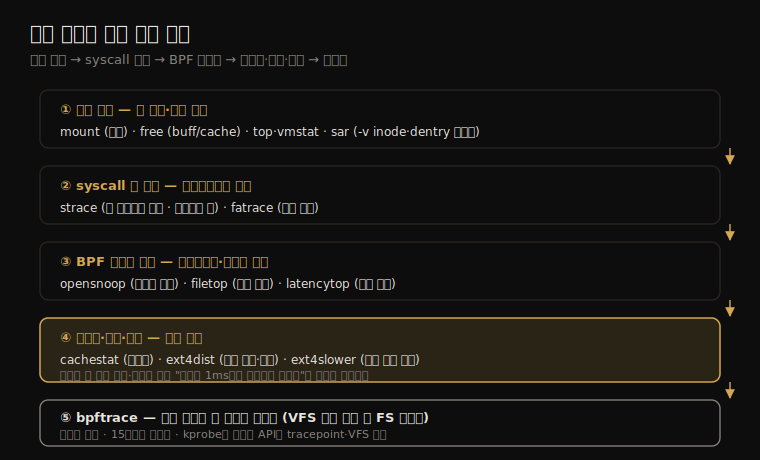

# 파일 시스템 (4) — 관측 도구
---
> 이 노트는 8장의 마지막으로, 08-03의 방법론을 손에 든 연장으로 옮깁니다. system-wide 통계(mount·free·sar·slabtop)에서 시작해 syscall 추적(strace·fatrace)·이벤트 추적(opensnoop·filetop·cachestat·ext4dist·ext4slower)·bpftrace 커스텀까지, I/O 스택을 따라 깊어집니다.

도구는 08-02의 I/O 스택을 따라 위에서 아래로 배치됩니다. 마운트·캐시 통계로 큰 그림을 보고, syscall 층(strace·fatrace)에서 애플리케이션 체감을 잡고, BPF 도구로 파일 시스템 층의 느린 요청·캐시 적중률·연산 분포를 봅니다. 정적 통계에서 시작해 동적 추적으로 내려가는 흐름입니다.

> BPF 기반 도구(opensnoop·filetop·cachestat·ext4dist·ext4slower·bpftrace)는 04-02의 이벤트 소스(tracepoint·kprobe) 위에 서며 15장에서 깊어집니다. sar·strace는 04-03·05-03과 교차참조합니다. 파일 시스템 캐시는 메모리(07-04)와 한 몸이라 free·slabtop은 양쪽에서 봅니다.

## 1. mount·free·sar — system-wide 통계

> mount는 마운트된 파일 시스템과 옵션(noatime 등)을, free는 페이지 캐시·버퍼 크기를, sar는 파일 시스템 관련 지표를 시계열로 봅니다. 부하 없이 빠르게 큰 그림과 정적 설정을 점검하는 1차 도구입니다.

파일 시스템 관측 도구가 I/O 스택을 따라 어떻게 깊어지는지를 한 장으로 정리하면 다음과 같습니다.

분석의 출발은 정적 통계입니다.

| 도구 | 보는 것 |
|------|--------|
| mount | 마운트된 파일 시스템·유형·옵션(ro/rw·noatime·data=ordered 등) |
| free | 메모리 중 buff/cache(페이지 캐시+버퍼) 크기 |
| top·vmstat | system-wide 캐시·페이징과 프로세스별 자원 |
| sar | 파일 시스템 관련 지표 시계열(`-v` inode·dentry·파일 핸들 등) |

mount는 정적 튜닝(08-03)의 첫걸음입니다 — noatime이 걸렸는지, 저널 모드가 무엇인지, ro로 잘못 마운트됐는지를 부하 없이 즉시 봅니다. free의 buff/cache는 파일 시스템 캐시가 메모리를 얼마나 쓰는지를 보여 주며, 이 값이 크면 캐싱이 잘 되고 있다는 신호입니다(07-04와 같은 지표).

> 이 도구들은 "정적 점검"과 "큰 그림"용입니다. 느림의 *원인* 은 못 짚지만, 설정 실수(noatime 누락)·캐시 규모·전반 추세를 빠르게 거릅니다. sar는 특히 시계열이라, 캐시·inode 사용량이 시간에 따라 어떻게 변하는지를 봐 추세·이상을 잡습니다.

## 2. strace·fatrace — syscall 층 추적

> strace는 한 프로세스의 파일 시스템 syscall(open·read·write·stat)과 인자·반환·시간을 봅니다. fatrace는 system-wide로 모든 프로세스의 파일 접근 이벤트를 봅니다. 둘 다 애플리케이션 체감 층(syscall)에서 무슨 I/O가 오가는지를 보여 줍니다.

I/O 스택에서 한 층 내려가, 애플리케이션이 실제로 거는 syscall을 봅니다.

**strace** 는 한 프로세스의 syscall을 가로채 인자·반환값·소요 시간(`-T`)·타임스탬프(`-tt`)를 보여 줍니다. `strace -ttT -p PID`로 어떤 파일을 열고(open) 얼마나 읽으며(read 크기·지연) 어디서 막히는지를 직접 봅니다. 다만 strace는 ptrace 기반이라 *오버헤드가 큽니다* — 프로세스를 수십 배 느리게 만들 수 있어, 운영 중 민감한 프로세스엔 조심해야 합니다(05-03에서도 경고).

**fatrace** 는 system-wide로 모든 프로세스의 파일 접근(open·read·write·close) 이벤트를 스트림으로 보여 줍니다. "지금 어떤 프로세스가 어떤 파일을 만지나"를 전체에서 훑을 때 씁니다. strace가 한 프로세스 심층이라면 fatrace는 전체 조망입니다.

> 두 도구의 자리는 다릅니다 — strace는 *특정 프로세스가 의심될 때* 그 syscall을 파고들고, fatrace는 *어느 프로세스가 I/O를 만드는지 모를 때* 전체에서 범인을 찾습니다. strace의 큰 오버헤드 탓에, 운영 환경의 일상 관측은 다음 절 BPF 도구(저오버헤드)로 넘어갑니다.

## 3. opensnoop·filetop·latencytop — BPF 이벤트 추적

> opensnoop은 어떤 파일이 열리는지를, filetop은 (top처럼) 가장 I/O가 많은 파일을, latencytop은 지연의 원인을 보여 줍니다. 모두 저오버헤드 이벤트 추적으로, strace의 부담 없이 운영 중에도 씁니다.

BPF 기반 도구는 strace의 통찰을 낮은 오버헤드로 줍니다.

| 도구 | 보는 것 |
|------|--------|
| opensnoop | 열리는 파일 실시간(프로세스·경로·성공/실패) |
| filetop | I/O 많은 파일 top(top의 파일 버전) |
| latencytop | 지연의 원인을 커널 차원에서 집계 |

**opensnoop** 은 "어떤 파일이 열리나"를 실시간 스트림으로 봅니다. 설정 파일을 어디서 읽는지, 없는 파일을 자꾸 열려다 실패(ENOENT)하는지 같은 문제를 즉시 드러냅니다 — 애플리케이션이 매 요청마다 같은 파일을 다시 여는 비효율이 여기서 보입니다.

**filetop** 은 top처럼 일정 간격으로 갱신하며, 읽기·쓰기 바이트·횟수가 가장 많은 파일을 순위로 보여 줍니다. "지금 어떤 파일이 I/O를 먹나"를 한눈에 봅니다.

**latencytop** 은 시스템·프로세스의 지연이 *어디서* 발생하는지(어떤 커널 경로에서 블록되는지)를 집계합니다.

> 이 도구들의 공통점은 *저오버헤드 + 이벤트 단위* 입니다. 카운터(집계값)가 아니라 개별 이벤트(이 파일, 이 프로세스)를 보여 줘, "평균은 괜찮은데 특정 파일만 느리다" 같은 문제를 짚습니다. opensnoop으로 무엇을 여는지, filetop으로 무엇이 바쁜지를 보고, 다음 절 도구로 그 지연·적중률을 정량화합니다.

## 4. cachestat·ext4dist·ext4slower — 적중률·분포·느린 요청

> cachestat은 페이지 캐시 적중률을, ext4dist는 파일 시스템 연산 지연 분포(히스토그램)를, ext4slower는 임계값 넘는 느린 요청만 골라 봅니다. 캐시 효율과 지연의 꼬리를 정량화하는 핵심 도구입니다.

08-01·08-03에서 강조한 캐시 적중률·지연을 실제로 재는 도구들입니다.

**cachestat** 은 페이지 캐시 적중률(HITS·MISSES·HITRATIO)을 초 단위로 보여 줍니다. 08-01에서 적중률 99%와 99.9%가 평균 지연을 10배 가른다고 했는데, cachestat이 바로 그 적중률을 직접 봅니다. 적중률이 낮으면 캐시 튜닝(메모리 증설·워킹셋 축소)의 신호입니다.

**ext4dist** 는 ext4 연산(read·write·open·fsync)의 지연을 히스토그램으로 보여 줍니다. 평균이 아니라 분포라, "대부분 빠른데 일부가 수십 ms"인 다봉(multimodal) 패턴을 드러냅니다(2장의 평균의 함정). 빠른 봉우리는 캐시 적중, 느린 봉우리는 디스크 I/O일 가능성이 높습니다.

**ext4slower** 는 임계값(예: 10ms)을 넘는 느린 ext4 연산만 골라, 어떤 프로세스가 어떤 파일에서 얼마나 느렸는지를 한 줄씩 보여 줍니다. 평균에 묻히는 *지연의 꼬리* 를 직접 잡아, 사용자가 체감하는 느린 요청을 추적합니다. xfsslower·zfsslower 등 파일 시스템별 변형이 있습니다.

> 이 셋이 파일 시스템 분석의 핵심 무기입니다 — cachestat으로 *왜* 느린지(캐시 미스)를, ext4dist로 *얼마나 퍼져* 있는지(분포)를, ext4slower로 *어떤* 요청이 느린지(개별 꼬리)를 봅니다. 평균 지표가 못 잡는 다봉·꼬리 문제를 이 도구들이 짚어, "평균은 1ms인데 사용자는 느리다고 한다"의 진짜 원인을 드러냅니다.

## 5. bpftrace — 커스텀 추적

> bpftrace는 한 줄 프로그램으로 VFS·파일 시스템 함수에 직접 트레이서를 걸어, 기성 도구에 없는 질문에 답합니다. 연산별 횟수·지연·인자를 원하는 대로 집계해 파일 시스템 분석을 끝까지 파고듭니다.

기성 BPF 도구로 부족할 때, bpftrace로 직접 질문을 짭니다(15장에서 깊어짐).

bpftrace는 tracepoint·kprobe(04-02)에 한 줄 프로그램을 걸어 원하는 집계를 만듭니다. 예를 들어 VFS read 크기 분포, 프로세스별 파일 시스템 연산 횟수, 특정 파일의 접근 패턴 같은, 기성 도구에 없는 질문에 답합니다. ext4slower가 "느린 요청"을 보여 준다면, bpftrace는 "내가 정의한 조건의 요청"을 보여 줍니다.

핵심은 *VFS 층에 걸면 파일 시스템 유형과 무관하게 전체를 본다* 는 점입니다(08-02의 VFS 공통 계측). vfs_read·vfs_write에 걸어 전 파일 시스템 활동을 한자리에서 집계하고, 필요하면 ext4_*·xfs_* 같은 특정 파일 시스템 함수로 내려갑니다.

> bpftrace는 "마지막 수단이자 만능 줄자"입니다. 기성 도구가 답하는 질문은 그 도구로(빠르고 검증됨), 답 못 하는 질문만 bpftrace로 짭니다. 다만 커널 함수(kprobe)는 불안정 API(04-02)라 커널 버전에 따라 함수명이 바뀔 수 있어, 가능하면 안정적인 tracepoint·VFS 인터페이스를 먼저 씁니다.

## 학습 점검

> 이 노트의 핵심을 스스로 떠올려 봅니다. 답이 막히면 해당 섹션으로 돌아가 확인합니다.

- mount·free·sar 같은 정적 통계 도구가 무엇을 빠르게 거르고 무엇을 못 짚는지 설명해 봅니다. (→ §1)
- strace와 fatrace를 각각 언제 쓰는지, strace를 운영 중 조심해야 하는 까닭을 떠올려 봅니다. (→ §2)
- cachestat·ext4dist·ext4slower가 각각 무엇을(적중률·분포·꼬리) 보여 주며 어떻게 보완하는지 말해 봅니다. (→ §4)
- 평균 지연이 낮은데 사용자가 느리다고 할 때 어떤 도구로 원인을 짚는지 설명해 봅니다. (→ §4)
- bpftrace를 기성 도구보다 나중에 쓰는 까닭과, VFS 층에 거는 이점을 떠올려 봅니다. (→ §5)
