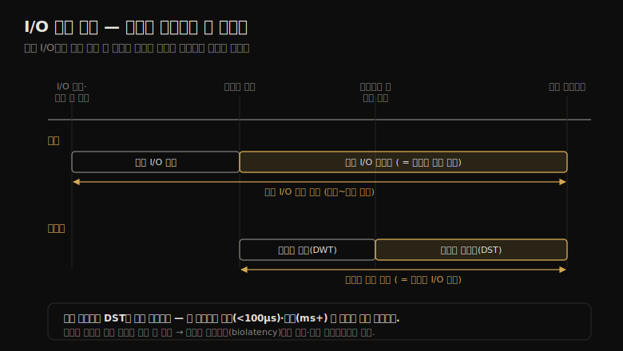

# 디스크 (1) — 배경·모델·핵심 개념
---
> 이 노트는 9장의 출발점으로, 디스크 I/O 성능을 *시간을 어디서 재느냐* 라는 질문으로 엽니다. 같은 "I/O 지연"도 커널 큐에서 재느냐 디스크 장치에서 재느냐에 따라 다른 값이 되고, 그 구분이 디스크 분석의 토대입니다.

8장이 파일 시스템(캐시가 디스크를 가리는 층)이었다면, 9장은 그 아래 *물리 디스크* 입니다. 파일 시스템이 캐시 미스로 내려보낸 물리 I/O가 실제 디스크에서 어떻게 큐에 쌓이고 처리되는지를 봅니다. 고부하에서 디스크는 병목이 되어, CPU가 디스크를 기다리며 놀게 만듭니다.

> 이 노트는 9.1~9.3의 배경·모델·개념을 다룹니다. 용어를 맞추고, 큐를 가진 단순 디스크 모델을 세우고, 시간 측정·시간 스케일·캐싱·랜덤 vs 순차·IOPS·사용률·포화·I/O wait 같은 핵심 개념 13종을 "왜 성능에 중요한가" 중심으로 정리합니다.

## 1. 용어와 모델 — 큐를 가진 디스크

> 현대 디스크는 내부에 I/O 큐를 둡니다. 들어온 I/O는 큐에서 대기하거나 처리 중이며, 이 단순 모델이 마트 계산대 줄과 같아 큐잉 이론으로 분석됩니다. 캐시·컨트롤러가 이 위에 얹힙니다.

디스크 성능을 말할 때 쓰는 용어부터 맞춥니다.

| 용어 | 의미 |
|------|------|
| 가상 디스크(virtual disk) | 저장 장치 에뮬레이션. 한 물리 디스크처럼 보이나 여러 디스크·일부로 구성 |
| 섹터(sector) | 디스크 저장 블록. 전통 512바이트, 요즘 4KB |
| I/O | 엄밀히 디스크 읽기·쓰기. 방향·주소·크기로 기술 |
| 처리량(throughput) | 현재 데이터 전송률(바이트/초) |
| 대역폭(bandwidth) | 하드웨어 한계인 최대 전송률 |
| I/O 지연(I/O latency) | I/O 한 건의 시작~끝 시간 |
| 지연 이상치(latency outlier) | 비정상으로 높은 지연의 디스크 I/O |

모델은 단순합니다. 디스크는 내부에 I/O 큐를 두고, 들어온 요청은 *큐에서 대기* 하거나 *처리 중* 입니다. 마트 계산대에서 손님이 줄 서 처리되길 기다리는 것과 같아, 큐잉 이론으로 분석하기 좋습니다. 큐는 선입선출처럼 보이지만, 디스크 컨트롤러는 회전 디스크의 엘리베이터 탐색이나 읽기/쓰기 분리 큐 같은 최적화 알고리즘을 적용합니다.

> 모델에 두 층이 더 얹힙니다. *온디스크 캐시*(DRAM)는 읽기 일부를 빠른 메모리에서 돌려주고, 되쓰기 캐시로 쓰기도 가속합니다(전원 장애 대비 배터리 동반). *컨트롤러*(HBA)는 CPU I/O 버스와 스토리지 버스를 잇는데, 성능은 이 버스들·컨트롤러·디스크 어디서든 막힐 수 있습니다.

## 2. 시간 측정 — 어디서 재느냐가 다 다르다

> I/O 시간은 요청 시간(전체)·대기 시간(큐)·서비스 시간(처리)으로 나뉩니다. 게다가 커널 기준(블록 I/O 층)과 디스크 기준(온디스크 큐)이 따로 있어, 같은 "I/O 지연"도 어디서 재느냐에 따라 전혀 다른 값입니다.

디스크 분석에서 가장 헷갈리는 게 시간 용어입니다. 기본 셋부터 보면, **I/O 요청 시간**(=응답 시간)은 발행~완료 전체, **I/O 대기 시간**은 큐에서 기다린 시간, **I/O 서비스 시간**은 실제 처리된 시간(대기 제외)입니다.

여기에 측정 *위치* 가 두 군데입니다. 커널 기준과 디스크 기준이 같은 I/O를 어떻게 나눠 보는지를 한 장으로 정리하면 다음과 같습니다.

| 기준 | 용어 | 재는 구간 |
|------|------|----------|
| 커널 | 블록 I/O 대기 시간 | I/O 생성·커널 큐 삽입 ~ 디스크 발행 |
| 커널 | 블록 I/O 서비스 시간 | 디스크 발행 ~ 완료 인터럽트 |
| 커널 | 블록 I/O 요청 시간 | 위 둘 합(생성 ~ 완료 전체) |
| 디스크 | 디스크 대기 시간 | 온디스크 큐 대기 |
| 디스크 | 디스크 서비스 시간 | 온디스크 큐 이후 실제 처리 |
| 디스크 | 디스크 요청 시간(=디스크 I/O 지연) | 위 둘 합 = 블록 I/O 서비스 시간 |

"서비스 시간"이라는 말은 OS가 디스크를 직접 관리하던 시절(디스크가 능동 처리 중인지 OS가 알던 때) 유래입니다. 지금 디스크는 자체 내부 큐를 가져, OS가 보는 서비스 시간에는 커널 큐 대기가 섞여 들어갑니다. 그래서 옛 `iostat`의 서비스 시간(`svctm`)은 부정확해져 최신판에서 제거됐습니다.

> 디스크 서비스 시간은 커널 통계로 직접 안 보이지만 `사용률/IOPS`로 근사합니다 — 사용률 60%·IOPS 300이면 평균 2ms. 단 디스크가 I/O를 병렬 처리하면 이 계산은 부정확합니다. 정확한 값은 이벤트 트레이싱(발행·완료 타임스탬프)으로 재며, biolatency가 그것입니다(09-04).

## 3. 시간 스케일·캐싱 — 자릿수가 다른 지연

> 디스크 I/O 지연은 수 마이크로초~수천 밀리초로 자릿수가 다릅니다. 온디스크 캐시 적중(<100μs)과 미스(회전 디스크 랜덤 8ms+)가 섞여 한 디스크가 두 종류 지연을 돌려주므로, 평균 하나로 표현하면 오해를 부릅니다.

디스크 지연의 범위를 온디스크 캐시 적중을 1초로 스케일하면 자릿수 차이가 와닿습니다.

| 이벤트 | 지연 | 1초 스케일 |
|--------|------|-----------|
| 온디스크 캐시 적중 | <100μs | 1초 |
| 플래시 메모리 읽기 | ~100~1,000μs | 1~10초 |
| 회전 디스크 순차 읽기 | ~1ms | 10초 |
| 회전 디스크 랜덤 읽기(7,200rpm) | ~8ms | 1.3분 |
| 랜덤 읽기(큐잉, 느림) | >10ms | 1.7분 |
| 랜덤 읽기(수십 개 큐) | >100ms | 17분 |
| 최악 가상 디스크(RAID-5·큐잉·랜덤) | >1,000ms | 2.8시간 |

지연 해석은 환경에 따라 다릅니다 — 엔터프라이즈 스토리지에선 10ms 넘으면 비정상으로 봤지만, 클라우드 웹 애플리케이션은 이미 네트워크 지연이 커서 50ms까지 허용하기도 합니다. 핵심은 한 디스크가 *두 종류 지연*(적중 <100μs, 미스 1~8ms+)을 섞어 돌려준다는 점입니다. 그래서 `iostat`처럼 평균 하나로 표현하면, 실제로는 봉우리가 둘인 분포를 가립니다(2장 평균의 함정).

> 캐싱은 "가장 좋은 디스크 I/O는 I/O를 아예 안 하는 것"이라는 원칙의 실현입니다. 소프트웨어 스택 여러 층(앱·파일 시스템·디바이스 드라이버·컨트롤러·온디스크)이 읽기를 캐시하고 쓰기를 버퍼링해 디스크 I/O를 피합니다. 디바이스 드라이버 아래 캐시로는 디스크 컨트롤러 캐시(RAID 카드)·스토리지 어레이 캐시·온디스크 캐시(DDC의 DRAM)가 있습니다.

## 4. 랜덤 vs 순차·IOPS — IOPS는 동등하지 않다

> 회전 디스크에서 랜덤 I/O는 헤드 탐색·회전 대기 때문에 순차보다 훨씬 느립니다(SSD는 차이 작음). 읽기/쓰기 비율·I/O 크기까지 더해, IOPS 값 하나만으로는 장치·워크로드를 비교할 수 없습니다.

랜덤 vs 순차는 디스크 물리 특성이 드러나는 지점입니다. 회전 디스크는 헤드가 섹터 사이를 *탐색(seek)* 하고 플래터가 *회전* 하길 기다려, 랜덤 I/O에 추가 지연이 붙습니다. 다음 I/O가 현재 I/O 바로 뒤면 탐색·회전이 없어 빠른데(순차), 흩어져 있으면 매번 기다립니다(랜덤). SSD는 움직이는 부품이 없어 랜덤·순차 차이가 거의 없습니다(블록 크기보다 작은 쓰기는 read-modify-write로 페널티).

이 위에 두 특성이 더 붙습니다 — **읽기/쓰기 비율**(읽기 많으면 캐시 추가가, 쓰기 많으면 디스크 추가가 유리), **I/O 크기**(클수록 처리량↑·건당 지연↑, 플래시는 4KB 읽기·1MB 쓰기처럼 최적 크기가 다름).

그래서 **IOPS는 동등하지 않습니다**. 회전 디스크에서 순차 5,000 IOPS가 랜덤 1,000 IOPS보다 훨씬 빠를 수 있어, IOPS 값 하나는 의미가 약합니다. IOPS를 이해하려면 랜덤/순차·I/O 크기·읽기/쓰기·버퍼/direct·병렬 개수를 함께 봐야 합니다.

> 게다가 IOPS가 애플리케이션에 그리 중요하지 않을 수도 있습니다. 랜덤 요청 워크로드는 *지연 민감* 이라 높은 IOPS가 바람직하지만, 스트리밍(순차) 워크로드는 *처리량 민감* 이라 큰 I/O의 낮은 IOPS가 오히려 낫습니다. 그래서 IOPS보다 사용률·서비스 시간 같은 *시간 기반 지표* 가 비교에 더 유용합니다.

## 5. 사용률·포화 — 가상 디스크가 오해를 부른다

> 사용률은 디스크가 바빴던 시간 비율, 포화는 처리 능력을 넘어 큐에 쌓인 일의 양입니다. 가상 디스크의 사용률은 밑단 물리 디스크 상태를 모른 채 보고돼, 100%여도 여유가 있거나 100% 미만이어도 포화일 수 있습니다.

**사용률** 은 한 구간에서 디스크가 능동적으로 일한 시간 비율입니다. 100%면 계속 바쁘다는 뜻이라 성능 문제의 유력 원인입니다. 다만 0~100% 사이 어딘가(가령 60%)에서 큐잉 가능성이 커져 이미 성능이 나빠지기도 합니다(2장 M/D/1 60% 규칙). 사용률은 *구간 요약* 이라, 50%가 "절반 시간 100% + 절반 idle"일 수도 있어 버스트(특히 쓰기 플러시)를 가립니다.

**가상 디스크 사용률** 은 특히 오해를 부릅니다.

- 여러 물리 디스크로 만든 가상 디스크가 100% busy여도, *일부 디스크만* 늘 바빴을 뿐 나머지는 idle이라 더 받을 수 있습니다.
- 되쓰기 캐시를 가진 가상 디스크는 쓰기 워크로드에서 안 바빠 보입니다 — 컨트롤러가 완료를 즉시 돌려주기 때문(밑단 디스크는 이후 한동안 바쁨).
- 하드웨어 RAID 재구축으로 디스크가 바빠도 OS엔 그 I/O가 안 보입니다.

**포화** 는 능력을 넘어 큐에 쌓인 일의 양으로, OS 장치 큐의 평균 길이로 잽니다. 100% 사용률 지점 *너머* 의 성능을 보여 줍니다 — 100%여도 포화(큐잉)가 없을 수도, 많아서 성능이 크게 나빠질 수도 있습니다.

> 핵심은 *사용률만으로 판단하지 말라* 는 것입니다. 물리 디스크는 사용률이 직관적이지만, 가상 디스크는 부하(IOPS·throughput)와 응답 시간으로 봐야 합니다. 100% 사용률이 애플리케이션 문제인지 확인하려면 디스크 응답 시간과 *애플리케이션이 그 I/O에 블록됐는지* 를 봅니다 — 비동기 I/O면 디스크가 느려도 앱은 안 기다립니다.

## 6. I/O wait·동기 vs 비동기 — 혼란스러운 지표

> I/O wait는 CPU가 idle인데 그 CPU의 스레드가 디스크 I/O에 블록된 시간입니다. 다른 CPU 작업이 끼면 값이 떨어져 오해를 부르므로, "애플리케이션 스레드가 디스크에 블록된 시간"이 더 믿을 만합니다.

**I/O wait** 는 CPU별 지표로, CPU가 할 일 없이 idle인데 그 디스패처 큐의 스레드가 디스크 I/O에 블록돼 있는 시간입니다. CPU idle을 "정말 할 일 없음"과 "디스크 I/O 대기"로 나눠 보여 줍니다. 높으면 디스크가 병목이라 CPU가 놀고 있다는 뜻입니다.

문제는 *혼란스럽다* 는 점입니다. CPU를 쓰는 다른 프로세스가 끼면 I/O wait 값이 떨어집니다 — CPU가 할 일이 생겼으니까요. 같은 디스크 I/O가 여전히 스레드를 블록하는데도 값은 내려갑니다. 반대로 앱을 효율적인 버전으로 업그레이드해 CPU를 덜 쓰게 되면 I/O wait가 *드러나서*, 마치 업그레이드가 디스크를 망친 듯 보이지만 실은 디스크는 그대로고 CPU만 빨라진 것입니다.

더 믿을 만한 지표는 **애플리케이션 스레드가 디스크 I/O에 블록된 시간** 입니다. CPU가 무슨 다른 일을 하든, 디스크 때문에 앱 스레드가 겪은 고통을 직접 잡습니다(정적·동적 계측으로 측정).

**동기 vs 비동기** 가 여기 얽힙니다. 디스크 I/O 지연이 앱 성능에 직결되지 *않을* 수 있습니다 — 앱 I/O와 디스크 I/O가 비동기로 돌면요. 되쓰기 캐시(앱 I/O는 일찍 완료, 디스크 I/O는 나중), 미리읽기/prefetch(비동기 읽기), I/O 워커 스레드, 커널 비동기/논블로킹 I/O가 그런 경우입니다.

> 그래서 I/O wait는 결함이 있어도 "디스크 바쁨·CPU idle"이라는 한 종류 병목을 식별하는 데 여전히 쓰입니다. 한 해석은 *비동시(non-concurrent) I/O* — I/O wait로 식별되는 — 가 앱을 블록하는 진짜 병목일 가능성이 크고, CPU 사용과 동시에 일어나는 동시(concurrent) I/O는 논블로킹이라 덜 위험하다는 것입니다. 또한 디스크 I/O는 파일 시스템 팽창/축소·페이징·드라이버 크기 반올림·RAID 미러/체크섬 때문에 앱이 발행한 I/O와 양이 다를 수 있습니다(09-03 지연 분석에서 다룸).

## 학습 점검

> 이 노트의 핵심을 스스로 떠올려 봅니다. 답이 막히면 해당 섹션으로 돌아가 확인합니다.

- 같은 "I/O 지연"이 커널 기준과 디스크 기준에서 어떻게 다른지, 블록 I/O 서비스 시간이 디스크 요청 시간과 같은 까닭을 설명해 봅니다. (→ §2)
- 한 디스크가 두 종류 지연을 돌려주는 까닭과, 평균 하나로 표현하면 무엇을 가리는지 떠올려 봅니다. (→ §3)
- "IOPS는 동등하지 않다"가 무슨 뜻인지, 순차 5,000과 랜덤 1,000 IOPS 비교로 설명해 봅니다. (→ §4)
- 가상 디스크가 100% busy인데도 여유가 있을 수 있는 까닭을 말해 봅니다. (→ §5)
- I/O wait 값이 떨어졌는데 디스크 성능은 그대로일 수 있는 상황을 설명해 봅니다. (→ §6)