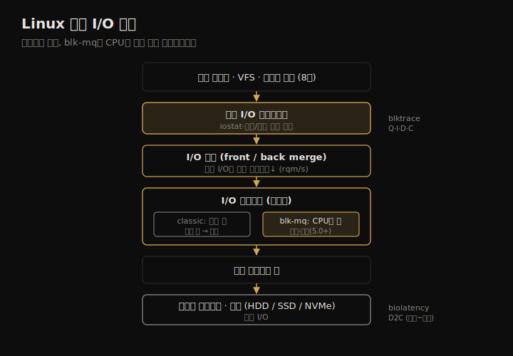

# 디스크 (2) — 아키텍처
---
> 이 노트는 9.4 아키텍처를 다룹니다. 회전 디스크(HDD)와 SSD의 내부 동작, 디스크를 시스템에 잇는 인터페이스(SCSI·SAS·SATA·FC·NVMe), RAID 구성, 그리고 Linux 블록 I/O 스택(병합·I/O 스케줄러·blk-mq)을 봅니다.

09-01이 *개념* 이었다면 이 노트는 *하드웨어와 그 아래 구조* 입니다. 디스크가 안에서 어떻게 비트를 저장하고 지연을 만드는지, 어떤 버스로 시스템에 붙는지, RAID가 그것을 어떻게 묶는지, 커널이 I/O를 어떻게 큐잉·스케줄링해 장치로 내려보내는지를 봅니다. 구조는 보통 용량 계획 때 한계를 따지려 보지만, 성능 문제가 *현재 부하* 가 아니라 *구조 선택* 에서 왔는지 확인할 때도 점검합니다.

> 디스크 유형(HDD·SSD·영속 메모리) → 인터페이스(SCSI~NVMe) → 스토리지 유형(JBOD·RAID·어레이·NAS) → OS 디스크 I/O 스택(블록 인터페이스·Linux blk-mq·스케줄러) 순으로 갑니다.

## 1. 회전 디스크(HDD) — 탐색과 회전이 만드는 지연

> HDD는 플래터가 회전하고 헤드가 트랙·섹터를 오가며 비트를 읽습니다. 느린 I/O의 원인은 헤드 탐색 시간과 플래터 회전 시간이며, 둘 다 밀리초 단위라 랜덤 I/O가 특히 느립니다.

회전 디스크(HDD)는 산화철 입자를 입힌 원반(플래터)이 돌고, 헤드 달린 기계 팔이 표면을 오가며 자화 방향으로 비트를 읽고 씁니다. 데이터는 원형 트랙에 저장되고 각 트랙은 섹터로 나뉩니다. 기계 장치라 느리며, 특히 랜덤 I/O가 그렇습니다. SSD에 밀려나는 중이지만, 저비용 고밀도 저장(데이터 웨어하우스)에선 아직 경쟁력이 있습니다.

HDD 성능을 좌우하는 요소들입니다.

| 요소 | 성능 의미 |
|------|----------|
| 탐색·회전 | 느린 I/O의 주범. 캐싱·COW·워크로드 분리·엘리베이터 탐색·short-stroking으로 줄임 |
| 회전 속도 | 5,400~15,000rpm. 빠를수록 회전 대기↓, 단 발열·수명↓ |
| 섹터 조닝(zoning) | 바깥 트랙이 섹터 더 많음 → 바깥이 처리량↑ |
| 섹터 크기 | 512B→4KB(Advanced Format)로 ECC 효율↑. 512e 에뮬레이션은 read-modify-write 유발 |
| 온디스크 캐시 | RAM으로 읽기 캐시·쓰기 버퍼·명령 큐잉(TCQ/NCQ) |
| 엘리베이터 탐색 | 온디스크 위치 기준 I/O 재정렬로 헤드 이동 최소화 |

**엘리베이터 탐색** 은 명백한 이득 같지만 함정이 있습니다 — 오프셋 1,000 근처에 I/O가 계속 도착하면, 2,000의 단일 I/O는 헤드가 1,000을 떠나지 못해 한참 굶습니다(starvation). 이게 deadline 스케줄러가 푸는 문제입니다(5절).

> HDD엔 알아 둘 병리도 있습니다 — *진동*(2008년 저자가 디스크 어레이에 소리쳐 느린 I/O를 유발, 데이터센터 방음 산업을 낳음), *sloth 디스크*(에러 보고 없이 1초 넘는 I/O를 가끔 돌려줌), *SMR*(트랙을 겹쳐 밀도 25%↑, 쓰기 성능↓ — 아카이브용). 디스크 데이터 컨트롤러(내부 펌웨어)가 섹터 조닝 같은 알고리즘을 돌려 오프셋 배치를 정하므로, OS는 디스크 내부를 들여다볼 수 없습니다.

## 2. SSD — 비대칭 읽기/쓰기와 FTL

> SSD는 움직이는 부품이 없어 오프셋·랜덤/순차에 거의 무관하게 일정한 성능을 냅니다. 단 플래시는 블록 단위 지우기 때문에 읽기는 빠르고 쓰기는 느린 비대칭이 있고, 컨트롤러의 FTL이 이를 가립니다.

SSD(솔리드 스테이트)는 솔리드 스테이트 전자로 비휘발성 메모리를 구현해, HDD보다 보통 훨씬 빠릅니다. 움직이는 부품이 없어 진동에 강하고, 오프셋별 성능이 일정해 용량 계획이 쉽습니다. 대부분 NAND 플래시 메모리 기반입니다.

**플래시의 비대칭** 이 핵심입니다. 읽기는 빠르지만(랜덤 읽기가 HDD를 자릿수로 능가), 쓰기는 *블록 전체를 지우고 다시 써야* 해서 느립니다. 그래서 드라이브는 되쓰기 캐시 + 전원 장애 대비 캐패시터로 쓰기를 가립니다. 플래시 유형은 셀당 비트 수로 갈립니다 — SLC(1비트, 고성능·고신뢰)·MLC(2비트)·TLC(3비트)·QLC(4비트)·3D NAND(적층). 비트가 많을수록 밀도↑·신뢰성↓이라, SLC 쓰기 수명 5~10만 사이클 vs QLC 약 1,000 사이클입니다.

**컨트롤러와 FTL** 이 비대칭을 관리합니다. 입력은 페이지 단위(보통 8KB) 읽기/쓰기에 블록 단위(256~512KB) 지우기인데, 출력은 임의 섹터 읽기/쓰기인 하드 드라이브 인터페이스를 흉내 내야 합니다. 이 변환을 *플래시 변환 계층(FTL)* 이 자체 로그 구조 파일 시스템처럼 수행합니다. 블록 크기보다 작은 쓰기는 *쓰기 증폭*(나머지를 다른 데 복사 후 지우기)을 일으켜 느립니다. TRIM 명령(더는 안 쓰는 영역 알림)이 자유 블록 확보를 도와 쓰기 증폭을 줄입니다.

> SSD에도 병리가 있습니다 — *노화로 인한 지연 이상치*(ECC로 데이터를 더 애써 추출), *단편화로 인한 지연 상승*(재포맷으로 FTL 블록 맵 정리), *내부 압축 시 처리량 저하*. 수명을 위해 *웨어 레벨링*(쓰기를 여러 블록에 분산)과 *오버프로비저닝*(예비 메모리)을 쓰지만, 블록당 쓰기 횟수는 여전히 유한합니다. 한편 **영속 메모리**(3D XPoint/Optane)는 DRAM과 플래시 사이 가격/성능으로, 14μs 접근 지연(3D NAND 200μs 대비)에 일관된 지연을 보입니다.

## 3. 인터페이스 — SCSI에서 NVMe까지

> 인터페이스는 디스크가 시스템과 통신하는 프로토콜입니다. 병렬 SCSI는 버스 경합 탓에 직렬 SAS·SATA로 진화했고, NVMe는 PCIe에 직접 붙어 다중 하드웨어 큐로 수만 개 명령을 버퍼링해 저지연 플래시에 맞습니다.

디스크가 (보통 컨트롤러를 거쳐) 시스템과 통신하는 프로토콜이 인터페이스입니다.

| 인터페이스 | 성격 | 대역폭/특징 |
|-----------|------|------------|
| 병렬 SCSI | 공유 버스 | 버스 경합·클럭 한계로 직렬로 전환 |
| SAS | 직렬 점대점 | SAS-4 22.5Gb/s. 듀얼 포팅·멀티패싱·핫스왑 — 엔터프라이즈 |
| SATA | 직렬 | SATA 3.0 6Gb/s. NCQ 지원 — 소비자용 |
| FC | 고속 광/구리 | SAN 구성(스위치로 다수 서버·스토리지 연결). Gen 7 51,200MB/s |
| NVMe | PCIe 직결 | 카드 자체가 PCIe 버스에 붙음. 다중 큐·저지연(<20μs) |

병렬 SCSI는 공유 버스라 백업 같은 저우선 I/O가 버스를 포화시키는 경합이 있었고, 클럭 문제까지 겹쳐 직렬 SAS로 갔습니다. SAS·SATA는 8b/10b 인코딩이라 실제 전송률이 대역폭의 80%입니다.

**NVMe** 가 전통 SAS/SATA와 다른 점은 *다중 하드웨어 큐* 입니다. 같은 CPU에서 큐를 써 캐시 온기를 유지하고(Linux multi-queue로 커널 락도 회피), 큐당 최대 6만 4천 명령을 버퍼링합니다(SAS 256·SATA 32 대비). NVMe는 저지연 플래시 장치에 쓰여 I/O 지연 20μs 미만을 기대합니다.

> 인터페이스 선택은 *워크로드·신뢰성 요구* 가 결정합니다 — 엔터프라이즈 이중화면 SAS, 소비자면 SATA, SAN이면 FC, 저지연 플래시면 NVMe입니다. 대역폭은 시간이 지나며 새 규격으로 계속 바뀌므로, 현재 규격·지원 대역폭을 그때그때 확인해야 합니다.

## 4. RAID와 스토리지 유형 — 묶음의 성능

> JBOD는 디스크를 개별 노출하고, RAID는 여러 디스크를 빠르고 안정적인 한 가상 디스크로 묶습니다. RAID 레벨마다 성능이 달라, 스트라이핑(0)은 빠르나 무중복, 미러(1)는 읽기 좋고 쓰기 제약, 패리티(5/6)는 read-modify-write로 쓰기가 느립니다.

스토리지는 네 방식으로 제공됩니다 — *디스크 디바이스*(서버 내장, 컨트롤러는 통로 역할, 분석 가장 쉬움. JBOD), *RAID*, *스토리지 어레이*(많은 디스크 + 기가바이트 캐시), *NAS*(NFS·SMB·iSCSI로 네트워크 경유).

**RAID** 는 여러 디스크를 크고 빠르고 안정적인 한 가상 디스크로 보입니다. 하드웨어 RAID(컨트롤러 카드, 배터리 백업)와 소프트웨어 RAID(ZFS 등, 관측성↑·수리 쉬움)가 있는데, CPU 코어가 남아돌면서 소프트웨어 RAID로 회귀하는 추세입니다.

| 레벨 | 설명 | 성능 |
|------|------|------|
| 0 (stripe) | I/O를 여러 드라이브에 분산 | 랜덤·순차 최고(스트라이프 크기·패턴 의존). 무중복 |
| 1 (mirror) | 동일 내용 복제 | 읽기 좋음(여러 드라이브 동시). 쓰기는 가장 느린 디스크에 제약, 처리량 2배 비용 |
| 10 | 0+1 결합 | RAID-1 유사 + 더 많은 그룹 참여로 대역폭↑ |
| 5 | 스트라이프 + 패리티 | read-modify-write·패리티 계산으로 쓰기 느림 |
| 6 | RAID-5 + 패리티 2개 | RAID-5보다 더 나쁨 |

**read-modify-write** 가 RAID-5의 약점입니다 — 스트라이프보다 작은 쓰기는 스트라이프를 읽고·수정하고·패리티 재계산 후 다시 써야 합니다. 컨트롤러는 되쓰기 캐시(배터리 백업)로 이를 완화합니다. 스트라이프 크기를 평균 쓰기 I/O 크기와 맞추면 추가 읽기 오버헤드가 줄어듭니다.

> RAID에서도 관측성이 갈립니다 — 하드웨어 RAID의 가상 디스크는 OS가 물리 디스크를 못 봐 분석이 어렵지만, 소프트웨어 RAID는 OS가 직접 관리해 개별 디스크를 봅니다. 또 *patrol read*(며칠마다 전체 블록 읽고 체크섬 검증)·*캐시 플러시 간격* 같은 고급 컨트롤러 기능이 성능에 큰 영향을 주므로 벤더 문서를 훑어 둡니다.

## 5. Linux 블록 I/O 스택 — 병합·스케줄러·blk-mq

> Linux는 블록 인터페이스 위에 I/O 병합(작은 I/O를 묶어 오버헤드↓)과 I/O 스케줄러(재정렬로 지연 균형)를 둡니다. 단일 큐 한계를 다중 큐(blk-mq)가 풀어, CPU별 큐로 수백만 IOPS를 병렬 처리합니다.

블록 디바이스 인터페이스는 초기 Unix에서 512바이트 블록 단위 접근 + 버퍼 캐시로 만들어졌습니다. Linux는 여기에 성능 기능을 얹었습니다.

블록 인터페이스부터 디스크 장치까지의 층 구조를 한 장으로 정리하면 다음과 같습니다.

**I/O 병합** 은 인접한 I/O 요청을 합쳐(front/back merge) 커널 스토리지 스택의 건당 CPU 오버헤드와 디스크 오버헤드를 줄여 처리량을 높입니다(`iostat`의 `rqm/s`로 보임).

**I/O 스케줄러** 는 블록 층에서 I/O를 큐잉·재정렬해 최적 전달로 성능을 고르게 합니다. 특히 지연이 큰 회전 디스크에 유효합니다.

| 분류 | 스케줄러 | 성격 |
|------|---------|------|
| classic | Noop | 스케줄링 안 함(RAM 디스크 등) |
| classic | Deadline | 지연 데드라인 강제(read/write FIFO + sorted 3큐)로 starvation 해결 |
| classic | CFQ | 프로세스에 I/O 시간 슬라이스 배분(ionice로 우선순위) |
| multi-queue | None | 큐잉 없음 |
| multi-queue | BFQ | CFQ 유사 + 대역폭 배분, cgroups 지원 |
| multi-queue | mq-deadline | deadline의 blk-mq 버전 |
| multi-queue | Kyber | read/write 디스패치 큐 길이를 목표 지연에 맞춰 조정(Netflix 기본) |

classic 스케줄러의 문제는 *단일 요청 큐 + 단일 락* 이 고 IOPS에서 병목이었다는 점입니다. **multi-queue(blk-mq, Linux 3.13)** 가 CPU별 제출 큐 + 장치별 다중 디스패치 큐로 풀어, 요청을 병렬로·발행한 같은 CPU에서 처리합니다. 수백만 IOPS의 플래시 장치를 지원하려 필요했고, Linux 5.0부터 multi-queue가 기본(classic 제거)입니다.

> 스택을 아는 이유는 *측정 위치의 지도* 이자 *튜닝 손잡이* 이기 때문입니다. 블록 I/O 인터페이스는 `iostat`로 보이고 정적·동적 계측의 흔한 지점입니다. 스케줄러 선택(`/sys/block/*/queue/scheduler`)·큐 깊이(`nr_requests`)·미리읽기(`read_ahead_kb`)가 09-03 튜닝의 대상입니다. blk-mq의 D2C·I2D 같은 구간 분해는 blktrace로 봅니다(09-04).

## 학습 점검

> 이 노트의 핵심을 스스로 떠올려 봅니다. 답이 막히면 해당 섹션으로 돌아가 확인합니다.

- HDD에서 느린 I/O의 두 원인을 들고, 엘리베이터 탐색이 starvation을 일으키는 시나리오를 설명해 봅니다. (→ §1)
- 플래시의 읽기/쓰기 비대칭이 어디서 오는지, FTL이 무엇을 변환하는지 떠올려 봅니다. (→ §2)
- NVMe가 전통 SAS/SATA와 다른 핵심(다중 큐)을 말하고, 저지연 플래시에 왜 맞는지 설명해 봅니다. (→ §3)
- RAID-5의 쓰기가 느린 까닭(read-modify-write)과 되쓰기 캐시가 어떻게 완화하는지 떠올려 봅니다. (→ §4)
- classic 스케줄러의 단일 큐 한계를 blk-mq가 어떻게 푸는지 설명해 봅니다. (→ §5)