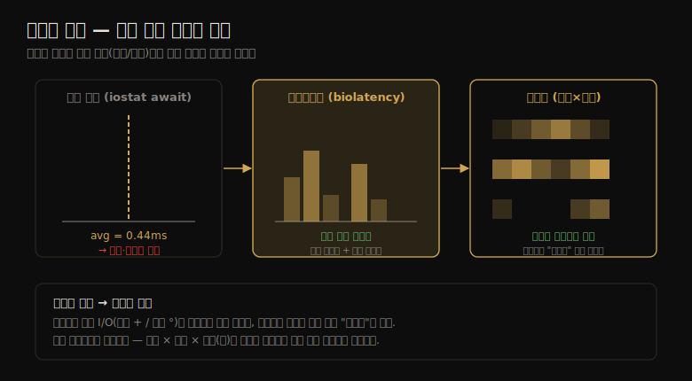

# 디스크 (3) — 방법론·시각화·실험·튜닝
---
> 이 노트는 9.5 방법론·9.7 시각화·9.8 실험·9.9 튜닝을 다룹니다. 디스크 성능을 *어떤 순서로 분석하고*(방법론 10종), *어떻게 그려 패턴을 보고*(시각화), *어떻게 부하를 걸어 재고*(실험), *어떤 손잡이를 돌리는가*(튜닝)를 잡습니다.

09-01·09-02가 개념·구조였다면 이 노트는 *행동* 입니다. 디스크가 병목이라는 신고가 들어왔을 때 무엇부터 보는지(방법론), 수많은 I/O 이벤트를 어떻게 한눈에 보는지(시각화), 가설을 어떻게 재현·측정하는지(실험), 원인을 찾았을 때 무엇을 바꾸는지(튜닝)의 순서입니다.

> 방법론 10종(USE·워크로드 특성화·지연 분석·마이크로벤치마킹·스케일링 등) → 시각화(라인·스캐터·히트맵) → 실험(dd·ioping·fio·blkreplay) → 튜닝(ionice·자원 제어·커널 튜너블) 순으로 갑니다.

## 1. 방법론 10종 — 무엇부터 보는가

> 디스크 분석 방법론은 10가지입니다. 저자 권장 순서는 USE → 성능 모니터링 → 워크로드 특성화 → 지연 분석 → 마이크로벤치마킹 → 정적 분석 → 이벤트 트레이싱입니다. 빠른 병목 식별에서 정밀 추적으로 좁혀 갑니다.

10가지 방법론을 목적별로 묶어 봅니다. 2장의 일반 방법론을 디스크에 적용한 것입니다.

| 방법론 | 무엇을 하나 | 유형 |
|--------|-----------|------|
| 도구 메서드 | 가용 도구를 차례로 훑으며 핵심 지표 점검 | 관측 |
| USE | 사용률·포화·에러로 병목·에러 조기 식별 | 관측 |
| 성능 모니터링 | 사용률·응답 시간을 시계열 추적 | 관측·용량계획 |
| 워크로드 특성화 | I/O율·처리량·크기·읽기쓰기비·랜덤/순차 파악 | 관측·용량계획 |
| 지연 분석 | 스택 층별로 지연 원인을 파고듦 | 관측 |
| 정적 성능 튜닝 | 구성·버전·하드웨어 점검 | 관측·용량계획 |
| 캐시 튜닝 | 캐시 점검·튜닝 | 관측·튜닝 |
| 자원 제어 | IOPS·처리량 제한·공유 | 튜닝 |
| 마이크로벤치마킹 | 합성 부하로 한 요소만 측정 | 실험 |
| 스케일링 | 용량 계획으로 디스크·컨트롤러 증설 산정 | 용량계획·튜닝 |

저자 권장 순서는 **USE → 성능 모니터링 → 워크로드 특성화 → 지연 분석 → 마이크로벤치마킹 → 정적 분석 → 이벤트 트레이싱** 입니다. USE로 병목·에러를 조기에 잡고(에러 먼저 — 중복 풀 탓에 디스크가 죽어도 느리게나마 돌아가 간과되기 쉬움), 모니터링·특성화로 부하를 그리고, 지연 분석으로 원인을 좁히고, 벤치마킹으로 검증합니다.

> 한 가지 함정 — **디스크 컨트롤러·전송 버스를 잊기 쉽습니다.** 보통 컨트롤러 용량이 디스크보다 커서 병목이 드물지만, 워크로드를 바꿔도 총 처리량·IOPS가 늘 같은 값에서 멈춘다면 컨트롤러·버스가 진짜 원인이라는 단서입니다. `iostat`이 컨트롤러별 지표를 안 줄 때는, 어느 디스크가 어느 컨트롤러에 속하는지 파악해 디스크 지표를 합산합니다.

## 2. 워크로드 특성화·지연 분석 — 원인 좁히기

> 워크로드 특성화는 I/O율·처리량·크기·읽기쓰기비·랜덤/순차로 부하를 그립니다. 지연 분석은 스택 층별로 지연을 재 어디서 생기는지 짚어, 같은 지연이 위아래로 같으면 디스크가, 한 층에서만 크면 그 층이 원인입니다.

**워크로드 특성화** 는 디스크 부하의 다섯 축을 묻습니다 — I/O율(IOPS)·처리량·I/O 크기·읽기/쓰기 비율·랜덤 vs 순차입니다. 초마다 크게 변하므로(특히 쓰기 플러시) 평균뿐 아니라 최댓값과 전체 분포를 잡습니다. 예시 기술:

> 시스템 디스크는 가벼운 랜덤 읽기 워크로드로, 평균 350 IOPS·처리량 3MB/s·읽기 96%다. 가끔 2~5초 순차 쓰기 버스트가 디스크를 최대 4,800 IOPS·560MB/s까지 몬다. 읽기는 약 8KB, 쓰기는 약 128KB다.

이 특성화는 가장 큰 성능 이득을 줄 수도 있습니다 — *불필요한 일* 을 식별해 제거하기 때문입니다. 심화 점검에선 "왜 디스크 I/O가 발행되는가(커널 콜 경로)", "어느 정도가 앱 동기인가", "I/O 도착 시간 분포는?"까지 묻습니다.

**지연 분석** 은 스택을 따라 내려가며 지연의 원천을 찾습니다. 핵심 판단:

- I/O의 지연이 앱~디스크 드라이버까지 *각 층에서 비슷* 하면 → 디스크(또는 드라이버)가 원인.
- 지연이 *파일 시스템 층에서 발생* 하고 아래 층은 작으면 → 그 층(락·큐잉)이 원인.

단, 층마다 I/O가 팽창/축소돼 크기·개수·지연이 다를 수 있습니다 — 아래 층에서 I/O 하나(10ms)만 보고 같은 파일 시스템 I/O를 위해 일어난 다른 관련 I/O(메타데이터 등)를 빠뜨릴 수 있습니다.

> 둘은 짝입니다 — 워크로드 특성화로 "어떤 부하인지" 그리고, 지연 분석으로 "그 부하가 어디서 막히는지" 짚습니다. 지연은 층별로 *구간 평균*(OS 도구)·*전체 분포*(히트맵)·*건당 값*(이벤트 트레이싱)으로 볼 수 있고, 뒤 둘이 이상치 추적과 I/O 분할/병합 식별에 유용합니다(3절 시각화·09-04 도구).

## 3. 시각화 — 수많은 I/O를 한눈에

> 라인 그래프는 IOPS·처리량·사용률의 시간 패턴을, 지연 스캐터 플롯은 건당 I/O 지연을, 지연 히트맵은 수백만 이벤트를 시간×지연×개수(색)로 보여 줍니다. 평균이 가리는 다봉·이상치를 시각화가 드러냅니다.

디스크 I/O는 이벤트가 많아 시각화가 특히 유용합니다. 평균·스캐터·히트맵이 같은 지연을 어떻게 다르게 보여 주는지를 한 장으로 정리하면 다음과 같습니다.

| 시각화 | 축 | 강점 |
|--------|-----|------|
| 라인 그래프 | 시간 × IOPS/처리량/사용률 | 시간 패턴(일간 부하 변화·플러시 주기) |
| 지연 스캐터 플롯 | 완료 시각 × 지연(점=건당) | 건당 이상치. 읽기/쓰기 구분 가능 |
| 지연 히트맵 | 시간 × 지연 × 개수(색) | 수백만 이벤트로 확장. 다봉·패턴 |
| 오프셋 히트맵 | 시간 × 블록 주소 × 개수(색) | 순차(짙은 선) vs 랜덤(옅은 구름) |
| 사용률 히트맵 | 시간 × 사용률% × 디스크 수(색) | 불균형·단일 hot 디스크(sloth) 식별 |

라인 그래프에선 *어떤 지표를 그리는가* 가 중요합니다 — 평균 지연은 다봉 분포·이상치를 가리고, 전 디스크 평균은 불균형(단일 디스크 이상치)을 가리며, 긴 구간 평균은 단기 변동을 가립니다.

**스캐터 플롯** 은 건당 I/O 지연을 점으로 찍어, 가령 "쓰기 버스트 뒤에 읽기 이상치(150ms+)가 나온다"는 패턴을 드러냅니다 — 쓰기가 되쓰기 캐시에서 빨리 돌아온 뒤 디스크 쓰기 뒤로 읽기가 큐잉됐기 때문입니다. 단 이벤트가 많아지면 점이 뭉쳐 "페인트"가 되므로, 그때는 **히트맵** 으로 넘어갑니다 — 시간×지연×개수(색)로 수백만 이벤트를 담습니다(저자가 발명, "프테로닥틸" 히트맵이 평균으로는 못 볼 정보를 보여 준 사례).

> 시각화의 공통 이점은 *평균이 가리는 것을 드러낸다* 는 점입니다. 디스크 지연은 본래 다봉(적중/미스)이고 이상치가 잦아, 단일 평균값은 거의 늘 진실을 덮습니다. 9장의 핵심 메시지 하나가 "평균 말고 분포를 보라"이고, 히트맵이 그 실현 도구입니다.

## 4. 실험 — 의도적으로 부하 걸기

> 실험은 dd(단순 순차)·ioping(가벼운 핑 스타일)·fio(유연한 설정)·blkreplay(캡처 재생)로 디스크에 직접 부하를 겁니다. 파일 시스템을 우회하려면 raw 장치나 direct I/O를 써 캐시·버퍼링을 피해야 디스크만 잽니다.

실험은 관측의 반대 손입니다(1장). 마이크로벤치마킹 시 `iostat`을 계속 띄워 결과를 즉시 교차 확인하고, 캐시를 피하려 "direct" 모드를 씁니다.

| 도구 | 성격 |
|------|------|
| dd | 단순 순차 처리량(`dd if=/dev/zero of=out bs=1M count=1000 oflag=direct`) |
| hdparm -Tt | 캐시 읽기(-T) vs 디스크 읽기(-t) — 적중/미스 격차 확인 |
| ioping | ping 스타일. 초당 4KB 읽기로 *가벼운* 부하(사용률 0.4%) — 운영 환경 디버깅에 적합 |
| fio | 유연한 IO 테스터. `--direct=true`로 비버퍼 I/O. 큐 깊이·랜덤성 세밀 설정 |
| blkreplay | blktrace로 캡처한 부하 재생 — 재현 어려운 이슈 디버깅 |

디스크만 재려면 *파일 시스템 우회* 가 핵심입니다 — raw 장치 경로(가능하면)나 direct I/O를 써 캐싱·버퍼링·I/O 분할/병합·오프셋 매핑 차이를 모두 피합니다. dd로 디스크 장치를 직접 읽으면 빠르지만 *쓰기 테스트는 MBR·파티션 테이블까지 파괴할 위험* 이 있어, 안전하게는 direct I/O + 파일 시스템 파일을 씁니다(파일 시스템 오버헤드 일부 포함).

**ioping** 이 특히 흥미롭습니다 — 다른 벤치마크가 디스크를 100%로 모는 것과 달리, 초당 4KB 읽기로 사용률 0.4%만 씁니다. 그래서 다른 마이크로벤치마크가 부적합한 *운영 환경* 에서 이슈를 디버깅할 수 있습니다.

> 실험의 함정은 8장과 같이 *캐시* 입니다 — 첫 실행(cold)과 둘째(warm)가 다릅니다. 디스크 성능을 재면 매 실행 전 캐시를 비우고(`/dev/raw` 또는 direct), 온디스크 캐시 적중을 재려면 "offset 0만" 반복해 캐시에 태웁니다(일부 펌웨어가 sector 0를 가속한다는 소문이 있어, sector 0 vs 다른 sector로 검증). blkreplay 재생은 대상 시스템이 바뀌었으면 오해를 부를 수 있습니다(12장).

## 5. 튜닝 — 어떤 손잡이를 돌리나

> 튜닝은 OS(ionice·cgroup blkio·스케줄러·큐 깊이·미리읽기)·디스크 장치(hdparm)·컨트롤러(벤더 설정) 세 층에서 합니다. 다만 기본값이 대개 합리적이라 거의 손댈 필요가 없고, 캐시 튜닝·스케일링·워크로드 특성화로 불필요한 일을 없애는 게 먼저입니다.

원인을 찾았으면 손잡이를 돌립니다. 단 *기본값이 대개 합리적* 이라 자주 바꿀 필요는 없습니다.

**OS 튜너블:**

- `ionice` — 프로세스의 I/O 스케줄링 클래스·우선순위 설정. real-time(1)·best-effort(2, 기본)·idle(3). 긴 백업 잡을 idle로 두면 운영 워크로드 방해↓ (`ionice -c 3 -p PID`).
- 자원 제어 — cgroup blkio로 프로세스(그룹)별 IOPS·처리량을 비례 가중 또는 고정 한도로(읽기/쓰기 독립).
- `/sys/block/*/queue/scheduler` — I/O 스케줄러 선택(09-02).
- `nr_requests` — 블록 층이 할당할 읽기/쓰기 요청 수.
- `read_ahead_kb` — 파일 시스템 미리읽기 최대 KB.

**디스크 장치 튜너블** 은 `hdparm`(전원 관리·스핀다운). 일부 옵션은 "DANGEROUS" 표시 — 데이터 손실 위험이라 매뉴얼을 꼭 읽습니다.

**컨트롤러 튜너블** 은 모델·벤더 의존(MegaCli로 본 PERC 카드의 Rebuild Rate·Cache Flush Interval·Patrol Read Rate 등). 각자 벤더 문서에 설명됩니다.

**스케일링** 은 한계를 넘어 더 필요할 때입니다 — 목표 처리량·IOPS 산정 → 필요 디스크 수 계산(RAID 반영, 100%가 아닌 목표 사용률 50%로 스케일) → 컨트롤러 수 → 전송 한계 → CPU 사이클/디스크 I/O 순으로. "Add more spindles"가 이제 "Add more flash"가 됐습니다.

> 튜닝의 원칙은 8장과 같습니다 — *측정 → 한 번에 하나 → 재측정*, 그리고 *튜닝보다 불필요한 일 제거가 먼저* 입니다. 캐시 튜닝·스케일링·워크로드 특성화로 일 자체를 줄이는 게 튜너블 조정보다 큰 이득을 줍니다. 튜너블은 마지막에, 기본값이 워크로드에 안 맞을 때만 손댑니다.

## 학습 점검

> 이 노트의 핵심을 스스로 떠올려 봅니다. 답이 막히면 해당 섹션으로 돌아가 확인합니다.

- 저자 권장 디스크 분석 순서를 떠올리고, 디스크 컨트롤러·버스가 진짜 병목이라는 단서가 무엇인지 설명해 봅니다. (→ §1)
- 지연 분석에서 같은 지연이 위아래 층에 비슷할 때와 한 층에서만 클 때, 각각 원인이 어디인지 말해 봅니다. (→ §2)
- 스캐터 플롯이 페인트가 될 때 히트맵으로 넘어가는 까닭과, 히트맵이 평균보다 나은 점을 설명해 봅니다. (→ §3)
- ioping이 다른 벤치마크와 달리 운영 환경에 적합한 까닭을 떠올려 봅니다. (→ §4)
- 튜너블 조정보다 캐시 튜닝·워크로드 특성화가 먼저인 까닭을 설명해 봅니다. (→ §5)