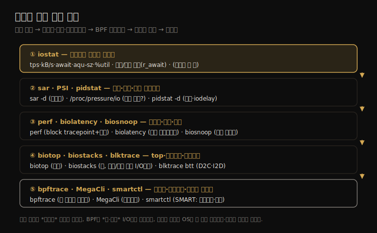

# 디스크 (4) — 관측 도구
---
> 이 노트는 9장의 마지막으로, 09-03의 방법론을 손에 든 연장으로 옮깁니다. 전통 통계(iostat·sar·PSI·pidstat)에서 시작해 BPF 트레이싱(biolatency·biosnoop·biotop·biostacks)·blktrace·bpftrace, 그리고 컨트롤러·디스크 펌웨어 도구(MegaCli·smartctl)까지 봅니다.

도구는 09-02의 블록 I/O 스택을 따라 배치됩니다. iostat으로 디스크별 통계를 보고, biolatency로 지연을 히스토그램으로, biosnoop으로 건당 I/O를, biostacks로 I/O를 유발한 커널 스택을 봅니다. 전통 통계에서 BPF 이벤트 트레이싱으로 깊어지는 흐름입니다.

> iostat이 출발점이자 가장 중요한 도구입니다. BPF 기반 도구(biolatency·biosnoop·biotop·biostacks)는 04-02의 이벤트 소스(block tracepoint·kprobe) 위에 서며 15장에서 깊어집니다. 디스크 캐시는 파일 시스템(08-04)과 한 몸이라 vmstat·swapon은 양쪽에서 봅니다.


## 1. iostat — 디스크별 통계의 출발점

> iostat은 디스크별 I/O 통계(IOPS·처리량·사용률·응답 시간)를 보여 주는, 디스크 분석의 첫 명령입니다. `-x`(확장)·`-s`(80자 폭)·`-z`(무활동 생략)로 워크로드 특성화·USE·지연 분석에 필요한 컬럼을 한 번에 봅니다.

iostat은 디스크별 I/O 통계를 요약해 워크로드 특성화·사용률·포화 지표를 줍니다. 커널이 기본으로 통계를 켜 둬 오버헤드가 무시할 수준이라, 누구나 첫 명령으로 씁니다(이름은 "I/O 통계"지만 *디스크* I/O라, 파일 시스템 I/O를 찾던 사용자가 안 보여 헷갈리기도 함).

디스크 관측 도구가 어떤 흐름으로 깊어지는지를 한 장으로 정리하면 다음과 같습니다.



확장(`-x`) 출력의 핵심 컬럼입니다(`-sxz`로 좁게).

| 컬럼 | 의미 |
|------|------|
| tps | 초당 트랜잭션(IOPS) |
| kB/s | 초당 KB(처리량) |
| rqm/s | 초당 큐잉·병합된 요청(순차 워크로드 신호) |
| await | 평균 I/O 응답 시간(OS 큐 대기 + 장치 응답, ms) |
| aqu-sz | 평균 요청 수(드라이버 큐 대기 + 장치 활성) |
| areq-sz | 평균 요청 크기(KB) |
| %util | 디스크가 I/O를 처리하느라 바빴던 시간 비율(사용률) |

가장 중요한 지표는 **await**(전달 성능)입니다. 큐잉(부하)·큰 I/O 크기·회전 디스크 랜덤 I/O·장치 에러로 커집니다. **%util** 은 용량 계획에 중요하지만 *busyness 측정일 뿐* 이라 여러 디스크로 받친 가상 장치엔 의미가 약합니다(09-01) — 그런 장치는 tps·kB/s로 봅니다.

`-x`(짧은 `-s` 없이)는 읽기/쓰기를 분리합니다(`r/s`·`w/s`·`r_await`·`w_await`·discard·flush). **읽기/쓰기 분리가 중요** 합니다 — 앱은 되쓰기 캐시로 쓰기 지연을 가리므로, 읽기·쓰기를 묶은 지표는 직접 안 중요한 쓰기에 왜곡됩니다. 분리하면 `r_await`(읽기 지연)를 보는데, 이게 앱 성능에 가장 중요할 때가 많습니다.

> iostat의 한계는 *디스크 에러를 안 준다* 는 점입니다(있었으면 USE 지표를 한 도구로 다 볼 수 있었음). `rqm/s`가 0 아니면 인접 요청이 병합됐다는 뜻(순차 신호)이고, `areq-sz`가 작으면(8KB 이하) 병합 안 된 랜덤 워크로드 지표입니다. 이상치는 다음 도구(biolatency·biosnoop)로 파고듭니다.


## 2. sar·PSI·pidstat — 시계열·압박·프로세스별

> sar -d는 iostat과 같은 디스크 지표를 시계열·아카이브로, PSI(/proc/pressure/io)는 I/O 포화의 시간 변화를, pidstat -d는 프로세스별 디스크 I/O와 블록된 시간(iodelay)을 봅니다. 큰 그림과 "누가 I/O를 만드나"를 잡습니다.

iostat이 현재 스냅숏이라면, 이 셋은 시계열·압박·프로세스별을 채웁니다.

**sar -d** 는 iostat `-x`와 같은 컬럼(tps·await·aqu-sz·%util 등)을 시계열로 보여 주고 아카이브합니다(04-03). 옛 `svctm`(추론 서비스 시간)은 병렬 I/O에서 부정확해져 제거됐습니다.

**PSI**(`/proc/pressure/io`)는 I/O 포화의 *시간 변화* 를 보여 줍니다 — `some`(일부 task stall)·`full`(모든 task stall)의 10·60·300초 평균(%). 10초 평균이 300초보다 높으면 압박이 *증가 중* 입니다. load average처럼 고수준 알림 지표로 쓰고, 인지 후 다른 도구로 근본 원인을 찾습니다.

**pidstat -d** 는 프로세스별 디스크 I/O를 봅니다.

| 컬럼 | 의미 |
|------|------|
| kB_rd/s | 초당 읽기 KB |
| kB_wr/s | 초당 쓰기 발행 KB |
| kB_ccwr/s | 초당 쓰기 취소 KB(플러시 전 덮어쓰기·삭제) |
| iodelay | 프로세스가 디스크 I/O에 블록된 시간(clock tick, 스와핑 포함) |

예를 들어 `tar`(읽기)는 iodelay가 있고 `gzip`(쓰기)은 되쓰기 캐시 덕에 iodelay가 없다가, 나중에 page cache 플러시 때 kworker가 iodelay를 겪습니다. **iodelay** 가 성능 문제의 크기 — 앱이 얼마나 기다렸는가 — 를 보여 줍니다.

> 세 도구의 자리가 다릅니다 — sar는 *추세*(시간에 따른 변화), PSI는 *압박 알림*(증가 중인가), pidstat은 *원인 프로세스*(누가·얼마나)입니다. PSI로 압박을 인지하고, pidstat으로 범인을 좁히고, 다음 절 perf·BPF로 그 I/O의 콜 경로·지연을 봅니다(프로세스가 자기 것이 아니면 root만 `/proc/PID/io` 접근).


## 3. perf·biolatency·biosnoop — 트레이스·히스토그램·건당

> perf는 block tracepoint(block_rq_issue 등)를 스택과 함께 기록해 I/O를 유발한 콜 경로를 봅니다. biolatency는 디스크 I/O 지연을 히스토그램(다봉 식별)으로, biosnoop은 건당 I/O를 한 줄씩(이상치 추적) 보여 줍니다.

이상치·콜 경로를 BPF로 낮은 오버헤드로 파고듭니다.

**perf** 는 block tracepoint를 기록합니다 — `block_rq_issue`(장치 발행)·`block_rq_complete`(완료)·`block_rq_insert`(큐 삽입) 등. `-g`로 스택을 함께 떠, 어떤 콜 경로가 I/O를 냈는지 봅니다(예: mysqld의 `log_flusher`→`fsync`→ext4→blk-mq). 큐잉 후 커널 스레드가 발행하면 `block_rq_issue`엔 원 프로세스가 안 보이니, `block_rq_insert`(삽입)로 바꿔 잡습니다(단 큐잉 우회 I/O는 놓침). `block_rq_complete`에 필터(`nr_sector > 200`·`rwbs == "WS"`)를 걸어 특정 I/O만 추적할 수 있습니다.

**biolatency**(BCC/bpftrace)는 디스크 I/O 지연을 히스토그램으로 보여 줍니다(발행~완료 = 디스크 요청 시간).

```
       128 -> 255   : 1065  |*****************       |
       256 -> 511   : 2462  |****************************************|
      2048 -> 4095  : 1815  |*****************************           |
```

이 *이봉(bi-modal)* 분포 — 256~1023μs와 2048~4095μs — 가 디스크가 두 종류 지연을 돌려준다는 09-01의 실증입니다. `-F`(I/O 플래그별)로 쪼개면 ReadAhead-Read는 빠르고 NoMerge-Write는 느린 식으로 봉우리의 정체가 드러납니다. `-Q`로 OS 큐 시간 포함(블록 I/O 요청 시간), `-m`으로 ms, `-D`로 디스크별.

**biosnoop**(BCC/bpftrace)은 건당 I/O를 한 줄씩 — TIME·COMM·PID·DISK·T(R/W)·SECTOR·BYTES·LAT(ms) — 보여 줍니다. 가령 262,144B 쓰기들이 1.82ms에서 시작해 4.03ms로 점증하면, `TIME - LAT`가 거의 같아 *동시 발행 → 장치 큐잉 → 순차 완료* 임을 알 수 있습니다. 출력을 지연순 정렬해 이상치를 찾고, 그 완료 시각 앞뒤 이벤트를 봐 큐잉인지 다른 요인(VM이면 하이퍼바이저 디스케줄)인지 가립니다. `-Q`로 생성~발행(OS 큐) 시간(QUE)도 봅니다.

> 세 도구가 보완합니다 — perf는 *왜*(콜 경로), biolatency는 *얼마나 퍼져*(분포·다봉), biosnoop은 *어떤*(건당 이상치)입니다. 디스크 지연은 본래 다봉이라(09-01·09-03), 평균 도구(iostat await)가 못 잡는 두 봉우리·꼬리를 이 도구들이 짚어 "평균은 0.44ms인데 가끔 64ms"의 진짜 원인을 드러냅니다.


## 4. biotop·biostacks·blktrace — top·유발 스택·저수준 추적

> biotop은 top처럼 디스크 I/O 많은 프로세스를, biostacks는 I/O를 유발한 초기화 스택을(읽기/쓰기 아닌 I/O의 정체까지), blktrace는 한 I/O의 여러 단계 이벤트(D2C·I2D 구간 분해)를 봅니다.

**biotop**(BCC)은 디스크용 top입니다 — PID·COMM·D(R/W)·DISK·I/O·Kbytes·AVGms로 누가 얼마나 디스크 I/O를 하는지 한눈에. 단 발행 시점엔 원 프로세스가 CPU에 없을 수 있어 PID·COMM은 best-effort입니다. (Linux `iotop`도 있지만 쓰기를 크게 과소 계상한다고 저자가 경고 — biotop은 다른 계측원이라 정확.)

**biostacks**(bpftrace)는 블록 I/O 요청 시간(OS enqueue~완료)을 *I/O를 유발한 초기화 스택* 과 함께 봅니다. 예를 들어 `access(2)`→`filename_lookup`→`ext4_lookup` 스택이 보이면, 그 I/O가 읽기/쓰기가 아니라 *경로 권한 확인의 디렉터리 조회* 였음을 압니다. "앱이 안 시켰는데 디스크 I/O가 난다"의 정체(예: ZFS 백그라운드 스크러버)를 커널 스택으로 잡습니다.

**blktrace**(blkparse·btrace·btt)는 블록 I/O 이벤트를 저수준으로 — 한 I/O당 여러 단계(A=remap·Q=큐 진입·G=get request·I=삽입·D=드라이버 발행·C=완료) — 추적합니다. `rwbs` 문자열(R·W·M=메타데이터·S=동기·A=read-ahead·F=flush·D=discard)로 I/O 유형을 기술합니다. `btt`로 분석하면 구간 통계가 나옵니다.

| btt 지표 | 구간 |
|----------|------|
| Q2C | 요청~완료 전체(블록 층 시간) |
| D2C | 장치 발행~완료(디스크 I/O 지연) |
| I2D | 큐 삽입~장치 발행(요청 큐 시간) |
| M2D | 병합~발행 |

> 이 도구들은 깊이가 다릅니다 — biotop은 *조망*(누가), biostacks는 *유발 원인*(왜, 읽기/쓰기 아닌 I/O까지), blktrace는 *단계 분해*(어느 구간에서 시간을 쓰나)입니다. D2C 평균은 정상인데 I2D나 M2D가 크면 디스크가 아니라 *커널 큐·병합* 이 지연원이라는, iostat·biolatency로는 못 보는 분해를 줍니다.


## 5. bpftrace·MegaCli·smartctl — 커스텀·컨트롤러·디스크 펌웨어

> bpftrace는 block tracepoint에 한 줄 프로그램을 걸어 I/O 크기·지연·에러·SCSI opcode를 원하는 대로 집계합니다. MegaCli는 컨트롤러 이벤트·설정을, smartctl은 디스크 SMART 데이터(에러·온도·수명)를 봅니다.

기성 도구로 부족하면 bpftrace로 직접 질문을 짭니다(15장).

```
# I/O 크기를 프로세스별 히스토그램으로
bpftrace -e 't:block:block_rq_issue /args->bytes/ { @[comm] = hist(args->bytes); }'
# I/O 에러를 장치·유형과 함께
bpftrace -e 't:block:block_rq_complete /args->error/ {
  printf("dev %d type %s error %d\n", args->dev, args->rwbs, args->error); }'
```

biolatency.bt가 지연을 재는 방식이 8장과 다른 점이 교훈적입니다 — 디스크 완료 인터럽트는 *발행과 다른* CPU·스레드에서 일어나므로, 스레드 ID 대신 *장치+섹터 번호* 를 고유 키로 시작 타임스탬프를 저장합니다(한 섹터에 동시 I/O 하나라는 가정).

**MegaCli** 는 LSI 컨트롤러 이벤트·설정을 봅니다 — patrol read 시작/완료, 어댑터·디스크·배터리·물리 에러 정보. OS·동적 트레이서로도 컨트롤러 내부는 직접 못 보므로, 입출력을 관찰해 추론합니다.

**smartctl** 은 디스크 SMART 데이터(자가 모니터링)를 봅니다 — 온도·전원 인가 시간·ECC 정정 에러·grown defect 목록·셀프 테스트 로그. 개별 느린 I/O를 짚을 해상도는 없지만, *정정 에러 추세* 가 디스크 고장 예측·확인에 유용합니다. 그 밖에 Linux SCSI logging(`/proc/sys/dev/scsi/logging_level`)으로 SCSI 이벤트를 로깅할 수 있습니다(워크로드에 따라 syslog 폭주 주의).

> bpftrace는 "마지막 수단이자 만능 줄자"입니다(8장과 같음) — 기성 도구가 답하는 건 그 도구로(빠르고 검증됨), 못 답하는 것만 bpftrace로. MegaCli·smartctl은 *OS가 못 보는 영역*(컨트롤러·디스크 펌웨어 내부)을 펌웨어 통계로 메우지만, 개별 I/O 지연 같은 정밀 질문엔 커널 트레이싱 프레임워크가 필요합니다 — 둘은 보는 층이 다릅니다.


## 학습 점검

> 이 노트의 핵심을 스스로 떠올려 봅니다. 답이 막히면 해당 섹션으로 돌아가 확인합니다.

- iostat에서 await와 %util이 각각 무엇을 보여 주며, 읽기/쓰기를 분리해야 하는 까닭을 설명해 봅니다. (→ §1)
- sar·PSI·pidstat이 각각 무엇(추세·압박·원인 프로세스)을 채우는지, iodelay가 무엇을 보여 주는지 떠올려 봅니다. (→ §2)
- biolatency의 이봉 분포가 09-01의 무엇을 실증하는지, perf에서 block_rq_issue 대신 block_rq_insert를 쓰는 경우를 설명해 봅니다. (→ §3)
- biostacks가 "앱이 안 시킨 디스크 I/O"의 정체를 어떻게 밝히는지, btt의 D2C와 I2D 차이를 말해 봅니다. (→ §4)
- biolatency.bt가 스레드 ID 대신 장치+섹터를 키로 쓰는 까닭과, smartctl이 못 하는 일을 떠올려 봅니다. (→ §5)