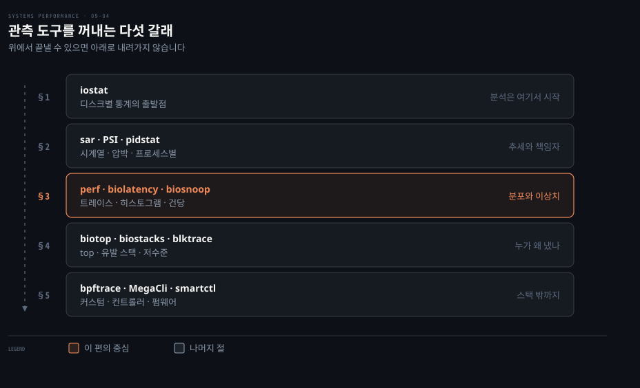
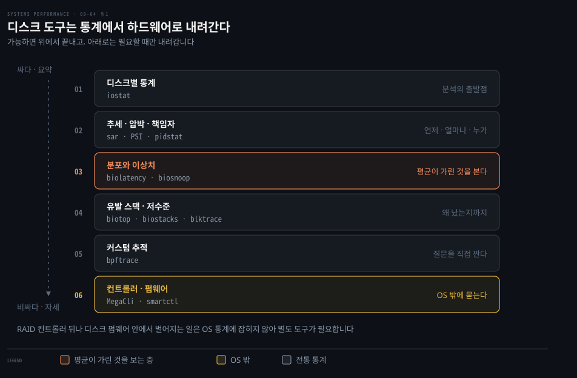

# 디스크 (4) — 관측 도구
---
> 이 노트는 9장의 마지막으로, 09-03의 방법론을 손에 든 연장으로 옮깁니다. 전통 통계(iostat·sar·PSI·pidstat)에서 시작해 BPF 트레이싱(biolatency·biosnoop·biotop·biostacks)·blktrace·bpftrace, 그리고 컨트롤러·디스크 펌웨어 도구(MegaCli·smartctl)까지 봅니다.

## 핵심 요약

> 이 편이 매달린 하나의 생각은 **도구를 고르는 일은 09-02의 블록 I/O 스택 어느 높이에서 볼지를 고르는 일이라는 것**입니다.

도구는 그 스택을 따라 배치됩니다. iostat으로 디스크별 통계를 보고, biolatency로 지연을 히스토그램으로, biosnoop으로 건당 I/O를, biostacks로 I/O를 유발한 커널 스택을 봅니다.

이 순서가 곧 비용 순서이기도 합니다. 위쪽 통계 도구는 커널이 이미 세어 둔 값을 읽지만, 아래로 갈수록 이벤트마다 일을 더 해야 합니다.

그래서 실무의 기본기는 위에서 끝내는 것입니다. iostat이 출발점이자 가장 중요한 도구인 이유가 여기 있습니다. 다만 09-01에서 봤듯 평균은 두 봉우리를 가리므로, iostat이 이상하지 않다고 해서 문제가 없는 것은 아닙니다.


## 학습 목표

> 이 편을 덮은 뒤 스스로 할 수 있어야 하는 일을 먼저 적어 둡니다.

- iostat의 주요 컬럼 중 무엇을 먼저 보는지 답하고 그 까닭을 댑니다.
- sar·PSI·pidstat이 각각 무엇을 더해 주는지 구분합니다.
- biolatency가 iostat 평균으로는 못 보는 무엇을 보여 주는지 설명합니다.
- biostacks가 "왜 이 I/O가 났나"에 어떻게 답하는지 말합니다.
- OS 통계로는 안 보이는 것을 어떤 도구로 보는지 답합니다.



전통 통계에서 BPF 이벤트 트레이싱으로, 마지막에 컨트롤러·펌웨어까지 내려갑니다.


## 이 문서가 다루지 않는 것

> 앞 편으로 넘긴 주제를 밝혀 둡니다.

- **개념·아키텍처·방법론** — 09-01~09-03이 다룹니다. 여기서는 그 방법론에 붙는 연장만 봅니다.
- **BPF·bpftrace 자체의 문법** — 15장이 다룹니다.
- **파일 시스템 층 도구** — 08-04가 다룹니다. 디스크 캐시는 파일 시스템과 한 몸이라 `vmstat`·`swapon`은 양쪽에서 봅니다.


## 1. iostat — 디스크별 통계의 출발점

> iostat은 디스크별 I/O 통계(IOPS·처리량·사용률·응답 시간)를 보여 주는, 디스크 분석의 첫 명령입니다. `-x`(확장)·`-s`(80자 폭)·`-z`(무활동 생략)로 워크로드 특성화·USE·지연 분석에 필요한 컬럼을 한 번에 봅니다.



iostat은 디스크별 I/O 통계를 요약해 워크로드 특성화·사용률·포화 지표를 줍니다. 커널이 기본으로 통계를 켜 두어 오버헤드가 무시할 수준이라 누구나 첫 명령으로 씁니다. 이름은 "I/O 통계"지만 실제로는 *디스크* I/O라, 파일 시스템 I/O를 찾던 사용자가 헷갈리기도 합니다.

확장(`-x`) 출력의 핵심 컬럼입니다(`-sxz`로 좁게).

| 컬럼 | 의미 |
|------|------|
| tps | 초당 트랜잭션(IOPS) |
| kB/s | 초당 KB(처리량) |
| rqm/s | 초당 큐잉·병합된 요청(순차 워크로드 신호) |
| await | 평균 I/O 응답 시간(OS 큐 대기 + 장치 응답, ms) |
| aqu-sz | 평균 요청 수(드라이버 큐 대기 + 장치 활성) |
| areq-sz | 평균 요청 크기(KB) |
| %util | 디스크가 I/O를 처리하느라 바빴던 시간 비율(사용률) |

가장 중요한 지표는 **await** 입니다. 앱이 체감하는 전달 성능이 여기 담깁니다. 커지는 원인은 넷입니다. 부하로 인한 큐잉, 큰 I/O 크기, 회전 디스크의 랜덤 I/O, 그리고 장치 에러입니다.

**%util** 은 용량 계획에 중요하지만 *busyness 측정일 뿐* 입니다. 여러 디스크로 받친 가상 장치에서는 의미가 약합니다(09-01). 그런 장치는 tps와 kB/s로 봅니다.

`-x` 를 `-s` 없이 쓰면 읽기와 쓰기가 분리됩니다. `r/s`·`w/s`·`r_await`·`w_await` 에 discard와 flush까지 나옵니다.

**이 분리가 중요합니다.** 앱은 되쓰기 캐시로 쓰기 지연을 가립니다. 그래서 읽기와 쓰기를 묶은 지표는 정작 앱에 직접 중요하지 않은 쓰기 쪽으로 왜곡됩니다. 분리하면 `r_await` 를 볼 수 있는데, 앱 성능에는 이 값이 가장 중요한 경우가 많습니다.

> iostat의 한계는 *디스크 에러를 안 준다* 는 점입니다(있었으면 USE 지표를 한 도구로 다 볼 수 있었음). `rqm/s`가 0 아니면 인접 요청이 병합됐다는 뜻(순차 신호)이고, `areq-sz`가 작으면(8KB 이하) 병합 안 된 랜덤 워크로드 지표입니다. 이상치는 다음 도구(biolatency·biosnoop)로 파고듭니다.


## 2. sar·PSI·pidstat — 시계열·압박·프로세스별

> sar -d는 iostat과 같은 디스크 지표를 시계열·아카이브로, PSI(/proc/pressure/io)는 I/O 포화의 시간 변화를, pidstat -d는 프로세스별 디스크 I/O와 블록된 시간(iodelay)을 봅니다. 큰 그림과 "누가 I/O를 만드나"를 잡습니다.

iostat이 현재 스냅숏이라면, 이 셋은 시계열·압박·프로세스별을 채웁니다.

**sar -d** 는 iostat `-x` 와 같은 컬럼을 시계열로 보여 주고 아카이브합니다(04-03). tps·await·aqu-sz·%util 같은 값들입니다. 옛 `svctm` 은 서비스 시간을 추론한 값이었는데, 병렬 I/O에서 부정확해져 제거됐습니다.

**PSI** 는 `/proc/pressure/io` 로 I/O 포화의 *시간 변화* 를 보여 줍니다. `some` 은 하나 이상의 task 가 막혀 있던 *시간* 의 비율, `full` 은 놀고 있지 않은(non-idle) task 가 *동시에 모두* 막혀 있던 시간의 비율이고, 각각 10·60·300초 평균이 나옵니다. 둘 다 task 수의 비율이 아니라 시간의 비율이라는 점이 헷갈리기 쉽습니다.

10초 평균이 300초 평균보다 높으면 압박이 *증가 중* 이라는 뜻입니다. load average처럼 고수준 알림 지표로 쓰고, 인지한 뒤 다른 도구로 근본 원인을 찾습니다.

**pidstat -d** 는 프로세스별 디스크 I/O를 봅니다.

| 컬럼 | 의미 |
|------|------|
| kB_rd/s | 초당 읽기 KB |
| kB_wr/s | 초당 쓰기 발행 KB |
| kB_ccwr/s | 초당 쓰기 취소 KB(플러시 전 덮어쓰기·삭제) |
| iodelay | 프로세스가 디스크 I/O에 블록된 시간(clock tick, 스와핑 포함) |

예를 들어 읽기를 하는 `tar` 는 iodelay가 잡힙니다. 쓰기를 하는 `gzip` 은 되쓰기 캐시 덕에 iodelay가 없다가, 나중에 page cache를 플러시할 때 kworker가 대신 iodelay를 겪습니다.

**iodelay** 가 보여 주는 것은 성능 문제의 크기입니다. 앱이 실제로 얼마나 기다렸는지가 이 값에 담깁니다.

> **갱신 (2026-09)**: 이 값은 커널의 delay accounting 에서 옵니다. 그런데 그 기능은 `CONFIG_TASK_DELAY_ACCT`·`CONFIG_TASKSTATS` 로 빌드돼 있어도 **부팅 시 기본으로 꺼져 있습니다** — `delayacct` 부트 옵션이나 `sysctl kernel.task_delayacct` 로 켜야 하고, 켠 *뒤에* 시작된 프로세스만 값이 잡힙니다. 그래서 iodelay 가 0이라고 해서 기다림이 없었다고 단정할 수 없습니다 — 먼저 계정이 켜져 있는지 확인합니다.

> 세 도구의 자리가 다릅니다 — sar는 *추세*(시간에 따른 변화), PSI는 *압박 알림*(증가 중인가), pidstat은 *원인 프로세스*(누가·얼마나)입니다. PSI로 압박을 인지하고, pidstat으로 범인을 좁히고, 다음 절 perf·BPF로 그 I/O의 콜 경로·지연을 봅니다(프로세스가 자기 것이 아니면 root만 `/proc/PID/io` 접근).


## 3. perf·biolatency·biosnoop — 트레이스·히스토그램·건당

> perf는 block tracepoint(block_rq_issue 등)를 스택과 함께 기록해 I/O를 유발한 콜 경로를 봅니다. biolatency는 디스크 I/O 지연을 히스토그램(다봉 식별)으로, biosnoop은 건당 I/O를 한 줄씩(이상치 추적) 보여 줍니다.

이상치·콜 경로를 BPF로 낮은 오버헤드로 파고듭니다.

**perf** 는 block tracepoint를 기록합니다.

| tracepoint | 시점 |
|------------|------|
| `block_rq_insert` | 큐 삽입 |
| `block_rq_issue` | 장치 발행 |
| `block_rq_complete` | 완료 |

`-g` 로 스택을 함께 뜨면 어떤 콜 경로가 I/O를 냈는지 보입니다. mysqld의 `log_flusher` → `fsync` → ext4 → blk-mq 같은 경로가 그대로 드러납니다.

한 가지 주의할 점이 있습니다. 큐잉된 뒤 커널 스레드가 발행하면 `block_rq_issue` 에는 원 프로세스가 보이지 않습니다. 그때는 `block_rq_insert` 로 바꿔 잡습니다. 다만 큐잉을 우회하는 I/O는 놓칩니다.

`block_rq_complete` 에 필터를 걸어 특정 I/O만 추적할 수도 있습니다. `nr_sector > 200` 이나 `rwbs == "WS"` 같은 조건입니다.

**biolatency**(BCC/bpftrace)는 디스크 I/O 지연을 히스토그램으로 보여 줍니다(발행~완료 = 디스크 요청 시간).

```bash
       128 -> 255   : 1065  |*****************       |
       256 -> 511   : 2462  |****************************************|
      2048 -> 4095  : 1815  |*****************************           |
```

이 *이봉* 분포가 09-01에서 말한 "한 디스크가 두 종류 지연을 돌려준다"의 실증입니다. 봉우리가 128~1023μs와 2048~4095μs에 하나씩 섰습니다.

`-F` 로 I/O 플래그별로 쪼개면 봉우리의 정체가 드러납니다. ReadAhead-Read는 빠르고 NoMerge-Write는 느린 식입니다. 이 밖에 `-Q` 는 OS 큐 시간까지 포함해 블록 I/O 요청 시간을 보고, `-m` 은 밀리초 단위로, `-D` 는 디스크별로 나눠 줍니다.

**biosnoop** 은 BCC와 bpftrace 양쪽에 있고, 건당 I/O를 한 줄씩 보여 줍니다. 컬럼은 TIME·COMM·PID·DISK·T(R/W)·SECTOR·BYTES·LAT입니다.

읽는 법을 예로 들면 이렇습니다. 262,144바이트 쓰기들의 지연이 1.82ms에서 시작해 4.03ms로 점점 커진다고 해 봅시다. `TIME` 에서 `LAT` 를 빼면 그 I/O가 시작된 시각이 나오는데, 그 값들이 서로 가깝다면 비슷한 때에 시작됐다는 뜻입니다. *동시에 발행돼 장치 큐에 쌓였다가 순서대로 완료* 된 것으로 보입니다.

실무에서는 출력을 지연순으로 정렬해 이상치를 찾습니다. 그다음 그 완료 시각 앞뒤 이벤트를 보고 큐잉 탓인지 다른 요인 탓인지 가립니다. VM이라면 하이퍼바이저 디스케줄일 수도 있습니다. `-Q` 를 붙이면 생성부터 발행까지의 OS 큐 시간도 QUE 컬럼으로 나옵니다.

> 세 도구가 보완합니다 — perf는 *왜*(콜 경로), biolatency는 *얼마나 퍼져*(분포·다봉), biosnoop은 *어떤*(건당 이상치)입니다. 디스크 지연은 본래 다봉이라(09-01·09-03), 평균 도구(iostat await)가 못 잡는 두 봉우리·꼬리를 이 도구들이 짚어 "평균은 0.44ms인데 가끔 64ms"의 진짜 원인을 드러냅니다.


## 4. biotop·biostacks·blktrace — top·유발 스택·저수준 추적

> biotop은 top처럼 디스크 I/O 많은 프로세스를, biostacks는 I/O를 유발한 초기화 스택을(읽기/쓰기 아닌 I/O의 정체까지), blktrace는 한 I/O의 여러 단계 이벤트(D2C·I2D 구간 분해)를 봅니다.

**biotop** 은 디스크용 top입니다. PID·COMM·D(R/W)·DISK·I/O·Kbytes·AVGms로 누가 얼마나 디스크 I/O를 하는지 한눈에 보여 줍니다.

다만 PID와 COMM은 best-effort입니다. 발행 시점에 원 프로세스가 CPU에 없을 수 있기 때문입니다.

Linux에는 커널 accounting 통계를 쓰는 `iotop` 도 있습니다. 다만 0.6 버전으로 시험한 결과 쓰기 워크로드를 크게 과소 계상했다는 보고가 있으니, 알려진 워크로드로 숫자가 맞는지 먼저 확인해 보는 편이 좋습니다. biotop은 계측원이 달라 같은 시험에서 값이 맞았습니다.

**biostacks** 는 블록 I/O 요청 시간을 *그 I/O를 유발한 초기화 스택* 과 함께 봅니다. OS 큐 진입부터 완료까지가 그 구간입니다.

예를 들어 `access(2)` → `filename_lookup` → `ext4_lookup` 스택이 보인다면, 그 I/O는 읽기나 쓰기가 아니라 *경로 권한을 확인하려는 디렉터리 조회* 였다는 뜻입니다.

"앱이 시키지도 않았는데 디스크 I/O가 난다"는 상황의 정체를 이렇게 커널 스택으로 잡습니다. ZFS 백그라운드 스크러버 같은 것이 그런 경우입니다.

**blktrace** 는 블록 I/O 이벤트를 저수준으로 추적합니다. `blkparse`·`btrace`·`btt` 가 딸린 도구 묶음입니다. 한 I/O가 여러 단계로 찍힙니다.

아래는 자주 보는 것만 추린 것이고, 원래는 14종입니다.

| 문자 | 단계 |
|------|------|
| A | 다른 장치로 재매핑 |
| Q | 요청 큐 코드가 넘겨받음 |
| G | get request |
| I | 요청 큐에 삽입 |
| M · F | 뒤쪽 병합 · 앞쪽 병합 |
| P · U | plug · unplug |
| D | 드라이버로 발행 |
| C | 완료 |

I/O 유형은 `rwbs` 문자열로 기술합니다. R과 W 외에 M은 메타데이터, S는 동기, A는 read-ahead, F는 flush 또는 force unit access, D는 discard, E는 erase, N은 해당 없음입니다. 이 문자들은 조합할 수 있어서 `WM` 처럼 붙여 씁니다. `btt` 로 분석하면 구간별 통계가 나옵니다.

| btt 지표 | 구간 |
|----------|------|
| Q2C | 요청~완료 전체(블록 층 시간) |
| D2C | 장치 발행~완료(디스크 I/O 지연) |
| I2D | 큐 삽입~장치 발행(요청 큐 시간) |
| M2D | 병합~발행 |

> 이 도구들은 깊이가 다릅니다 — biotop은 *조망*(누가), biostacks는 *유발 원인*(왜, 읽기/쓰기 아닌 I/O까지), blktrace는 *단계 분해*(어느 구간에서 시간을 쓰나)입니다. D2C 평균은 정상인데 I2D나 M2D가 크면 디스크가 아니라 *커널 큐·병합* 이 지연원이라는, iostat·biolatency로는 못 보는 분해를 줍니다.


## 5. bpftrace·MegaCli·smartctl — 커스텀·컨트롤러·디스크 펌웨어

> bpftrace는 block tracepoint에 한 줄 프로그램을 걸어 I/O 크기·지연·에러·SCSI opcode를 원하는 대로 집계합니다. MegaCli는 컨트롤러 이벤트·설정을, smartctl은 디스크 SMART 데이터(에러·온도·수명)를 봅니다.

기성 도구로 부족하면 bpftrace로 직접 질문을 짭니다(15장).

```bash
# I/O 크기를 프로세스별 히스토그램으로
bpftrace -e 't:block:block_rq_issue /args->bytes/ { @[comm] = hist(args->bytes); }'
# I/O 에러를 장치·유형과 함께
bpftrace -e 't:block:block_rq_complete /args->error/ {
  printf("dev %d type %s error %d\n", args->dev, args->rwbs, args->error); }'
```

biolatency.bt가 지연을 재는 방식은 8장과 다릅니다. 디스크 완료 인터럽트가 *발행과 다른* CPU와 스레드에서 일어나기 때문입니다.

그래서 스레드 ID를 키로 쓸 수 없습니다. 대신 *장치와 섹터 번호* 를 고유 키로 삼아 시작 타임스탬프를 저장합니다. 한 섹터에 동시 I/O가 하나뿐이라는 가정 위에 선 방법입니다.

**MegaCli** 는 LSI 컨트롤러 이벤트·설정을 봅니다 — patrol read 시작/완료, 어댑터·디스크·배터리·물리 에러 정보. OS·동적 트레이서로도 컨트롤러 내부는 직접 못 보므로, 입출력을 관찰해 추론합니다.

**smartctl** 은 디스크의 SMART 데이터, 곧 자가 모니터링 값을 봅니다. 온도·전원 인가 시간·ECC 정정 에러·grown defect 목록·셀프 테스트 로그가 나옵니다.

개별 느린 I/O를 짚을 해상도는 없습니다. 대신 *정정 에러의 추세* 가 디스크 고장을 예측하고 확인하는 데 유용합니다. 그 밖에 `/proc/sys/dev/scsi/logging_level` 로 SCSI 이벤트를 로깅할 수도 있는데, 워크로드에 따라 syslog가 폭주할 수 있어 주의합니다.

> bpftrace는 "마지막 수단이자 만능 줄자"입니다(8장과 같음) — 기성 도구가 답하는 건 그 도구로(빠르고 검증됨), 못 답하는 것만 bpftrace로. MegaCli·smartctl은 *OS가 못 보는 영역*(컨트롤러·디스크 펌웨어 내부)을 펌웨어 통계로 메우지만, 개별 I/O 지연 같은 정밀 질문엔 커널 트레이싱 프레임워크가 필요합니다 — 둘은 보는 층이 다릅니다.


## 학습 점검

> 이 노트의 핵심을 스스로 떠올려 봅니다. 답이 막히면 해당 섹션으로 돌아가 확인합니다.

- iostat에서 await와 %util이 각각 무엇을 보여 주며, 읽기/쓰기를 분리해야 하는 까닭을 설명해 봅니다. (→ §1)
- sar·PSI·pidstat이 각각 무엇(추세·압박·원인 프로세스)을 채우는지, iodelay가 무엇을 보여 주는지 떠올려 봅니다. (→ §2)
- biolatency의 이봉 분포가 09-01의 무엇을 실증하는지, perf에서 block_rq_issue 대신 block_rq_insert를 쓰는 경우를 설명해 봅니다. (→ §3)
- biostacks가 "앱이 안 시킨 디스크 I/O"의 정체를 어떻게 밝히는지, btt의 D2C와 I2D 차이를 말해 봅니다. (→ §4)
- biolatency.bt가 스레드 ID 대신 장치+섹터를 키로 쓰는 까닭과, smartctl이 못 하는 일을 떠올려 봅니다. (→ §5)