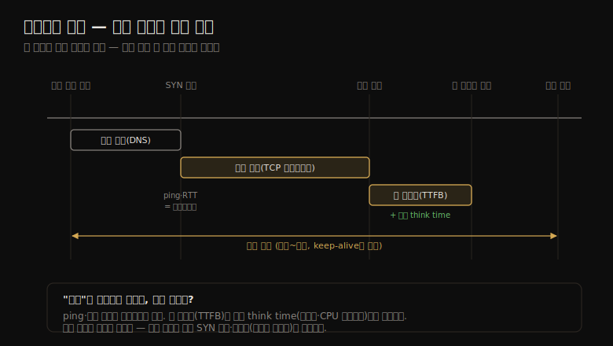

# 네트워크 (1) — 배경·모델·핵심 개념
---
> 이 노트는 10장의 출발점으로, 네트워크 성능을 *지연을 어디서·어떻게 재느냐* 라는 질문으로 엽니다. 네트워크는 흔히 "원인 불명일 때 일단 의심받는" 자원이라, 실제로 무슨 일이 일어나는지를 밝혀 네트워크의 혐의를 벗기는 것이 분석의 첫걸음입니다.

분산 시스템·클라우드가 늘면서 네트워크가 성능에서 차지하는 비중이 커졌습니다. 흔한 과제는 지연·처리량 개선과 *지연 이상치* 제거인데, 이상치는 드롭되거나 지연된 패킷에서 옵니다. 네트워크는 혼잡 가능성과 내재된 복잡성 탓에 "모르는 건 일단 네트워크 탓"으로 몰리기 쉬워, 분석은 실제 무슨 일이 일어나는지를 밝혀 네트워크를 *면죄* 하는 데서 출발합니다.

> 이 노트는 10.1~10.3의 배경·모델·개념을 다룹니다. 용어를 맞추고, 인터페이스·컨트롤러·프로토콜 스택 모델을 세우고, 라우팅·캡슐화·패킷 크기·지연 6종·버퍼링·백로그·혼잡 회피·사용률·로컬 연결 같은 핵심 개념을 "왜 성능에 중요한가" 중심으로 정리합니다. IP·TCP의 기본 역할은 안다고 전제합니다.

## 1. 용어와 모델 — 인터페이스·컨트롤러·프로토콜 스택

> 네트워크 인터페이스는 OS가 보는 논리 엔드포인트, 컨트롤러(NIC)는 포트와 시스템 I/O 버스 사이에서 패킷을 옮기는 마이크로프로세서입니다. 그 위에 프로토콜 스택이 층층이 쌓여, 보낼 메시지는 아래로·받을 메시지는 위로 흐릅니다.

네트워크 용어부터 맞춥니다.

| 용어 | 의미 |
|------|------|
| 인터페이스(interface)·링크 | OS가 보고 설정하는 네트워크 인터페이스 포트의 논리 인스턴스(가상일 수도) |
| 패킷(packet) | 패킷 교환망의 메시지(예: IP 패킷) |
| 프레임(frame) | 물리 네트워크 레벨 메시지(예: 이더넷 프레임) |
| 소켓(socket) | BSD 유래 네트워크 엔드포인트 API |
| 대역폭(bandwidth) | 네트워크 유형의 최대 전송률(보통 bit/s). 100GbE = 100Gbit/s |
| 처리량(throughput) | 현재 엔드포인트 간 전송률(bit/s 또는 byte/s) |
| 지연(latency) | 메시지 왕복 시간, 또는 연결 수립 시간(데이터 전송 제외) |

모델은 세 층으로 봅니다. **인터페이스** 는 OS가 보는 논리 엔드포인트로, 물리 포트에 매핑되며 보통 송신·수신 채널이 분리됩니다. **컨트롤러(NIC)** 는 하나 이상의 포트를 제공하고, 포트와 시스템 I/O 버스 사이에서 패킷을 옮기는 마이크로프로세서를 품습니다. 그 위에 **프로토콜 스택** 이 층층이 쌓이는데, 보낼 메시지는 애플리케이션에서 물리 네트워크로 *내려가고*(캡슐화로 점점 커짐), 받을 메시지는 *올라갑니다*.

> TCP/IP 스택이 표준이지만, OSI 모델의 "계층(Layer)" 용어도 알아 둘 만합니다 — Layer 3가 네트워크(IP) 프로토콜입니다. 계층마다 메시지를 부르는 말이 달라집니다 — 전송 계층은 세그먼트/데이터그램, 네트워크 계층은 패킷, 데이터 링크 계층은 프레임입니다. 이 구분이 도구 출력(예: tcpdump가 보는 패킷 vs 프레임)을 읽을 때 기준이 됩니다.

## 2. 라우팅·캡슐화·패킷 크기 — 효율과 오버헤드

> 네트워크를 작은 서브넷으로 나누면 브로드캐스트 범람을 막고 인프라를 효율적으로 씁니다. 캡슐화는 페이로드에 헤더·푸터를 더해 약간의 오버헤드를 만들고, 패킷 크기(MTU)는 클수록 처리량↑·건당 오버헤드↓이지만 1,500바이트 기본이 흔합니다.

**라우팅** 은 네트워크 사이로 패킷 전달을 관리합니다. 하나의 거대 네트워크 대신 작은 서브넷으로 나누는 이유는 *확장성* 입니다 — 브로드캐스트 메시지를 국소적으로 가둬 대규모 범람을 막고, 정규 메시지도 출발지~목적지 사이 네트워크로만 보내 인프라를 효율적으로 씁니다. 라우터·스위치는 공유 자원이라 다른 트래픽의 경합이 성능을 해칠 수 있습니다.

**캡슐화** 는 페이로드 앞(헤더)·뒤(푸터)에 메타데이터를 더합니다. 페이로드 자체는 안 바뀌지만 메시지 총 크기가 약간 커져 전송 오버헤드가 생깁니다(이더넷+IP+TCP 헤더가 54바이트 이상).

**패킷 크기** 는 클수록 처리량↑·건당 오버헤드↓입니다. TCP/IP+이더넷은 54~9,054바이트인데, 보통 인터페이스 MTU가 1,500바이트로 제한합니다. 1,500의 유래는 초기 이더넷에서 NIC 버퍼 비용과 전송 지연(공유 매체에서 차례 기다리는 시간)의 균형이었습니다. 9,000바이트 *점보 프레임* 은 처리량·지연을 개선하지만, 구형 하드웨어와 *잘못 설정된 방화벽*(ICMP "분할 불가" 메시지를 막아 패킷이 조용히 드롭됨) 때문에 채택이 막혀 많은 시스템이 1,500을 고수합니다.

> 1,500 MTU의 성능은 NIC 기능(TCP offload·large segment offload)으로 보완됐습니다 — 큰 버퍼를 NIC에 넘기면 전용 하드웨어가 작은 프레임으로 쪼개, 1,500과 9,000 MTU의 성능 격차를 어느 정도 좁혔습니다. 핵심은 "큰 패킷이 효율적이지만, 경로 전체가 지원해야 안전하다"는 점입니다.

## 3. 지연 — 여섯 가지로 나눠 본다

> 네트워크 지연은 이름 해석·ping·연결·첫 바이트·왕복 시간(RTT)·연결 수명으로 나뉩니다. 각각이 다른 구간을 재므로, 여러 개를 측정해 지연의 진짜 원천을 좁혀야 합니다.

지연은 네트워크 성능의 핵심 지표인데, *어디서 재느냐* 에 따라 종류가 다릅니다(클라이언트가 서버에 연결하는 관점). 각 지연이 타임라인의 어느 구간을 재는지를 한 장으로 정리하면 다음과 같습니다.

| 지연 | 재는 구간 |
|------|----------|
| 이름 해석(name resolution) | 호스트명→IP(DNS). 타임아웃 시 수십 초 |
| ping | ICMP echo 요청~응답(네트워크 왕복). 단순·흔하지만 라우터가 우선순위를 달리 줄 수 있음 |
| 연결(connection) | TCP 핸드셰이크(SYN~SYN-ACK). 드롭 시 재전송 지연(1초+) 포함 |
| 첫 바이트(TTFB) | 연결 수립~첫 데이터 바이트. *서버 think time*(부하·스케줄링) 포함 |
| 왕복 시간(RTT) | 엔드포인트 간 왕복(전파+각 홉 처리). ICMP echo가 흔히 쓰임 |
| 연결 수명(life span) | 연결 수립~종료. keep-alive로 늘려 재수립 오버헤드 회피 |

예를 들어 localhost ping을 1초로 스케일하면 거리감이 옵니다 — 같은 서브넷 10GbE는 4초, Wi-Fi는 1분, SF→뉴욕은 13분, SF→호주는 1시간입니다.

> 지연을 여섯으로 나누는 이유는 *원천을 좁히기* 위해서입니다. ping·연결 지연은 네트워크가 일으킨 지연을 보지만, 첫 바이트 지연(TTFB)은 *서버의 think time*(과부하·CPU 스케줄링)까지 포함합니다. 그래서 "느리다"가 네트워크 탓인지 서버 탓인지를 이 둘의 차이로 가립니다. 특히 연결 지연은 SYN 드롭으로 인한 재전송 지연을 포함할 수 있어, 백로그가 찬 과부하 서버를 드러냅니다.

## 4. 버퍼링·백로그 — 처리량을 떠받치고 부하를 흡수한다

> 버퍼링은 송수신 양쪽에서 RTT가 높아도 처리량을 유지하게 합니다(TCP 슬라이딩 윈도). 단 스위치·라우터의 과한 버퍼는 버퍼블로트(긴 큐 대기)를 일으킵니다. 백로그는 SYN 요청을 큐잉하며, 차면 SYN 드롭으로 호스트 과부하를 알립니다.

**버퍼링** 은 다양한 지연에도 처리량을 높게 유지하는 장치입니다. 송신자가 ACK를 기다리며 멈추기 전에 더 보낼 수 있어, 높은 RTT의 영향을 완화합니다. TCP는 버퍼링 + *슬라이딩 송신 윈도* 로 처리량을 높입니다. 소켓에도 버퍼가 있고, 애플리케이션도 자체 버퍼로 데이터를 모아 보냅니다.

다만 버퍼링이 *중간 노드*(스위치·라우터)에서 과하면 **버퍼블로트** 가 생깁니다 — 패킷이 긴 시간 큐에 갇혀, 호스트의 TCP 혼잡 회피가 발동해 오히려 성능이 떨어집니다. Linux 3.x에 대응 기능(byte queue limits·CoDel·TCP small queues)이 들어갔습니다. "버퍼링은 중간 노드가 아니라 *엔드포인트(호스트)* 가 맡는 게 낫다"는 end-to-end 원칙이 그 배경입니다.

**백로그** 는 또 다른 버퍼링으로, 초기 연결 요청용입니다. TCP는 SYN 요청을 유저 프로세스가 accept하기 전 커널에 큐잉합니다. 너무 많아 한도에 차면 SYN 패킷이 드롭되고 클라이언트가 재전송하는데, 이게 연결 지연을 만듭니다. **백로그 드롭과 SYN 재전송은 호스트 과부하의 지표** 입니다.

> 두 버퍼링의 자리가 다릅니다 — 데이터 버퍼링은 *처리량을 떠받치고*(RTT 흡수), 백로그는 *연결 폭주를 흡수* 합니다. 핵심 함정은 *과한* 버퍼링입니다 — 중간 노드의 과버퍼는 버퍼블로트로 지연을 키우고, 백로그가 차면 SYN 드롭으로 연결 지연을 만듭니다. 그래서 버퍼는 "충분하되 과하지 않게"가 원칙입니다.

## 5. 혼잡 회피·인터페이스 협상 — 공유 자원의 관리

> 네트워크는 공유 자원이라 부하가 높으면 혼잡합니다. 이더넷 pause 프레임·IP ECN·TCP 혼잡 윈도가 혼잡을 피하는 장치입니다. 인터페이스는 대역폭·듀플렉스를 자동 협상하며, 전이중이면 방향별로 따로 봐야 합니다.

**혼잡 회피** 는 공유 자원인 네트워크가 부하로 막힐 때를 대비합니다. 라우터·스위치가 패킷을 드롭하면 TCP 재전송으로 지연이 생기고, 호스트도 높은 패킷율에 압도돼 스스로 드롭합니다. 프로토콜별 장치:

| 프로토콜 | 혼잡 회피 |
|----------|----------|
| 이더넷 | 압도된 호스트가 송신자에 pause 프레임(802.3x) 전송 |
| IP | ECN(Explicit Congestion Notification) 필드 |
| TCP | 혼잡 윈도 + 여러 혼잡 제어 알고리즘 |

**인터페이스 협상** 은 연결된 트랜시버 사이에서 대역폭(10~100,000Mbit/s)·듀플렉스(반/전이중)를 자동 협상합니다. 1GbE라도 상대가 느리거나 배선이 나쁘면 낮은 속도로 협상될 수 있습니다. *전이중* 은 송신·수신을 각각 풀 대역폭으로 동시에 합니다.

**사용률** 은 현재 처리량 ÷ 최대 대역폭인데, 자동 협상으로 대역폭·듀플렉스가 변해 계산이 단순하지 않습니다. 전이중은 *방향별로* 봐야 하며, 보통 한 방향이 더 중요합니다(서버는 송신 위주, 클라이언트는 수신 위주). 한 방향이 100%에 닿으면 그게 병목입니다.

> 한 가지 주의 — 일부 도구는 *바이트가 아니라 패킷* 으로만 활동을 보고합니다. 패킷 크기가 크게 변할 수 있어(2절), 패킷 수로는 처리량·(처리량 기반)사용률을 계산할 수 없습니다. 또 **로컬 연결**(localhost)은 loopback 가상 인터페이스를 씁니다 — 같은 호스트의 분산 컴포넌트(웹·DB·캐시 서버)가 localhost로 통신하며, Unix 도메인 소켓(UDS)을 쓰면 TCP/IP 스택을 우회해 더 빠를 수 있습니다.

## 학습 점검

> 이 노트의 핵심을 스스로 떠올려 봅니다. 답이 막히면 해당 섹션으로 돌아가 확인합니다.

- 인터페이스·컨트롤러·프로토콜 스택 세 모델이 각각 무엇이며, 계층마다 메시지를 부르는 말(세그먼트·패킷·프레임)이 왜 다른지 설명해 봅니다. (→ §1)
- 점보 프레임(9,000 MTU)이 처리량을 높이는데도 1,500이 흔한 까닭을 떠올려 봅니다. (→ §2)
- ping·연결 지연과 첫 바이트 지연(TTFB)의 차이로 "느림"이 네트워크 탓인지 서버 탓인지 어떻게 가리는지 말해 봅니다. (→ §3)
- 버퍼블로트가 무엇이며, 왜 버퍼링을 중간 노드가 아니라 엔드포인트가 맡아야 하는지 설명해 봅니다. (→ §4)
- 전이중에서 사용률을 방향별로 봐야 하는 까닭과, 패킷 수로 처리량을 계산할 수 없는 까닭을 떠올려 봅니다. (→ §5)