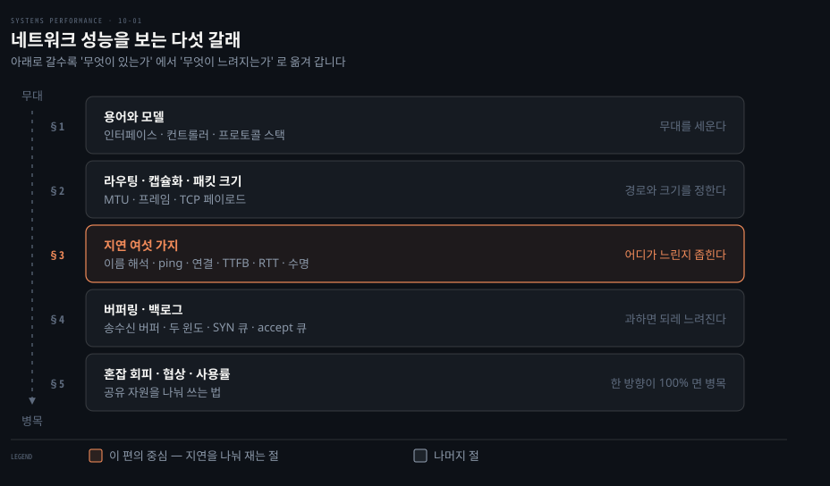
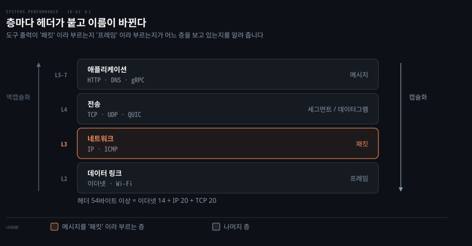
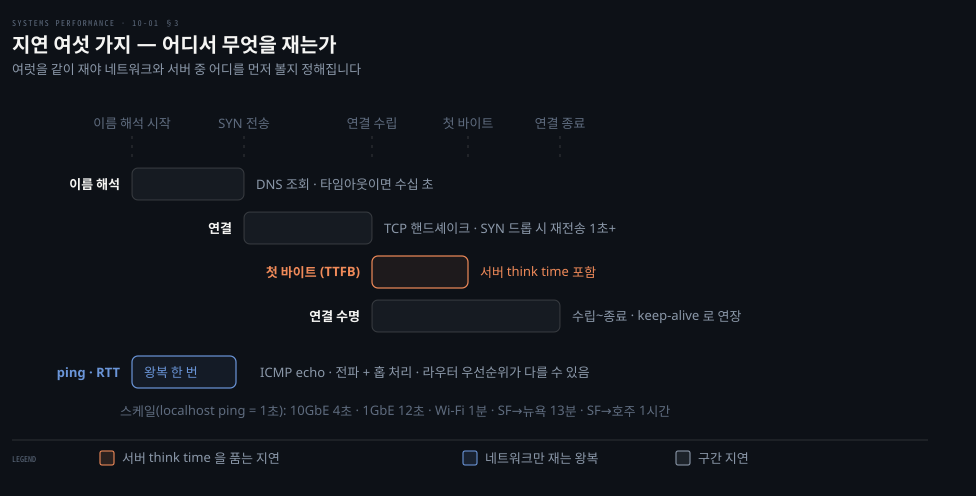
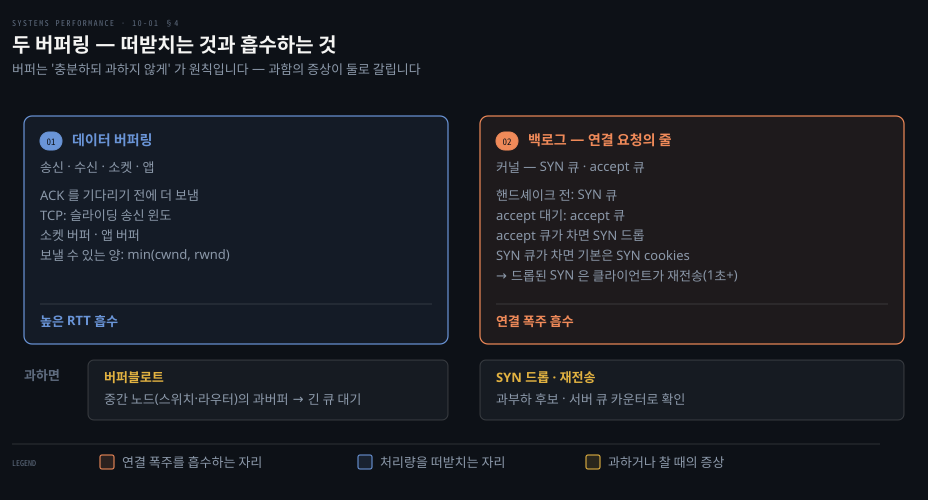
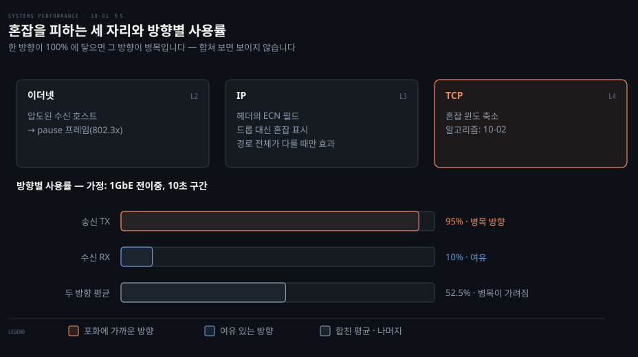

# 네트워크 (1) — 배경·모델·핵심 개념
---
> 이 노트는 10장의 출발점으로, 네트워크 성능을 *지연을 어디서·어떻게 재느냐* 라는 질문으로 엽니다. 네트워크는 흔히 "원인 불명일 때 일단 의심받는" 자원이라, 실제로 무슨 일이 일어나는지를 밝혀 네트워크의 혐의를 벗기는 것이 분석의 첫걸음입니다.

## 핵심 요약

> 이 편이 매달린 하나의 생각은 **네트워크 지연은 한 덩어리가 아니라 서로 다른 구간을 재는 여섯 가지이며, 그중 무엇을 재느냐가 범인을 네트워크와 서버 중 어디로 지목할지를 정한다는 것**입니다.

분산 시스템·클라우드가 늘면서 네트워크가 성능에서 차지하는 비중이 커졌습니다. 흔한 과제는 지연·처리량 개선과 *지연 이상치* 제거인데, 이상치는 드롭되거나 지연된 패킷에서 옵니다.

네트워크는 혼잡 가능성과 내재된 복잡성 탓에 "모르는 건 일단 네트워크 탓"으로 몰리기 쉽습니다. 그래서 분석은 실제로 무슨 일이 일어나는지를 밝혀 네트워크를 *면죄* 하는 데서 출발합니다.

면죄가 가능하려면 지연을 쪼갤 수 있어야 합니다. ping 이 빠른데도 응답이 느리다면 그 시간은 네트워크가 아니라 서버 안에서 흘렀다는 뜻입니다. 이 판별이 이 편의 실질적인 쓸모입니다.

## 학습 목표

> 이 편을 덮은 뒤 스스로 할 수 있어야 하는 일을 먼저 적어 둡니다.

- 인터페이스·컨트롤러·프로토콜 스택 세 모델로 "지금 보는 수치가 어느 층의 것인지" 구분합니다.
- 캡슐화 오버헤드와 MTU 가 처리량에 미치는 영향을 설명하고, 점보 프레임이 흔히 쓰이지 않는 까닭을 댑니다.
- 지연 여섯 가지 중 어느 것을 재야 "네트워크 탓"과 "서버 탓"이 갈리는지 고릅니다.
- 버퍼가 부족할 때와 과할 때 각각 어떤 증상으로 나타나는지 예측합니다.
- 전이중 링크의 사용률을 방향별로 읽고, 패킷 수만 있는 지표로는 무엇을 계산할 수 없는지 압니다.

위 다섯 갈래는 아래로 갈수록 구체화됩니다. §1·§2 가 무대를 세우고, §3~§5 가 실제로 느려지는 자리를 짚습니다.

## 이 문서가 다루지 않는 것

> 같은 10장 안에서 뒤 편으로 넘긴 주제를 먼저 밝혀 둡니다. 여기서는 "왜 성능에 중요한가" 층위까지만 봅니다.

- **TCP 혼잡 제어 알고리즘의 동작**(CUBIC·BBR 등)과 TCP 상태 전이, QUIC — 10-02 가 다룹니다.
- **Linux 네트워크 스택의 큐·버퍼 구현**과 세그먼테이션 오프로드, 커널 바이패스 — 10-02 가 다룹니다.
- **버퍼 크기·백로그 한도 같은 튜닝 손잡이**와 분석 방법론 — 10-03 이 다룹니다.
- **관측 도구**(`ss`·`sar`·`tcpdump`·bpftrace 등) — 10-04 가 다룹니다. 이 편에는 명령을 싣지 않습니다.

IP·TCP 의 기본 역할은 안다고 전제합니다.

## 1. 용어와 모델 — 인터페이스·컨트롤러·프로토콜 스택

> 성능 수치를 읽으려면 그 수치가 어느 층의 것인지부터 정해야 합니다. 인터페이스·컨트롤러·프로토콜 스택 세 모델이 그 좌표를 줍니다.

같은 "패킷이 느리다"는 말도 NIC 의 링 버퍼를 말하는 것인지 소켓 버퍼를 말하는 것인지에 따라 손댈 자리가 달라집니다. 그래서 용어부터 맞춥니다.

| 용어 | 의미 |
|------|------|
| 인터페이스(interface)·링크 | OS가 보고 설정하는 네트워크 인터페이스 포트의 논리 인스턴스(가상일 수도) |
| 패킷(packet) | 패킷 교환망의 메시지(예: IP 패킷) |
| 프레임(frame) | 물리 네트워크 레벨 메시지(예: 이더넷 프레임) |
| 소켓(socket) | BSD 유래 네트워크 엔드포인트 API |
| 대역폭(bandwidth) | 네트워크 유형의 최대 전송률(보통 bit/s). 100GbE = 100Gbit/s |
| 처리량(throughput) | 현재 엔드포인트 간 전송률(bit/s 또는 byte/s) |
| 지연(latency) | 메시지 왕복 시간, 또는 연결 수립 시간(데이터 전송 제외) |

모델은 세 층으로 봅니다. **인터페이스** 는 OS가 보는 논리 엔드포인트로, 물리 포트에 매핑되며 보통 송신·수신 채널이 분리됩니다. **컨트롤러(NIC)** 는 하나 이상의 포트를 제공하고, 포트와 시스템 I/O 버스 사이에서 패킷을 옮기는 마이크로프로세서를 품습니다. 그 위에 **프로토콜 스택** 이 층층이 쌓이는데, 보낼 메시지는 애플리케이션에서 물리 네트워크로 *내려가고*, 받을 메시지는 *올라갑니다*.

### 층마다 메시지를 부르는 이름이 다릅니다

TCP/IP 스택이 표준이지만, OSI 모델의 "계층(Layer)" 용어도 알아 둘 만합니다. Layer 3가 네트워크(IP) 프로토콜입니다.

계층마다 메시지를 부르는 말이 달라집니다. 전송 계층은 세그먼트·데이터그램, 네트워크 계층은 패킷, 데이터 링크 계층은 프레임입니다. 이 구분이 도구 출력을 읽을 때 기준이 됩니다. 어떤 도구가 "프레임 드롭"을 보고한다면, 그 수치가 어느 층을 보고 있는지를 먼저 알려 줍니다. 원인은 그 층에만 있지 않을 수 있어 위층까지 함께 봐야 합니다.

## 2. 라우팅·캡슐화·패킷 크기 — 효율과 오버헤드

> 네트워크를 작은 서브넷으로 나누면 브로드캐스트 범람을 막고 인프라를 효율적으로 씁니다. 캡슐화는 헤더·푸터만큼 오버헤드를 만들고, 패킷이 클수록 건당 오버헤드는 줄어듭니다.

**라우팅** 은 네트워크 사이로 패킷 전달을 관리합니다. 하나의 거대 네트워크 대신 작은 서브넷으로 나누는 이유는 *확장성* 입니다. 브로드캐스트 메시지를 국소적으로 가둬 대규모 범람을 막고, 정규 메시지도 출발지~목적지 사이 네트워크로만 보내 인프라를 효율적으로 씁니다. 라우터·스위치는 공유 자원이라 다른 트래픽의 경합이 성능을 해칠 수 있습니다.

**캡슐화** 는 페이로드 앞뒤에 메타데이터를 더합니다. 앞에 붙는 것이 헤더, 뒤에 붙는 것이 푸터입니다. 페이로드 자체는 바뀌지 않지만 메시지 총 크기가 커지고, 그 커진 만큼이 전송 오버헤드입니다. 이더넷·IP·TCP 헤더를 합치면 54바이트 이상입니다.

### 1,500바이트라는 기본값의 유래

**패킷 크기** 는 클수록 처리량이 오르고 건당 오버헤드가 줄어듭니다. TCP/IP + 이더넷의 패킷 크기는 총 54~9,054바이트입니다. 하한 54는 페이로드가 0일 때의 헤더뿐인 크기이고, 상한은 9,000 페이로드에 헤더 54를 더한 값입니다. 보통 인터페이스 MTU가 1,500바이트로 제한합니다.

1,500의 유래는 초기 이더넷입니다. NIC 버퍼 메모리 비용과 전송 지연이라는 두 요인의 균형에서 나온 값입니다. 당시 호스트들은 동축 케이블이나 허브라는 공유 매체를 두고 경쟁했고, 프레임이 클수록 다른 호스트가 차례를 기다리는 지연이 늘었습니다.

9,000바이트 *점보 프레임* 은 패킷 수를 줄여 처리량과 전송 지연을 함께 개선합니다. 그런데도 채택이 막힌 데는 두 가지가 겹쳤습니다. 구형 네트워크 하드웨어와 잘못 설정된 방화벽입니다.

점보 프레임을 모르는 구형 장비는 둘 중 하나로 반응합니다. IP 분할로 쪼개거나(재조립 비용이 듭니다), ICMP "분할 불가" 오류로 발신자에게 크기를 줄이라고 알립니다.

여기서 방화벽이 끼어듭니다. 과거 ping of death 같은 ICMP 기반 공격이 있었습니다. 일부 관리자가 그 대응으로 ICMP를 통째로 막아 뒀습니다. 그러면 도움이 됐을 "분할 불가" 통지가 발신자에게 닿지 못하고, 1,500을 넘는 패킷이 조용히 드롭됩니다. ICMP가 전달돼 분할이 일어나더라도, 분할 패킷을 지원하지 않는 장비가 그것을 버릴 위험이 남습니다. 그래서 많은 시스템이 1,500을 고수합니다.

1,500 MTU의 성능은 NIC 기능으로 보완됐습니다. TCP offload와 large segment offload가 큰 버퍼를 NIC에 넘기면, 전용 하드웨어가 그것을 작은 프레임으로 쪼갭니다. 이것이 1,500과 9,000 MTU의 성능 격차를 어느 정도 좁혔습니다. 핵심은 큰 패킷이 효율적이지만 경로 전체가 지원해야 안전하다는 점입니다.

## 3. 지연 — 여섯 가지로 나눠 본다

> 네트워크 지연은 이름 해석·ping·연결·첫 바이트·왕복 시간·연결 수명으로 나뉩니다. 각각이 다른 구간을 재므로 여러 개를 측정해 지연의 진짜 원천을 좁혀야 합니다.

"느리다"는 신고만으로는 손댈 곳을 정할 수 없습니다. 지연은 네트워크 성능의 핵심 지표인데, *어디서 재느냐* 에 따라 종류가 달라지기 때문입니다. 클라이언트가 서버에 연결하는 관점에서 여섯으로 나눕니다.

| 지연 | 재는 구간 |
|------|----------|
| 이름 해석(name resolution) | 호스트명→IP(DNS). 타임아웃 시 수십 초 |
| ping | ICMP echo 요청~응답. 단순하고 흔하지만 라우터가 우선순위를 달리 줄 수 있음 |
| 연결(connection) | TCP 핸드셰이크(SYN~SYN-ACK). 드롭 시 재전송 지연(1초+) 포함 |
| 첫 바이트(TTFB) | 연결 수립~첫 데이터 바이트. *서버 think time* 포함 |
| 왕복 시간(RTT) | 엔드포인트 간 왕복(전파+각 홉 처리). ICMP echo가 흔히 쓰임 |
| 연결 수명(life span) | 연결 수립~종료. keep-alive로 늘려 재수립 오버헤드 회피 |

예를 들어 localhost ping을 1초로 스케일하면 거리감이 옵니다. 같은 서브넷 10GbE는 4초, Wi-Fi는 1분, SF→뉴욕은 13분, SF→호주는 1시간입니다.

### 왜 여섯으로 나누는가

지연을 여섯으로 나누는 이유는 *원천을 좁히기* 위해서입니다. ping·연결 지연은 네트워크가 일으킨 지연을 보지만, 첫 바이트 지연(TTFB)은 *서버의 think time* 까지 포함합니다. 과부하나 CPU 스케줄링으로 서버가 늦게 응답한 시간이 여기 섞입니다.

그래서 "느리다"가 네트워크 탓인지 서버 탓인지를 이 둘의 차이로 가립니다. ping 은 정상인데 TTFB 만 크다면 네트워크보다 서버 쪽을 먼저 의심할 근거가 됩니다. ping 이 잡지 못하는 대역폭·큐잉 요인이 남아 있으므로 면죄를 확정하려면 처리량도 함께 봐야 합니다. 특히 연결 지연은 SYN 드롭으로 인한 재전송 지연을 포함할 수 있어, 백로그가 찬 과부하 서버를 드러낼 수 있습니다. 다만 SYN 재전송은 경로상 손실이나 방화벽으로도 생기므로 그것만으로 백로그 포화를 확정하지는 않습니다.

## 4. 버퍼링·백로그 — 처리량을 떠받치고 부하를 흡수한다

> 버퍼링은 RTT가 높아도 처리량을 유지하게 하고, 백로그는 SYN 요청을 큐잉해 연결 폭주를 흡수합니다. 둘 다 과하면 문제가 되는데 증상이 서로 다릅니다.

네트워크는 왕복에 시간이 걸립니다. 매번 ACK를 기다렸다 다음을 보내면 RTT가 높을수록 처리량이 주저앉습니다. 버퍼링이 그 문제를 풉니다.

**버퍼링** 은 송신자가 ACK를 기다리며 멈추기 전에 더 보낼 수 있게 해, 높은 RTT의 영향을 완화합니다. TCP는 버퍼링에 *슬라이딩 송신 윈도* 를 더해 처리량을 높입니다. 소켓에도 버퍼가 있고, 애플리케이션도 자체 버퍼로 데이터를 모아 보냅니다.

### 과한 버퍼는 되레 느리게 만듭니다

스위치·라우터 같은 *중간 노드* 도 자기 처리량을 높이려고 버퍼링을 합니다. 그것이 과하면 **버퍼블로트** 가 생깁니다. 패킷이 긴 시간 큐에 갇히면 호스트의 TCP 혼잡 회피가 발동해 오히려 성능이 떨어집니다. Linux 3.x에 대응 기능이 들어갔습니다. byte queue limits·CoDel·TCP small queues 가 그것입니다.

버퍼링은 중간 노드가 아니라 *엔드포인트(호스트)* 가 맡는 게 낫다는 end-to-end 원칙이 그 배경입니다.

**백로그** 는 또 다른 버퍼링으로, 초기 연결 요청용입니다. TCP는 SYN 요청을 유저 프로세스가 accept하기 전 커널에 큐잉합니다. 너무 많아 한도에 차면 SYN 패킷이 드롭되고 클라이언트가 재전송하는데, 이것이 연결 지연을 만듭니다. **백로그 드롭과 SYN 재전송은 호스트 과부하의 지표** 입니다.

두 버퍼링은 자리가 다릅니다. 데이터 버퍼링은 *처리량을 떠받치고*, 백로그는 *연결 폭주를 흡수* 합니다. 핵심 함정은 *과한* 버퍼링입니다. 중간 노드의 과버퍼는 버퍼블로트로 지연을 키우고, 백로그가 차면 SYN 드롭으로 연결 지연을 만듭니다. 그래서 버퍼는 "충분하되 과하지 않게"가 원칙입니다.

## 5. 혼잡 회피·인터페이스 협상 — 공유 자원의 관리

> 네트워크는 공유 자원이라 부하가 높으면 혼잡합니다. 이더넷 pause 프레임·IP ECN·TCP 혼잡 윈도가 혼잡을 피하는 장치입니다.

**혼잡 회피** 는 공유 자원인 네트워크가 부하로 막힐 때를 대비합니다. 라우터·스위치가 패킷을 드롭하면 TCP 재전송으로 지연이 생기고, 호스트도 높은 패킷율에 압도돼 스스로 드롭합니다. 프로토콜마다 장치가 다릅니다.

| 프로토콜 | 혼잡 회피 |
|----------|----------|
| 이더넷 | 압도된 호스트가 송신자에 pause 프레임(802.3x) 전송 |
| IP | ECN(Explicit Congestion Notification) 필드 |
| TCP | 혼잡 윈도 + 여러 혼잡 제어 알고리즘 |

**인터페이스 협상** 은 연결된 트랜시버 사이에서 대역폭과 듀플렉스를 자동 협상합니다. 대역폭은 10~100,000Mbit/s 범위이고, 듀플렉스는 반이중과 전이중 중 하나입니다. 1GbE라도 상대가 느리거나 배선이 나쁘면 낮은 속도로 협상될 수 있습니다. *전이중* 은 송신·수신을 각각 풀 대역폭으로 동시에 합니다.

### 사용률은 방향별로 봅니다

**사용률** 은 현재 처리량 ÷ 최대 대역폭인데, 자동 협상으로 대역폭·듀플렉스가 변해 계산이 단순하지 않습니다. 전이중은 *방향별로* 봐야 하며, 보통 한 방향이 더 중요합니다. 서버는 송신 위주, 클라이언트는 수신 위주입니다. 한 방향이 100%에 닿으면 그것이 병목입니다. 두 방향을 합쳐 평균 내면 포화된 방향이 여유 있는 방향에 가려집니다.

한 가지 주의할 점이 있습니다. 일부 도구는 *바이트가 아니라 패킷* 으로만 활동을 보고합니다. 패킷 크기가 크게 변할 수 있어(§2), 패킷 수로는 처리량이나 처리량 기반 사용률을 계산할 수 없습니다.

**로컬 연결** 도 짚어 둡니다. localhost 통신은 loopback 가상 인터페이스를 씁니다. 같은 호스트의 분산 컴포넌트가 이 경로로 통신하는데, 웹·DB·캐시 서버를 한 장비에 올린 구성이 그렇습니다. Unix 도메인 소켓(UDS)을 쓰면 TCP/IP 스택을 우회해 더 빠를 수 있습니다.

TCP/IP 소켓이라고 방법이 없는 것은 아닙니다. 커널이 핸드셰이크 뒤 localhost 연결임을 알아채고 데이터 전송에서 스택을 건너뛰게 하는 접근이 TCP friends라는 이름으로 개발됐습니다. 머지되지는 않았지만 지금은 BPF로 같은 일을 할 수 있고, Cilium이 컨테이너 네트워킹에 이를 씁니다.

## 학습 점검

> 이 노트의 핵심을 스스로 떠올려 봅니다. 답이 막히면 해당 섹션으로 돌아가 확인합니다.

- 인터페이스·컨트롤러·프로토콜 스택 세 모델이 각각 무엇이며, 계층마다 메시지를 부르는 말이 왜 다른지 설명해 봅니다. (→ §1)
- 점보 프레임(9,000 MTU)이 처리량을 높이는데도 1,500이 흔한 까닭을 떠올려 봅니다. (→ §2)
- ping·연결 지연과 첫 바이트 지연(TTFB)의 차이로 "느림"이 네트워크 탓인지 서버 탓인지 어떻게 가리는지 말해 봅니다. (→ §3)
- 버퍼블로트가 무엇이며, 왜 버퍼링을 중간 노드가 아니라 엔드포인트가 맡아야 하는지 설명해 봅니다. (→ §4)
- 전이중에서 사용률을 방향별로 봐야 하는 까닭과, 패킷 수로 처리량을 계산할 수 없는 까닭을 떠올려 봅니다. (→ §5)
