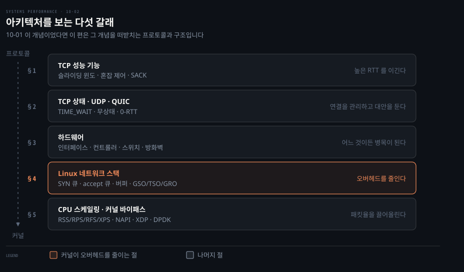
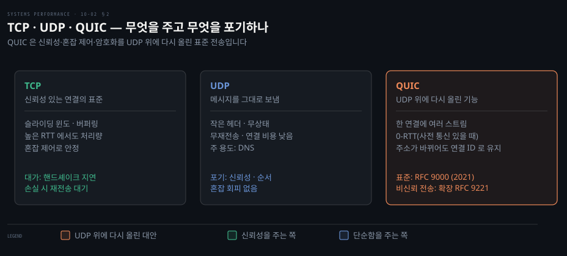
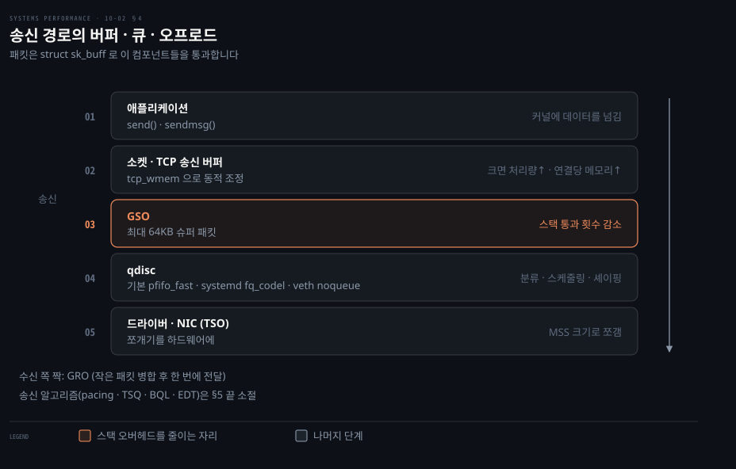
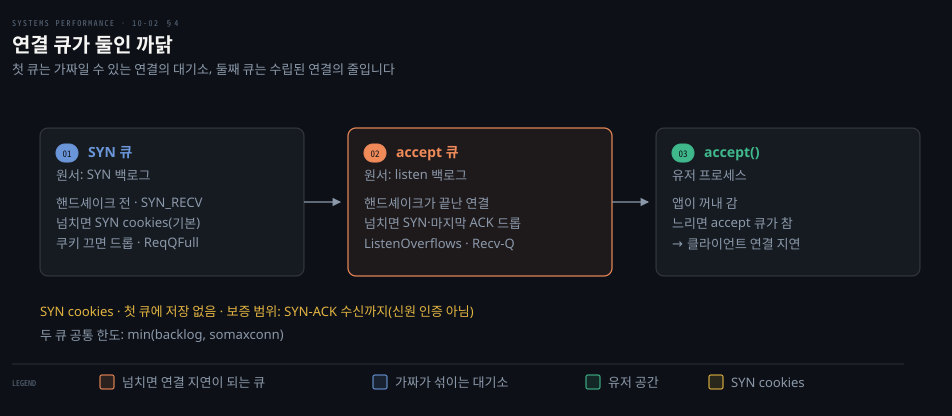
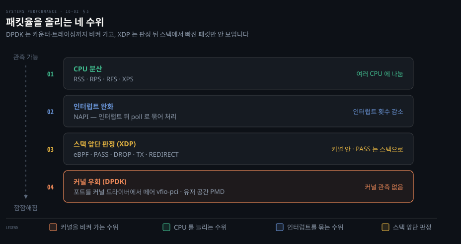

# 네트워크 (2) — 아키텍처
---
> 이 노트는 10.4 아키텍처를 다룹니다. 프로토콜(IP·TCP·UDP·QUIC)의 성능 특성, 네트워크 하드웨어(인터페이스·컨트롤러·스위치·라우터·방화벽), 그리고 Linux 네트워크 스택(연결 큐·버퍼·GSO/TSO·NAPI·CPU 스케일링·커널 바이패스)을 봅니다.

## 핵심 요약

> 이 편이 매달린 하나의 생각은 **프로토콜·하드웨어·커널 세 층이 각자 다른 오버헤드를 줄이려 애쓰고, 그 각각이 병목이 될 수 있다는 것**입니다.

10-01이 *개념* 이었다면 이 노트는 *프로토콜과 그 아래 구조* 입니다. TCP가 어떻게 높은 RTT에서도 처리량을 내는지, 하드웨어가 어디서 병목이 되는지, 커널이 패킷을 어떻게 큐잉·분산·오프로드하는지를 봅니다.

세 층을 관통하는 주제는 오버헤드입니다. TCP는 슬라이딩 윈도로 왕복 대기의 오버헤드를 줄입니다. 커널은 세그먼테이션 오프로드로 작은 패킷이 스택을 여러 번 지나는 비용을 줄입니다. CPU 스케일링은 한 코어에 몰리는 부하를 흩뜨립니다.

그 끝에 커널 바이패스가 있는데, 여기서 맞교환이 분명해집니다. 스택을 우회하면 빨라지지만 카운터와 트레이싱 이벤트도 함께 우회돼 성능 분석이 어려워집니다. 성능 특성에 초점을 두며, 일반 네트워킹 이론은 전제합니다.

## 학습 목표

> 이 편을 덮은 뒤 스스로 할 수 있어야 하는 일을 먼저 적어 둡니다.

- TCP가 높은 RTT에서도 처리량을 내는 원리를 슬라이딩 윈도·버퍼링으로 설명합니다.
- UDP가 무엇을 포기했고 QUIC이 그중 무엇을 되돌려 놓았는지 구분합니다.
- 인터페이스·컨트롤러·버스 중 어디가 먼저 한계에 닿는지 계산으로 따집니다.
- 연결 큐가 둘인 이유를 SYN 플러드 방어와 엮어 답합니다.
- 커널 바이패스가 무엇을 얻고 무엇을 잃는지 말합니다.

프로토콜 → 하드웨어 → 소프트웨어 순으로 내려갑니다. 위 두 층이 무엇을 주는지 본 뒤, 커널이 그 위에서 무슨 일을 더 하는지를 봅니다.

## 이 문서가 다루지 않는 것

> 앞뒤 편으로 넘긴 주제를 밝혀 둡니다.

- **지연 6종·버퍼블로트·MTU 같은 기본 개념** — 10-01이 다룹니다.
- **분석 방법론·실험·튜닝 손잡이**(sysctl·setsockopt) — 10-03이 다룹니다.
- **관측 도구**(`ss`·`nstat`·`tcpdump` 등) — 10-04가 다룹니다.

## 1. TCP — 높은 RTT에서도 처리량을 내는 법

> TCP는 슬라이딩 윈도와 버퍼링으로 높은 RTT에서도 처리량을 내고, 혼잡 제어로 안정성을 지킵니다. 슬라이딩 윈도·혼잡 회피·slow-start·SACK·fast retransmit·TCP fast open 같은 기능이 그 성능을 떠받칩니다.

왕복에 시간이 걸리는 링크에서 한 번 보내고 ACK를 기다리면 처리량이 RTT에 묶입니다. TCP가 그 묶임을 푸는 방식이 이 절의 내용입니다.

TCP는 신뢰성 있는 연결의 표준입니다. 성능 면에서 *버퍼링 + 슬라이딩 윈도* 로 높은 RTT에서도 높은 처리량을 내고, *혼잡 제어 + 혼잡 윈도* 로 다양한 네트워크에서 높지만 안정적인 전송률을 유지합니다.

| TCP 성능 기능 | 역할 |
|--------------|------|
| 슬라이딩 윈도 | ACK 전에 윈도 크기만큼 다중 패킷 전송 — 높은 RTT에서도 처리량↑ |
| 혼잡 회피 | 과전송으로 인한 포화·드롭 방지 |
| slow-start | 작은 혼잡 윈도로 시작, ACK 받으며 증가 |
| SACK | 불연속 패킷 ACK — 재전송 수↓ |
| fast retransmit | 중복 ACK 기반 즉시 재전송(타이머 대기 회피) |
| fast recovery | 중복 ACK 감지 후 slow-start로 성능 회복 |
| TCP fast open | SYN에 데이터 포함 — 핸드셰이크 대기 없이 처리 시작 |
| TCP timestamps | RTT 측정용 타임스탬프 |
| TCP SYN cookies | SYN 플러드 시 정상 클라이언트 연결 유지 |

핵심 동작 몇 가지를 짚습니다. **3-way 핸드셰이크** 는 SYN → SYN-ACK → ACK 로 연결을 수립합니다. 클라이언트가 보는 연결 지연은 마지막 ACK까지이고, 이 사이에 패킷이 드롭되면 타임아웃과 재전송으로 지연이 붙습니다.

**재전송** 은 두 갈래입니다. *타이머 기반* 은 Linux에서 최소 200ms를 기다린 뒤 지수 백오프로 늘어나고, *fast retransmit* 은 중복 ACK를 신호로 삼아 타이머를 기다리지 않습니다. 마지막 패킷이 손실되면 중복 ACK가 오지 않으므로 Tail Loss Probe(TLP)가 그 자리를 메웁니다.

> TCP에서 가장 큰 성능 레버는 **혼잡 제어 알고리즘** 입니다 — Reno·Tahoe·CUBIC(Linux 기본, 더 공격적)·BBR(경로 모델 기반, 어떤 경로는 극적 개선·어떤 경로는 악화)·DCTCP(데이터센터용). Netflix의 한 사례에서는 BBR로 심한 패킷 손실 구간의 처리량이 3배까지 개선됐습니다. Linux 5.6은 BPF로 새 혼잡 제어 알고리즘을 만들 수 있게 했습니다. 그 밖에 Nagle(작은 패킷 지연 합침)·delayed ACK(ACK 최대 500ms 지연 합침)·SACK/FACK/RACK(손실 복구 개선)·초기 윈도(IW10) 같은 동작이 성능에 영향을 줍니다.

## 2. TCP 상태·UDP·QUIC — 연결 관리와 대안

> TCP 세션은 상태(LISTEN·ESTABLISHED·TIME_WAIT 등)와 타이머로 전이하며, TIME_WAIT는 포트 고갈을 일으킬 수 있습니다. UDP는 단순·무상태·무재전송이라 빠르지만 비신뢰적이고, QUIC은 UDP 위에 다중 스트림·암호화·0-RTT를 얹은 TCP 대안입니다.

TCP 세션은 패킷·소켓 이벤트로 상태를 전이합니다. LISTEN·SYN-SENT·ESTABLISHED·TIME-WAIT·CLOSED 같은 상태가 있고, 성능 분석은 보통 *활성 연결인 ESTABLISHED* 에 집중합니다.

완전히 닫힌 세션은 TIME_WAIT로 들어가 보통 2분을 머뭅니다. 늦게 도착한 패킷이 같은 포트를 쓰는 새 연결에 잘못 섞이지 않게 하려는 장치입니다. 다만 이것이 *포트 고갈* 문제를 일으킬 수 있습니다(10-03 TCP 분석).

**UDP** 는 데이터그램이라 부르는 메시지를 보내는 표준입니다. 성능 면의 장점은 셋입니다. 헤더가 작아 단순합니다. 무상태라 연결 오버헤드가 낮습니다. 재전송이 없어 TCP의 큰 지연을 피합니다.

대가도 분명합니다. 비신뢰적이라 데이터가 누락되거나 순서가 뒤바뀔 수 있고, 혼잡 회피가 없어 네트워크 혼잡에 오히려 기여할 수 있습니다. 주 용도는 DNS였습니다.

**QUIC** 은 HTTP/3의 기반으로, Google이 만든 TCP 대안입니다. UDP 위에 여러 기능을 다시 얹었습니다.

한 "연결" 안에 여러 스트림을 다중화하며 신뢰성을 선택적으로 적용합니다. 클라이언트 주소가 바뀌어도 암호화된 연결 ID로 연결을 이어 갑니다. 페이로드는 전체를 암호화합니다. 이미 통신한 적 있는 상대와는 0-RTT 핸드셰이크로 시작합니다. Chrome이 많이 씁니다.

> UDP의 단순함이 역설적으로 QUIC을 낳았습니다 — UDP는 혼잡 제어가 없고 보통 방화벽에 안 막혀서, 그 위에 *자체 혼잡 제어·신뢰성* 을 얹은 프로토콜(QUIC)이 등장했습니다. 즉 QUIC은 "TCP의 기능을 UDP의 유연성 위에 다시 구현"한 셈입니다 — TCP가 커널에 박혀 진화가 느린 데 비해, QUIC은 유저 공간에서 빠르게 개선됩니다.

## 3. 하드웨어 — 인터페이스·컨트롤러·스위치·방화벽

> 인터페이스는 프레임을 주고받으며 대역폭이 높을수록 지연↓·비용↑입니다. 컨트롤러·I/O 버스가 처리량 한계가 될 수 있고, 스위치·라우터·방화벽도 내부 버퍼·CPU가 부하에서 병목이 됩니다.

"NIC가 10GbE니까 10Gbit/s가 나온다"는 기대는 자주 어긋납니다. 인터페이스 뒤에 컨트롤러와 버스가 있고, 그중 가장 좁은 곳이 실제 상한을 정하기 때문입니다.

네트워크 하드웨어를 성능 관점에서 봅니다.

**인터페이스** 는 프레임을 주고받으며 전기·광·무선 신호와 전송 에러를 다룹니다. 이더넷은 1~400GbE까지 있고, 대역폭이 높을수록 지연↓·비용↑이라 서버 설계 시 가격과 성능을 저울질합니다. 무선은 신호 약함·간섭으로 성능 문제가 생깁니다.

**컨트롤러(NIC)** 는 PCIe 같은 I/O 버스로 시스템에 붙습니다. 컨트롤러와 버스 *어느 쪽이든* 처리량·IOPS 한계가 될 수 있습니다.

듀얼 10GbE NIC를 예로 들면 송신 최대치가 20Gbit/s입니다. 이것을 최대 16Gbit/s인 PCIe Gen2 x4 슬롯에 꽂으면 두 포트를 동시에 라인 속도로 몰지 못합니다. 버스 쪽 상한이 더 낮기 때문입니다.

**스위치·라우터** 도 병목이 됩니다.

| 장치 | 역할·병목 |
|------|----------|
| 스위치 | 두 호스트 간 전용 경로(허브의 충돌 문제 해결). 내부 버퍼·CPU가 부하에서 한계 |
| 라우터 | 네트워크 간 패킷 전달(라우팅 테이블). 동적 경로라 순서 뒤바뀜 → TCP 성능 문제 가능 |
| 방화벽 | 인가된 통신만 허용. stateful이면 연결당 메타데이터로 메모리 부하(DoS·대량 연결 시) |

라우터·스위치는 *rate transition*(10Gbps→1Gbps 등)이 일어나는 곳이라 버퍼링이 필요한데, 과버퍼링하면 버퍼블로트(10-01)로 지연이 커집니다. 소스에서 *pacing* 으로 트래픽을 덜 버스티하게 만드는 것도 완화책입니다.

> 하드웨어의 공통 교훈은 *어느 컴포넌트든 병목이 될 수 있다* 는 점입니다 — 인터페이스·컨트롤러·버스·스위치·라우터·방화벽 각각이 처리량·CPU 한계를 가집니다. 특히 BPF로 commodity 하드웨어에 방화벽·DDoS 솔루션을 구현하는 추세입니다(Facebook·Cloudflare·Cilium) — 성능·프로그래밍 가능성·비용 때문입니다.

## 4. Linux 네트워크 스택 — 연결 큐·버퍼·세그먼테이션 오프로드

> Linux 스택은 멀티스레드라 인바운드 패킷을 여러 CPU가 처리합니다. TCP 연결은 두 백로그 큐(SYN·listen)로 폭주를 흡수하고, 송수신 버퍼로 처리량을 높이며, GSO/TSO/GRO로 작은 패킷의 스택 오버헤드를 줄입니다.

패킷 하나하나가 스택을 통과할 때마다 비용이 듭니다. 초당 수백만 개가 오가면 그 비용이 곧 병목이 되므로, 커널은 여러 층에서 그 횟수를 줄이려 합니다.

Linux 스택은 멀티스레드라 인바운드 패킷을 여러 CPU가 처리합니다. 패킷은 `struct sk_buff`로 커널 컴포넌트를 통과합니다.

### 연결 큐가 둘인 까닭

**TCP 연결 큐** 는 두 개입니다. *SYN 백로그* 는 핸드셰이크가 끝나지 않은 연결을 담고, *listen 백로그* 는 수립됐지만 accept를 기다리는 연결을 담습니다.

큐가 둘인 이유는 *SYN 플러드* 방어입니다. 첫 큐는 가짜일 수 있는 연결의 대기소입니다. 핸드셰이크가 끝난 것만 둘째 큐로 승격합니다. 첫 큐를 길게 만들면 SYN 플러드를 흡수할 수 있고, 저장할 메타데이터를 최소로 줄여 최적화합니다. SYN cookies는 그 첫 큐를 우회합니다. 클라이언트가 이미 인증됐음을 쿠키가 보여 주기 때문입니다. 백로그가 찬 SYN 플러드 상황에서 정상 클라이언트가 계속 연결할 수 있게 하는 장치입니다.

**TCP 버퍼** 는 송수신 버퍼로 처리량을 높입니다 — 크면 처리량↑·연결당 메모리↑입니다. Linux는 연결 활동에 따라 버퍼 크기를 동적으로 키우며, 최소·기본·최대를 튜닝할 수 있습니다.

**세그먼테이션 오프로드(GSO/TSO/GRO)** 는 작은 패킷의 스택 오버헤드를 줄입니다 — Linux는 GSO로 최대 64KB "슈퍼 패킷"을 만들어 NIC 전달 직전 MSS 크기로 쪼갭니다. NIC·드라이버가 TSO를 지원하면 쪼개기를 *NIC 하드웨어* 에 맡겨 스택 처리량을 높입니다. 수신 쪽 GRO가 그 짝입니다.

> **갱신 (2026-09)**: 64KB라는 상한은 IP 헤더의 length 필드가 16비트여서 생긴 것입니다. 이후 **BIG TCP** 가 이 한계를 넘겼습니다. IPv6는 RFC 2675의 hop-by-hop 헤더로 32비트 length를 써 훨씬 큰 패킷을 만들 수 있고, IPv4용 경로도 뒤따라 들어왔습니다. 기본은 꺼져 있으므로 64KB가 여전히 기본값이라고 읽으면 됩니다. (출처: [LWN — BIG TCP](https://lwn.net/Articles/884104/))

> 이 세 가지의 공통 목표는 *오버헤드 줄이기* 입니다 — 백로그 큐는 연결 폭주의 처리 오버헤드를, 버퍼는 작은 전송의 오버헤드를, 세그먼테이션 오프로드는 작은 패킷의 스택 통과 오버헤드를 줄입니다. 또 *큐잉 규율(qdisc)* 층이 트래픽 분류·스케줄링·셰이핑을 맡는데(tc로 설정), 버퍼블로트를 줄이려 fq_codel을 기본으로 두는 배포판·설정이 흔합니다(커널 자체 기본은 pfifo_fast입니다). BPF가 이 층(BPF_PROG_TYPE_SCHED_CLS/ACT)을 강화해 로드밸런서·방화벽에 쓰입니다.

## 5. CPU 스케일링·커널 바이패스 — 패킷율을 끌어올리는 법

> 높은 패킷율은 여러 CPU로 패킷을 처리해 달성합니다(RSS·RPS·RFS·XPS). NAPI는 저부하엔 인터럽트·고부하엔 폴링으로 전환하고, 커널 바이패스(DPDK·XDP)는 스택을 우회하거나 BPF로 가속해 더 높은 성능을 냅니다.

NIC 하나가 한 CPU만 깨우면, 나머지 코어가 놀아도 그 한 코어가 100%에 닿아 병목이 됩니다. 패킷율을 올리는 일은 그 쏠림을 푸는 데서 시작합니다.

높은 패킷율은 여러 CPU를 동원해 패킷·TCP/IP 스택을 처리해 달성합니다.

| 방법 | 동작 |
|------|------|
| RSS | NIC가 패킷을 해시해 여러 큐로 → 각 CPU가 직접 처리(같은 연결은 같은 CPU) |
| RPS | RSS의 소프트웨어 구현(다중 큐 미지원 NIC용) |
| RFS | RPS + 소켓이 마지막 처리된 CPU 친화성(캐시 적중·메모리 지역성↑) |
| Accelerated RFS | RFS를 하드웨어로(NIC에 흐름 정보 전달) |
| XPS | 다중 송신 큐로 여러 CPU가 송신 |

CPU 부하 분산 전략이 없으면 NIC가 한 CPU만 인터럽트해 100%에 닿아 병목이 됩니다(mpstat에서 한 CPU의 높은 softirq 시간으로 보임) — 특히 로드밸런서·프록시(nginx)처럼 인바운드 패킷율이 높을 때 그렇습니다.

**NAPI** 는 인터럽트 완화 기법입니다 — 저패킷율엔 인터럽트(softirq로 처리), 고패킷율엔 인터럽트를 끄고 *폴링* 으로 합칩니다(coalescing). 워크로드에 따라 저지연 또는 고처리량을 줍니다. 패킷 스로틀링·인터페이스 스케줄링·SO_BUSY_POLL도 NAPI 기능입니다.

**커널 바이패스** 는 스택을 우회해 더 높은 패킷율을 냅니다 — DPDK는 유저 공간에서 자체 프로토콜을 구현하고 NIC 메모리에 직접 접근해 복사를 피합니다. XDP는 *우회 대신* eBPF로 기존 스택에 통합되는 프로그래머블 fast path를 줍니다.

> CPU 스케일링과 커널 바이패스는 *같은 목표(높은 패킷율)의 다른 수위* 입니다 — 스케일링은 여러 CPU로 스택 처리를 분산하고, 바이패스는 스택 자체를 우회하거나(DPDK) 가속합니다(XDP). 단 커널 바이패스의 대가는 *관측성 상실* 입니다 — 카운터·트레이싱 이벤트도 함께 우회돼 전통 도구로 성능 분석이 어려워집니다. 그 밖에 송신 경로엔 pacing·TCP Small Queues·Byte Queue Limits·Earliest Departure Time 같은 알고리즘이 조합돼 성능을 높입니다.

## 학습 점검

> 이 노트의 핵심을 스스로 떠올려 봅니다. 답이 막히면 해당 섹션으로 돌아가 확인합니다.

- TCP가 높은 RTT에서도 처리량을 내는 두 축(슬라이딩 윈도·버퍼링)과, 혼잡 제어 알고리즘이 성능에 미치는 영향을 설명해 봅니다. (→ §1)
- UDP의 단순함이 어떻게 QUIC을 낳았는지, QUIC이 TCP에 비해 진화가 빠른 까닭을 떠올려 봅니다. (→ §2)
- 듀얼 10GbE NIC를 PCIe Gen2 x4에 꽂으면 왜 두 포트를 동시에 라인 속도로 못 모는지 말해 봅니다. (→ §3)
- TCP 연결 큐가 둘(SYN·listen)인 까닭과, GSO/TSO가 무엇을 오프로드하는지 설명해 봅니다. (→ §4)
- 커널 바이패스(DPDK·XDP)가 높은 패킷율을 내는 대가가 무엇인지 떠올려 봅니다. (→ §5)