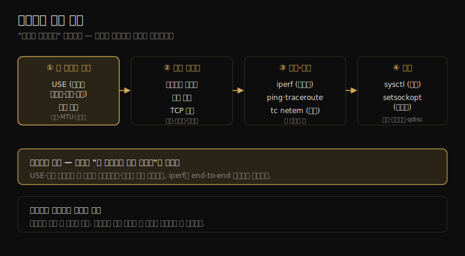

# 네트워크 (3) — 방법론·실험·튜닝
---
> 이 노트는 10.5 방법론·10.7 실험·10.8 튜닝을 다룹니다. 네트워크 성능을 *어떤 순서로 분석하고*(방법론 10종), *어떻게 부하를 걸어 재고*(ping·iperf·tc), *어떤 손잡이를 돌리는가*(sysctl·소켓 옵션)를 잡습니다.

10-01·10-02가 개념·구조였다면 이 노트는 *행동* 입니다. 네트워크가 의심받을 때 무엇부터 보는지(방법론), 호스트 사이 네트워크 건강을 어떻게 실험으로 확인하는지(ping·traceroute·iperf), 원인을 찾았을 때 무엇을 바꾸는지(튜닝)의 순서입니다.

> 방법론 10종(USE·워크로드 특성화·지연 분석·패킷 스니핑·TCP 분석·정적 튜닝 등) → 실험(ping·traceroute·iperf·netperf·tc) → 튜닝(시스템 전역 sysctl·소켓 옵션·설정) 순으로 갑니다. 저자 권장 시작 순서는 성능 모니터링·USE·정적 튜닝·워크로드 특성화입니다.

## 1. 방법론 10종 — 무엇부터 보는가

> 네트워크 분석 방법론은 10가지입니다. 저자 권장 시작 순서는 성능 모니터링 → USE → 정적 성능 튜닝 → 워크로드 특성화입니다. 빠른 병목·에러 식별에서 부하 그리기로 좁혀 갑니다.

10가지 방법론을 목적별로 묶어 봅니다.

| 방법론 | 무엇을 하나 | 유형 |
|--------|-----------|------|
| 도구 메서드 | 가용 도구를 차례로 훑으며 핵심 지표 점검 | 관측 |
| USE | 인터페이스별·방향별 사용률·포화·에러 | 관측 |
| 워크로드 특성화 | 처리량·IOPS·연결율 파악 | 관측·용량계획 |
| 지연 분석 | 여러 지연(이름해석~inter-stack)을 재 원천 좁힘 | 관측 |
| 성능 모니터링 | 처리량·연결·에러·재전송 시계열 | 관측·용량계획 |
| 패킷 스니핑 | 패킷 단위로 헤더·데이터 검사 | 관측 |
| TCP 분석 | 버퍼·백로그·혼잡 윈도·TIME_WAIT 조사 | 관측 |
| 정적 성능 튜닝 | 인터페이스 속도·MTU·라우팅·방화벽 점검 | 관측·용량계획 |
| 자원 제어 | 대역폭 한계·QoS·지연 주입 | 튜닝 |
| 마이크로벤치마킹 | iperf 등으로 처리량 한계 측정 | 실험 |

**USE 메서드** 가 빠른 병목·에러 식별의 핵심입니다 — 인터페이스별·방향별(TX/RX)로 *사용률·포화·에러* 를 봅니다. 에러를 먼저 봅니다(빠르고 해석 쉬움). 사용률은 OS 도구가 직접 안 주는 경우가 많아(nicstat 예외) 현재 처리량 ÷ 협상 속도로 계산합니다. 포화는 측정이 어렵지만 *TCP 재전송* 이 네트워크 포화의 지표가 될 수 있습니다.

**워크로드 특성화** 의 기본 축은 인터페이스 처리량(RX/TX byte/s)·IOPS(frame/s)·TCP 연결율(active/passive)입니다. 심화 점검에선 평균 패킷 크기·프로토콜 분해·활성 포트·브로드캐스트/멀티캐스트율·사용 프로세스까지 묻습니다.

> 저자 권장 시작 순서는 **성능 모니터링 → USE → 정적 성능 튜닝 → 워크로드 특성화** 입니다. 한 가지 핵심 — 네트워크는 "모르면 일단 의심받는" 자원이라(10-01), USE·정적 튜닝으로 *내 호스트의 인터페이스·설정* 을 먼저 확인해 혐의를 좁히는 게 중요합니다. 그래야 "내 네트워크 탓이 아니다"를 증거로 보일 수 있습니다.

## 2. 지연 분석·TCP 분석 — 원천 좁히기

> 지연 분석은 이름 해석부터 inter-stack까지 여러 지연을 재 진짜 원천을 좁힙니다. TCP 분석은 버퍼·백로그·혼잡 윈도·TIME_WAIT를 조사하며, 특히 포트 고갈은 잦은 연결에서 확장성 문제가 됩니다.

**지연 분석** 은 10-01의 지연 6종을 더 잘게 나눠 *최대한 많이* 재 원천을 좁힙니다 — 이름 해석·ping·TCP 연결 초기화·첫 바이트·재전송·TIME_WAIT·연결 수명·syscall 송수신·syscall connect·RTT·인터럽트·inter-stack 지연입니다. 흔한 문제는 *TCP 재전송으로 인한 지연 이상치* 인데, 전체 분포나 건당 추적(최소 지연 임계값 필터)으로 식별합니다.

지연 측정은 트레이싱 도구와 소켓 옵션으로 합니다 — Linux의 SO_TIMESTAMP(수신 시각)·SO_TIMESTAMPING(건당 타임스탬프)이 전송 지연·RTT·inter-stack 지연을 식별하며, 터널링이 얽힌 복잡한 패킷 지연 분석에 특히 유용합니다.

**TCP 분석** 은 TCP 고유 동작을 조사합니다.

| 조사 대상 | 보는 것 |
|----------|--------|
| TCP 송수신 버퍼 사용 | 처리량 제약 여부 |
| TCP 백로그 큐 사용 | 연결 폭주 흡수 여부 |
| 백로그 full 커널 드롭 | 호스트 과부하 |
| 혼잡 윈도 크기(zero window 포함) | 전송 제약 |
| TIME_WAIT 중 받은 SYN | 포트 고갈 |

특히 **포트 고갈** 이 확장성 문제입니다 — 한 서버가 같은 목적지 포트·IP로 자주 연결하면, 각 연결을 구분하는 건 클라이언트 *ephemeral 포트*(16비트)뿐입니다. TIME_WAIT(최대 60초)와 겹쳐 60초에 65,536개를 넘는 연결율이면 새 연결이 충돌합니다 — TIME_WAIT 중인 포트로 SYN을 보내면 옛 연결의 일부로 오인돼 거부될 수 있습니다. Linux는 연결 재사용·재활용으로 보통 잘 처리하고, 다중 IP나 SO_LINGER가 해법입니다.

> 둘은 짝입니다 — 지연 분석으로 "어디서 시간을 쓰는지" 좁히고, TCP 분석으로 "TCP 내부의 무엇이 막는지"(버퍼·백로그·혼잡 윈도·TIME_WAIT) 봅니다. 한 가지 주의 — 일부 지연은 *부하 중에만* 나타나는 일시적 지연이라, 더 현실적인 측정을 위해 idle 시스템뿐 아니라 *부하 중인 시스템* 도 재야 합니다.

## 3. 패킷 스니핑 — 마지막 수단의 정밀 도구

> 패킷 스니핑은 패킷 단위로 헤더·데이터를 검사하는 정밀 도구지만, CPU·저장 비용이 커 관측 분석의 마지막 수단입니다. 커널 내 BPF 필터로 원하는 패킷만 골라 오버헤드를 줄입니다.

**패킷 스니핑**(패킷 캡처)은 네트워크에서 패킷을 잡아 프로토콜 헤더·데이터를 패킷 단위로 검사합니다. 관측 분석에선 *마지막 수단* 입니다 — CPU·저장 오버헤드가 크기 때문입니다. 네트워크 커널 코드는 초당 수백만 패킷을 다루도록 사이클 최적화돼 있어, 추가 오버헤드에 민감합니다.

오버헤드를 줄이는 방법들입니다. *커널 ring buffer* 로 패킷 데이터를 유저 트레이스 도구에 공유 메모리로 넘기거나(BPF + perf 출력 ring buffer, AF_XDP), *out-of-band 스니퍼*(스위치 tap/mirror 포트에 연결된 별도 서버)를 씁니다. 무엇보다 *커널 내 BPF 필터* 로 원하는 패킷만 골라, 안 쓰는 패킷을 유저 레벨로 안 넘겨 오버헤드를 줄입니다 — 필터 표현식은 BPF 바이트코드로 컴파일돼 커널에서 JIT됩니다.

패킷 캡처 로그는 보통 타임스탬프·전체 패킷(모든 헤더 + 부분/전체 페이로드)·메타데이터(패킷 수·드롭 수)·인터페이스명을 담습니다. CPU가 비싸 과부하 시 이벤트를 드롭하는 능력을 둡니다(드롭 수를 로그에 기록).

> 핵심은 *언제 쓰느냐* 입니다 — 패킷 스니핑은 메시지 지연·누락 패킷·프로토콜 헤더 디버깅에 강력하지만, 비용이 커 짧게만 씁니다. 가능하면 BPF 기반 도구(bpftrace 등)로 *커널 안에서 집계* 해 패킷을 유저 레벨로 안 넘기는 게 낫습니다 — 그게 다음 노트(10-04) tcplife·tcpretrans가 패킷 캡처보다 싼 이유입니다.

## 4. 실험 — 네트워크 건강을 능동 측정

> 실험은 ping(연결성·RTT)·traceroute(경로)·iperf(처리량 한계)·netperf(요청/응답 지연)·tc(지연·손실 주입)로 네트워크를 능동 측정합니다. 호스트 간 end-to-end 처리량이 문제인지 확인해, 애플리케이션 디버깅 전에 네트워크를 가립니다.

실험은 상태를 관찰하는 대신 *능동적으로 부하를 걸어* 측정합니다. 방법론에서 실험·튜닝으로 이어지는 전체 흐름을 한 장으로 정리하면 다음과 같습니다.

| 도구 | 측정 |
|------|------|
| ping | ICMP echo로 연결성·RTT. 커널 타임스탬프(SO_TIMESTAMP)로 정확도↑ |
| traceroute | TTL을 1씩 늘려 홉별 경로·RTT 노출(방화벽이 ICMP 막으면 `*`) |
| pathchar | traceroute + 홉 간 대역폭(시간 오래 걸림, 잘 안 쓰임) |
| iperf | TCP/UDP 최대 처리량(병렬 모드로 라인 속도까지). 서버·클라이언트 양쪽 실행 |
| netperf | 요청/응답 성능(TCP_RR로 왕복 지연 측정) |
| tc | 큐잉 규율 선택 + netem으로 손실·지연 주입(테스트·시뮬레이션) |

**iperf** 가 가장 널리 쓰입니다 — 분산 애플리케이션의 처리량 문제를 조사할 때, 네트워크가 *기대 처리량을 낼 수 있는지* 부터 확인합니다. iperf는 애플리케이션보다 훨씬 단순해 디버깅이 빠릅니다. 100Gbit/s 같은 빠른 인터페이스는 다중 클라이언트 스레드(`-P`)로 몰아야 최대 대역폭에 닿습니다.

**tc + netem** 은 실험용 부하를 *주입* 합니다 — `tc qdisc add dev eth0 root netem loss 1%`로 1% 패킷 손실을 걸어, 다른 네트워크를 시뮬레이션하거나 손실 상황의 애플리케이션 동작을 테스트합니다.

> 실험의 자리는 *애플리케이션 디버깅 전* 입니다 — 호스트 간 end-to-end 네트워크 처리량이 문제인지 iperf로 먼저 확인해, 문제면 단순한 네트워크 마이크로벤치마크로 좁히고(애플리케이션보다 빠름), 네트워크를 원하는 속도로 튜닝한 뒤 애플리케이션으로 돌아갑니다. 즉 실험은 "네트워크를 가려(면죄) 분석을 진전시키는" 10-01의 출발 문제와 직결됩니다.

## 5. 튜닝 — 어떤 손잡이를 돌리나

> 튜닝은 시스템 전역(sysctl: 소켓·TCP 버퍼·백로그·혼잡 제어·qdisc)과 소켓별(setsockopt: 버퍼·SO_REUSEPORT·TCP_NODELAY·혼잡 제어), 설정(점보 프레임·링크 집계)에서 합니다. 다만 기본값이 대개 잘 튜닝돼 있어, 워크로드 이해가 먼저입니다.

네트워크 튜너블은 대개 이미 고성능으로 튜닝돼 있고, 스택도 워크로드에 동적으로 반응합니다. 그래서 *튜너블보다 워크로드 이해가 먼저* 입니다 — 불필요한 일을 없애는 게 더 큰 이득입니다.

**시스템 전역**(sysctl·`/proc/sys/net`)의 주요 튜너블입니다.

| 튜너블 | 역할 |
|--------|------|
| net.core.rmem_max·wmem_max | 소켓 최대 버퍼(10GbE 풀 속도엔 16MB+) |
| net.ipv4.tcp_rmem·tcp_wmem | TCP 읽기/쓰기 버퍼 auto-tuning(최소·기본·최대) |
| net.ipv4.tcp_max_syn_backlog | 첫 백로그(half-open) |
| net.core.somaxconn | 둘째 백로그(listen) |
| net.core.netdev_max_backlog | 장치 백로그(CPU별, 10GbE엔 증가) |
| net.ipv4.tcp_congestion_control | 혼잡 제어 알고리즘(cubic·bbr 등) |
| net.core.default_qdisc | 기본 qdisc(fq_codel이 흔한 기본) |

Netflix는 클라우드 인스턴스에서 14개 튜너블만 설정합니다(fq qdisc·bbr 혼잡 제어·버퍼·백로그 등) — 가능한 전부가 아니라 *워크로드에 맞는 일부* 입니다.

**소켓별**(setsockopt)은 애플리케이션이 소켓을 개별 튜닝합니다 — SO_SNDBUF/SO_RCVBUF(버퍼)·SO_REUSEPORT(다중 프로세스가 같은 포트 바인드, 확장성)·SO_MAX_PACING_RATE·TCP_NODELAY(Nagle 비활성, 지연↓·패킷↑)·TCP_CONGESTION(소켓별 혼잡 제어). **설정** 으론 점보 프레임(MTU 9,000)·링크 집계(여러 NIC 묶기)·방화벽(IP ToS/DSCP 설정)이 있습니다.

> 튜닝의 원칙은 8·9장과 같습니다 — *워크로드 특성화·정적 튜닝으로 불필요한 일을 먼저 없애고*, 그다음 튜너블을 손댑니다. 또 Tuned Project 같은 자동 튜닝 도구가 프로파일(network-latency·network-throughput)로 여러 튜너블을 한 번에 설정합니다. 시스템 전역은 *기본값*, 소켓별은 *그 연결만* 의 차이라, 특정 연결만 다르게 하려면 setsockopt를 씁니다.

## 학습 점검

> 이 노트의 핵심을 스스로 떠올려 봅니다. 답이 막히면 해당 섹션으로 돌아가 확인합니다.

- USE 메서드를 네트워크에 적용할 때 무엇을(사용률·포화·에러) 방향별로 보며, 사용률을 어떻게 계산하는지 설명해 봅니다. (→ §1)
- 포트 고갈이 왜 잦은 연결에서 확장성 문제가 되는지, ephemeral 포트·TIME_WAIT와 엮어 떠올려 봅니다. (→ §2)
- 패킷 스니핑이 마지막 수단인 까닭과, 커널 내 BPF 필터가 오버헤드를 줄이는 원리를 말해 봅니다. (→ §3)
- iperf를 애플리케이션 디버깅 *전* 에 쓰는 까닭(네트워크 면죄)을 설명해 봅니다. (→ §4)
- 튜너블 조정보다 워크로드 특성화·정적 튜닝이 먼저인 까닭과, 시스템 전역 vs 소켓별 튜닝의 차이를 떠올려 봅니다. (→ §5)