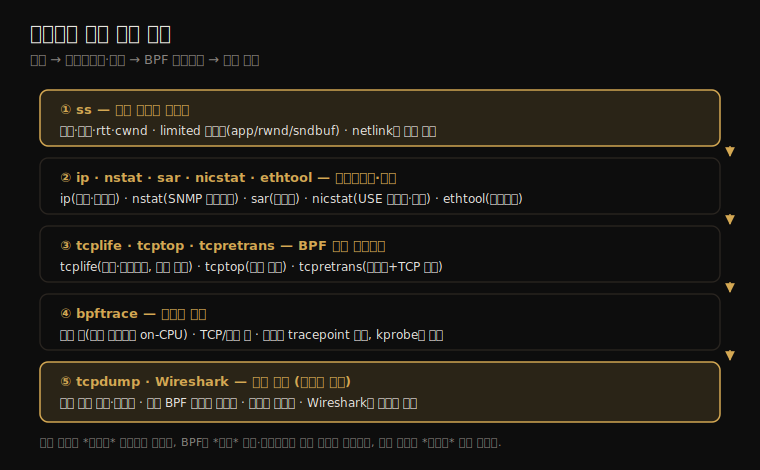

# 네트워크 (4) — 관측 도구
---
> 이 노트는 10장의 마지막으로, 10-03의 방법론을 손에 든 연장으로 옮깁니다. 소켓 통계(ss)에서 시작해 인터페이스·스택 통계(ip·nstat·sar·nicstat·ethtool), BPF 트레이싱(tcplife·tcptop·tcpretrans·bpftrace), 그리고 패킷 캡처(tcpdump·Wireshark)까지 봅니다.

도구는 소켓·연결에서 인터페이스·스택으로, 다시 패킷 단위로 깊어집니다. ss로 소켓을 보고, nstat/sar로 스택·인터페이스 통계를, tcplife/tcpretrans로 연결 수명·재전송을, tcpdump로 패킷을 봅니다. 전통 통계에서 BPF 이벤트 트레이싱·패킷 캡처로 내려가는 흐름입니다.

> ss·ip·nstat은 iproute2 패키지(네트워크 커널 엔지니어 유지보수)라 최신 커널 기능을 가장 잘 지원합니다. ifconfig·netstat은 net-tools 패키지로 널리 쓰이나 deprecated입니다. BPF 도구(tcplife·tcptop·tcpretrans)는 04-02의 이벤트 소스(sock·tcp tracepoint·kprobe) 위에 서며 15장에서 깊어집니다.


## 1. ss·ip·nstat — 소켓·인터페이스·스택 통계

> ss는 열린 소켓을 요약해(옵션으로 TCP 내부·프로세스·메모리까지) 현재 워크로드를 특성화합니다. ip는 인터페이스·라우팅 통계와 에러를, nstat은 SNMP 이름의 스택 지표(재전송율 등)를 봅니다.

분석의 출발은 소켓·인터페이스·스택 통계입니다. 네트워크 관측 도구가 소켓에서 패킷까지 어떤 흐름으로 깊어지는지를 한 장으로 정리하면 다음과 같습니다.



**ss** 는 열린 소켓을 요약합니다. 기본은 고수준 정보(프로토콜·상태·로컬/원격 주소)라, 클라이언트 연결 수·의존 서비스 동시 연결 수 같은 *현재 워크로드 특성화* 에 쓰입니다. 옵션으로 훨씬 깊이 봅니다 — `-tiepm`(TCP·내부·확장·프로세스·메모리)이 프로세스(PID·fd)·rtt·cwnd·bytes_acked·혼잡 제어(bbr) 통계·*limited 플래그*(app_limited·rwnd_limited·sndbuf_limited)를 줍니다. ss는 netlink 인터페이스로 커널에서 정보를 가져옵니다(netstat은 `/proc/net` 텍스트 파싱 — 모니터링엔 netlink가 효율적).

**ip** 는 라우팅·장치·인터페이스·터널을 관리하며 관측도 합니다 — `ip -s link`가 인터페이스별 RX/TX 바이트·패킷과 *에러*(errors·dropped·overruns·carrier·collisions)를 줍니다. 정적 성능 튜닝 때 설정 오류 점검에 유용하고, `ip route`로 라우팅 테이블(잘못된 경로가 성능 문제)을 봅니다. 단 *현재 처리량*(구간)은 안 줘서 sar를 씁니다.

**nstat** 은 커널 네트워크 지표를 SNMP 이름으로 봅니다 — IpInReceives·TcpActiveOpens(connect)·TcpPassiveOpens(accept)·TcpInSegs/OutSegs·TcpRetransSegs(재전송, OutSegs와 비교해 재전송율). `-s`로 카운터 리셋 없이 보고, 옵션 없으면 *리셋* 해서 명령 전후로 구간 변화를 봅니다.

> 세 도구의 자리가 다릅니다 — ss는 *소켓 단위*(어떤 연결이 무엇에 제약되나), ip는 *인터페이스 단위*(에러·설정), nstat은 *스택 단위*(재전송율 같은 집계)입니다. 특히 ss의 limited 플래그가 강력합니다 — 한 연결이 애플리케이션 제약(app_limited)인지 수신 윈도(rwnd)·송신 버퍼(sndbuf) 제약인지를 직접 보여 줘, 처리량이 안 나오는 원인을 짚습니다.


## 2. sar·nicstat·ethtool — 시계열·사용률·드라이버 통계

> sar는 인터페이스·IP·TCP·소켓 통계를 시계열·아카이브로, nicstat은 인터페이스 처리량과 사용률·포화를(USE 메서드에 적합), ethtool은 드라이버 통계와 정적 설정(오프로드 on/off)을 봅니다.

iostat 계열의 통계 도구로 인터페이스를 봅니다.

**sar** 는 네트워크 통계를 시계열·아카이브로 줍니다.

| 옵션 | 보는 것 |
|------|--------|
| -n DEV | 인터페이스 통계(rxpck/s·txpck/s·rxkB/s·txkB/s·%ifutil) |
| -n EDEV | 인터페이스 에러(rxerr/s·txerr/s·coll/s·rxdrop/s) |
| -n TCP·ETCP | TCP 통계(active/s·passive/s·iseg/s) / 에러(retrans/s) |
| -n SOCK | 소켓 사용(totsck·tcpsck·tcp-tw) |

sar 통계 이름은 방향·단위를 담아 외우기 쉽습니다 — rx(received)·i(input)·seg(segments) 등.

**nicstat** 은 인터페이스 처리량·사용률·포화를 줍니다 — 인터페이스명(Int)·최대 사용률(%Util)·포화 지표(Sat)와 r/w 접두 통계(KB/s·Pk/s·Avs 평균 패킷 크기). *USE 메서드에 특히 유용* 합니다 — 사용률·포화 값을 직접 주기 때문입니다.

**ethtool** 은 드라이버 통계(`-S`)와 정적 설정(`-i` 드라이버 정보·`-k` 튜너블)을 봅니다 — 정적 성능 튜닝 때 오프로드(tcp-segmentation-offload·generic-receive-offload) on/off를 확인하고, `-K`로 변경합니다.

> 세 도구가 보완합니다 — sar는 *추세*(시간에 따른 변화), nicstat은 *USE 지표*(사용률·포화 직접), ethtool은 *드라이버·설정*(오프로드·튜너블)입니다. 특히 nicstat이 사용률을 직접 주는 게 강점입니다 — 다른 도구(ip·sar)는 바이트만 줘서 사용률을 협상 속도로 나눠 계산해야 하지만, nicstat은 RX/TX 중 높은 쪽 사용률을 바로 보여 줍니다.


## 3. tcplife·tcptop·tcpretrans — 연결 수명·top·재전송

> tcplife는 TCP 세션 수명·주소·처리량·프로세스를(상태 변화 추적이라 패킷 스니퍼보다 쌈), tcptop은 TCP를 많이 쓰는 프로세스를, tcpretrans는 재전송을 주소·TCP 상태와 함께 봅니다.

이상치·연결 흐름을 BPF로 낮은 오버헤드로 봅니다.

**tcplife**(BCC/bpftrace)는 TCP 세션 수명을 추적합니다 — PID·COMM·로컬/원격 주소·포트·TX_KB·RX_KB·MS(수명). 단명(20ms 미만)·장명(3초+) 연결을 한눈에 보여 주고, 어떤 포트로 어디에 연결하는지를 봅니다. *TCP 소켓 상태 변화 이벤트* 를 추적해(TCP_CLOSE로 바뀔 때 요약 출력) 패킷보다 훨씬 드물어, 패킷 스니퍼보다 오버헤드가 낮습니다 — Netflix 운영 서버에서 TCP 흐름 로거로 상시 돌릴 만합니다.

**tcptop**(BCC)은 TCP를 많이 쓰는 프로세스를 top처럼 봅니다 — PID·COMM·로컬/원격 주소·RX_KB·TX_KB. TCP 송수신 코드 경로를 추적해 BPF map에 집계하는데, 고처리량 시스템에선 오버헤드가 측정될 수 있습니다.

**tcpretrans**(BCC/bpftrace)는 TCP 재전송을 추적합니다 — TIME·PID·주소·포트·TCP 상태. ESTABLISHED 상태의 높은 재전송율은 *외부 네트워크 문제* 를, SYN_SENT의 높은 재전송율은 *SYN 백로그를 빨리 못 비우는 과부하 서버 앱* 을 가리킵니다. 커널 재전송 이벤트를 추적해 오버헤드가 무시할 수준입니다.

> 세 도구가 보완합니다 — tcplife는 *연결 수명*(무엇이 얼마나 오래·얼마나 전송), tcptop은 *현재 top*(누가 많이), tcpretrans는 *재전송*(어디서 손실)입니다. 특히 tcpretrans가 전통 방식과 대비됩니다 — 옛날엔 패킷을 다 캡처해 후처리로 재전송을 찾아 CPU를 많이 썼지만, tcpretrans는 커널에서 *TCP 상태를 직접* 출력해, 패킷 캡처가 못 보는 커널 상태까지 줍니다.


## 4. bpftrace — 커스텀 네트워크 추적

> bpftrace는 소켓·TCP·UDP·IP·패킷·드라이버 이벤트에 한 줄 프로그램을 걸어, 연결·송수신·재전송·백로그를 원하는 대로 집계합니다. 소켓 층 추적은 책임 프로세스가 on-CPU라 코드 경로를 쉽게 식별합니다.

기성 도구로 부족하면 bpftrace로 직접 질문을 짭니다(15장).

```
# accept(2)를 PID·프로세스명별로 카운트
bpftrace -e 't:syscalls:sys_enter_accept* { @[pid, comm] = count(); }'
# TCP 송신 바이트 히스토그램
bpftrace -e 'k:tcp_sendmsg { @send_bytes = hist(arg2); }'
# TCP 재전송을 유형·원격 호스트별로(IPv4)
bpftrace -e 't:tcp:tcp_retransmit_* { @[probe, ntop(2, args->saddr)] = count(); }'
```

**소켓 층 추적** 이 특히 유리합니다 — 소켓 syscall(accept·connect·sendmsg) 시점엔 *책임 프로세스가 아직 on-CPU* 라, 애플리케이션·코드 경로를 식별하기 쉽습니다. connect의 유저 스택을 카운트하면 "이 수상한 연결이 어느 코드에서 났나"를 밝힙니다. (반면 tcp_sendmsg 같은 깊은 kprobe는 프로세스 엔드포인트가 on-CPU가 아닐 수 있어 pid·comm이 무관할 수 있습니다.)

이벤트 소스는 계층별로 다릅니다 — 애플리케이션 프로토콜은 uprobes, 소켓은 syscall tracepoint, TCP는 tcp tracepoint·kprobe, UDP·IP는 kprobe, 패킷은 skb tracepoint·kprobe, qdisc·드라이버는 qdisc·net tracepoint입니다. *가능하면 tracepoint를 씁니다* — 안정적 인터페이스이기 때문입니다(kprobe는 커널 버전에 따라 함수명이 바뀜).

예로 tcpsynbl.bt는 listen 백로그 큐 길이를 한도별 히스토그램으로 보여 줘, 큐가 얼마나 오버플로(SYN 드롭)에 가까운지를 알려 용량 계획에 씁니다.

> bpftrace의 핵심은 *추적 층 선택* 입니다 — 소켓 층은 책임 프로세스가 on-CPU라 "누가·어느 코드가" 명확하고, TCP·패킷 층은 프로토콜 내부·소켓 없는 이벤트(포트 스캔 등)까지 보지만 프로세스 식별이 약합니다. 질문에 맞는 층을 골라, 안정적 tracepoint를 우선하고 없을 때만 kprobe로 내려갑니다.


## 5. tcpdump·Wireshark — 패킷 캡처

> tcpdump는 패킷을 잡아 헤더를 한 줄씩 요약하거나 파일로 저장해 분석합니다(커널 BPF 필터로 효율화). Wireshark는 그 파일을 그래픽으로 검사해 연결별 패킷 분리·수백 프로토콜 해석을 줍니다.

마지막은 패킷 캡처입니다(10-03의 패킷 스니핑 방법론을 도구로).

**tcpdump** 는 패킷을 잡아 STDOUT에 요약하거나 파일로 저장합니다(`-w`). 패킷율이 높으면 실시간 요약을 따라가기 어려워 보통 파일 저장 후 분석(`-r`)이 실용적입니다. 각 줄은 패킷 시각(마이크로초)·출발/목적 IP·TCP 헤더 값을 보여 줘, TCP 동작과 고급 기능이 워크로드에서 잘 작동하는지를 상세히 봅니다. 옵션으로 verbose(`-v`)·링크 헤더(`-e`)·헥스 덤프(`-X`)·델타 시간(`-ttt`)을 줍니다. 출력에 *커널이 드롭한 패킷 수* 가 나옵니다(패킷율이 너무 높을 때).

tcpdump는 비싸므로(CPU·저장) *짧게만* 쓰고, 필터 표현식(pcap-filter)으로 관심 패킷만 잡습니다 — 효율을 위해 커널 내 BPF로 필터링합니다.

**Wireshark**(옛 Ethereal)는 그래픽 인터페이스로 패킷 캡처·검사를 주고, tcpdump 덤프 파일도 가져옵니다. *연결별 패킷 분리*(따로 연구)와 *수백 프로토콜 헤더 해석* 이 유용합니다. tshark(1)는 그 CLI 버전입니다.

> 패킷 캡처의 자리는 8장 strace와 같습니다 — *마지막 수단의 정밀 도구* 입니다. tcpdump로 짧게 잡아 메시지 지연·누락 패킷·프로토콜 헤더를 디버깅하되, 비용이 커 상시론 안 씁니다. 가능하면 BPF 기반 도구(tcplife·tcpretrans·bpftrace)로 *커널 안에서 집계* 해 패킷을 유저 레벨로 안 넘기는 게 낫습니다 — 깊은 분석엔 Wireshark로 덤프를 그래픽 검사합니다.


## 학습 점검

> 이 노트의 핵심을 스스로 떠올려 봅니다. 답이 막히면 해당 섹션으로 돌아가 확인합니다.

- ss·ip·nstat이 각각 무엇(소켓·인터페이스·스택)을 보며, ss의 limited 플래그가 무엇을 짚는지 설명해 봅니다. (→ §1)
- nicstat이 USE 메서드에 유용한 까닭(사용률·포화 직접)과, 다른 도구는 사용률을 어떻게 계산해야 하는지 떠올려 봅니다. (→ §2)
- tcplife가 패킷 스니퍼보다 오버헤드가 낮은 까닭과, tcpretrans의 ESTABLISHED vs SYN_SENT 재전송이 각각 무엇을 가리키는지 말해 봅니다. (→ §3)
- bpftrace의 소켓 층 추적이 TCP·패킷 층보다 프로세스 식별에 유리한 까닭을 설명해 봅니다. (→ §4)
- tcpdump를 짧게만 쓰는 까닭과, 가능하면 BPF 기반 도구를 먼저 쓰는 까닭을 떠올려 봅니다. (→ §5)