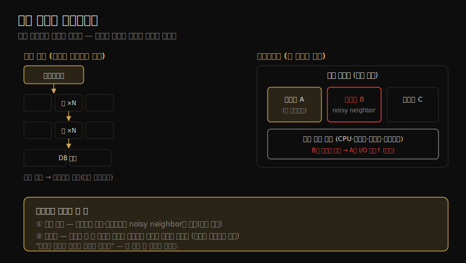

# 클라우드 컴퓨팅 (1) — 배경
---
> 이 노트는 11장의 출발점으로, 클라우드가 *옛 문제를 풀면서 새 문제를 만든다* 는 관점으로 엽니다. 인스턴스를 즉시 만들고 수요에 따라 늘리는 유연함을 얻는 대신, 가상화 오버헤드와 이웃 테넌트와의 자원 경합이라는 새 성능 과제를 떠안습니다.

클라우드는 컴퓨팅 자원을 *서비스* 로 제공해, 서버 일부에서 다중 서버까지 즉시 확장합니다. 온프레미스 데이터센터를 짓고 관리하는 오버헤드 없이 환경을 즉시 만들고 수요에 따라 키울 수 있고, 서버 일부를 고객별로 나눠 쓰는 세밀한 배치도 가능합니다. 대가는 *가상화의 성능 오버헤드* 와 *이웃 테넌트와의 자원 경합* 입니다.

> 이 노트는 11.1 배경을 다룹니다. 인스턴스 유형, 수평 확장 아키텍처, 용량 계획(자동 스케일링), 스토리지, 멀티테넌시(noisy neighbor), 오케스트레이션(Kubernetes)을 "왜 성능에 중요한가" 중심으로 정리합니다. 가상화 유형 자체(하드웨어·OS·경량)는 11-02~11-04에서 다룹니다.

## 1. 인스턴스 유형 — 튜너블이 된 하드웨어

> 클라우드는 자원별로 최적화된 다양한 인스턴스 유형·크기를 제공합니다. 재배포가 쉬워 인스턴스 유형이 *튜너블 파라미터* 처럼 바뀌어, 워크로드에 맞는 크기를 고르고 필요하면 즉시 바꿉니다.

클라우드는 자원 균형이 잡힌 범용 유형과 특정 자원(메모리·CPU·디스크)에 최적화된 유형을 제공합니다. AWS는 패밀리(문자)+세대(숫자)로 묶습니다 — m5(범용)·c5(컴퓨트)·i3/d2(스토리지)·r4/x1(메모리)·p1/g3/f1(가속, GPU·FPGA). 패밀리 안에 크기가 다양해, m5는 m5.large(2 vCPU·8GB)부터 m5.24xlarge(96 vCPU·384GB)까지입니다. 크기 전반에 가격/성능 비가 일정해 워크로드에 맞는 크기를 고를 수 있고, GCP 같은 곳은 자원량을 직접 고르는 커스텀 머신 타입도 줍니다.

핵심 변화는 **인스턴스 유형이 튜너블 파라미터가 됐다** 는 점입니다. 옵션이 많고 재배포가 쉬워, 필요에 따라 유형을 바꿀 수 있습니다.

> 이것이 전통 엔터프라이즈 모델의 큰 개선입니다 — 물리 하드웨어를 골라 주문하면 몇 년간 못 바꾸던 것과 달리, 클라우드는 워크로드에 맞춰 인스턴스를 즉시 재배포합니다. 그래서 "처음에 완벽히 사이징"하는 부담이 줄고, 측정 후 조정하는 반복이 가능해집니다.

## 2. 수평 확장 — 작은 인스턴스를 병렬로

> 엔터프라이즈는 더 큰 단일 시스템(수직 확장)으로 부하를 다뤘지만 물리·캐시 일관성·전력 한계가 있습니다. 클라우드는 작은 시스템 여럿에 부하를 분산하는 수평 확장 기반이라, 세밀한 사이징으로 최적 가격/성능을 냅니다.

엔터프라이즈는 역사적으로 *수직 확장*(메인프레임처럼 더 큰 단일 시스템)으로 부하를 다뤘는데, 한계가 있습니다 — 물리 크기 한계, CPU 수가 늘수록 커지는 캐시 일관성 문제, 전력·냉각입니다. 해법이 *수평 확장*(작은 시스템 여럿에 부하 분산)이고, 클라우드가 이를 기반으로 합니다.

전형적 환경은 로드밸런서·웹 서버·애플리케이션 서버·데이터베이스 각 층이 병렬 인스턴스로 구성되고, 부하에 따라 더 추가됩니다. 도전 과제는 *전통 데이터베이스 배치* 입니다 — 한 인스턴스가 primary여야 하므로, MySQL 같은 DB는 데이터를 *샤드* 로 논리 분할해 각 샤드를 자체 DB가 관리합니다. Riak·Cassandra·CockroachDB·Aurora·DynamoDB 같은 분산·클라우드 네이티브 DB는 병렬 실행을 동적으로 처리합니다.

> 핵심은 *세밀한 사이징* 입니다 — 인스턴스당 크기가 작으면(512GB 호스트에 8GB 인스턴스 등), 거대 시스템에 미리 투자해 대부분 놀리는 대신 최적 가격/성능을 얻습니다. 즉 수평 확장은 "큰 하나"가 아니라 "작은 여럿"으로 가는 전환이고, 그래서 자원을 부하에 맞춰 잘게 조절할 수 있습니다.

## 3. 용량 계획 — 자동 스케일링과 그 함정

> 온프레미스는 정밀한 용량 계획이 필수였지만(서버 도입에 몇 달), 클라우드는 부하에 반응해 인스턴스를 즉시 늘립니다. 자동 스케일링은 부하 변화에 빠르게 대응하나, DoS·성능 회귀가 과잉 프로비저닝을 부를 위험이 있어 모니터링이 중요합니다.

온프레미스 서버는 하드웨어·서비스 계약 비용이 크고 도입에 몇 달이 걸려(승인·부품·배송·설치·테스트), *정밀한 용량 계획* 이 필수였습니다 — 너무 작으면 실패, 너무 크면 (계약까지 수년간) 비쌌습니다. 클라우드는 다릅니다 — 인스턴스가 싸고 즉시 만들고 없앨 수 있어, 미리 계획하는 대신 *실제 부하에 반응해* 인스턴스를 늘립니다(클라우드 API로 자동화). 스타트업이 단일 인스턴스에서 수천 개로 정밀 계획 없이 성장할 수 있습니다.

**자동 스케일링(auto scaling)** 은 부하 증가에 따라 인스턴스를 자동으로 늘립니다(AWS ASG). 마이크로서비스 아키텍처와 잘 맞고, 부하의 일일 패턴에 맞춰 분 단위로 용량을 맞출 수 있습니다 — Netflix는 일일 streams-per-second 패턴에 맞춰 매일 수만 인스턴스를 더하고 뺍니다. Pinterest는 업무 외 시간 시스템 종료로 $54→$20/시로 절감했습니다.

> 자동 스케일링의 함정은 *과잉 프로비저닝* 입니다 — DoS 공격이 부하 증가처럼 보여 비싼 인스턴스 증가를 유발하거나, 성능 회귀가 같은 부하에 더 많은 인스턴스를 요구합니다. 그래서 *모니터링* 으로 증가가 타당한지 검증해야 합니다. 한편 *bursting* 은 가용한 유휴 CPU를 즉시 빌려 줘(무료) 과잉 프로비저닝을 막는 완충을 제공합니다 — 부하가 실제로 지속될지 확인할 시간을 벌어 줍니다.

## 4. 스토리지 — 휘발성 로컬과 영속 네트워크

> 인스턴스 스토리지는 휘발성이라 인스턴스 파괴 시 사라집니다. 영속 저장은 별도 서비스(파일/블록/오브젝트 스토어)를 쓰는데, 네트워크 경유라 로컬 디스크보다 성능 예측이 어렵고, 자주 쓰는 데이터는 인메모리 캐시로 완화합니다.

인스턴스는 OS·애플리케이션·임시 파일용 스토리지가 필요합니다. 로컬 물리 스토리지나 네트워크 스토리지가 제공하는데, *인스턴스 스토리지는 휘발성*(ephemeral)이라 인스턴스 파괴 시 사라집니다. 영속 저장은 독립 서비스를 씁니다.

| 유형 | 방식 | 예시 |
|------|------|------|
| 파일 스토어 | NFS 등 파일 | Amazon EFS |
| 블록 스토어 | iSCSI 등 블록 | Amazon EBS |
| 오브젝트 스토어 | API(주로 HTTP) | Amazon S3 |

이들은 *네트워크* 로 동작하고, 네트워크 인프라·스토리지 장치 모두 다른 테넌트와 공유합니다. 그래서 로컬 디스크보다 성능 예측이 훨씬 어렵습니다 — 다만 클라우드 제공자의 자원 제어로 일관성을 높일 수 있습니다.

> 네트워크 스토리지의 늘어난 지연은 보통 *자주 쓰는 데이터의 인메모리 캐시* 로 완화합니다. 신뢰성 있는 성능이 필요하면 IOPS 비율을 구매할 수 있습니다(EBS Provisioned IOPS). 핵심은 8·9장의 디스크 분석이 그대로 적용되되, *공유 네트워크 자원* 이라는 변수가 더해진다는 점입니다 — 같은 EBS 볼륨이라도 이웃과 네트워크·스토리지를 공유해 지연이 변동합니다.

## 5. 멀티테넌시·Kubernetes — 공유의 새 문제

> 멀티테넌시는 여러 OS 인스턴스가 같은 물리 시스템에 공존해, noisy neighbor(자원을 공격적으로 쓰는 이웃)가 성능 문제를 일으킵니다. 자원 제어로 격리하고, Kubernetes 같은 오케스트레이션이 컨테이너 배치·확장·네트워킹을 관리합니다.

수평 확장과 멀티테넌시가 클라우드에서 어떻게 맞물리는지를 한 장으로 정리하면 다음과 같습니다.

**멀티테넌시** 가 클라우드의 새 문제입니다. Unix는 여러 사용자·프로세스가 자원을 공유하도록 설계됐고, Linux가 자원 한계·관측을 더했습니다. 클라우드는 *전체 OS 인스턴스* 가 같은 물리 시스템에 공존한다는 점이 다릅니다 — 각 게스트는 격리된 OS라 보통 다른 게스트의 사용자·프로세스를 못 봅니다(정보 유출 방지).

자원이 공유되므로 **noisy neighbor**(시끄러운 이웃)가 문제입니다 — 같은 호스트의 다른 게스트가 내 피크 부하 중 DB 전체 덤프를 돌려 내 디스크·네트워크 I/O를 방해하거나, 마이크로벤치마크로 자원을 일부러 포화시킬 수 있습니다. 해법은 *자원 관리(자원 제어)* 로 성능 격리를 두는 것 — 테넌트별 한계·우선순위를 CPU·메모리·I/O·네트워크에 부과합니다. 경합을 *관측* 할 수 있으면 한계를 튜닝하고 테넌트 균형을 잡을 수 있는데, 관측성은 가상화 유형에 따라 다릅니다(11-02~11-04).

**Kubernetes**(k8s)는 가장 인기 있는 오케스트레이션 소프트웨어입니다. 컨테이너로 애플리케이션 배포를 관리하며, co-located 그룹인 *Pod* 로 배포합니다(Pod 안 컨테이너는 자원 공유·localhost 통신). 성능 과제는 *스케줄링*(어느 노드에 컨테이너를 둘지)과 *네트워크 성능*(컨테이너 네트워킹·로드밸런싱의 추가 컴포넌트)입니다. 네트워킹은 CNI 플러그인(iptables 기반 Calico, BPF 기반 Cilium)으로 구현되고, Kubernetes는 현재 블록 I/O를 제한하지 않아 디스크 경합이 성능 문제가 될 수 있습니다.

> 멀티테넌시와 Kubernetes의 공통 주제는 *공유의 관리* 입니다 — 멀티테넌시는 자원 제어로 noisy neighbor를 통제하고, Kubernetes는 스케줄링·네트워킹으로 컨테이너 공유를 조율합니다. 핵심은 "공유가 효율을 주지만 경합을 부른다"는 점이고, 그래서 자원 제어와 관측성이 클라우드 성능 분석의 두 축이 됩니다.

## 학습 점검

> 이 노트의 핵심을 스스로 떠올려 봅니다. 답이 막히면 해당 섹션으로 돌아가 확인합니다.

- 인스턴스 유형이 "튜너블 파라미터"가 됐다는 말이 전통 엔터프라이즈 모델과 어떻게 다른지 설명해 봅니다. (→ §1)
- 수평 확장이 수직 확장의 어떤 한계를 풀며, 세밀한 사이징이 왜 가격/성능에 유리한지 떠올려 봅니다. (→ §2)
- 자동 스케일링의 과잉 프로비저닝 위험과, bursting이 이를 어떻게 완화하는지 말해 봅니다. (→ §3)
- 네트워크 스토리지가 로컬 디스크보다 성능 예측이 어려운 까닭과, 그 완화책을 설명해 봅니다. (→ §4)
- noisy neighbor가 무엇이며, 자원 제어와 관측성이 왜 클라우드 성능의 두 축인지 떠올려 봅니다. (→ §5)