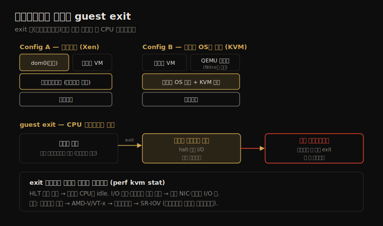

# 클라우드 컴퓨팅 (2) — 하드웨어 가상화
---
> 이 노트는 11.2 하드웨어 가상화를 다룹니다. 하이퍼바이저가 게스트마다 자체 커널을 가진 가상 머신을 만들고 관리하는 방식, 그 성능 오버헤드(특히 guest exit와 I/O), 자원 제어, 그리고 호스트·게스트에서의 관측을 Xen·KVM·Nitro를 예로 봅니다.

하드웨어 가상화는 자체 커널을 포함한 전체 OS를 돌리는 가상 머신(VM)을 만듭니다. 하이퍼바이저(VMM)가 VM을 생성·관리하며, 옛 Type 1/2 분류 대신 실용적으로 Config A(네이티브·베어메탈, Xen)와 Config B(호스트 OS가 실행, KVM)로 봅니다. 클라우드 성능 문제를 조사할 때 *언제 오버헤드가 생기고 안 생기는지* 를 아는 게 중요합니다.

> 구현(VMware·Xen·KVM·Nitro) → 오버헤드(CPU·메모리·I/O·멀티테넌트 경합) → 자원 제어(CPU·메모리·I/O) → 관측(호스트·게스트) 순으로 갑니다. 가상화는 바이너리 변환 → 프로세서 지원(AMD-V·VT-x) → 패러버추얼라이제이션 → 하드웨어 디바이스 지원(SR-IOV)으로 발전했습니다.

## 1. 구현 — VMware·Xen·KVM·Nitro

> 하이퍼바이저 구현은 Config A(베어메탈, Xen)와 Config B(호스트 OS가 실행, KVM)로 나뉩니다. 둘 다 I/O 프록시(QEMU)를 쓸 수 있어 오버헤드가 붙는데, Nitro는 하드웨어 지원으로 프록시를 없애 베어메탈에 가까운 성능을 냅니다.

원래 하드웨어 하이퍼바이저(VMware, 1998)는 *바이너리 변환* 으로 전체 하드웨어 가상화를 했습니다 — 특권 명령(syscall·페이지 테이블)을 실행 전 재작성하고, 비특권 명령은 프로세서에서 직접 실행합니다. 이후 프로세서 가상화 지원(AMD-V·VT-x)·패러버추얼라이제이션·디바이스 하드웨어 지원(SR-IOV)으로 개선됐습니다.

| 구현 | 성격 |
|------|------|
| VMware ESX | 베어메탈 마이크로커널 하이퍼바이저. 엔터프라이즈 서버 통합 |
| Xen | Type 1. 패러버추얼 게스트로 고성능. 도메인(dom0이 관리). 옛 EC2 기반 |
| Hyper-V | Type 1. 파티션으로 게스트 실행. Azure |
| KVM | Type 2(커널 모듈). QEMU와 짝지어 완전한 VM 생성. GCE 기반 |
| Nitro | KVM 기반 + 모든 주요 자원에 하드웨어 지원. QEMU 프록시 없음. 베어메탈급 |

Config A(Xen)·Config B(KVM) 둘 다 게스트 I/O를 위해 dom0(Xen)나 호스트 OS(KVM)에서 *I/O 프록시(QEMU)* 를 돌릴 수 있는데, 이게 I/O에 오버헤드를 더합니다. 현대 Xen은 PVHVM(HVM 모드 부팅 + PV 드라이버)으로, 나아가 SR-IOV로 일부 드라이버를 하드웨어 가상화에 전적으로 맡겨 개선했습니다.

> 구현의 핵심 차이는 *I/O 경로의 단계 수* 입니다 — Nitro는 하드웨어 지원으로 I/O 프록시(추가 단계)를 없앱니다. 저자는 "최대 성능을 추구하는 모든 대형 클라우드 제공자가 Nitro처럼 하드웨어 지원으로 I/O 프록시를 없애는 방향을 따를 것"이라 봅니다. 즉 가상화 발전사는 "소프트웨어 변환 → 하드웨어 직접 접근"으로 오버헤드를 줄여 온 역사입니다.

## 2. CPU 오버헤드 — guest exit가 핵심

> 게스트 애플리케이션은 보통 프로세서에서 직접 실행돼 CPU-bound 작업은 베어메탈과 거의 같습니다. 오버헤드는 특권 명령·하드웨어 접근·메모리 매핑 시 하이퍼바이저로의 전환(guest exit)에서 생기며, exit 처리 시간이 곧 CPU 오버헤드입니다.

게스트 애플리케이션은 일반적으로 프로세서에서 *직접 실행* 되어, CPU-bound 작업은 베어메탈과 거의 같은 성능입니다. CPU 오버헤드는 특권 프로세서 호출·하드웨어 접근·메모리 매핑 때, 하이퍼바이저가 어떻게 처리하느냐에 따라 생깁니다. 명령 처리 방식:

- **바이너리 변환**: 물리 자원에 작용하는 게스트 커널 명령을 식별·변환(하드웨어 지원 전 방식, 큰 CPU 오버헤드).
- **패러버추얼라이제이션**: 가상화 필요 명령을 하이퍼콜로 교체(게스트 OS 수정 필요).
- **하드웨어 지원**: 수정 안 된 게스트 커널 명령이 ring 0 아래 VMM으로 trap돼 처리.

두 하이퍼바이저 구성과 guest exit가 CPU 오버헤드가 되는 흐름을 한 장으로 정리하면 다음과 같습니다.

핵심 개념이 **guest exit** 입니다 — 가상 CPU가 게스트 안에서 실행을 멈추고 하이퍼바이저로 빠져나가는 이벤트입니다. exit 밖(하이퍼바이저)에서 보낸 시간이 곧 하드웨어 가상화의 CPU 오버헤드입니다 — exit 처리에 시간을 더 쓸수록 오버헤드가 큽니다. 일부 exit는 커널에서 직접 처리되지만, 못 하는 것은 커널을 떠나 유저 프로세스로 돌아가 *더 큰* 오버헤드를 냅니다.

KVM은 exit 이유를 핸들러로 매핑합니다 — handle_halt(idle 스레드의 halt)·handle_io(I/O 명령)·handle_cpuid·handle_rdmsr 등. 가장 흔한 exit 하나가 *halt*(커널이 더 할 일 없을 때 idle 스레드가 호출)입니다.

> CPU 오버헤드의 핵심 지표는 *guest exit의 빈도와 처리 시간* 입니다. exit가 적고 그중 halt 비율이 높으면 게스트 CPU가 꽤 idle하다는 뜻이고, I/O 명령·인터럽트 주입이 많으면 가상 NIC·디스크로 I/O 중이라는 뜻입니다. 이 exit를 분석하면 게스트 내부를 직접 못 봐도 하드웨어 가상화 오버헤드가 테넌트에 미치는 영향을 특성화할 수 있습니다(4절 관측).

## 3. 메모리·I/O 오버헤드 — 매핑 두 단계와 I/O 경로

> 메모리 매핑은 게스트 가상→게스트 물리→호스트 물리 두 단계라, EPT/NPT(하드웨어) 또는 shadow page table로 가속합니다. I/O는 역사적으로 가장 큰 오버헤드였으나, 패러버추얼 드라이버·PCI pass-through·SR-IOV로 줄여 왔습니다.

**메모리 매핑** 오버헤드는 두 단계 변환에서 옵니다 — 게스트 가상→게스트 물리(게스트 커널)와 게스트 물리→호스트 물리(하이퍼바이저 VMM). 이 매핑은 TLB에 캐시돼 이후 접근은 정상 속도입니다. 현대 프로세서는 MMU 가상화를 지원해, TLB에서 빠진 매핑을 하이퍼바이저 호출 없이 하드웨어만으로 더 빠르게 되찾습니다 — Intel EPT, AMD NPT입니다. 없으면 *shadow page table*(VMM이 관리하는 게스트가상→호스트물리 매핑)로 가속합니다.

**메모리 크기** 오버헤드도 있습니다 — 게스트마다 자체 커널이 메모리를 약간 쓰고, 스토리지 아키텍처가 *이중 캐싱*(게스트·호스트가 같은 데이터 캐시)을 부르며, KVM류는 VM마다 QEMU 프로세스가 메모리를 씁니다.

**I/O** 는 역사적으로 가장 큰 오버헤드였습니다 — 모든 디바이스 I/O를 하이퍼바이저가 변환해야 했고, 10Gbit/s 같은 고빈도 I/O는 건당 작은 오버헤드도 전체 성능을 크게 떨어뜨렸습니다. 완화 기술:

| 기술 | 동작 |
|------|------|
| 패러버추얼 드라이버 | I/O를 합치고 디바이스 인터럽트를 줄여 하이퍼바이저 오버헤드↓ |
| PCI pass-through | PCI 디바이스를 게스트에 직접 할당(베어메탈처럼) — 최고 성능, 유연성↓ |
| SR-IOV / MR-IOV | 하드웨어 가상화로 게스트가 하드웨어 직접 접근 |

Xen·KVM·Nitro의 I/O 경로가 다릅니다 — Xen은 dom0과 게스트 도메인 사이 *device channel*(비동기 공유 메모리)로 추가 복사를 피하고, KVM은 Xen보다 적은 단계로 I/O를 처리합니다. **Nitro는 추가 I/O 단계를 아예 없앱니다.**

> 메모리·I/O 오버헤드의 공통 주제는 *하드웨어 지원으로 소프트웨어 단계를 없애는 것* 입니다 — 메모리는 EPT/NPT로 두 단계 변환을 하드웨어가, I/O는 SR-IOV로 게스트가 하드웨어를 직접 접근합니다. 한편 *멀티테넌트 경합* 도 있습니다 — CPU·캐시 공유로 stolen time·캐시 오염이 생기는데, 이는 VM보다 컨테이너에서 더 큰 문제입니다(11-03).

## 4. 자원 제어 — vCPU·메모리·I/O 제한

> CPU는 vCPU 수로 거칠게, 하이퍼바이저 스케줄러(Xen credit·KVM cgroup)로 세밀하게 제한합니다. 메모리는 게스트 설정으로 고정하되 balloon 드라이버로 유연성을 더하고, I/O는 호스트 커널 기능(cgroup·qdisc)이나 하드웨어로 제한합니다.

**CPU** 는 보통 vCPU로 할당돼 하이퍼바이저가 스케줄링하며, vCPU 수가 CPU 사용을 거칠게 제한합니다. 세밀한 쿼터는 Xen은 하이퍼바이저 CPU 스케줄러(BVT·SEDF·credit-based)로, KVM은 호스트 OS(cgroup CPU bandwidth)로 부과합니다. 한계는 *게스트 우선순위를 존중하기 어렵다* 는 점입니다 — 게스트 CPU 사용이 하이퍼바이저엔 불투명해, 한 게스트의 저우선 로그 데몬이 다른 게스트의 핵심 앱과 같은 우선순위일 수 있습니다. Xen은 고I/O 워크로드가 dom0 CPU를 추가 소비하는 문제가 있어, *격리 드라이버 도메인(IDD)* 으로 I/O 서비스를 분리·계정합니다. CPU 캐시는 Intel CAT로 게스트별 LLC 분할이 가능합니다(단 캐시 제한이 성능도 해침).

**메모리 용량** 은 게스트 설정으로 부과돼 게스트가 정해진 양만 봅니다. 정적 설정의 유연성을 위해 VMware가 *balloon 드라이버* 를 개발했습니다 — 게스트 안에서 balloon 모듈을 "부풀려" 게스트 메모리를 소비하면, 그 메모리를 하이퍼바이저가 회수해 다른 게스트에 씁니다(deflate로 반환). Xen·KVM도 지원합니다.

**디바이스 I/O** 는 역사적으로 CPU 제어로 간접 제한했습니다. 네트워크 처리량은 외부 전용 장치나 호스트 커널(cgroup 대역폭·qdisc)로 throttle하고, 하드웨어 지원 하이퍼바이저(Nitro)는 하드웨어나 외부 장치가 I/O 한계를 부과합니다(EC2는 외부 시스템으로 네트워크·EBS I/O를 쿼터에 throttle).

> 자원 제어의 핵심은 *KVM류는 호스트 OS 제어를 함께 쓸 수 있다* 는 점입니다 — 호스트가 물리 자원을 최종 통제하므로 cgroup·taskset이 하이퍼바이저 제어에 더해 적용됩니다(11-03 OS 가상화 자원 제어 참조). balloon 드라이버가 동작 중이면(게스트 dmesg에서 "balloon" 검색) 그것이 일으킬 성능 문제를 주시합니다.

## 5. 관측 — 호스트는 자원, 게스트는 커널

> 호스트(Xen dom0·KVM)에서는 물리 자원을 게스트별로 관측하지만 게스트 내부(프로세스)는 직접 못 봅니다. 게스트에서는 자체 커널이라 BPF 등 커널 추적 도구가 다 동작하고, vmstat의 steal로 가상화를 인지할 수 있습니다.

관측은 도구를 *어디서 띄우느냐* 에 따라 다릅니다.

**호스트에서**(Xen dom0·KVM): 물리 자원을 표준 OS 도구로 관측합니다. Xen은 vCPU가 하이퍼바이저에 있어 표준 도구로 안 보이고 `xentop`을 씁니다(CPU%·MEM·VBD_RD/WR 등). KVM은 게스트가 `qemu-system-x86` 프로세스로 보여 top·pidstat로 vCPU 스레드(CPU N/KVM)를 봅니다. 특히 **guest exit 분석** 이 강력합니다 — `perf kvm stat`로 exit 유형별 통계(HLT가 길면 게스트 CPU가 idle, I/O가 많으면 가상 NIC·디스크 I/O)를 보고, kvm:kvm_exit/kvm_entry tracepoint로 exit 이유·지속시간을 잽니다(kvmexits.bt). 단 *게스트 내부 프로세스는 직접 못 봅니다* — SSH로 게스트에 로그인해야 합니다.

**게스트에서**: 가상화된 자원과 그 사용만 보이고 물리 문제는 추론합니다. **핵심은 게스트가 자체 전용 커널을 가져, 커널 추적 도구(perf·Ftrace·BPF)가 다 동작한다** 는 점입니다 — root가 전체 커널 접근권을 가지므로 biosnoop 같은 BPF 도구로 가상 디스크 지연을 봅니다. vmstat의 *steal*(st) 컬럼이 가상화 인지 통계의 드문 예 — 게스트가 못 쓴 CPU 시간(다른 테넌트·하이퍼바이저 기능)을 보여 줍니다.

> 관측의 핵심 대비는 *호스트는 자원, 게스트는 커널* 입니다 — 호스트는 물리 자원을 게스트별로 보지만 게스트 내부는 못 보고, 게스트는 자체 커널이라 커널 추적이 다 되지만 물리 자원은 추론만 합니다. **이것이 컨테이너(11-03)와 결정적으로 다른 점** 입니다 — VM 게스트는 커널 추적 도구가 다 동작하지만, 컨테이너 게스트는 보통 커널을 분석할 수 없습니다. 게스트에서 물리 자원이 안 보여 "noisy neighbor 탓"으로 돌리기 쉬워, 제공자가 물리 자원 사용(redacted)을 SNMP·API로 제공하기도 합니다.

## 학습 점검

> 이 노트의 핵심을 스스로 떠올려 봅니다. 답이 막히면 해당 섹션으로 돌아가 확인합니다.

- Config A(Xen)와 Config B(KVM)의 차이와, Nitro가 I/O 프록시를 없애 베어메탈급 성능을 내는 까닭을 설명해 봅니다. (→ §1)
- guest exit가 무엇이며, exit 빈도·유형(halt vs I/O)으로 게스트 상태를 어떻게 추론하는지 떠올려 봅니다. (→ §2)
- 메모리 매핑 두 단계를 EPT/NPT가 어떻게 가속하며, I/O 오버헤드를 SR-IOV가 어떻게 줄이는지 말해 봅니다. (→ §3)
- balloon 드라이버가 정적 메모리 설정에 어떻게 유연성을 더하는지, KVM이 호스트 OS 자원 제어를 함께 쓸 수 있는 까닭을 설명해 봅니다. (→ §4)
- VM 게스트에서 커널 추적 도구가 다 동작하는 까닭과, 이것이 컨테이너와 어떻게 다른지 떠올려 봅니다. (→ §5)