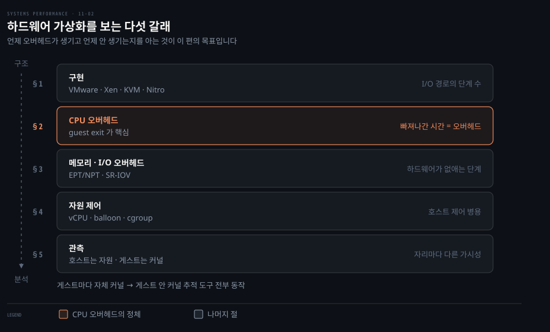
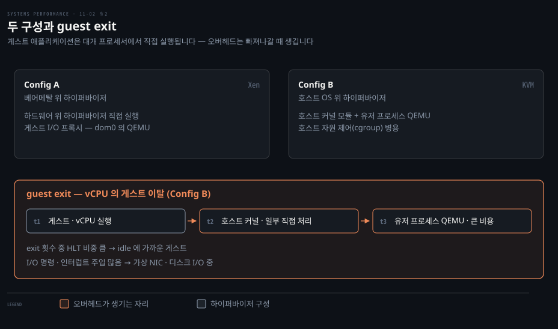
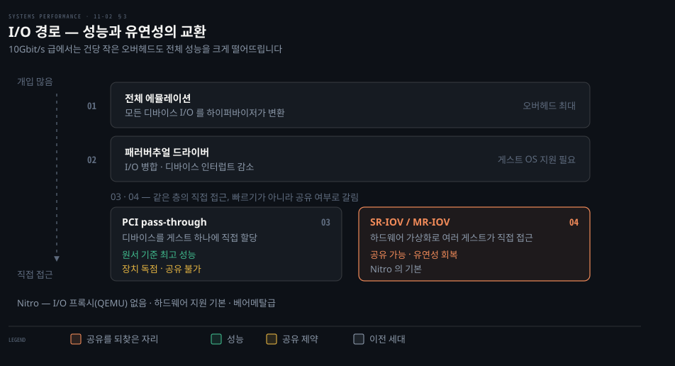

# 클라우드 컴퓨팅 (2) — 하드웨어 가상화
---
> 이 노트는 11.2 하드웨어 가상화를 다룹니다. 하이퍼바이저가 게스트마다 자체 커널을 가진 가상 머신을 만들고 관리하는 방식, 그 성능 오버헤드(특히 guest exit와 I/O), 자원 제어, 그리고 호스트·게스트에서의 관측을 Xen·KVM·Nitro를 예로 봅니다.

## 핵심 요약

> 이 편이 매달린 하나의 생각은 **가상화 오버헤드가 늘 붙어 있는 세금이 아니라, 게스트가 하이퍼바이저로 빠져나가는 순간에만 생기는 비용이라는 것**입니다.

하드웨어 가상화는 자체 커널을 포함한 전체 OS를 돌리는 가상 머신을 만듭니다. 하이퍼바이저가 그 VM을 생성하고 관리합니다. 옛 Type 1/2 분류 대신 실용적으로 둘로 봅니다. Config A는 베어메탈 위에서 도는 것(Xen), Config B는 호스트 OS가 실행하는 것(KVM)입니다.

성능을 볼 때 중요한 것은 *언제 오버헤드가 생기고 언제 안 생기는지* 입니다. 게스트 애플리케이션은 대개 프로세서에서 직접 실행되므로 CPU-bound 작업은 베어메탈과 거의 같습니다. 비용은 특권 명령이나 하드웨어 접근처럼 하이퍼바이저의 손을 빌려야 하는 순간에 발생합니다.

그래서 가상화 발전사는 한 방향으로 읽힙니다. 소프트웨어가 대신하던 일을 하드웨어에 넘겨 그 순간의 수와 비용을 줄여 온 역사입니다. 바이너리 변환에서 프로세서 지원(AMD-V·VT-x)으로, 패러버추얼라이제이션을 거쳐 디바이스 하드웨어 지원(SR-IOV)까지 왔습니다.

## 학습 목표

> 이 편을 덮은 뒤 스스로 할 수 있어야 하는 일을 먼저 적어 둡니다.

- Config A와 Config B의 차이를 말하고, Nitro가 무엇을 없애 베어메탈급이 되는지 설명합니다.
- guest exit가 무엇인지 답하고, exit 유형으로 게스트 상태를 추론합니다.
- 메모리 매핑이 왜 두 단계인지, EPT/NPT가 그것을 어떻게 줄이는지 말합니다.
- balloon 드라이버가 고정 메모리 설정에 어떤 유연성을 더하는지 설명합니다.
- 호스트와 게스트에서 각각 무엇이 보이고 무엇이 안 보이는지 구분합니다.

구현에서 시작해 오버헤드가 생기는 자리를 짚고, 제어와 관측으로 넘어갑니다.

## 이 문서가 다루지 않는 것

> 앞뒤 편으로 넘긴 주제를 밝혀 둡니다.

- **클라우드 일반 배경**(인스턴스 유형·수평 확장·멀티테넌시) — 11-01이 다룹니다.
- **컨테이너**(namespace·cgroup) — 11-03이 다룹니다.
- **경량 가상화와 세 기술 비교** — 11-04가 다룹니다.

일반 네트워킹·OS 이론은 전제합니다.

## 1. 구현 — VMware·Xen·KVM·Nitro

> 하이퍼바이저 구현은 Config A(베어메탈, Xen)와 Config B(호스트 OS가 실행, KVM)로 나뉩니다. 둘 다 I/O 프록시(QEMU)를 쓸 수 있어 오버헤드가 붙는데, Nitro는 하드웨어 지원으로 프록시를 없애 베어메탈에 가까운 성능을 냅니다.

게스트 커널은 자기가 하드웨어를 직접 만진다고 믿습니다. 그 믿음을 깨지 않으면서 실제 하드웨어를 여럿이 나눠 쓰게 만드는 것이 하이퍼바이저의 일이고, 그 방법이 세대마다 달랐습니다.

1998년 VMware의 하드웨어 하이퍼바이저는 *바이너리 변환* 으로 전체 하드웨어를 가상화했습니다. syscall이나 페이지 테이블 조작 같은 특권 명령을 실행 전에 재작성하고, 나머지 비특권 명령은 프로세서에서 그대로 돌렸습니다.

이후 세 갈래로 개선됐습니다. 프로세서 가상화 지원(AMD-V·VT-x), 패러버추얼라이제이션, 그리고 디바이스 하드웨어 지원(SR-IOV)입니다.

| 구현 | 성격 |
|------|------|
| VMware ESX | 베어메탈 마이크로커널 하이퍼바이저. 엔터프라이즈 서버 통합 |
| Xen | Type 1. 패러버추얼 게스트로 고성능. 도메인(dom0이 관리). 옛 EC2 기반 |
| Hyper-V | Type 1. 파티션으로 게스트 실행. Azure |
| KVM | Type 2(커널 모듈). QEMU와 짝지어 완전한 VM 생성. GCE 기반 |
| Nitro | KVM 기반 + 모든 주요 자원에 하드웨어 지원. QEMU 프록시 없음. 베어메탈급 |

두 구성 모두 게스트 I/O를 위해 *I/O 프록시* 를 돌릴 수 있습니다. Xen은 dom0에서, KVM은 호스트 OS에서 QEMU를 띄웁니다. 이 프록시가 I/O 경로에 단계를 하나 더해 오버헤드가 됩니다.

현대 Xen은 이를 두 단계로 개선했습니다. HVM 모드로 부팅하면서 PV 드라이버를 쓰는 PVHVM이 하나이고, SR-IOV로 일부 드라이버를 하드웨어 가상화에 전적으로 맡기는 것이 다음입니다.

> 구현의 핵심 차이는 *I/O 경로의 단계 수* 입니다 — Nitro는 하드웨어 지원으로 I/O 프록시(추가 단계)를 없앱니다. 최대 성능을 추구하는 대형 클라우드 제공자라면 결국 이 방향, 곧 하드웨어 지원으로 I/O 프록시를 없애는 쪽으로 갈 것으로 전망됩니다. 즉 가상화 발전사는 "소프트웨어 변환 → 하드웨어 직접 접근"으로 오버헤드를 줄여 온 역사입니다.

## 2. CPU 오버헤드 — guest exit가 핵심

> 게스트 애플리케이션은 보통 프로세서에서 직접 실행돼 CPU-bound 작업은 베어메탈과 거의 같습니다. 오버헤드는 특권 명령·하드웨어 접근·메모리 매핑 시 하이퍼바이저로의 전환(guest exit)에서 생기며, exit 처리 시간이 곧 CPU 오버헤드입니다.

게스트 애플리케이션은 일반적으로 프로세서에서 *직접 실행* 되어, CPU-bound 작업은 베어메탈과 거의 같은 성능입니다. CPU 오버헤드는 특권 프로세서 호출·하드웨어 접근·메모리 매핑 때, 하이퍼바이저가 어떻게 처리하느냐에 따라 생깁니다. 명령 처리 방식은 셋입니다.

- **바이너리 변환**: 물리 자원에 작용하는 게스트 커널 명령을 식별·변환(하드웨어 지원 전 방식, 큰 CPU 오버헤드).
- **패러버추얼라이제이션**: 가상화 필요 명령을 하이퍼콜로 교체(게스트 OS 수정 필요).
- **하드웨어 지원**: 수정 안 된 게스트 커널 명령이 ring 0 아래 VMM으로 trap돼 처리.

핵심 개념이 **guest exit** 입니다. 가상 CPU가 게스트 안에서 실행을 멈추고 하이퍼바이저로 빠져나가는 이벤트를 말합니다.

게스트 밖에서 보낸 시간이 곧 하드웨어 가상화의 CPU 오버헤드입니다. exit 처리에 시간을 더 쓸수록 오버헤드가 커집니다. 일부 exit는 커널에서 바로 처리되지만, 그러지 못하는 것은 커널을 떠나 유저 프로세스까지 돌아가 *더 큰* 비용을 냅니다.

KVM은 exit 이유마다 핸들러를 둡니다. `handle_halt` 는 idle 스레드의 halt를, `handle_io` 는 I/O 명령을 받고, `handle_cpuid`·`handle_rdmsr` 같은 것도 있습니다.

가장 흔한 exit 하나가 *halt* 입니다. 커널이 더 할 일이 없을 때 idle 스레드가 호출합니다.

> CPU 오버헤드의 핵심 지표는 *guest exit의 빈도와 처리 시간* 입니다. exit가 적고 그중 halt 비율이 높으면 게스트 CPU가 꽤 idle하다는 뜻이고, I/O 명령·인터럽트 주입이 많으면 가상 NIC·디스크로 I/O 중이라는 뜻입니다. 이 exit를 분석하면 게스트 내부를 직접 못 봐도 하드웨어 가상화 오버헤드가 테넌트에 미치는 영향을 특성화할 수 있습니다(4절 관측).

## 3. 메모리·I/O 오버헤드 — 매핑 두 단계와 I/O 경로

> 메모리 매핑은 게스트 가상→게스트 물리→호스트 물리 두 단계라, EPT/NPT(하드웨어) 또는 shadow page table로 가속합니다. I/O는 역사적으로 가장 큰 오버헤드였으나, 패러버추얼 드라이버·PCI pass-through·SR-IOV로 줄여 왔습니다.

**메모리 매핑** 오버헤드는 변환이 두 단계이기 때문에 생깁니다. 게스트 커널이 게스트 가상 주소를 게스트 물리 주소로 바꾸고, 하이퍼바이저가 다시 그것을 호스트 물리 주소로 바꿉니다.

이 매핑은 TLB에 캐시되므로 이후 접근은 정상 속도입니다. 현대 프로세서는 MMU 가상화를 지원해, TLB에서 빠진 매핑을 하이퍼바이저 호출 없이 하드웨어만으로 되찾습니다. Intel EPT와 AMD NPT가 그것입니다. 지원이 없으면 VMM이 게스트 가상에서 호스트 물리로 바로 잇는 *shadow page table* 을 관리해 가속합니다.

**메모리 크기** 쪽에도 오버헤드가 있습니다. 게스트마다 자체 커널이 메모리를 조금씩 씁니다. 스토리지 아키텍처는 *이중 캐싱* 을 부르는데, 게스트와 호스트가 같은 데이터를 각자 캐시하는 상황입니다. KVM류에서는 VM마다 QEMU 프로세스가 따로 메모리를 씁니다.

**I/O** 는 역사적으로 가장 큰 오버헤드였습니다 — 모든 디바이스 I/O를 하이퍼바이저가 변환해야 했고, 10Gbit/s 같은 고빈도 I/O는 건당 작은 오버헤드도 전체 성능을 크게 떨어뜨렸습니다. 완화 기술:

| 기술 | 동작 |
|------|------|
| 패러버추얼 드라이버 | I/O를 합치고 디바이스 인터럽트를 줄여 하이퍼바이저 오버헤드↓ |
| PCI pass-through | PCI 디바이스를 게스트에 직접 할당(베어메탈처럼) — 최고 성능, 유연성↓ |
| SR-IOV / MR-IOV | 하드웨어 가상화로 게스트가 하드웨어 직접 접근 |

Xen·KVM·Nitro의 I/O 경로가 다릅니다 — Xen은 dom0과 게스트 도메인 사이 *device channel*(비동기 공유 메모리)로 추가 복사를 피하고, KVM은 Xen보다 적은 단계로 I/O를 처리합니다. **Nitro는 추가 I/O 단계를 아예 없앱니다.**

> 메모리·I/O 오버헤드의 공통 주제는 *하드웨어 지원으로 소프트웨어 단계를 없애는 것* 입니다 — 메모리는 EPT/NPT로 두 단계 변환을 하드웨어가, I/O는 SR-IOV로 게스트가 하드웨어를 직접 접근합니다. 한편 *멀티테넌트 경합* 도 있습니다 — CPU·캐시 공유로 stolen time·캐시 오염이 생기는데, 이는 VM보다 컨테이너에서 더 큰 문제입니다(11-03).

## 4. 자원 제어 — vCPU·메모리·I/O 제한

> CPU는 vCPU 수로 거칠게, 하이퍼바이저 스케줄러(Xen credit·KVM cgroup)로 세밀하게 제한합니다. 메모리는 게스트 설정으로 고정하되 balloon 드라이버로 유연성을 더하고, I/O는 호스트 커널 기능(cgroup·qdisc)이나 하드웨어로 제한합니다.

**CPU** 는 보통 vCPU 단위로 할당되고 하이퍼바이저가 스케줄링합니다. vCPU 수가 CPU 사용을 거칠게 제한하는 셈입니다. 더 세밀한 쿼터는 Xen이 하이퍼바이저 CPU 스케줄러로, KVM이 호스트 OS의 cgroup CPU bandwidth로 부과합니다. Xen 스케줄러는 계보가 있습니다. BVT는 가상 시간을 앞당겨 쓰게 해 저지연을 노렸고, SEDF는 최단 데드라인 우선의 실시간 스케줄링을, credit 기반은 가중치와 상한에 CPU 간 부하 분산을 더했습니다.

> **갱신 (2026-09)**: 지금 기본은 **credit2** 입니다(Xen 4.12부터). SEDF는 트리에서 제거됐고 BVT도 현행 문서에 없어, 위 셋은 역사적 계보로 읽는 편이 맞습니다. (출처: [Xen — Credit2 Scheduler](https://xenbits.xen.org/docs/unstable/features/sched_credit2.html))

여기에 한계가 하나 있습니다. *게스트 우선순위를 존중하기 어렵다* 는 점입니다. 게스트 안의 CPU 사용은 하이퍼바이저에게 불투명하므로, 한 게스트의 한가한 로그 데몬이 다른 게스트의 핵심 앱과 같은 우선순위로 취급될 수 있습니다.

Xen에는 I/O가 많은 워크로드가 dom0 CPU를 추가로 먹는 문제가 있습니다. *격리 드라이버 도메인(IDD)* 으로 I/O 서비스를 떼어 내 따로 계정합니다. CPU 캐시는 Intel CAT로 게스트별 LLC 분할이 가능한데, 캐시를 제한하면 성능도 함께 깎인다는 점은 감안해야 합니다.

**메모리 용량** 은 게스트 설정으로 부과돼 게스트가 정해진 양만 봅니다. 정적 설정에 유연성을 더하려고 VMware가 *balloon 드라이버* 를 만들었습니다. 게스트 안의 balloon 모듈을 "부풀리면" 게스트 메모리를 그만큼 소비합니다. 하이퍼바이저는 그렇게 비워진 메모리를 회수해 다른 게스트에 씁니다. 반대로 수축시키면 게스트에 돌려줍니다. Xen과 KVM도 지원합니다.

**디바이스 I/O** 는 역사적으로 CPU 제어를 통해 간접적으로 제한했습니다. 네트워크 처리량은 외부 전용 장치를 두거나 호스트 커널의 cgroup 대역폭·qdisc로 throttle합니다.

Nitro 같은 하드웨어 지원 하이퍼바이저에서는 하드웨어나 외부 장치가 I/O 한계를 부과합니다. EC2는 외부 시스템으로 네트워크와 EBS I/O를 쿼터에 맞춰 throttle합니다.

> 자원 제어의 핵심은 *KVM류는 호스트 OS 제어를 함께 쓸 수 있다* 는 점입니다 — 호스트가 물리 자원을 최종 통제하므로 cgroup·taskset이 하이퍼바이저 제어에 더해 적용됩니다(11-03 OS 가상화 자원 제어 참조). balloon 드라이버가 동작 중이면(게스트 dmesg에서 "balloon" 검색) 그것이 일으킬 성능 문제를 주시합니다.

## 5. 관측 — 호스트는 자원, 게스트는 커널

> 호스트(Xen dom0·KVM)에서는 물리 자원을 게스트별로 관측하지만 게스트 내부(프로세스)는 직접 못 봅니다. 게스트에서는 자체 커널이라 BPF 등 커널 추적 도구가 다 동작하고, vmstat의 steal로 가상화를 인지할 수 있습니다.

관측은 도구를 *어디서 띄우느냐* 에 따라 다릅니다.

**호스트에서** 는 물리 자원을 표준 OS 도구로 관측합니다. Xen은 vCPU가 하이퍼바이저 안에 있어 표준 도구에 잡히지 않으므로 `xentop` 을 씁니다. CPU%·MEM·VBD_RD/WR 같은 값을 줍니다. KVM은 게스트가 `qemu-system-x86` 프로세스로 보여, top이나 pidstat로 vCPU 스레드를 봅니다.

특히 **guest exit 분석** 이 강력합니다. `perf kvm stat` 이 exit 유형별 통계를 주는데, HLT가 길면 게스트 CPU가 idle하다는 뜻이고 I/O가 많으면 가상 NIC·디스크로 I/O 중이라는 뜻입니다. `kvm:kvm_exit`·`kvm_entry` tracepoint로 exit 이유와 지속시간을 재기도 합니다.

다만 *게스트 내부 프로세스는 직접 못 봅니다.* 보려면 SSH로 게스트에 로그인해야 합니다.

**게스트에서** 는 가상화된 자원과 그 사용만 보이고, 물리 쪽 문제는 추론해야 합니다.

핵심은 **게스트가 자체 전용 커널을 가져 perf·Ftrace·BPF 같은 커널 추적 도구가 다 동작한다** 는 점입니다. root가 전체 커널 접근권을 가지므로 biosnoop 같은 BPF 도구로 가상 디스크 지연까지 봅니다.

vmstat의 *steal* 컬럼은 가상화를 인지하는 드문 통계입니다. 다른 테넌트나 하이퍼바이저 기능 때문에 게스트가 쓰지 못한 CPU 시간을 보여 줍니다.

> 관측의 핵심 대비는 *호스트는 자원, 게스트는 커널* 입니다 — 호스트는 물리 자원을 게스트별로 보지만 게스트 내부는 못 보고, 게스트는 자체 커널이라 커널 추적이 다 되지만 물리 자원은 추론만 합니다. **이것이 컨테이너(11-03)와 결정적으로 다른 점** 입니다 — VM 게스트는 커널 추적 도구가 다 동작하지만, 컨테이너 게스트는 보통 커널을 분석할 수 없습니다. 게스트에서 물리 자원이 안 보여 "noisy neighbor 탓"으로 돌리기 쉬워, 제공자가 물리 자원 사용(redacted)을 SNMP·API로 제공하기도 합니다.

## 학습 점검

> 이 노트의 핵심을 스스로 떠올려 봅니다. 답이 막히면 해당 섹션으로 돌아가 확인합니다.

- Config A(Xen)와 Config B(KVM)의 차이와, Nitro가 I/O 프록시를 없애 베어메탈급 성능을 내는 까닭을 설명해 봅니다. (→ §1)
- guest exit가 무엇이며, exit 빈도·유형(halt vs I/O)으로 게스트 상태를 어떻게 추론하는지 떠올려 봅니다. (→ §2)
- 메모리 매핑 두 단계를 EPT/NPT가 어떻게 가속하며, I/O 오버헤드를 SR-IOV가 어떻게 줄이는지 말해 봅니다. (→ §3)
- balloon 드라이버가 정적 메모리 설정에 어떻게 유연성을 더하는지, KVM이 호스트 OS 자원 제어를 함께 쓸 수 있는 까닭을 설명해 봅니다. (→ §4)
- VM 게스트에서 커널 추적 도구가 다 동작하는 까닭과, 이것이 컨테이너와 어떻게 다른지 떠올려 봅니다. (→ §5)