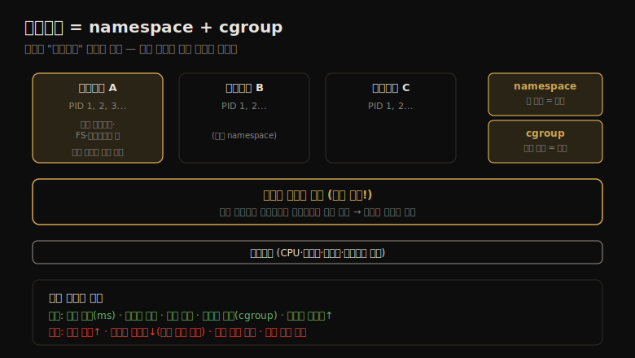

# 클라우드 컴퓨팅 (3) — OS 가상화
---
> 이 노트는 11.3 OS 가상화를 다룹니다. 하나의 커널이 격리된 OS 인스턴스(컨테이너)를 만드는 방식, 그 장단점(빠른 부팅·세밀한 공유 vs 커널 경합·관측성 상실), namespace·cgroup 구현, 자원 제어, 그리고 호스트·게스트에서의 관측을 봅니다.

OS 가상화는 운영체제를 Linux가 *컨테이너* 라 부르는 인스턴스로 분할합니다 — 별도 게스트 서버처럼 동작하고 독립적으로 관리·재부팅됩니다. 하드웨어 가상화와의 결정적 차이는 **커널이 하나만 실행된다** 는 점입니다. chroot(1983)→FreeBSD jails(1998)→Solaris Zones(2005)로 발전했고, Linux는 namespace(2002)+cgroup(2008)을 조합해 컨테이너를 만듭니다.

> 구현(namespace·cgroup) → 오버헤드(CPU·메모리·I/O·멀티테넌트 경합) → 자원 제어(CPU shares/bandwidth·메모리·I/O) → 관측(호스트·게스트·전략) 순으로 갑니다.

## 1. 컨테이너의 장단점 — 빠른 공유와 잃는 격리

> 컨테이너는 커널이 하나라 빠른 부팅·메모리 절약·세밀한 자원 공유·호스트의 높은 관측성을 줍니다. 대가는 커널 자원 경합 증가, 게스트의 관측성 상실(커널 분석 불가), 커널 패닉이 모든 게스트에 영향, 커스텀/다른 커널 불가입니다.

커널이 하나라는 점이 하드웨어 VM 대비 장단점을 모두 만듭니다.

**장점:**

| 장점 | 설명 |
|------|------|
| 빠른 초기화 | 보통 밀리초 단위 |
| 메모리 효율 | 게스트가 메모리를 전부 앱에 씀(추가 커널 없음) |
| 통합 파일 시스템 캐시 | 호스트·게스트 이중 캐싱 회피 |
| 세밀한 자원 공유 | cgroup |
| 호스트 관측성↑ | 게스트 프로세스가 직접 보임 |
| 페이지 공유 | 공통 파일을 공유해 캐시 절약·CPU 캐시 적중↑ |

**단점:**

| 단점 | 설명 |
|------|------|
| 커널 자원 경합↑ | 락·캐시·버퍼·큐 |
| 게스트 관측성↓ | 커널을 분석할 수 없음 |
| 커널 패닉 | 모든 게스트에 영향 |
| 커스텀 커널 모듈 불가 | |
| 다른 커널 버전·종류 불가 | |

> 처음 두 단점을 함께 보면 핵심이 드러납니다 — VM에서 컨테이너로 옮긴 게스트는 *커널 경합 문제를 더 만나면서 동시에 그것을 분석할 능력을 잃습니다*. 그래서 이런 분석을 호스트 운영자에 더 의존하게 됩니다. 모든 단점은 경량 가상화(11-04)가 풀지만, 일부 장점을 대가로 합니다. 비성능 단점으로는 커널 공유로 인한 *약한 보안* 이 있습니다.

## 2. 구현 — namespace와 cgroup

> Linux 커널에 "컨테이너"라는 개념은 없습니다 — 유저 공간 소프트웨어(Docker 등)가 namespace와 cgroup을 조합해 컨테이너를 만듭니다. namespace는 시스템 뷰를 필터링해 격리하고, cgroup은 자원 사용을 제한합니다.

컨테이너가 namespace와 cgroup의 조합으로 어떻게 만들어지는지를 한 장으로 정리하면 다음과 같습니다.

Linux 커널에는 *컨테이너라는 개념이 없습니다* — namespace와 cgroup이 있고, 유저 공간 소프트웨어가 이를 조합해 "컨테이너"를 만듭니다. 컨테이너마다 PID 1 프로세스가 있지만, 다른 namespace에 속해 서로 다른 프로세스입니다.

**namespace** 는 시스템 뷰를 필터링해 컨테이너가 자기 자원만 보고 관리하게 합니다 — 격리의 1차 메커니즘입니다.

| namespace | 격리 대상 |
|-----------|----------|
| cgroup | cgroup 가시성 |
| ipc | 프로세스 간 통신 |
| mnt | 파일 시스템 마운트 |
| net | 네트워크 스택(인터페이스·소켓·라우트) |
| pid | 프로세스 가시성(/proc 필터) |
| time | 컨테이너별 시스템 시계 |
| user | 사용자 ID |
| uts | 호스트 정보(uname) |

`lsns`로 현재 namespace를 봅니다.

**cgroup**(control group)은 자원 사용을 제한합니다. v1·v2가 있고 많은 프로젝트(Kubernetes)가 아직 v1을 씁니다.

| cgroup | 제한 대상 |
|--------|----------|
| blkio | 블록 I/O(바이트·IOPS) |
| cpu | 공유 기반 CPU |
| cpuset | CPU·메모리 노드 할당 |
| memory | 프로세스·커널·swap 메모리 |
| net_cls·net_prio | 패킷 classid·인터페이스 우선순위 |
| pids | 생성 프로세스 수 |

cgroup은 컨테이너 간 자원 경합을 제한합니다 — 하드 한계(CPU·메모리)나 소프트 한계(공유 기반)로. v2는 계층 기반이라 v1의 단점을 풀어, 향후 마이그레이션이 예상됩니다.

> 구현의 핵심은 *컨테이너 = namespace(격리) + cgroup(제한)* 의 조합이고, 커널엔 통일된 컨테이너 ID가 없다는 점입니다. 이것이 관측을 복잡하게 만듭니다(4절) — 전통 도구가 컨테이너 ID를 모릅니다. Kubernetes는 여러 컨테이너가 같은 namespace를 공유하는 Pod로 묶어 더 빠른 통신을 가능하게 합니다.

## 3. 오버헤드 — 가벼운 실행과 멀티테넌트 경합

> 컨테이너 실행은 가벼워, 앱 CPU·메모리는 베어메탈 성능을 냅니다(namespace·cgroup에 추가 CPU 오버헤드 없음). 가장 큰 성능 문제는 멀티테넌트 경합 — 컨테이너가 커널·물리 자원 공유를 더 조장하기 때문입니다.

컨테이너 실행 오버헤드는 가벼워야 합니다 — 앱 CPU·메모리는 베어메탈 성능을 내되, 파일 시스템·네트워크 경로의 계층 때문에 I/O에 커널 내 추가 호출이 있을 수 있습니다.

- **CPU**: 유저 모드 실행 시 직접 오버헤드가 없습니다. namespace·cgroup에 추가 CPU 오버헤드가 없습니다(모든 프로세스가 이미 기본 namespace·cgroup에서 실행). Kubernetes의 네트워크 컴포넌트(kube-proxy)가 많은 서비스에서 iptables 규칙 처리로 약간의 오버헤드를 더하는데, BPF로 대체해 극복할 수 있습니다.
- **메모리**: 매핑·로드·스토어에 오버헤드가 없습니다. 앱이 할당된 메모리를 전부 씁니다(VM은 게스트마다 커널이 메모리를 씀). OverlayFS는 같은 파일을 접근하는 컨테이너 간 페이지 캐시를 공유해 메모리를 아낍니다.
- **I/O**: 격리 계층(overlayfs 파일 시스템, bridge 네트워킹)이 오버헤드를 더합니다 — 저IOPS 서버(<1000 IOPS)엔 무시할 수준입니다.

가장 큰 문제는 **멀티테넌트 경합** 입니다 — 컨테이너가 커널·물리 자원 공유를 더 조장하기 때문입니다.

| 경합 | 영향 |
|------|------|
| CPU 캐시 | 다른 테넌트가 엔트리를 evict해 적중률↓(컨텍스트 전환 시 L1 flush 가능) |
| TLB 캐시 | 다른 테넌트·전환으로 적중률↓(PCID로 완화 가능) |
| CPU 인터럽트 | 다른 테넌트 디바이스 인터럽트로 실행 중단 |
| 커널 자원 | 버퍼·캐시·큐·락 경합(멀티테넌트가 부하를 자릿수로 늘림) |
| 네트워크 | iptables 컨테이너 네트워킹의 CPU 오버헤드 |

> 멀티테넌트 경합이 핵심 오버헤드인 까닭은 *전통 다중 사용자 환경보다 훨씬 심하기 때문* 입니다. 한 사례에선 다른 컨테이너의 워크로드가 dcache에 영향을 줘 lstat 지연이 시간이 지나며 서서히 악화됐고, 또 다른 사례는 멀티테넌트 컨테이너로 옮기며 posix_fadvise 호출이 병목이 됐습니다. 마지막 항목(다른 테넌트의 자원 경쟁)은 자원 제어로 관리합니다(4절).

## 4. 자원 제어 — CPU shares·bandwidth와 bursting

> 자원 제어는 우선순위(이웃 간 균형)와 한계(소비 상한)로 나뉩니다. CPU는 cpusets(전체 CPU 할당)·shares(유휴 공유, bursting)·bandwidth(상한)로, 메모리는 한계·소프트 한계로, 디스크·네트워크는 blkio·net_prio로 제어합니다.

자원 제어는 자원을 공정히 공유하도록 throttle합니다(주로 cgroup). *우선순위*(중요도로 이웃 간 균형)와 *한계*(소비 상한)로 나뉩니다.

**CPU** 는 세 방식입니다.

- **cpusets**: 전체 CPU를 특정 컨테이너에 할당 — 중단 없는 일관된 CPU 용량(단 유휴 용량을 다른 컨테이너가 못 씀).
- **shares**: CFS 스케줄러가 유휴 CPU를 공유 — *bursting*(다른 컨테이너의 유휴 CPU를 빌려 더 빨리 실행). `컨테이너 CPU = 전체 CPU × 컨테이너 shares / 시스템 전체 busy shares`로, shares는 *최소 보장* 을 줍니다.
- **bandwidth**: CPU 사용 상한(period당 quota 마이크로초).

**bursting의 함정** 이 중요합니다 — 사용자가 idle 시스템에서 컨테이너를 테스트해 100% CPU를 얻고 만족했다가, 나중에 다른 컨테이너가 들어오면 shares 최소치(예: 10%)로 떨어집니다. 사용자에겐 10배 느려진 게 새 기준이 되어 "시스템 문제"로 오해하기 쉽습니다. bandwidth로 bursting을 제한하면(예: 10~20% 범위) 성능 급락이 덜 심합니다. CPU 캐시는 Intel CAT로 제어합니다.

**메모리 용량** 은 memory cgroup으로 — limit_in_bytes(초과 시 swap 또는 OOM)·soft_limit_in_bytes(best-effort 회수)·kmem(커널 메모리)·pressure_level(저메모리 알림). 컨테이너의 미사용 메모리는 다른 컨테이너의 페이지 캐시로 쓰여(메모리 형태 bursting), swap 한계도 둘 수 있습니다.

**디스크 I/O** 는 blkio cgroup — weight(공유, BFQ 스케줄러)·throttle.read/write_bps/iops_device(한계). **네트워크 I/O** 는 net_prio(우선순위)·net_cls(classid 태깅)+qdisc(셰이핑)로 제어하고, BPF 프로그램을 cgroup에 붙여 커스텀 제어·방화벽을 만듭니다(Cilium).

> 자원 제어의 핵심은 *우선순위와 한계의 조합* 이고, 특히 CPU shares의 bursting이 양날입니다 — 효율(유휴 CPU 활용)을 주지만, 모니터링이 bursting 통계를 안 보여 주면 사용자가 잘못된 성능 기대를 갖게 됩니다. 그래서 bursting 통계를 노출하거나, bursting 중임을 사용자에게 알려 컨테이너 크기 업그레이드(더 많은 shares)를 권하는 게 좋습니다.

## 5. 관측 — 호스트는 다 보지만 게스트는 헷갈린다

> 호스트에서는 모든 컨테이너의 프로세스·자원을 직접 봐 분석합니다. 게스트에서는 자기 프로세스만 보이나, 시스템 전역 통계(CPU·디스크)는 종종 호스트 것을 보여 줘 헷갈립니다 — idle 컨테이너의 iostat이 바쁘게 나오는 식입니다.

관측은 도구를 어디서 띄우느냐와 보안 설정에 따라 다릅니다.

**호스트에서**(최고 권한): 하드웨어 자원·파일 시스템·게스트 프로세스·TCP 세션을 다 봅니다 — 게스트에 로그인하지 않고도 게스트 프로세스를 분석합니다. 단 커널엔 컨테이너 ID가 없어, 통계를 컨테이너별로 보려면 ① 컨테이너 도구(`kubectl top`·`docker stats`) ② cgroup 통계(`/sys/fs/cgroup/.../cpu.stat`의 nr_throttled·throttled_time) ③ namespace 매핑(`nsenter -t PID -m -p`로 호스트 도구를 컨테이너에서 실행) ④ BPF 추적을 씁니다. 프로세스 namespace 때문에 게스트 PID와 호스트 PID가 다른데, `/proc/PID/status`의 NSpid나 `/proc/PID/ns/`로 매핑합니다.

**게스트에서**: 보통 자기 프로세스·파일 시스템·네트워크·TCP만 봅니다. **큰 예외가 시스템 전역 통계** 입니다 — CPU·디스크 통계는 종종 *컨테이너가 아니라 호스트* 를 보여 줍니다. 예를 들어 *완전히 idle한 컨테이너* 에서 iostat을 돌리면 CPU·디스크가 바쁘게 나오는데, 다른 테넌트 활동을 포함한 호스트 통계이기 때문입니다 — OS 가상화에 처음인 사람에겐 "왜 내 컨테이너가 바쁘지?"로 헷갈립니다. 커널 내부는 보통 못 보므로 커널 추적 도구(perf·Ftrace·BPF)가 대개 동작하지 않습니다.

전통 도구의 상태 — top(헤더는 호스트 혼합, 프로세스 표는 컨테이너)·free/mpstat/vmstat(호스트)·pidstat(컨테이너 프로세스)·perf(권한 따라)·dmesg(실패). 컨테이너 인지(container-aware)는 *목표* 에 따라 다릅니다 — ① 격리된 서버(클라우드 벤더): 컨테이너 활동만 표시 ② 패키징 솔루션(자사 클라우드): 호스트 통계를 보여 줘 noisy neighbor를 이해하게 함. 자원 제어도 USE 메서드로 점검해야 합니다(throttled_time 증가 = bandwidth throttle).

> 관측의 핵심 대비는 *호스트는 다 보고 게스트는 헷갈린다* 입니다 — 호스트는 모든 컨테이너를 한 커널에서 동시에 분석(전통 다중 프로세스 분석과 유사)하지만, 게스트는 자기 것만 보이면서도 시스템 전역 통계는 호스트 것이 새어 나옵니다. **11-02 VM과 정반대** 입니다 — VM은 게스트가 커널을 다 분석하지만 물리 자원을 못 보고, 컨테이너는 게스트가 커널을 못 보지만 호스트 통계가 새어 나옵니다. 그래서 "관측은 컨테이너가 호스트 운영자에 유리, VM이 엔드유저에 유리"라는 11-06 비교로 이어집니다.

## 학습 점검

> 이 노트의 핵심을 스스로 떠올려 봅니다. 답이 막히면 해당 섹션으로 돌아가 확인합니다.

- VM에서 컨테이너로 옮긴 게스트가 커널 경합을 더 만나면서 동시에 분석 능력을 잃는다는 게 무슨 뜻인지 설명해 봅니다. (→ §1)
- 커널에 컨테이너 개념이 없는데 컨테이너가 어떻게 만들어지는지(namespace + cgroup), 각각의 역할을 떠올려 봅니다. (→ §2)
- 멀티테넌트 경합이 전통 다중 사용자 환경보다 심한 까닭을 말해 봅니다. (→ §3)
- CPU shares의 bursting 함정이 무엇이며, bandwidth가 이를 어떻게 완화하는지 설명해 봅니다. (→ §4)
- idle 컨테이너의 iostat이 바쁘게 나오는 까닭과, 이것이 VM 관측과 어떻게 정반대인지 떠올려 봅니다. (→ §5)