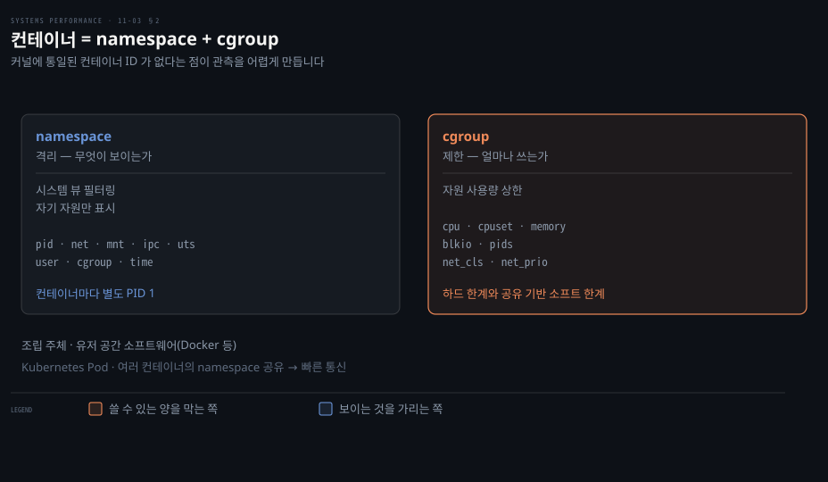
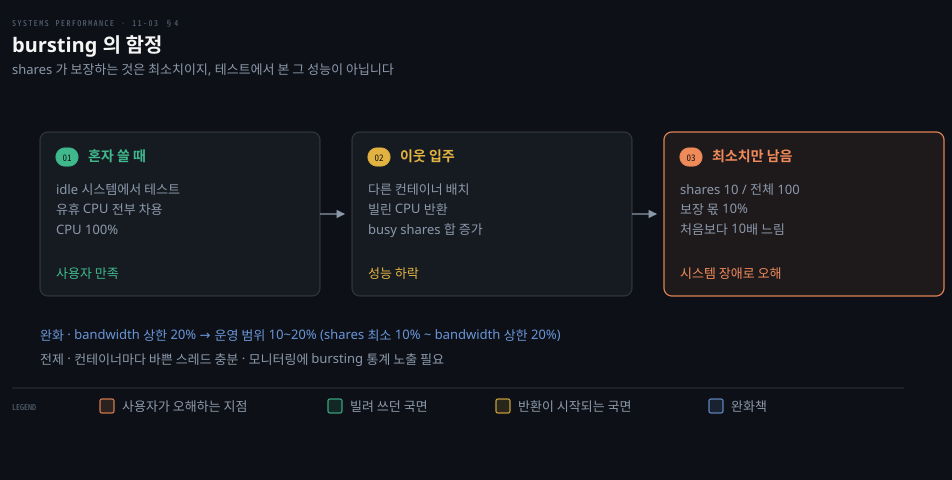
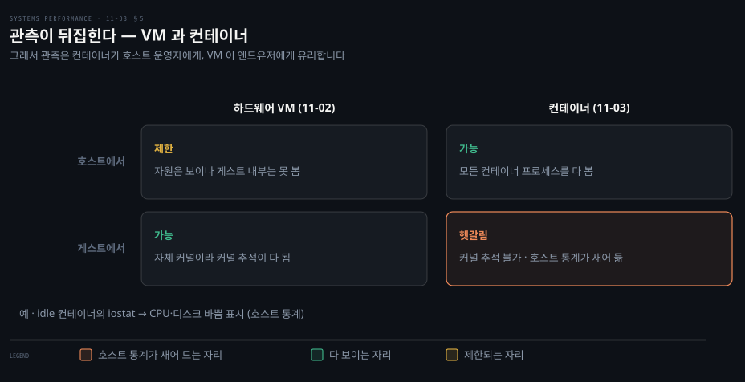

# 클라우드 컴퓨팅 (3) — OS 가상화
---
> 이 노트는 11.3 OS 가상화를 다룹니다. 하나의 커널이 격리된 OS 인스턴스(컨테이너)를 만드는 방식, 그 장단점(빠른 부팅·세밀한 공유 vs 커널 경합·관측성 상실), namespace·cgroup 구현, 자원 제어, 그리고 호스트·게스트에서의 관측을 봅니다.

## 핵심 요약

> 이 편이 매달린 하나의 생각은 **커널이 하나뿐이라는 사실 하나가 컨테이너의 모든 장점과 모든 단점을 동시에 만든다는 것**입니다.

OS 가상화는 운영체제를 Linux가 *컨테이너* 라 부르는 인스턴스로 나눕니다. 각 컨테이너는 별도 게스트 서버처럼 동작하고 독립적으로 관리·재부팅됩니다.

하드웨어 가상화와의 결정적 차이는 **커널이 하나만 실행된다** 는 점입니다. 커널을 새로 띄우지 않으니 부팅이 밀리초 단위로 끝납니다. 게스트마다 커널이 메모리를 먹지도 않습니다. 호스트에서는 모든 게스트 프로세스가 그대로 보입니다.

같은 사실이 반대쪽도 만듭니다. 커널을 공유하니 커널 자원 경합이 늘어납니다. 게스트는 그 커널을 분석할 수 없습니다. 커널이 패닉하면 모든 게스트가 함께 죽고, 다른 커널 버전을 쓰는 것도 불가능합니다.

이 계보는 Unix의 `chroot` 에서 시작합니다. 프로세스가 보는 최상위 디렉토리를 다른 곳으로 바꿔, 파일 시스템의 한 서브트리에 가두는 명령입니다.

갈래는 둘입니다. Unix 계열이 격리 구획을 먼저 완성했고, Linux는 부품을 따로따로 쌓았습니다.

| 갈래 | 연도 | 기술 |
|------|------|------|
| Unix 계열 | 1998 | FreeBSD jails — 자체 서버처럼 동작하는 격리 구획 |
| Unix 계열 | 2005 | Solaris Zones — 각종 자원 제어 포함 |
| Linux | 2002 | namespace (2.4.19) |
| Linux | 2008 | cgroup (2.6.24) |

Linux는 마지막 둘을 조합해 컨테이너를 만들고, 보통 여기에 seccomp-bpf를 더해 syscall 접근까지 통제합니다.

## 학습 목표

> 이 편을 덮은 뒤 스스로 할 수 있어야 하는 일을 먼저 적어 둡니다.

- 커널이 하나라는 사실에서 장점과 단점을 각각 이끌어 냅니다.
- 커널에 컨테이너 개념이 없는데 컨테이너가 어떻게 만들어지는지 설명합니다.
- 멀티테넌트 경합이 전통 다중 사용자 환경보다 심한 까닭을 댑니다.
- CPU shares의 bursting이 왜 사용자를 오해하게 만드는지 말합니다.
- idle 컨테이너의 iostat이 바쁘게 나오는 까닭을 답합니다.

첫 절이 나머지 전체를 규정합니다. 구현·오버헤드·제어·관측이 모두 "커널이 하나"라는 사실에서 따라 나옵니다.

## 이 문서가 다루지 않는 것

> 앞뒤 편으로 넘긴 주제를 밝혀 둡니다.

- **클라우드 일반 배경** — 11-01이 다룹니다.
- **하드웨어 가상화**(하이퍼바이저·guest exit) — 11-02가 다룹니다.
- **경량 가상화와 세 기술 비교** — 11-04가 다룹니다. 컨테이너의 단점을 푸는 방법이 거기 있습니다.
- **Kubernetes 운영** — 11-01이 개요만 다루고, 이 편은 그 아래 커널 기능을 봅니다.

## 1. 컨테이너의 장단점 — 빠른 공유와 잃는 격리

> 컨테이너는 커널이 하나라 빠른 부팅·메모리 절약·세밀한 자원 공유·호스트의 높은 관측성을 줍니다. 대가는 커널 자원 경합 증가, 게스트의 관측성 상실(커널 분석 불가), 커널 패닉이 모든 게스트에 영향, 커스텀/다른 커널 불가입니다.

장점만 골라 세거나 단점만 골라 세면 컨테이너를 잘못 보게 됩니다. 둘은 같은 뿌리에서 나오기 때문입니다.

커널이 하나라는 점이 하드웨어 VM 대비 장단점을 모두 만듭니다.

**장점:**

| 장점 | 설명 |
|------|------|
| 빠른 초기화 | 보통 밀리초 단위 |
| 메모리 효율 | 게스트가 메모리를 전부 앱에 씀(추가 커널 없음) |
| 통합 파일 시스템 캐시 | 호스트·게스트 이중 캐싱 회피 |
| 세밀한 자원 공유 | cgroup |
| 호스트 관측성↑ | 게스트 프로세스가 직접 보임 |
| 페이지 공유 | 공통 파일을 공유해 캐시 절약·CPU 캐시 적중↑ |

**단점:**

| 단점 | 설명 |
|------|------|
| 커널 자원 경합↑ | 락·캐시·버퍼·큐 |
| 게스트 관측성↓ | 커널을 분석할 수 없음 |
| 커널 패닉 | 모든 게스트에 영향 |
| 커스텀 커널 모듈 불가 | |
| 다른 커널 버전·종류 불가 | |

> 처음 두 단점을 함께 보면 핵심이 드러납니다 — VM에서 컨테이너로 옮긴 게스트는 *커널 경합 문제를 더 만나면서 동시에 그것을 분석할 능력을 잃습니다*. 그래서 이런 분석을 호스트 운영자에 더 의존하게 됩니다. 모든 단점은 경량 가상화(11-04)가 풀지만, 일부 장점을 대가로 합니다. 비성능 단점으로는 커널 공유로 인한 *약한 보안* 이 있습니다.

## 2. 구현 — namespace와 cgroup

> Linux 커널에 "컨테이너"라는 개념은 없습니다 — 유저 공간 소프트웨어(Docker 등)가 namespace와 cgroup을 조합해 컨테이너를 만듭니다. namespace는 시스템 뷰를 필터링해 격리하고, cgroup은 자원 사용을 제한합니다.

Linux 커널에는 *컨테이너라는 개념이 없습니다.* namespace와 cgroup이 있을 뿐이고, 유저 공간 소프트웨어가 이 둘을 조합해 "컨테이너"라 부르는 것을 만듭니다.

컨테이너마다 PID 1 프로세스가 있지만 서로 다른 namespace에 속하므로 각각 다른 프로세스입니다.

**namespace** 는 시스템 뷰를 필터링해 컨테이너가 자기 자원만 보고 관리하게 합니다 — 격리의 1차 메커니즘입니다.

| namespace | 격리 대상 |
|-----------|----------|
| cgroup | cgroup 가시성 |
| ipc | 프로세스 간 통신 |
| mnt | 파일 시스템 마운트 |
| net | 네트워크 스택(인터페이스·소켓·라우트) |
| pid | 프로세스 가시성(/proc 필터) |
| time | 컨테이너별 시스템 시계 |
| user | 사용자 ID |
| uts | 호스트 정보(uname) |

`lsns`로 현재 namespace를 봅니다.

**cgroup**(control group)은 자원 사용을 제한합니다. v1과 v2가 있고, 책이 쓰인 시점에는 Kubernetes를 비롯한 많은 프로젝트가 아직 v1을 쓰고 있었습니다.

> **갱신 (2026-09)**: 이 구도는 뒤집혔습니다. Kubernetes는 v1.25에서 cgroup v2 지원을 GA로 올렸고, v1.35에서 **cgroup v1을 deprecated로 지정**했습니다. 지금 kubelet은 기본 설정으로는 cgroup v1 노드에서 아예 뜨지 않습니다(`failCgroupV1` 을 false로 낮춰야 뜹니다). 배포판도 대부분 v2가 기본입니다 — Ubuntu 21.10+, Debian 11+, Fedora 31+, RHEL 9+. 아래 표는 v1 컨트롤러 이름이므로, v2에서는 `blkio` 가 `io` 로 바뀌고 `net_cls`·`net_prio` 는 빠졌다는 점을 감안해 읽습니다. (출처: [kubernetes.io — About cgroup v2](https://kubernetes.io/docs/concepts/architecture/cgroups/))

아래는 **cgroup v1** 컨트롤러입니다. v2에서는 `blkio` 가 `io` 로 바뀌고, `net_cls`·`net_prio` 는 사라져 BPF가 그 자리를 대신합니다.

| cgroup v1 | 제한 대상 |
|--------|----------|
| blkio | 블록 I/O(바이트·IOPS) — v2에서는 `io` |
| cpu | 공유 기반 CPU |
| cpuset | CPU·메모리 노드 할당 |
| memory | 프로세스·커널·swap 메모리 |
| net_cls·net_prio | 패킷 classid·인터페이스 우선순위 — v2에는 없음 |
| pids | 생성 프로세스 수 |

cgroup은 컨테이너 간 자원 경합을 제한합니다. 하드 한계는 CPU·메모리처럼 상한을 못 박습니다. 소프트 한계는 공유 기반으로 나눕니다. v2는 계층 기반이라 v1의 단점을 풀었고, 예상됐던 마이그레이션은 이미 끝났습니다.

> 구현의 핵심은 *컨테이너 = namespace(격리) + cgroup(제한)* 의 조합이고, 커널엔 통일된 컨테이너 ID가 없다는 점입니다. 이것이 관측을 복잡하게 만듭니다(4절) — 전통 도구가 컨테이너 ID를 모릅니다. Kubernetes는 여러 컨테이너가 같은 namespace를 공유하는 Pod로 묶어 더 빠른 통신을 가능하게 합니다.

## 3. 오버헤드 — 가벼운 실행과 멀티테넌트 경합

> 컨테이너 실행은 가벼워, 앱 CPU·메모리는 베어메탈 성능을 냅니다(namespace·cgroup에 추가 CPU 오버헤드 없음). 가장 큰 성능 문제는 멀티테넌트 경합 — 컨테이너가 커널·물리 자원 공유를 더 조장하기 때문입니다.

컨테이너 실행 오버헤드는 가벼워야 합니다 — 앱 CPU·메모리는 베어메탈 성능을 내되, 파일 시스템·네트워크 경로의 계층 때문에 I/O에 커널 내 추가 호출이 있을 수 있습니다.

- **CPU**: 유저 모드 실행에 직접 오버헤드가 없습니다. namespace와 cgroup 자체에도 추가 CPU 비용이 없습니다. 모든 프로세스가 이미 기본 namespace와 cgroup 안에서 돌고 있기 때문입니다. 다만 Kubernetes의 kube-proxy가 서비스가 많아지면 iptables 규칙 처리로 약간의 오버헤드를 더하는데, BPF로 대체해 극복할 수 있습니다.
- **메모리**: 매핑·로드·스토어에 오버헤드가 없습니다. 앱이 할당된 메모리를 전부 씁니다(VM은 게스트마다 커널이 메모리를 씀). OverlayFS는 같은 파일을 접근하는 컨테이너 간 페이지 캐시를 공유해 메모리를 아낍니다.
- **I/O**: 격리 계층(overlayfs 파일 시스템, bridge 네트워킹)이 오버헤드를 더합니다 — 저IOPS 서버(<1000 IOPS)엔 무시할 수준입니다.

가장 큰 문제는 **멀티테넌트 경합** 입니다 — 컨테이너가 커널·물리 자원 공유를 더 조장하기 때문입니다.

| 경합 | 영향 |
|------|------|
| CPU 캐시 | 다른 테넌트가 엔트리를 evict해 적중률↓(컨텍스트 전환 시 L1 flush 가능) |
| TLB 캐시 | 다른 테넌트·전환으로 적중률↓(PCID로 완화 가능) |
| CPU 인터럽트 | 다른 테넌트 디바이스 인터럽트로 실행 중단 |
| 커널 자원 | 버퍼·캐시·큐·락 경합(멀티테넌트가 부하를 자릿수로 늘림) |
| 네트워크 | iptables 컨테이너 네트워킹의 CPU 오버헤드 |

> 멀티테넌트 경합이 핵심 오버헤드인 까닭은 *전통 다중 사용자 환경보다 훨씬 심하기 때문* 입니다. 한 사례에선 다른 컨테이너의 워크로드가 dcache에 영향을 줘 lstat 지연이 시간이 지나며 서서히 악화됐고, 또 다른 사례는 멀티테넌트 컨테이너로 옮기며 posix_fadvise 호출이 병목이 됐습니다. 마지막 항목(다른 테넌트의 자원 경쟁)은 자원 제어로 관리합니다(4절).

## 4. 자원 제어 — CPU shares·bandwidth와 bursting

> 자원 제어는 우선순위(이웃 간 균형)와 한계(소비 상한)로 나뉩니다. CPU는 cpusets(전체 CPU 할당)·shares(유휴 공유, bursting)·bandwidth(상한)로, 메모리는 한계·소프트 한계로, 디스크·네트워크는 blkio·net_prio로 제어합니다.

자원 제어는 주로 cgroup으로 자원을 공정히 나눠 쓰게 throttle합니다. 크게 둘로 나뉩니다. *우선순위* 는 중요도에 따라 이웃 사이 균형을 잡고, *한계* 는 소비 상한을 겁니다.

**CPU** 는 세 방식입니다.

- **cpusets**: 전체 CPU를 특정 컨테이너에 할당 — 중단 없는 일관된 CPU 용량(단 유휴 용량을 다른 컨테이너가 못 씀).
- **shares**: CFS 스케줄러가 유휴 CPU를 나눠 씁니다. 다른 컨테이너의 유휴 CPU를 빌려 더 빨리 도는 것이 *bursting* 입니다. 계산은 `컨테이너 CPU = 전체 CPU × 컨테이너 shares / 시스템 전체 busy shares` 이고, shares가 주는 것은 *최소 보장* 입니다.
- **bandwidth**: CPU 사용 상한(period당 quota 마이크로초).

**bursting의 함정** 이 중요합니다 — 사용자가 idle 시스템에서 컨테이너를 테스트해 100% CPU를 얻고 만족했다가, 나중에 다른 컨테이너가 들어오면 shares 최소치(예: 10%)로 떨어집니다. 사용자에겐 10배 느려진 게 새 기준이 되어 "시스템 문제"로 오해하기 쉽습니다. bandwidth로 bursting을 제한하면(예: 10~20% 범위) 성능 급락이 덜 심합니다. CPU 캐시는 Intel CAT로 제어합니다.

**메모리 용량** 은 memory cgroup으로 제어합니다.

| 항목 | 역할 |
|------|------|
| limit_in_bytes | 하드 한계 — 넘으면 swap 또는 OOM |
| soft_limit_in_bytes | best-effort 회수 |
| kmem | 커널 메모리 |
| pressure_level | 저메모리 알림 |

컨테이너가 쓰지 않는 메모리는 다른 컨테이너의 페이지 캐시로 쓰입니다. 메모리 형태의 bursting인 셈입니다. swap에도 한계를 둘 수 있습니다.

**디스크 I/O** 는 blkio cgroup이 맡습니다. weight는 BFQ 스케줄러에서 공유 비율을 정하고, `throttle.read_bps_device` 계열이 하드 한계를 겁니다.

**네트워크 I/O** 는 net_prio가 우선순위를, net_cls가 classid 태깅을 맡고 qdisc가 셰이핑을 합니다. cgroup에 BPF 프로그램을 붙여 커스텀 제어나 방화벽을 만들기도 합니다. Cilium이 그 예입니다.

> 자원 제어의 핵심은 *우선순위와 한계의 조합* 이고, 특히 CPU shares의 bursting이 양날입니다 — 효율(유휴 CPU 활용)을 주지만, 모니터링이 bursting 통계를 안 보여 주면 사용자가 잘못된 성능 기대를 갖게 됩니다. 그래서 bursting 통계를 노출하거나, bursting 중임을 사용자에게 알려 컨테이너 크기 업그레이드(더 많은 shares)를 권하는 게 좋습니다.

## 5. 관측 — 호스트는 다 보지만 게스트는 헷갈린다

> 호스트에서는 모든 컨테이너의 프로세스·자원을 직접 봐 분석합니다. 게스트에서는 자기 프로세스만 보이나, 시스템 전역 통계(CPU·디스크)는 종종 호스트 것을 보여 줘 헷갈립니다 — idle 컨테이너의 iostat이 바쁘게 나오는 식입니다.

관측은 도구를 어디서 띄우느냐와 보안 설정에 따라 다릅니다.

**호스트에서** 는 최고 권한으로 하드웨어 자원·파일 시스템·게스트 프로세스·TCP 세션을 다 봅니다. 게스트에 로그인하지 않고도 게스트 프로세스를 분석할 수 있습니다.

다만 커널에 컨테이너 ID가 없어 통계를 컨테이너별로 가르려면 따로 방법이 필요합니다.

| 방법 | 수단 |
|------|------|
| 컨테이너 도구 | `kubectl top` · `docker stats` |
| cgroup 통계 | `/sys/fs/cgroup/.../cpu.stat` 의 nr_throttled · throttled_time |
| namespace 매핑 | `nsenter -t PID -m -p` 로 호스트 도구를 컨테이너에서 실행 |
| BPF 추적 | 커널에서 직접 집계 |

프로세스 namespace 때문에 게스트 PID와 호스트 PID가 다릅니다. `/proc/PID/status` 의 NSpid나 `/proc/PID/ns/` 로 매핑합니다.

**게스트에서** 는 보통 자기 프로세스·파일 시스템·네트워크·TCP만 보입니다.

**큰 예외가 시스템 전역 통계** 입니다. CPU와 디스크 통계는 종종 *컨테이너가 아니라 호스트* 것을 보여 줍니다. *완전히 idle한 컨테이너* 에서 iostat을 돌려도 CPU와 디스크가 바쁘게 나오는데, 다른 테넌트의 활동까지 포함한 호스트 통계이기 때문입니다. OS 가상화가 처음이면 "왜 내 컨테이너가 바쁘지?" 하고 헷갈리기 쉽습니다.

커널 내부는 보통 보이지 않아 perf·Ftrace·BPF 같은 커널 추적 도구가 대개 동작하지 않습니다.

전통 도구가 컨테이너 안에서 무엇을 보여 주는지는 도구마다 다릅니다.

| 도구 | 보이는 것 |
|------|----------|
| top | 헤더는 호스트가 섞이고, 프로세스 표는 컨테이너 |
| free · mpstat · vmstat | 호스트 |
| pidstat | 컨테이너 프로세스 |
| perf | 권한에 따라 |
| dmesg | 실패 |

컨테이너를 인지하게 만들지 여부는 *목표* 에 달렸습니다. 격리된 서버를 파는 클라우드 벤더라면 컨테이너 활동만 보여 주는 편이 맞습니다. 자사 클라우드의 패키징 솔루션이라면 호스트 통계를 함께 보여 줘 noisy neighbor를 이해하게 하는 편이 낫습니다.

자원 제어도 USE 메서드로 점검합니다. throttled_time이 늘면 bandwidth throttle이 걸린 것입니다.

> 관측의 핵심 대비는 *호스트는 다 보고 게스트는 헷갈린다* 입니다 — 호스트는 모든 컨테이너를 한 커널에서 동시에 분석(전통 다중 프로세스 분석과 유사)하지만, 게스트는 자기 것만 보이면서도 시스템 전역 통계는 호스트 것이 새어 나옵니다. **11-02 VM과 정반대** 입니다 — VM은 게스트가 커널을 다 분석하지만 물리 자원을 못 보고, 컨테이너는 게스트가 커널을 못 보지만 호스트 통계가 새어 나옵니다. 그래서 "관측은 컨테이너가 호스트 운영자에 유리, VM이 엔드유저에 유리"라는 11-06 비교로 이어집니다.

## 학습 점검

> 이 노트의 핵심을 스스로 떠올려 봅니다. 답이 막히면 해당 섹션으로 돌아가 확인합니다.

- VM에서 컨테이너로 옮긴 게스트가 커널 경합을 더 만나면서 동시에 분석 능력을 잃는다는 게 무슨 뜻인지 설명해 봅니다. (→ §1)
- 커널에 컨테이너 개념이 없는데 컨테이너가 어떻게 만들어지는지(namespace + cgroup), 각각의 역할을 떠올려 봅니다. (→ §2)
- 멀티테넌트 경합이 전통 다중 사용자 환경보다 심한 까닭을 말해 봅니다. (→ §3)
- CPU shares의 bursting 함정이 무엇이며, bandwidth가 이를 어떻게 완화하는지 설명해 봅니다. (→ §4)
- idle 컨테이너의 iostat이 바쁘게 나오는 까닭과, 이것이 VM 관측과 어떻게 정반대인지 떠올려 봅니다. (→ §5)