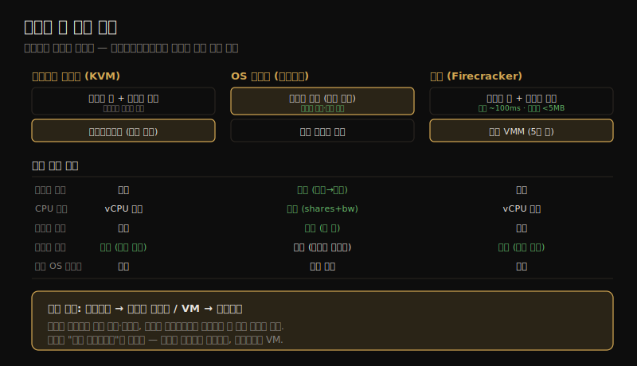

# 클라우드 컴퓨팅 (4) — 경량 가상화·기타·비교
---
> 이 노트는 11장의 마지막으로, 11.4 경량 가상화·11.5 기타 유형·11.6 비교를 다룹니다. 하드웨어 가상화의 보안과 컨테이너의 효율·빠른 부팅을 결합한 경량 가상화(Firecracker), FaaS·Unikernel 같은 기타 유형, 그리고 세 가상화 기술의 성능 비교를 봅니다.

경량 하드웨어 가상화는 *양쪽의 장점* 을 노립니다 — 하드웨어 가상화의 보안과 컨테이너의 효율·빠른 부팅입니다. 프로세서 가상화 기반의 경량 하이퍼바이저와 최소한의 에뮬레이트 디바이스만 씁니다. 전체 머신 하이퍼바이저(QEMU 140만 줄)와 달리 경량 하이퍼바이저(Firecracker 5만 줄)는 서버 컴퓨팅에 불필요한 디바이스(비디오·오디오·BIOS·PCI)를 빼고 현대 프로세서 가상화 기능을 전제합니다.

> 경량 가상화(Firecracker·Kata·gVisor) → 기타 유형(FaaS·SaaS·Unikernel) → 세 기술 비교 순으로 갑니다. 경량 VM(MicroVM)은 11-02 Config B 하드웨어 VM처럼 동작하되, 부팅이 훨씬 빠르고 메모리 오버헤드가 낮으며 보안이 개선됩니다.

## 1. 경량 가상화 — 양쪽의 장점

> 경량 가상화는 KVM류 하드웨어 가상화처럼 동작하되, VMM이 훨씬 작아 메모리 오버헤드가 낮고 부팅이 빠릅니다(~100ms). VMM 프로세스가 호스트에서 돌아 OS 자원 제어로 관리되고, namespace로 보안 계층을 더할 수 있습니다.

여러 경량 가상화 프로젝트가 있습니다.

| 구현 | 성격 |
|------|------|
| Intel Clear Containers (2015) | Intel VT로 경량 VM. 부팅 <45ms. 이후 Kata로 합류 |
| Kata Containers (2017) | Clear Containers + Hyper.sh RunV 기반. "컨테이너의 속도, VM의 보안" |
| Google gVisor (2018) | Go로 쓴 전용 유저 공간 커널로 컨테이너 보안 개선 |
| Amazon Firecracker (2019) | KVM + 경량 VMM(QEMU 대신). 부팅 ~100ms |

흔한 구현은 *경량 하드웨어 하이퍼바이저*(Clear Containers·Kata·Firecracker)입니다. gVisor는 자체 경량 커널을 구현하는 다른 접근이라 컨테이너(11-03)에 더 가까운 특성을 가집니다.

**오버헤드** 는 KVM 가상화(11-02)와 비슷하되 VMM이 훨씬 작아 메모리 풋프린트가 낮습니다 — Clear Containers 2.0은 컨테이너당 48~50MB, Firecracker는 5MB 미만을 보고했습니다. **자원 제어** 는 VMM 프로세스가 호스트에서 돌아 OS 자원 제어(cgroup·qdisc)로 관리됩니다(KVM 가상화와 유사).

경량 가상화는 *MicroVM* 으로도 불립니다(저자는 이 용어를 선호 — "컨테이너"는 보통 OS 가상화와 연관). 하드웨어 VM 대비 부팅이 훨씬 빠르고 메모리 오버헤드가 낮으며 보안이 개선되고, namespace를 보안 계층으로 더 구성할 수 있습니다.

> 경량 가상화의 핵심은 *VMM을 작게 만들어 양쪽 장점을 얻는 것* 입니다 — KVM류 하드웨어 가상화처럼 게스트가 전용 커널을 가져(보안·관측성) 동작하되, 불필요한 디바이스를 빼 컨테이너급 부팅 속도·밀도를 냅니다. 11-03 컨테이너의 모든 단점(커널 경합·관측성 상실·커널 패닉 전파·다른 커널 불가)을 풀지만, 일부 장점(통합 캐시·세밀한 메모리 공유)을 대가로 합니다.

## 2. 관측 — VM처럼 게스트가 자체 커널을 본다

> 경량 가상화 관측은 KVM 가상화와 같습니다. 호스트에서는 VMM이 단일 프로세스(firecracker)로 보여 게스트 내부를 직접 못 보고, 게스트에서는 자체 전용 커널이라 BPF 등 커널 추적 도구가 다 동작합니다.

관측은 KVM 가상화(11-02)와 같습니다.

**호스트에서**: 물리 자원을 표준 OS 도구로 보고, 게스트 VM은 *프로세스* 로 보입니다. 게스트 내부(VM 안 프로세스·파일 시스템)는 직접 못 봅니다 — 분석하려면 접근권(SSH)이 필요합니다. 예를 들어 호스트 top에서 Firecracker VM은 `firecracker`라는 *단일 프로세스* 로 보여 200% CPU(2 CPU)를 쓰는 게 보이지만, 어느 게스트 프로세스가 그 CPU를 쓰는지는 호스트에서 알 수 없습니다.

**게스트에서**: 가상화된 자원과 그 사용을 보고 물리 문제는 추론합니다. **핵심은 VM이 자체 전용 커널을 가져, BPF 기반 도구를 포함한 커널 추적 도구가 다 동작한다** 는 점입니다. 게스트 top은 어느 프로세스(bash 둘)가 CPU를 쓰는지 보여 주고, 헤더 요약도 호스트와 다릅니다 — 게스트가 자체 커널로 게스트 전용 통계를 유지하기 때문입니다(load average 호스트 4.48 vs 게스트 1.89). 게스트 mpstat은 할당된 2 CPU만 보여 줍니다.

> 관측의 핵심은 *11-02 VM과 같고 11-03 컨테이너와 다르다* 는 점입니다 — 경량 VM 게스트는 자체 커널이라 통계가 게스트 전용으로 정확하고 커널 추적이 다 됩니다. 컨테이너는 시스템 전역 통계가 호스트 것이 새어 나와(idle 컨테이너 iostat이 바쁘게 나옴) 헷갈렸지만, 경량 VM은 그렇지 않습니다. 이것이 경량 가상화가 "엔드유저 관측성"에서 컨테이너보다 나은 이유입니다(3절 비교).

## 3. 기타 유형 — FaaS·SaaS·Unikernel

> FaaS는 함수를 온디맨드로 실행해 서버 관리가 없지만(serverless) 시작 지연·관측 도구 부재가 문제입니다. SaaS는 고수준 소프트웨어를, Unikernel은 앱+최소 커널을 단일 바이너리로 컴파일하는데, 모두 OS가 없어 전통 관측이 어렵습니다.

다른 클라우드 컴퓨팅 기본 요소들입니다.

| 유형 | 설명 | 성능·관측 |
|------|------|----------|
| FaaS | 함수를 클라우드에 제출, 온디맨드 실행 | 서버 관리 없음(serverless). 시작 지연이 클 수 있고, 서버가 없어 전통 CLI 관측 도구 사용 불가 — 앱 제공 타임스탬프로만 분석 |
| SaaS | 고수준 소프트웨어(서버·앱 설정 불필요) | 운영자만 분석 가능. 엔드유저는 클라이언트 기반 타이밍만 |
| Unikernel | 앱 + 최소 커널 부분을 단일 바이너리로 컴파일, 하이퍼바이저가 직접 실행(OS 불필요) | 명령 text 최소화로 CPU 캐시 오염↓·미사용 코드 제거로 보안↑. 단 OS가 없어 관측 도구·`/proc` 통계 부재 |

**FaaS** 는 함수를 제출하면 클라우드가 온디맨드로 실행합니다 — 서버 관리가 없어 개발이 단순하지만, 함수 시작 시간이 상당할 수 있고 서버가 없어 전통 명령줄 관측 도구를 못 씁니다. 성능 분석이 *앱이 제공한 타임스탬프* 로 제한됩니다.

**Unikernel** 은 앱과 최소 커널을 단일 바이너리로 컴파일해 하이퍼바이저가 직접 실행합니다 — OS가 필요 없습니다. 성능 이득(명령 text 최소화로 CPU 캐시 오염↓)·보안 이득(미사용 코드 제거)이 있지만, *관측 도전* 을 만듭니다 — OS가 없어 관측 도구를 돌릴 데가 없고 `/proc` 같은 커널 통계도 없습니다. 다만 보통 Unikernel을 일반 프로세스로 돌릴 수 있어 한 분석 경로가 되고, 하이퍼바이저가 스택 프로파일링 같은 방법을 개발할 수 있습니다.

> 기타 유형의 공통 도전은 *로그인할 OS가 없다* 는 점입니다 — FaaS·SaaS는 운영자만 분석할 수 있고, Unikernel은 커스텀 도구·통계와 (이상적으로) 하이퍼바이저 프로파일링 지원이 필요합니다. 즉 추상화 수준이 높아질수록(서버→함수→단일 바이너리) 엔드유저의 전통 성능 분석 능력이 줄어들고, 분석이 앱 계측이나 운영자·하이퍼바이저 쪽으로 옮겨 갑니다.

## 4. 세 기술 비교 — 관측성이 가르는 선택

> 하드웨어·OS·경량 가상화는 CPU·I/O 성능은 모두 높지만, 메모리 할당 유연성·자원 제어·관측성에서 갈립니다. 관측은 컨테이너가 호스트 운영자에, VM(하드웨어·경량)이 엔드유저에 유리합니다.

세 기술의 구조와 핵심 속성을 한 장으로 정리하면 다음과 같습니다.

세 기술의 성능 속성을 비교합니다(성능 한정 — 보안 등 다른 차이는 별개).

| 속성 | 하드웨어 가상화(KVM) | OS 가상화(컨테이너) | 경량 가상화(Firecracker) |
|------|---------------------|---------------------|-------------------------|
| CPU 성능 | 높음(CPU 지원) | 높음 | 높음(CPU 지원) |
| CPU 할당 | vCPU 고정 | 유연(shares + bandwidth) | vCPU 고정 |
| I/O 처리량 | 높음(SR-IOV) | 높음(내재 오버헤드 없음) | 높음(SR-IOV) |
| I/O 지연 | 낮음(SR-IOV·QEMU 없을 때) | 낮음 | 낮음(SR-IOV) |
| 메모리 접근 오버헤드 | 일부(EPT/NPT·shadow) | 없음 | 일부(EPT/NPT·shadow) |
| 메모리 손실 | 일부(추가 커널·페이지테이블) | 없음 | 일부(추가 커널) |
| 메모리 할당 | 고정(이중 캐싱 가능) | 유연(유휴 게스트 메모리를 캐시로) | 고정(이중 캐싱 가능) |
| 자원 제어 | 많음(커널+하이퍼바이저) | 많음(커널 의존) | 많음(커널+하이퍼바이저) |
| 호스트 관측성 | 중간(자원·하이퍼바이저 통계, 게스트 내부 불가) | 높음(다 봄) | 중간(게스트 내부 불가) |
| 게스트 관측성 | 높음(전체 커널·가상 디바이스) | 중간(유저 모드+호스트 통계 새어 나옴) | 높음(전체 커널) |
| 관측 유리 | 엔드유저 | 호스트 운영자 | 엔드유저 |
| 다른 OS 게스트 | 가능 | 보통 불가 | 가능 |

핵심은 **관측성이 선택을 가른다** 는 점입니다 — 가상화를 마이크로벤치마크로 비교하면 *관측 능력의 중요성* 을 놓치기 쉽습니다. 관측은 불필요한 일을 식별·제거하게 해, 사소한 하이퍼바이저 차이보다 훨씬 큰 성능 이득을 줍니다.

- *호스트 운영자* 에겐 **컨테이너** 가 최고 관측 — 호스트에서 모든 프로세스·상호작용을 봅니다.
- *엔드유저* 에겐 **VM**(하드웨어·경량) — 게스트가 커널 접근권으로 모든 커널 기반 성능 도구(13~15장)를 돌립니다.

> 비교의 핵심 교훈은 *관측성이 성능의 일부* 라는 점입니다 — "어느 게 더 빠른가"라는 마이크로벤치마크 비교는 관측 능력을 간과하는데, 실제로는 관측이 불필요한 일을 제거해 더 큰 이득을 줍니다. 그래서 선택은 "누가 분석하는가"에 달립니다 — 호스트 운영자면 컨테이너, 엔드유저면 VM입니다. 경량 가상화는 엔드유저 관측성 이점 덕에 사용이 늘 것으로 저자는 전망합니다.

## 학습 점검

> 이 노트의 핵심을 스스로 떠올려 봅니다. 답이 막히면 해당 섹션으로 돌아가 확인합니다.

- 경량 가상화가 "양쪽의 장점"을 어떻게 얻으며(작은 VMM), 컨테이너의 어떤 단점을 풀고 무엇을 대가로 하는지 설명해 봅니다. (→ §1)
- 경량 VM 게스트의 관측이 11-02 VM과 같고 11-03 컨테이너와 다른 까닭(자체 커널)을 떠올려 봅니다. (→ §2)
- FaaS·Unikernel의 공통 관측 도전("로그인할 OS가 없다")이 무엇이며, 분석이 어디로 옮겨 가는지 말해 봅니다. (→ §3)
- 세 기술의 메모리 할당 유연성이 어떻게 다른지(컨테이너만 유연), 그 까닭을 설명해 봅니다. (→ §4)
- "관측성이 선택을 가른다"가 무슨 뜻이며, 호스트 운영자와 엔드유저에게 각각 어느 기술이 유리한지 떠올려 봅니다. (→ §4)