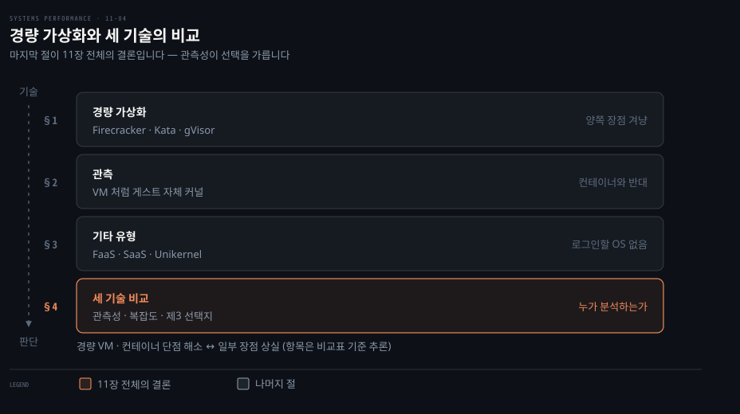
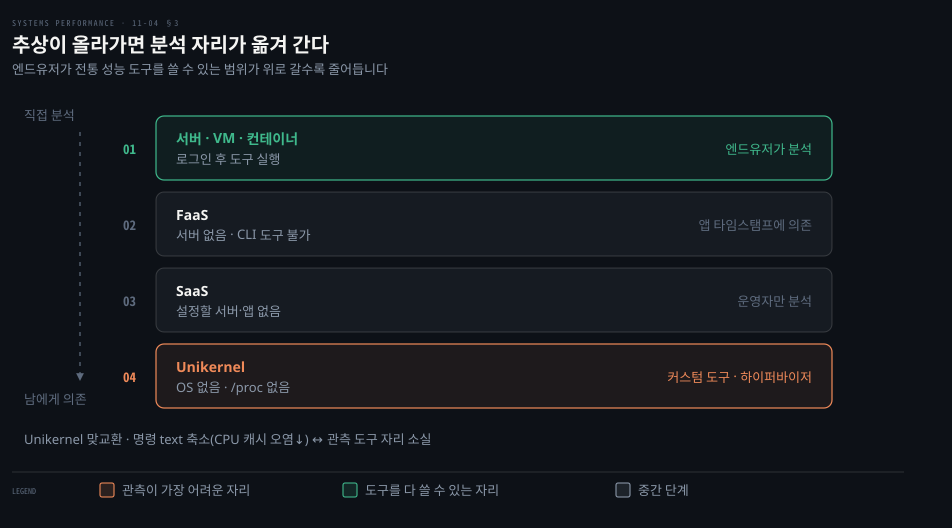
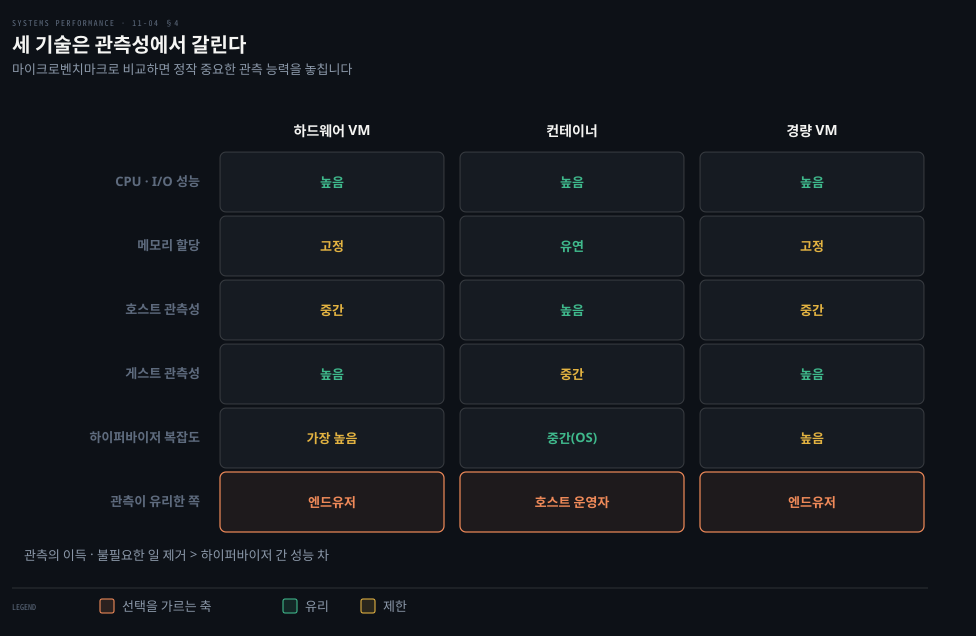

# 클라우드 컴퓨팅 — 경량 가상화·기타·비교
---
> 이 노트는 11장의 마지막으로, 11.4 경량 가상화·11.5 기타 유형·11.6 비교를 다룹니다. 하드웨어 가상화의 보안과 컨테이너의 효율·빠른 부팅을 결합한 경량 가상화(Firecracker), FaaS·Unikernel 같은 기타 유형, 그리고 세 가상화 기술의 성능 비교를 봅니다.

## 핵심 요약

> 이 편이 매달린 하나의 생각은 **가상화 기술의 선택이 성능 수치가 아니라 "누가 분석할 것인가"로 갈린다는 것**입니다.

앞의 두 편이 하드웨어 가상화와 OS 가상화를 각각 봤습니다. 이 편은 그 사이를 메우는 경량 가상화를 보고, 셋을 나란히 놓고 비교합니다.

경량 하드웨어 가상화는 *양쪽의 장점* 을 노립니다. 하드웨어 가상화의 보안과, 컨테이너의 효율·빠른 부팅입니다. 방법은 하이퍼바이저를 작게 만드는 것입니다. QEMU가 140만 줄인 데 비해 Firecracker는 5만 줄입니다. 비디오·오디오·BIOS·PCI처럼 서버에 필요 없는 디바이스를 빼고, 현대 프로세서의 가상화 기능을 전제하기 때문입니다.

마지막 절이 11장 전체의 결론입니다. 세 기술의 CPU·I/O 성능은 모두 높아 마이크로벤치마크로는 잘 갈리지 않습니다. 실제로 갈리는 곳은 관측성입니다. 관측이 불필요한 일을 찾아 없애 주는 만큼, 그 이득이 하이퍼바이저 사이의 미세한 성능 차보다 큽니다.

## 학습 목표

> 이 편을 덮은 뒤 스스로 할 수 있어야 하는 일을 먼저 적어 둡니다.

- 경량 가상화가 작은 VMM으로 무엇을 얻고 무엇을 대가로 내는지 설명합니다.
- 경량 VM의 관측이 왜 컨테이너가 아니라 VM 쪽과 같은지 답합니다.
- 호스트 top 과 게스트 top 이 같은 경량 VM 을 다르게 보여 주는 까닭을 출력으로 설명합니다.
- FaaS·Unikernel의 공통 관측 문제를 한 문장으로 말합니다.
- 세 기술을 메모리 할당·하이퍼바이저 복잡도·관측성 축으로 비교하고, 누가 분석하느냐에 따라 기술을 고릅니다.

경량 가상화와 기타 유형을 거쳐 마지막에 셋을 비교합니다.

## 이 문서가 다루지 않는 것

> 앞 편으로 넘긴 주제를 밝혀 둡니다.

- **클라우드 일반 배경** — 11-01이 다룹니다.
- **하이퍼바이저 내부와 guest exit** — 11-02가 다룹니다.
- **namespace·cgroup 상세** — 11-03이 다룹니다.

## 1. 경량 가상화 — 양쪽의 장점

> 경량 가상화는 KVM류 하드웨어 가상화처럼 동작하되, VMM이 훨씬 작아 메모리 오버헤드가 낮고 부팅이 빠릅니다(~100ms). VMM 프로세스가 호스트에서 돌아 OS 자원 제어로 관리되고, namespace로 보안 계층을 더할 수 있습니다.

VM은 안전하지만 무겁고, 컨테이너는 가볍지만 커널을 공유합니다. 둘 중 하나를 고르는 대신 사이를 메우려는 시도가 이 절의 내용입니다.

여러 경량 가상화 프로젝트가 있습니다.

| 구현 | 성격 |
|------|------|
| Intel Clear Containers (2015) | Intel VT로 경량 VM. 부팅 <45ms. 이후 Kata로 합류 |
| Kata Containers (2017) | Clear Containers + Hyper.sh RunV 기반. "컨테이너의 속도, VM의 보안" |
| Google gVisor (2018) | Go로 쓴 전용 유저 공간 커널로 컨테이너 보안 개선 |
| Amazon Firecracker (2019) | KVM + 경량 VMM(QEMU 대신). 부팅 ~100ms |

흔한 구현은 *경량 하드웨어 하이퍼바이저*(Clear Containers·Kata·Firecracker)입니다. gVisor는 자체 경량 커널을 구현하는 다른 접근이라 컨테이너(11-03)에 더 가까운 특성을 가집니다.

**오버헤드** 는 KVM 가상화와 비슷하지만 VMM이 훨씬 작아 메모리 풋프린트가 낮습니다. 그 "훨씬 작음"은 QEMU 140만 줄 대 Firecracker 5만 줄이라는 차이입니다. Clear Containers 2.0은 컨테이너당 48~50MB를, Firecracker는 5MB 미만을 보고했습니다.

> **갱신 (2026-09)**: 두 프로젝트 모두 현재도 활발하고, 줄 수는 양쪽 다 늘었습니다. 직접 세어 보면 QEMU 11.1은 약 219만 줄, Firecracker v1.17은 인라인 테스트를 뺀 프로덕션 코드가 약 8만 줄입니다. 절대값은 책의 140만 대 5만에서 올라갔지만, 비율은 책의 약 28배(140만 ÷ 5만)에서 약 27배(219만 ÷ 8만)로 거의 그대로입니다. 공식 명세는 지금도 부팅 125ms 이하, 메모리 오버헤드 5MiB 이하를 보증합니다. Kata는 4.0.0(2026-07)에서 Rust 로 다시 쓴 런타임(runtime-rs)을 기본으로 삼고 기존 Go 런타임을 deprecated 로 돌렸습니다. (출처: 두 저장소 `--depth 1` 클론 후 실측, [Firecracker SPECIFICATION](https://github.com/firecracker-microvm/firecracker/blob/main/SPECIFICATION.md), [Kata 4.0.0 릴리스](https://github.com/kata-containers/kata-containers/releases/tag/4.0.0))

**자원 제어** 는 KVM 가상화와 비슷합니다. VMM이 호스트에서 프로세스로 돌기 때문에 cgroup·qdisc 같은 OS 자원 제어로 관리됩니다.

경량 VM 은 11-02 의 Config B 하드웨어 VM 처럼 동작합니다. 하드웨어 VM 대비 부팅이 훨씬 빠르고 메모리 오버헤드가 낮으며 보안이 개선됩니다. 경량 하이퍼바이저는 namespace 를 또 하나의 보안 계층으로 구성해 보안을 더 높일 수 있습니다.

이름은 구현마다 다릅니다. 경량 VM 을 컨테이너라 부르는 구현도 있고 *MicroVM* 이라 부르는 구현도 있습니다. 원서 저자는 "컨테이너"가 보통 OS 가상화를 가리키므로 MicroVM 쪽을 택합니다.

> 경량 가상화의 핵심은 *VMM을 작게 만들어 양쪽 장점을 얻는 것* 입니다. KVM류 하드웨어 가상화처럼 게스트가 전용 커널을 가져(보안·관측성) 동작하되, 불필요한 디바이스를 빼 컨테이너급 부팅 속도·밀도를 냅니다. 원서는 11.3 에서 컨테이너의 모든 단점(커널 경합·관측성 상실·커널 패닉 전파·다른 커널 불가)을 경량 가상화가 풀되 "일부 장점을 대가로"(at the cost of some advantages) 한다고만 적습니다.

무엇을 잃는지는 원서가 항목으로 적지 않았으므로, §4 비교표의 경량 가상화 열에서 읽어 냅니다. 이 노트의 추론입니다. 컨테이너가 "없음·유연·높음"이던 칸이 경량 VM 에서 바뀐 자리가 대가입니다. 메모리 할당이 고정되고 이중 캐싱이 가능해지므로 통합 파일 시스템 캐시와 유휴 메모리의 유연한 공유를 잃습니다. 추가 커널이 메모리를 조금 먹고, 호스트 관측성이 "높음"에서 "중간"으로 내려갑니다.

## 2. 관측 — VM처럼 게스트가 자체 커널을 본다

> 경량 가상화 관측은 KVM 가상화와 같습니다. 호스트에서는 VMM이 단일 프로세스(firecracker)로 보여 게스트 내부를 직접 못 보고, 게스트에서는 자체 전용 커널이라 BPF 등 커널 추적 도구가 다 동작합니다.

관측은 KVM 가상화(11-02)와 같습니다.

**호스트에서** 는 물리 자원을 표준 OS 도구로 보고, 게스트 VM은 *프로세스* 로 보입니다. VM 안의 프로세스나 파일 시스템은 직접 보이지 않아, 분석하려면 SSH 같은 접근권이 필요합니다.

호스트 top에서 Firecracker VM은 `firecracker` 라는 *단일 프로세스* 로 나타납니다. 2 CPU를 다 쓰면 200%로 보이지만, 그 CPU를 어느 게스트 프로세스가 쓰는지는 호스트에서 알 수 없습니다.

**게스트에서**: 가상화된 자원과 그 사용을 보고 물리 문제는 추론합니다. **핵심은 VM이 자체 전용 커널을 가져, BPF 기반 도구를 포함한 커널 추적 도구가 다 동작한다** 는 점입니다. 게스트 top은 어느 프로세스가 CPU를 쓰는지 그대로 보여 줍니다. 헤더 요약도 호스트와 다릅니다. 게스트가 자체 커널로 게스트 전용 통계를 유지하기 때문입니다. 같은 시점에 load average가 호스트에서 4.48, 게스트에서 1.89로 갈리는 식입니다. 게스트 mpstat은 할당된 2 CPU만 보여 줍니다.

> 관측의 핵심은 *11-02 VM과 같고 11-03 컨테이너와 다르다* 는 점입니다 — 경량 VM 게스트는 자체 커널이라 통계가 게스트 전용으로 정확하고 커널 추적이 다 됩니다. 컨테이너는 시스템 전역 통계가 호스트 것이 새어 나와(idle 컨테이너 iostat이 바쁘게 나옴) 헷갈렸지만, 경량 VM은 그렇지 않습니다. 이것이 경량 가상화가 "엔드유저 관측성"에서 컨테이너보다 나은 이유입니다(§4 비교).

## 3. 기타 유형 — FaaS·SaaS·Unikernel

> FaaS는 함수를 온디맨드로 실행해 서버 관리가 없지만(serverless) 시작 지연·관측 도구 부재가 문제입니다. SaaS는 고수준 소프트웨어를, Unikernel은 앱+최소 커널을 단일 바이너리로 컴파일하는데, 모두 OS가 없어 전통 관측이 어렵습니다.

다른 클라우드 컴퓨팅 기본 요소들입니다.

| 유형 | 설명 | 성능·관측 |
|------|------|----------|
| FaaS | 함수를 클라우드에 제출, 온디맨드 실행 | 서버 관리 없음(serverless). 시작 지연이 클 수 있고, 서버가 없어 전통 CLI 관측 도구 사용 불가 — 앱 제공 타임스탬프로만 분석 |
| SaaS | 고수준 소프트웨어(서버·앱 설정 불필요) | 운영자만 분석 가능. 엔드유저는 클라이언트 기반 타이밍만 |
| Unikernel | 앱 + 최소 커널 부분을 단일 바이너리로 컴파일, 하이퍼바이저가 직접 실행(OS 불필요) | 명령 text 최소화로 CPU 캐시 오염↓·미사용 코드 제거로 보안↑. 단 OS가 없어 관측 도구·`/proc` 통계 부재 |

**FaaS** 는 함수를 제출하면 클라우드가 온디맨드로 실행합니다 — 서버 관리가 없어 개발이 단순하지만, 함수 시작 시간이 상당할 수 있고 서버가 없어 전통 명령줄 관측 도구를 못 씁니다. 성능 분석이 *앱이 제공한 타임스탬프* 로 제한됩니다.

**Unikernel** 은 앱과 최소한의 커널을 단일 바이너리로 컴파일해 하이퍼바이저가 직접 실행합니다. OS가 필요 없습니다.

이득은 둘입니다. 명령 text가 줄어 CPU 캐시 오염이 낮아지고, 쓰지 않는 코드가 없으니 보안 표면도 줄어듭니다.

대신 *관측 도전* 이 생깁니다. OS가 없으니 관측 도구를 돌릴 자리가 없고 `/proc` 같은 커널 통계도 없습니다. 다만 Unikernel을 일반 프로세스로 돌릴 수 있는 경우가 많아 그것이 한 분석 경로가 되고, 하이퍼바이저가 스택 프로파일링 같은 방법을 마련할 수도 있습니다.

> 기타 유형의 공통 도전은 *로그인할 OS가 없다* 는 점입니다 — FaaS·SaaS는 운영자만 분석할 수 있고, Unikernel은 커스텀 도구·통계와 (이상적으로) 하이퍼바이저 프로파일링 지원이 필요합니다. 즉 추상화 수준이 높아질수록(서버→함수→단일 바이너리) 엔드유저의 전통 성능 분석 능력이 줄어들고, 분석이 앱 계측이나 운영자·하이퍼바이저 쪽으로 옮겨 갑니다.

## 4. 세 기술 비교 — 관측성이 가르는 선택

> 하드웨어·OS·경량 가상화는 CPU·I/O 성능은 모두 높지만, 메모리 할당 유연성·자원 제어·관측성에서 갈립니다. 관측은 컨테이너가 호스트 운영자에, VM(하드웨어·경량)이 엔드유저에 유리합니다.

"어느 것이 더 빠른가"로 물으면 답이 잘 나오지 않습니다. 셋 다 CPU·I/O 성능이 높기 때문입니다. 질문을 바꿔야 답이 갈립니다.

세 기술의 성능 속성을 비교합니다. 성능에 한정한 비교이고, 보안 같은 다른 차이는 별개입니다.

| 속성 | 하드웨어 가상화(KVM) | OS 가상화(컨테이너) | 경량 가상화(Firecracker) |
|------|---------------------|---------------------|-------------------------|
| CPU 성능 | 높음(CPU 지원) | 높음 | 높음(CPU 지원) |
| CPU 할당 | vCPU 고정 | 유연(shares + bandwidth) | vCPU 고정 |
| I/O 처리량 | 높음(SR-IOV) | 높음(내재 오버헤드 없음) | 높음(SR-IOV) |
| I/O 지연 | 낮음(SR-IOV·QEMU 없을 때) | 낮음 | 낮음(SR-IOV) |
| 메모리 접근 오버헤드 | 일부(EPT/NPT·shadow) | 없음 | 일부(EPT/NPT·shadow) |
| 메모리 손실 | 일부(추가 커널·페이지테이블) | 없음 | 일부(추가 커널) |
| 메모리 할당 | 고정(이중 캐싱 가능) | 유연(유휴 게스트 메모리를 캐시로) | 고정(이중 캐싱 가능) |
| 자원 제어 | 가장 많음(커널+하이퍼바이저) | 많음(커널에 의존) | 가장 많음(커널+하이퍼바이저) |
| 호스트 관측성 | 중간(자원·하이퍼바이저 통계, 게스트 내부 불가) | 높음(다 봄) | 중간(게스트 내부 불가) |
| 게스트 관측성 | 높음(전체 커널·가상 디바이스) | 중간(유저 모드+호스트 통계 새어 나옴) | 높음(전체 커널) |
| 관측 유리 | 엔드유저 | 호스트 운영자 | 엔드유저 |
| 하이퍼바이저 복잡도 | 가장 높음(복잡한 하이퍼바이저 추가) | 중간(OS) | 높음(경량 하이퍼바이저 추가) |
| 다른 OS 게스트 | 가능 | 보통 불가(syscall 변환으로 가끔 가능, 오버헤드 추가) | 가능 |

원서는 이 표가 새 기능이 나오면서 낡을 것이라 적습니다. 그래도 어느 범주에도 들지 않는 새 가상화 기술이 나왔을 때 무엇을 살펴야 하는지 보여 주는 축으로는 계속 쓸 수 있습니다.

핵심은 **관측성이 선택을 가른다** 는 점입니다 — 가상화를 마이크로벤치마크로 비교하면 *관측 능력의 중요성* 을 놓치기 쉽습니다. 관측은 불필요한 일을 식별·제거하게 해, 사소한 하이퍼바이저 차이보다 훨씬 큰 성능 이득을 줍니다.

- *호스트 운영자* 에겐 컨테이너가 최고 관측입니다. 호스트에서 모든 프로세스·상호작용을 봅니다.
- *엔드유저* 에겐 VM(하드웨어·경량)입니다. 게스트가 커널 접근권으로 모든 커널 기반 성능 도구(13~15장)를 돌립니다.
- 원서는 제3 선택지로 *커널 접근권을 가진 컨테이너* 를 듭니다. 운영자와 사용자 모두 모든 것을 볼 수 있습니다. 다만 컨테이너 사이에 보안 격리가 없으므로, 고객이 컨테이너 호스트까지 직접 운영할 때만 고를 수 있습니다.

> 비교의 핵심 교훈은 *관측성이 성능의 일부* 라는 점입니다 — "어느 게 더 빠른가"라는 마이크로벤치마크 비교는 관측 능력을 간과하는데, 실제로는 관측이 불필요한 일을 제거해 더 큰 이득을 줍니다. 그래서 선택은 "누가 분석하는가"에 달립니다. 호스트 운영자면 컨테이너, 엔드유저면 VM이고, 둘이 같은 조직이면 커널 접근권을 준 컨테이너도 후보입니다. 경량 가상화는 엔드유저 관측성 이점 덕에 사용이 늘 것으로 보입니다.

## 학습 점검

> 먼저 답해 본 뒤 아래 정답과 맞춰 봅니다. 1~4 는 본문을 떠올리는 문항이고, 5 는 본문에 없는 조건으로 판단하는 문항입니다.

1. 경량 가상화가 "양쪽의 장점"을 어떻게 얻으며(작은 VMM), 원서가 11.2 의 하드웨어 가상화와 무엇이 다르다고 하는지, 그리고 무엇을 대가로 하는지 설명해 봅니다. (→ §1, 원서 11.7 연습문제 2.6)
2. 경량 VM 게스트의 관측이 11-02 VM과 같고 11-03 컨테이너와 다른 까닭(자체 커널)을 떠올려 봅니다. (→ §2)
3. 호스트 top 에 `firecracker` 프로세스가 200% 로 보이고, 같은 순간 호스트 load average 는 4.48, 게스트는 1.89 입니다. 호스트에서 알 수 있는 것과 없는 것, 두 load average 가 다른 까닭을 말해 봅니다. (→ §2)
4. FaaS·Unikernel의 공통 관측 도전("로그인할 OS가 없다")이 무엇이며, 분석이 어디로 옮겨 가는지 말해 봅니다. (→ §3)
5. 두 상황에서 비교표를 써서 기술을 골라 봅니다. (→ §4)
   - (가) 한 팀이 멀티테넌트 호스트에서 메모리를 많이 쓰다 말다 하는 배치 컨테이너 여럿을 경량 VM 으로 옮기려 합니다. 비교표에서 무엇이 달라질지와, 하이퍼바이저 복잡도 행이 이 판단에 무엇을 더하는지 따져 봅니다.
   - (나) 사내 플랫폼 팀이 호스트를 직접 운영하고, 그 위의 서비스도 모두 사내 팀 것입니다. 성능 분석을 가장 쉽게 하려면 어느 선택지를 고르고, 어떤 조건이 깨지면 그 선택을 버려야 합니까?

## 정답 (자답 후 펼치기)

> 먼저 답한 뒤 읽습니다. 판단 근거와 흔한 오해를 함께 적습니다.

### 정답 1 — 작은 VMM, 서버 전용 디바이스

전가상화 하이퍼바이저는 데스크톱 VM 에서 출발해 비디오·오디오·BIOS·PCI 버스 같은 디바이스와 여러 세대의 프로세서 지원을 품습니다. 경량 하이퍼바이저는 서버에 필요 없는 디바이스를 빼고 현대 프로세서의 가상화 기능을 전제해, QEMU 140만 줄 대 Firecracker 5만 줄로 작아집니다.

그래서 부팅이 빠르고 메모리 오버헤드가 낮으면서 게스트가 전용 커널을 갖는 보안·관측성은 유지합니다. 대가는 원서가 "일부 장점"이라고만 적었고, 비교표로 읽으면 고정 메모리 할당과 이중 캐싱 가능성, 호스트 관측성 하락입니다. 대표 오해는 경량 VM 이 컨테이너 기술의 한 종류라고 보는 것입니다. 경량 VM 은 KVM 류 하드웨어 가상화 위에 있습니다.

### 정답 2 — 게스트가 자기 커널을 갖는다

경량 VM 게스트는 자체 전용 커널을 돌리므로 통계가 게스트 전용으로 유지되고 BPF 를 포함한 커널 추적 도구가 다 동작합니다. 컨테이너는 호스트 커널을 공유해 커널 추적이 막히고 시스템 전역 통계에 호스트 것이 섞입니다. 대표 오해는 "가볍다"는 공통점 때문에 관측도 컨테이너와 같으리라 보는 것입니다.

### 정답 3 — 프로세스 하나로만 보인다

호스트에서는 게스트 VM 이 `firecracker` 라는 단일 프로세스로 보이므로, 200% 는 그 VM 이 2 CPU 를 다 쓰고 있다는 것까지만 알려 줍니다. 그 CPU 를 게스트 안의 어느 프로세스가 쓰는지는 호스트에서 알 수 없어 SSH 같은 접근권이 필요합니다. load average 가 다른 까닭은 게스트가 자체 커널로 게스트 전용 통계를 유지하기 때문입니다. 호스트의 4.48 은 호스트 전체, 게스트의 1.89 는 그 VM 안의 부하입니다. 대표 오해는 둘 중 하나가 틀렸다고 보는 것입니다. 둘은 다른 커널이 센 다른 범위의 값입니다.

### 정답 4 — 로그인할 OS 가 없다

FaaS 는 서버가 없어 명령줄 관측 도구를 못 쓰고 앱이 남긴 타임스탬프로 분석합니다. Unikernel 은 OS 가 없어 도구를 돌릴 자리도 `/proc` 도 없습니다. 분석은 앱 계측, 운영자, 하이퍼바이저 쪽으로 옮겨 갑니다. Unikernel 은 일반 프로세스로 돌려 보는 것이 한 분석 경로가 됩니다.

### 정답 5 — 비교표로 고르기

(가) 유연한 메모리를 내주고 복잡도를 삽니다. 컨테이너에서는 한 컨테이너가 안 쓰는 메모리가 다른 컨테이너의 페이지 캐시로 쓰였습니다. 경량 VM 은 메모리 할당이 고정이고 이중 캐싱이 생길 수 있습니다. 쓰다 말다 하는 배치라면 유휴 메모리를 이웃에게 빌려주던 이득이 사라집니다. 추가 커널의 메모리도 조금 듭니다.

하이퍼바이저 복잡도는 OS 수준인 "중간"에서 경량 하이퍼바이저가 더해진 "높음"으로 올라갑니다. 운영자가 알아야 할 층이 하나 늘고, 자원 제어가 커널과 하이퍼바이저 두 곳에 걸리게 됩니다.

호스트 관측성도 "높음"에서 "중간"으로 내려갑니다. 원서는 클라우드 운영자에게 가장 관측성이 높은 선택지가 컨테이너라고 적는데, 경량 VM 으로 옮기면 호스트에서 게스트 안의 프로세스를 더는 보지 못합니다. 멀티테넌트 호스트를 운영하는 쪽에서는 이것이 가장 큰 손실입니다. 얻는 것은 커널 격리와 게스트 쪽 관측성입니다. 대표 오해는 경량 VM 의 메모리 오버헤드가 5MB 미만이니 메모리 면에서 잃는 것이 없다고 보는 것입니다. 오버헤드가 작아도 할당 방식이 고정으로 바뀝니다.

(나) 커널 접근권을 가진 컨테이너입니다. 호스트 운영자와 사용자가 같은 조직이면, 원서가 제3 선택지로 든 커널 접근권을 준 컨테이너가 후보입니다. 운영자와 사용자 모두 호스트의 모든 것과 커널까지 볼 수 있습니다. 이 선택은 컨테이너 사이에 보안 격리가 없다는 대가를 받아들일 수 있을 때만 성립합니다. 외부 고객이나 신뢰 경계가 다른 팀이 같은 호스트에 올라오는 순간 버려야 하며, 그때는 엔드유저 관측성을 지키는 VM(하드웨어·경량)으로 돌아갑니다.

## 관련 문서

- 컨테이너의 장단점과 CPU throttle 판별: [11-03 §5 「관측 — 호스트는 다 보지만 게스트는 헷갈린다」](./11-03.%ED%81%B4%EB%9D%BC%EC%9A%B0%EB%93%9C%20%EC%BB%B4%ED%93%A8%ED%8C%85%20%E2%80%94%20OS%20%EA%B0%80%EC%83%81%ED%99%94.md)
- Config B 하드웨어 VM 과 KVM 관측: [11-02](./11-02.%ED%81%B4%EB%9D%BC%EC%9A%B0%EB%93%9C%20%EC%BB%B4%ED%93%A8%ED%8C%85%20%E2%80%94%20%ED%95%98%EB%93%9C%EC%9B%A8%EC%96%B4%20%EA%B0%80%EC%83%81%ED%99%94.md)
