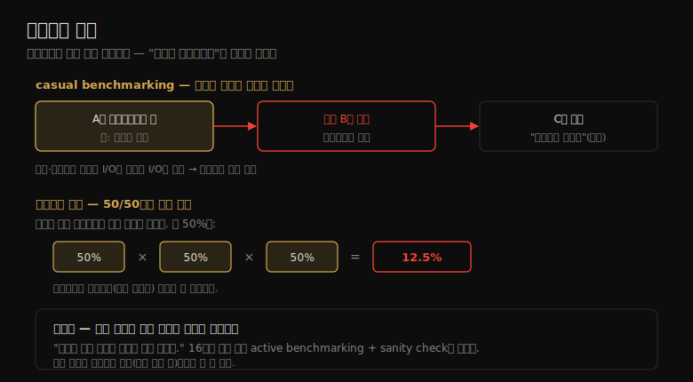

# 벤치마킹 (1) — 배경·효과적 벤치마킹·실패 16가지
---
> 이 노트는 12장의 출발점으로, 벤치마크를 *믿지 말고 분석하라* 는 관점으로 엽니다. "거짓말, 새빨간 거짓말, 그리고 성능 측정"이라는 인용처럼, 벤치마크는 시스템이 그 벤치마크를 얼마나 빨리 도는지만 알려 줄 뿐 — 그 결과가 내 환경에 무슨 의미인지는 직접 이해해야 합니다.

벤치마킹은 성능을 통제된 방식으로 테스트해, 선택지를 비교하고 회귀를 찾고 한계를 *운영 전에* 이해하게 합니다. 핵심은 "벤치마크는 시스템이 그 벤치마크를 얼마나 빨리 도는지만 알려 준다"는 점입니다 — 결과를 이해하고 내 환경에 어떻게 적용되는지 판단하는 건 내 몫입니다. 마이크로벤치마킹(인공 워크로드로 컴포넌트 테스트)과 매크로벤치마킹(클라이언트 워크로드 시뮬레이션으로 전체 시스템 테스트) 둘 다, *무엇을 측정하는지 분석* 하는 게 중요합니다.

> 이 노트는 12.1 배경을 다룹니다. 벤치마킹의 이유, 효과적 벤치마킹의 조건(분석 중심), 그리고 피해야 할 실패 16가지를 "왜 벤치마크를 믿으면 안 되는가" 중심으로 정리합니다. 벤치마킹 유형은 12-02, 방법론은 12-03에서 다룹니다.

## 1. 벤치마킹의 이유 — 무엇을 위해 재는가

> 벤치마킹은 시스템 설계 비교·PoC·튜닝·개발(회귀 테스트·한계 조사)·용량 계획·트러블슈팅·마케팅을 위해 합니다. 온프레미스는 하드웨어 구매 전 몇 주~몇 달의 과정이지만, 클라우드는 환경을 분 단위로 만들고 없애 벤치마킹을 쉽게 합니다.

벤치마킹을 하는 이유는 여럿입니다.

| 이유 | 내용 |
|------|------|
| 시스템 설계 | 시스템·컴포넌트·앱 비교(구매 결정, 가격/성능 비) |
| PoC | 구매·운영 투입 전 부하 하 성능 테스트 |
| 튜닝 | 튜너블·설정 옵션 테스트 |
| 개발 | 비회귀 테스트(자동 배터리) + 한계 조사(엔지니어링 노력 방향) |
| 용량 계획 | 시스템·앱 한계 결정(모델링 데이터 또는 직접) |
| 트러블슈팅 | 컴포넌트가 최대 성능을 낼 수 있는지 검증(예: 호스트 간 최대 네트워크 처리량) |
| 마케팅 | 최대 성능 측정(benchmarketing) |

온프레미스 엔터프라이즈에선 PoC 하드웨어 벤치마킹이 대규모 구매 전 중요 단계라, 배송·랙·케이블·OS 설치·테스트로 몇 주~몇 달이 걸립니다. **클라우드는 다릅니다** — 자원이 온디맨드라 큰 초기 투자 없이 즉시 쓰고 빠르게 바꿉니다(다른 인스턴스 타입 재배포). 대규모 환경을 분 단위로 만들어 벤치마크 돌리고 없애는 데 비용이 거의 안 듭니다.

> 클라우드는 *실험* 도 쉽게 합니다 — 새 인스턴스 타입이 나오면 전통 벤치마킹 평가를 건너뛰고 운영 워크로드로 바로 테스트할 수 있습니다. 그 시나리오에서도 벤치마킹은 컴포넌트 성능을 비교해 성능 차이를 *설명* 하는 데 여전히 쓰입니다 — Netflix 성능 팀은 새 인스턴스 타입을 다양한 마이크로벤치마크로 자동 분석하며, 시스템 통계·CPU 프로파일을 자동 수집해 차이를 설명합니다.

## 2. 효과적 벤치마킹 — 결과가 아니라 분석

> 벤치마킹은 의외로 잘하기 어렵습니다 — 한 연구는 415개 파일시스템 벤치마크 중 대부분이 결함이 있다고 했습니다. 좋은 벤치마크는 반복·관측·이식·표현·현실·실행 가능해야 하고, 무엇보다 결과의 *분석* 이 핵심입니다.

벤치마킹은 실수·간과의 여지가 많아 잘하기 어렵습니다 — "9년간 파일시스템·스토리지 벤치마킹 연구"는 *106개 논문의 415개 벤치마크 중 대부분이 결함* 이고 많은 논문이 참된 성능을 명확히 보이지 못한다고 했습니다. 좋은 벤치마크의 조건:

| 조건 | 의미 |
|------|------|
| 반복 가능(repeatable) | 비교를 용이하게 |
| 관측 가능(observable) | 성능을 분석·이해 |
| 이식 가능(portable) | 경쟁사·다른 릴리스에서 실행 |
| 표현 용이(presentable) | 누구나 결과 이해 |
| 현실적(realistic) | 고객 경험 현실 반영 |
| 실행 가능(runnable) | 개발자가 빠르게 변경 테스트 |
| (구매 시) 가격/성능 비 | 5년 자본 비용으로 정량화 |

핵심은 효과적 벤치마킹이 *벤치마크를 어떻게 적용하느냐* — 분석과 결론 — 라는 점입니다. **벤치마크 분석** 에서 알아야 할 것: 무엇을 테스트하나, 한계 요인이 무엇인가, 결과에 영향 주는 교란은, 어떤 결론을 끌어낼 수 있나.

> 이 분석은 *벤치마크가 도는 동안 시스템 성능을 분석* 할 때 가장 잘 됩니다. 흔한 실수는 주니어가 벤치마크를 돌리고 끝난 *뒤* 전문가가 결과를 설명하게 하는 것 — 전문가를 벤치마크 *중* 에 투입해 돌아가는 시스템을 분석해야 합니다(12-03 active benchmarking). Bill Joy가 1981년 BSD TCP/IP 스택을 분석하며 "11/750이 CPU 포화"라고 한계 요인을 짚고 커널 컴포넌트별 CPU 시간을 설명한 게 그 예입니다 — 플레임 그래프가 이제 이를 쉽게 합니다.

## 3. 실패 16가지 (1) — casual부터 환경 무시까지

> 가장 흔한 실패는 casual benchmarking(A를 재려다 B를 측정하고 C라 결론), 맹신, 분석 없는 숫자입니다. 복잡한 도구·틀린 대상·환경 무시도 결과를 무의미하게 만듭니다 — 모두 "무엇을 측정하는지"를 안 따진 탓입니다.

대표적인 실패 두 가지(casual benchmarking과 벤치마크 역설)를 한 장으로 정리하면 다음과 같습니다.

벤치마킹 실패 16가지 중 앞쪽 절반입니다.

1. **Casual benchmarking**: "A를 벤치마크하는데 실은 B를 측정하고 C를 측정했다고 결론짓는다." 많은 도구가 디스크 성능을 잰다고 주장하나 실은 파일시스템 성능을 잽니다(캐시·버퍼링으로 디스크 I/O를 메모리 I/O로 대체) — 자릿수가 다릅니다.
2. **맹신(blind faith)**: 인기 도구가 신뢰할 만하다는 믿음(argumentum ad populum). 인기 = 유효가 아닙니다. 문제는 도구 버그가 아니라 *결과 해석* 인 경우가 많습니다.
3. **분석 없는 숫자**: 분석 없는 맨 결과는 저자가 미숙하다는 신호입니다. "벤치마크 결과를 일주일 미만 연구했다면 아마 틀렸다." 시간이 없으면 확인 못 한 가정을 결과와 함께 나열합니다(도구 무버그 가정, 디스크 I/O를 실제 측정 가정 등).
4. **복잡한 도구**: 도구의 복잡성이 분석을 방해하면 안 됩니다 — 오픈소스에 짧아야 빠르게 읽고 이해합니다. 마이크로벤치마크는 C 권장, *벤치마크를 벤치마크하는 문제*(단일 스레드 도구가 결과를 제한)를 조심합니다.
5. **틀린 대상 테스트**: 도구가 있다고 디스크를 테스트하지만, 대상 환경은 파일시스템 캐시에서 전부 돌아 디스크 I/O와 무관할 수 있습니다. 엔지니어링 팀이 한 벤치마크에 표준화해 *고객 워크로드와 안 닮은* 것에 노력을 쏟기도 합니다.
6. **환경 무시**: 운영 환경이 테스트 환경과 맞나? 기본 설정·기본 튜너블·기본 파일시스템의 테스트 서버는, 고I/O로 튜닝된 운영 DB 서버와 달라 비현실적입니다.

> 앞쪽 실패들의 공통 뿌리는 *"무엇을 측정하는지"를 안 따진 것* 입니다. 초보자에겐 벤치마크 이해가 특히 어렵습니다 — 방 온도가 1,000도라는 온도계는 즉시 이상함을 알지만, 벤치마크 숫자는 낯설어 의심할 본능이 없습니다. 그래서 1·5번(틀린 것 측정)을 막으려면 *워크로드 특성화* 로 실제 워크로드를 측정해 닮은 벤치마크를 고르는 게 중요합니다.

## 4. 실패 16가지 (2) — 에러·변동·교란부터 cheating까지

> 에러 무시(블록된 요청의 타임아웃을 지연으로 보고)·변동 무시(평균만 흉내)·교란 무시(백업·이웃 테넌트)는 흔한 함정입니다. 다중 요인 변경·벤치마크 역설·경쟁사 벤치마킹·benchmark special·cheating까지, 모두 결과를 왜곡하거나 오도합니다.

뒤쪽 절반입니다.

7. **에러 무시**: 결과가 나왔다고 성공한 테스트가 아닙니다 — 일부(또는 전부) 요청이 에러일 수 있습니다. 한 사례에서 웹 서버 평균 지연이 1초 넘게 나왔는데, 방화벽이 모든 요청을 막아 *클라이언트 타임아웃 시간* 이 지연으로 보고된 것이었습니다.
8. **변동 무시**: 도구가 평균·일정 부하만 흉내 냅니다 — 쓰기가 10초마다 버스트(비동기 플러시)로 읽기를 큐잉시키는 실제 문제를, 평균 부하 흉내는 못 잡습니다. Markov 모델로 변동을 흉내 낼 수 있습니다.
9. **교란 무시**: 백업·모니터링 에이전트·(클라우드의) 보이지 않는 이웃 테넌트가 결과에 영향을 줍니다. 완화책은 *더 긴 실행*(초가 아닌 분)과 표준편차 점검 — 1초 미만 테스트는 인터럽트·스케줄링·캐시 온기에 교란됩니다.
10. **다중 요인 변경**: 두 결과 비교 시 모든 차이를 이해해야 합니다 — 호스트 간 네트워크가 동일한가? 클라우드는 인스턴스가 빠른/느린 시스템에 생성되거나 이웃 부하가 달라, 여러 인스턴스를 테스트해 중앙값(또는 분포)을 봅니다.
11. **벤치마크 역설**: "이길 확률이 50/50이면 보통 진다." 고객이 여러 벤치마크를 *모두* 이기길 원하면, 3개 각 50%는 0.5³ = 12.5%입니다.
12. **경쟁사 벤치마킹**: 고객은 몇 달 쓰며 튜닝하지만, 나는 경쟁사 제품을 튜닝할 시간이 없어 *비현실적 미튜닝 결과* 만 얻습니다 — 경쟁사 고객이 보면 신뢰를 잃습니다.
13. **아군 오발(friendly fire)**: 자사 제품도 최고 구성·진짜 한계까지 안 밀면 과소평가됩니다 — 문서 없는 신기술을 벤치마크 팀이 오설정해 제품을 깎아내린 사례. "이 벤치마크의 병목이 무엇인가?"를 물어 100% 포화 자원을 식별합니다.
14. **오도(misleading)**: 기술적으로 맞지만 오도 — 비싸서 안 팔릴 커스텀 제품의 가격 미공개 결과, "2배 빠르다"는 모호한 요약. 벤더 결과는 *상한*(넘지 못할 값)으로 유용합니다.
15. **Benchmark special**: 벤더가 인기 벤치마크에 점수 잘 나오게 제품을 엔지니어링(실제 고객 성능 무시). TPC는 "벤치마크 결과만 개선하고 실제 성능·가격은 아닌 구현 금지" 조항과 "가격은 고객 실제 지불가의 2% 이내" 요건을 더했습니다.
16. **Cheating**: 가짜 결과 공유 — 다행히 드물거나 없습니다(저자도 순수 조작은 못 봄).

> 뒤쪽 실패들의 공통 주제는 *결과의 왜곡·오도* 입니다. 핵심 교훈 둘 — ① 모든 벤치마크 숫자에 *한계 요인과 분석* 을 동반하라(7·13번), ② 벤더 결과는 의심하되 *상한* 으로는 쓸 수 있다(14번). 결국 16가지 모두 12-03 active benchmarking(돌아가는 동안 분석)과 sanity check로 막습니다 — "무엇을 측정하는지" 검증이 유일한 방어선입니다.

## 학습 점검

> 이 노트의 핵심을 스스로 떠올려 봅니다. 답이 막히면 해당 섹션으로 돌아가 확인합니다.

- "벤치마크는 시스템이 그 벤치마크를 얼마나 빨리 도는지만 알려 준다"가 무슨 뜻이며, 클라우드가 벤치마킹을 어떻게 쉽게 하는지 설명해 봅니다. (→ §1)
- 좋은 벤치마크의 조건(반복·관측·이식·표현·현실·실행)과, 효과적 벤치마킹의 핵심이 왜 "결과가 아니라 분석"인지 떠올려 봅니다. (→ §2)
- casual benchmarking("A를 재려다 B를 측정")의 디스크 vs 파일시스템 예와, 틀린 대상 테스트를 워크로드 특성화로 어떻게 막는지 말해 봅니다. (→ §3)
- 에러 무시·변동 무시·교란 무시가 각각 어떻게 결과를 왜곡하는지 설명해 봅니다. (→ §4)
- 벤치마크 역설(50/50이면 보통 진다)과 benchmark special이 무엇인지 떠올려 봅니다. (→ §4)