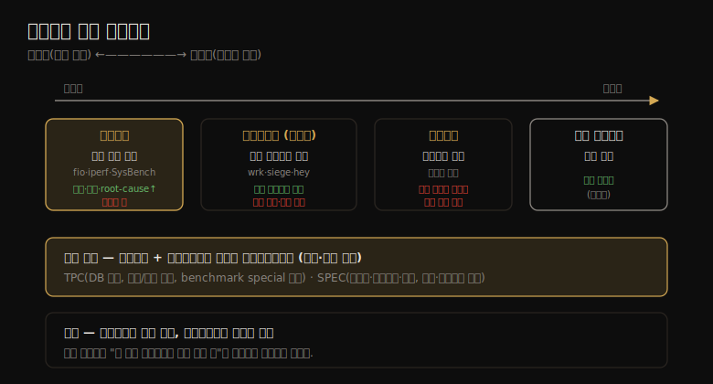

# 벤치마킹 (2) — 벤치마킹 유형
---
> 이 노트는 12.2 벤치마킹 유형을 다룹니다. 워크로드가 인공적이냐 현실적이냐의 스펙트럼 위에 놓인 세 유형 — 마이크로벤치마크(인공 단일 연산)·시뮬레이션(고객 워크로드 흉내)·리플레이(트레이스 재생) — 과 산업 표준 벤치마크(TPC·SPEC)를 봅니다.

벤치마크 유형은 *테스트하는 워크로드* 로 스펙트럼을 이룹니다 — 인공적(마이크로벤치마크)에서 현실적(운영 워크로드)까지입니다. 이 스펙트럼을 한 장으로 정리하면 다음과 같습니다.

 마이크로벤치마크는 단순해 분석이 쉽지만 현실과 멀고, 시뮬레이션은 현실에 가깝지만 복잡하며, 리플레이는 실제 트레이스를 재생하나 함정이 많습니다.

> 마이크로벤치마크 → 시뮬레이션(매크로) → 리플레이 → 산업 표준(TPC·SPEC) 순으로 갑니다. 각 유형의 장단점과 "결과를 어떻게 해석·적용하느냐"가 초점입니다.

## 1. 마이크로벤치마크 — 단순함이 장점

> 마이크로벤치마크는 단일 연산 유형(파일시스템 I/O·DB 쿼리·CPU 명령·syscall)을 인공 워크로드로 테스트합니다. 컴포넌트·코드 경로가 좁아 분석·root-cause가 빠르고 반복 가능하지만, 결과를 대상 워크로드에 매핑해야 의미가 있습니다.

마이크로벤치마크는 특정 연산 유형 하나를 인공 워크로드로 테스트합니다 — 한 종류 파일시스템 I/O·DB 쿼리·CPU 명령·syscall 등입니다. 장점은 *단순함* 입니다 — 컴포넌트·코드 경로를 좁혀 연구하기 쉽고 성능 차이를 빠르게 root-cause하며, 다른 컴포넌트 변동이 배제돼 반복 가능합니다. 인공적이라 실제 워크로드 시뮬레이션과 혼동되지 않는 것도 장점입니다.

자원별 예시 도구 — CPU: SysBench / 메모리 I/O: lmbench / 파일시스템: fio / 디스크: hdparm·dd·fio(direct I/O) / 네트워크: iperf. 단 "인기 벤치마크 대부분이 결함"이라는 경고를 기억합니다(12-01).

**설계 예시** — 파일시스템 마이크로벤치마크는 순차/랜덤·I/O 크기·방향(읽기/쓰기)을 테스트합니다.

| 테스트 | 의도 |
|--------|------|
| 순차 512B 읽기 | 최대 (현실적) IOPS |
| 순차 1MB 읽기 | 최대 읽기 처리량 |
| 순차 1MB 쓰기 | 최대 쓰기 처리량 |
| 랜덤 512B 읽기 | 랜덤 I/O 영향 |
| 랜덤 512B 쓰기 | 재쓰기 영향 |

이 테스트들에 두 요인을 곱합니다 — *워킹셋 크기*(메모리보다 훨씬 작으면 파일시스템 캐시 테스트, 훨씬 크면 디스크 I/O 테스트)와 *스레드 수*(단일=현재 CPU 클럭 기준, 다중=시스템 최대 성능). 빠르게 큰 테스트 매트릭스가 됩니다.

> 핵심은 *결과를 대상 워크로드에 매핑* 해야 한다는 점입니다 — 마이크로벤치마크가 여러 차원을 테스트해도 한두 개만 관련 있을 수 있어, 대상 시스템의 성능 분석·모델링으로 어느 결과가 적절한지 정합니다. 또 최고 속도만 보는 "sunny day" 테스트뿐 아니라, 경합·교란·변동을 보는 "cloudy/rainy day" 테스트도 고려해 문제를 놓치지 않습니다.

## 2. 시뮬레이션 — 고객 워크로드 흉내

> 시뮬레이션(매크로벤치마크)은 워크로드 특성화 기반으로 고객 앱 워크로드를 흉내 냅니다. 마이크로벤치마크가 놓칠 복잡한 시스템 상호작용을 포함하지만, 변동을 무시하기 쉽고 사용 패턴이 바뀌면 갱신이 필요합니다.

많은 벤치마크가 고객 앱 워크로드를 흉내 냅니다 — *매크로벤치마크* 입니다. 운영 환경의 워크로드 특성화(2장)를 기반으로 흉내 낼 특성을 정합니다 — 예: NFS 워크로드가 읽기 40%·쓰기 7%·getattr 19%·readdir 1%... 라면 그 비율을 흉내 냅니다.

시뮬레이션은 *마이크로벤치마크가 놓칠 복잡한 시스템 상호작용을 포함* 할 수 있어, 실제 클라이언트 성능에 가까운 결과를 냅니다. Whetstone(1972, 과학 워크로드)·Dhrystone(1984, 정수 워크로드)이 시뮬레이션 예입니다. 많은 회사가 HTTP 부하를 자체/외부 부하 생성기(wrk·siege·hey)로 흉내 내, 소프트웨어·하드웨어 변경 평가나 피크 부하(플래시 세일) 흉내로 병목을 노출합니다.

시뮬레이션은 *무상태* 또는 *상태유지* 입니다 — 무상태는 각 요청이 독립(측정 확률로 연산 유형을 랜덤 선택), 상태유지는 각 요청이 클라이언트 상태에 의존합니다. NFS 읽기/쓰기가 묶여 도착해 "쓰기 뒤 쓰기" 확률이 "읽기 뒤 쓰기"보다 훨씬 높다면, Markov 모델(요청을 상태로, 상태 전이 확률 측정)로 더 잘 흉내 냅니다.

> 시뮬레이션의 문제는 *변동 무시* 입니다(12-01 8번 실패) — 평균 부하를 흉내 내 버스트를 놓칩니다. 또 고객 사용 패턴이 시간에 따라 변해 *갱신이 필요* 한데, 옛 버전으로 이미 결과를 발표했으면 비교 불가가 되어 갱신에 저항이 생깁니다. 그래서 시뮬레이션은 "마이크로벤치마크보다 현실적이지만, 여전히 변동·갱신 함정이 있다"는 절충입니다.

## 3. 리플레이 — 이상적으로 보이나 함정이 많다

> 리플레이는 트레이스 로그를 대상에 재생해 실제 캡처된 클라이언트 연산으로 테스트합니다. 운영 테스트처럼 이상적으로 보이지만, 서버 특성이 바뀌면 캡처된 워크로드가 자연스럽게 반응하지 못해 오히려 시뮬레이션보다 나을 게 없습니다.

세 번째 유형은 트레이스 로그를 대상에 *재생* 해, 실제 캡처된 클라이언트 연산으로 성능을 테스트합니다. 운영에서 테스트하는 것만큼 이상적으로 들리지만 *문제가 많습니다* — 서버의 특성·전달 지연이 바뀌면, 캡처된 클라이언트 워크로드가 그 차이에 자연스럽게 반응하지 못해, 시뮬레이션된 고객 워크로드보다 나을 게 없습니다. 과한 신뢰를 두면 더 나빠집니다.

가상의 예 — 고객이 스토리지 업그레이드를 검토하며 운영 워크로드를 트레이스해 신규 하드웨어에 재생했더니 성능이 *나빠져* 판매가 무산됐습니다. 문제: 트레이스/재생이 *디스크 I/O 수준* 이었습니다. 구 시스템은 10K rpm 디스크, 신 시스템은 느린 7,200 rpm이었지만, 신 시스템은 파일시스템 캐시가 16배·프로세서가 빨랐습니다. *실제* 운영 워크로드는 대부분 캐시에서 돌아 성능이 개선됐을 텐데, 디스크 이벤트 재생은 이를 흉내 내지 못했습니다.

> 리플레이의 핵심 함정은 *틀린 수준 테스트* 입니다(위 예는 12-01 5번과 같음) — 디스크 I/O 트레이스를 재생하면 캐시 효과를 놓칩니다. 올바른 수준으로 재생해도 미묘한 타이밍 효과가 망칠 수 있습니다. 모든 벤치마크처럼, *무슨 일이 일어나는지 분석·이해* 하는 게 핵심입니다 — 리플레이가 "운영만큼 좋다"는 가정이 가장 위험합니다.

## 4. 산업 표준 — TPC·SPEC

> 산업 표준 벤치마크는 독립 기관이 만든 공정·관련성 있는 벤치마크 모음으로, 마이크로벤치마크와 시뮬레이션을 잘 정의된 가이드라인으로 실행합니다. TPC(DB 중심, 가격/성능 포함)와 SPEC(컴퓨트·클라우드·파일 등)이 대표입니다.

산업 표준 벤치마크는 독립 기관이 공정·관련성 있게 만든 것으로, 잘 정의·문서화된 마이크로벤치마크·시뮬레이션 모음을 정해진 가이드라인으로 실행합니다. 벤더가 (보통 유료로) 참여해 실행하고, 결과는 보통 설정 환경 전체 공개(감사 가능)를 요합니다. 고객에겐 여러 벤더·제품 결과가 이미 있어 시간을 아껴 주는데, *내 미래/현재 운영 워크로드에 가장 닮은 벤치마크를 찾는 것* 이 과제입니다.

산업 표준의 필요성은 1985년 "트랜잭션 처리 능력의 척도"(Jim Gray 외)가 제기했습니다 — 가격/성능 비 측정 필요와 TPS(초당 트랜잭션, 자동차 mpg 같은) 측정을 제안했고, 이게 TPC 창설로 이어졌습니다. 다른 척도로 MIPS(초당 백만 명령, 명령 유형 의존)·FLOPS(초당 부동소수점 연산)가 있습니다.

| 기관 | 벤치마크 | 특징 |
|------|---------|------|
| TPC | TPC-C(완전 컴퓨팅 환경)·TPC-E(OLTP 브로커리지)·TPC-H(의사결정 지원)·TPCx-HS(Hadoop) | DB 성능 중심. 결과에 *가격/성능 포함* |
| SPEC | CPU 2017(컴퓨트)·Cloud IaaS 2018·SPECsfs2014(파일 접근)·SPECvirt_sc2013(가상화) | 튜닝 방법·컴포넌트 목록 공개(보통 가격은 미포함) |

> 산업 표준의 핵심 가치는 *공정성과 비교 가능성* 입니다 — TPC는 가격/성능을 포함하고 benchmark special·특가를 금지 조항으로 막아(12-01 15번) 현실과 결과를 맞춥니다. 활용의 과제는 "어느 벤치마크가 내 워크로드에 가장 닮았나"이고, 현재 워크로드는 *워크로드 특성화* 로 판별합니다 — 즉 산업 표준도 "내 환경에 적용되는가"라는 12장 전체 질문에서 자유롭지 않습니다.

## 학습 점검

> 이 노트의 핵심을 스스로 떠올려 봅니다. 답이 막히면 해당 섹션으로 돌아가 확인합니다.

- 마이크로벤치마크의 장점(단순함)과, 결과를 대상 워크로드에 매핑해야 하는 까닭을 설명해 봅니다. (→ §1)
- 시뮬레이션(매크로벤치마크)이 마이크로벤치마크보다 무엇을 더 포착하며, 무상태와 상태유지(Markov)의 차이를 떠올려 봅니다. (→ §2)
- 리플레이가 이상적으로 보이지만 함정이 많은 까닭을, 디스크 I/O 트레이스 재생 예로 설명해 봅니다. (→ §3)
- TPC와 SPEC의 차이(가격/성능 포함 여부 등)와, 산업 표준 활용의 핵심 과제가 무엇인지 말해 봅니다. (→ §4)
- 산업 표준 벤치마크도 "내 환경에 적용되는가"라는 질문에서 자유롭지 않은 까닭을 떠올려 봅니다. (→ §4)