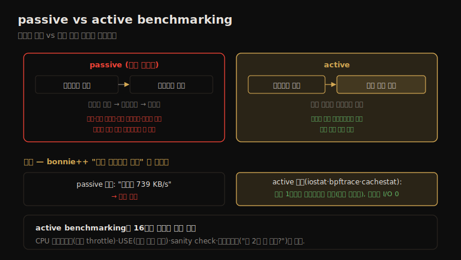

# 벤치마킹 (3) — 방법론·벤치마크 질문
---
> 이 노트는 12.3 방법론·12.4 벤치마크 질문을 다룹니다. 핵심은 passive benchmarking(돌리고 잊기, 안티 방법론)과 active benchmarking(돌아가는 동안 분석)의 대비입니다 — active가 벤치마크가 무엇을 진짜 테스트하는지 확인하고 한계 요인을 식별합니다.

벤치마킹 방법론의 중심은 *돌아가는 동안 분석하느냐* 입니다. passive benchmarking은 돌리고 잊는 안티 방법론이고, active benchmarking은 벤치마크 *중* 에 관측 도구로 시스템을 분석해 무엇을 진짜 테스트하는지·한계 요인이 무엇인지 확인합니다. 이 차이가 12-01의 16가지 실패를 막는 유일한 방어선입니다.

> passive vs active benchmarking → CPU 프로파일링·USE·워크로드 특성화 → 커스텀 벤치마크·ramping load → sanity check·통계 분석·체크리스트 → 벤치마크 질문 목록 순으로 갑니다.

## 1. Passive vs Active Benchmarking — 핵심 대비

> passive benchmarking은 벤치마크를 돌리고 완료까지 무시하는 안티 방법론으로, 결과가 버그·단일 스레드·무관 컴포넌트·교란에 좌우될 수 있습니다. active benchmarking은 돌아가는 동안 관측 도구로 분석해, 벤치마크가 주장하는 것을 실제 테스트하는지 확인합니다.

passive와 active benchmarking의 대비를 한 장으로 정리하면 다음과 같습니다.

**passive benchmarking** 은 "돌리고 잊기" 전략입니다 — 벤치마크를 실행하고 완료까지 무시하며, 목표는 데이터 수집뿐입니다. 흔한 단계: 도구 선택 → 여러 옵션으로 실행 → 슬라이드 제작 → 경영진 제출. 결과의 문제:

- 벤치마크 소프트웨어 버그로 무효
- 벤치마크 소프트웨어가 제한(단일 스레드 등)
- 무관 컴포넌트가 제한(혼잡한 네트워크 등)
- 설정이 제한(성능 기능 미활성, 최대 구성 아님)
- 교란에 좌우(반복 불가)
- 완전히 틀린 것을 벤치마크

passive benchmarking은 쉽지만 오류가 잦습니다 — 벤더가 하면 거짓 경보로 엔지니어링 자원을 낭비하거나 판매를 잃고, 고객이 하면 나쁜 제품 선택으로 나중에 고생합니다.

**active benchmarking** 은 벤치마크가 *끝난 뒤가 아니라 도는 동안* 관측 도구로 성능을 분석합니다. 벤치마크가 주장하는 것을 실제 테스트하는지·내가 그것을 이해하는지 확인하고, 시스템(또는 벤치마크 자체)의 진짜 한계 요인을 식별합니다. 결과 공유 시 *만난 한계의 구체적 세부* 를 포함하면 큰 도움이 됩니다. 덤으로 관측 도구 기술을 키우는 좋은 기회입니다 — 알려진 부하를 도구로 어떻게 보는지 봅니다.

> 핵심 대비는 *passive는 결과만, active는 과정을 분석* 한다는 점입니다. 이상적으로는 벤치마크를 정상 상태로 두고 몇 시간~며칠 분석합니다. bonnie++ 사례가 active benchmarking의 위력을 보입니다 — "하드 드라이브 성능"을 테스트한다는 첫 테스트("Sequential Output·Per Chr")를 도는 동안 iostat·bpftrace·cachestat로 분석하니, 실은 *1바이트 파일시스템 쓰기(캐시에 버퍼링)* 였고 디스크 I/O를 전혀 안 했습니다. 도는 동안 분석하지 않았으면 "디스크가 739 KB/s"라는 틀린 결론을 냈을 것입니다.

## 2. CPU 프로파일링·USE·워크로드 특성화 — 빠른 발견

> CPU 프로파일링은 벤치마크 대상·소프트웨어가 무엇을 하는지 빠르게 확인해 발견을 이끕니다(플레임 그래프). USE 메서드는 한계가 발견됐는지(어떤 컴포넌트가 100%) 보장하고, 워크로드 특성화는 벤치마크가 운영 환경과 얼마나 관련 있는지 판별합니다.

active benchmarking 중 자주 쓰는 세 방법론입니다.

**CPU 프로파일링** 은 모든 소프트웨어가 무엇을 하는지 빠르게 확인해, 흥미로운 게 나오는지 봅니다 — 가장 중요한 컴포넌트로 연구를 좁힙니다. 유저·커널 스택 모두 프로파일하며 플레임 그래프로 봅니다. 사례 — 디스크 마이크로벤치마크 결과가 실망스러워 디스크·컨트롤러 업그레이드를 검토했는데, USE 메서드로 디스크가 안 바쁘고 system-time CPU가 좀 있어 커널을 프로파일했더니, 62%의 샘플이 `zfs_zone_io_throttle()` — *기본 활성된 ZFS I/O throttling 자원 제어* 가 벤치마크를 인위적으로 throttle하고 있었습니다(신 시스템 기본, 구 시스템엔 없었음).

**USE 메서드**(2장)는 벤치마킹 중 *한계가 발견됐는지 보장* 합니다 — 어떤 컴포넌트(하드웨어·소프트웨어)가 100% 사용률에 닿았거나, 아니면 시스템을 한계까지 안 몬 것입니다.

**워크로드 특성화**(2장)는 주어진 벤치마크가 현재 운영 환경과 *얼마나 관련 있는지* 판별합니다 — 운영 워크로드를 특성화해 비교합니다.

> 세 방법론의 공통점은 *active benchmarking의 일부로 빠른 발견을 이끈다* 는 점입니다 — CPU 프로파일링은 "소프트웨어가 무엇을 하나"(숨은 throttle 발견), USE는 "한계가 발견됐나"(100% 자원 찾기), 워크로드 특성화는 "관련 있나"(운영과 비교)입니다. 특히 CPU 프로파일링은 디스크 벤치마크에서도 커널 CPU를 들여다봐 숨은 자원 제어 같은 의외의 발견을 줍니다.

## 3. 커스텀 벤치마크·ramping load — 직접 만들고 한계 찾기

> 단순 벤치마크는 직접 코딩하는 게 분석에 유리합니다(C 권장, 컴파일러 최적화 주의). ramping load는 부하를 조금씩 늘려 최대 처리량을 찾는 방법으로, 확장성 프로파일을 그리되 처리량뿐 아니라 지연 분포도 함께 봐야 합니다.

**커스텀 벤치마크** 는 단순 벤치마크를 직접 코딩하는 것입니다 — 짧게 유지해 복잡성이 분석을 방해하지 않게 합니다. C가 보통 좋은 선택(실행되는 것에 가깝게 매핑)이지만 *컴파일러 최적화 주의* — 출력이 안 쓰이면 단순 루틴을 제거할 수 있어, 도는 동안 다른 도구로 동작을 확인하고 디스어셈블을 봅니다. VM·GC·동적 컴파일 언어는 디버깅·제어가 더 어렵지만, 그런 언어로 쓰인 클라이언트를 흉내 내려면(매크로벤치마크) 써야 할 수 있습니다. 소프트웨어가 단지 부하만 생성(부하 생성기)하고 측정은 다른 도구에 맡길 수도 있습니다.

**ramping load** 는 시스템이 다룰 수 있는 최대 처리량을 찾는 단순한 방법입니다 — 부하를 작은 증분으로 더하며 전달 처리량을 한계까지 측정합니다. 결과를 그래프로 그리면 *확장성 프로파일* 이 나와, 시각적으로나 확장성 모델로 연구합니다. 예 — 파일시스템이 스레드를 하나씩 더하며 초당 거의 50만 읽기까지 확장(피크에서 3.5GB/s 전송, VFS 통계로 확인). 저자는 이 접근(짧은 Perl 부하 생성기를 클라이언트 농장에서 병렬 실행)으로 Sun ZFS Storage Appliance의 한계를 찾아 세계 기록 결과를 냈습니다.

> ramping load의 핵심 주의는 *처리량뿐 아니라 지연(특히 분포)도 재라* 는 점입니다 — 시스템이 한계에 가까워지면 큐잉 지연이 커집니다. 990,000 IOPS를 평균 5ms로 내다가, 100만을 넘기려 클라이언트를 더하면 모든 연산이 무겁게 큐잉돼 평균 50ms가 될 수 있습니다 — 이는 허용 불가입니다. "고객에게 이 지연이 허용될까?"를 물어, 마케팅에는 990,000 IOPS를 줍니다.

## 4. Sanity check·통계 분석·체크리스트 — 결과 검증

> sanity check는 결과가 알려진 한계(네트워크 대역폭·디스크 IOPS)를 넘는지 간단한 계산으로 검증합니다. 통계 분석은 결과 데이터를 분석하고, 벤치마킹 체크리스트(왜 2배 안 됐나·한계 깼나·에러 났나·재현되나·중요한가·일어나긴 했나)로 정확도를 확인합니다.

**sanity check** 는 결과의 어떤 특성이 말이 안 되는지 조사합니다 — 결과가 알려진 한계(네트워크 대역폭·컨트롤러·디스크 IOPS)를 넘는지 봅니다. 예 — NFS 서버가 8KB 읽기로 50,000 IOPS를 낸다는데, 50,000 × 8KB = 400,000 KB/s = 3.2Gbit/s 이상이라 단일 1Gbit/s 인터페이스 한계를 훨씬 넘습니다 — 뭔가 잘못됐습니다(보통 클라이언트 캐싱을 테스트한 것). 저자는 이 계산으로 단일 1Gbit/s에서 350MB/s·800MB/s·1.15GB/s 같은 가짜 결과를 식별했습니다(1Gbit/s는 실측 ~119MB/s가 한계).

**통계 분석** 은 결과 데이터를 분석합니다 — 도구·설정·지표 선택 → 실행(대규모 데이터셋 수집) → 통계 해석(보고서)입니다. active benchmarking(도는 동안 분석)·passive(분석 없음)와 달리 *결과 분석에 집중* 합니다. 대규모 시스템 접근이 시간 제한·고비용일 때(여러 팀이 한 max config 시스템을 공유), 수집은 비싸므로 신뢰성을 확보하고 변동·분포·오차 범위를 함께 수집해 문제를 일찍 찾습니다.

**벤치마킹 체크리스트** — 결과 정확도를 검증할 질문:

| 질문 | 의미 |
|------|------|
| 왜 2배 안 됐나? | 한계 요인이 무엇인가(의도한 대상이 아닌 게 한계면 많은 문제 해결) |
| 한계 깼나? | sanity check |
| 에러 났나? | 에러는 정상 연산과 다르게 동작, 높은 에러율은 결과 왜곡 |
| 재현되나? | 결과 일관성 |
| 중요한가? | 테스트한 워크로드가 내 운영에 관련 있나 |
| 일어나긴 했나? | (방화벽 차단 타임아웃을 지연으로 보고한 사례) |

> 세 가지의 공통 목표는 *결과 검증* 입니다 — sanity check는 간단한 계산으로(한계 초과?), 통계 분석은 변동·분포·오차로(신뢰할 만한가?), 체크리스트는 여섯 질문으로(정확한가?) 검증합니다. 특히 "왜 2배 안 됐나?"가 강력합니다 — 한계 요인을 물으면, 그게 의도한 테스트 대상이 아닐 때 많은 벤치마킹 문제가 풀립니다.

## 5. 벤치마크 질문 — 결과를 받았을 때

> 벤더가 벤치마크 결과를 주면, 시스템에 접근 못 해도 던질 질문이 많습니다 — 내 운영 워크로드와 관련 있나? 시스템 구성은? 평균인가 피크인가? 한계 요인은? 에러율은? 재현되나? 무엇을 진짜 측정하는지 알아내는 게 목표입니다.

벤더가 결과를 주면, 돌아가는 벤치마크에 접근해 분석 못 해도 던질 질문이 많습니다 — *무엇을 진짜 측정하는지, 얼마나 현실적·반복 가능한지* 를 알아내는 게 목표입니다.

**일반:**

- 이 벤치마크가 내 운영 워크로드와 관련 있나?
- 테스트 시스템 구성은? 단일 시스템인가 클러스터인가? 비용은?
- 클라이언트 구성은? 테스트 기간은? 결과 개수는?
- 평균인가 피크인가? 평균은? 분포 세부(표준편차·백분위)는?
- 한계 요인은? 연산 성공/실패 비는? 연산 속성은?
- 변동을 흉내 냈나, 평균 워크로드인가?
- 다른 분석 도구로 결과를 확인했나(스크린샷)? 오차 범위는? 재현되나?

**자원별** — CPU/메모리: 어느 프로세서? 오버클럭? DIMM 수·소켓 연결? CPU 비활성? 시스템 전역 CPU 사용률(가벼운 부하가 turbo boost로 더 빠를 수 있음)? / 스토리지: 디바이스 구성(수·유형·RAID·캐시·write-back/through)? 파일시스템? 워킹셋 크기? 어디에 캐시됐나? / 네트워크: 인터페이스 수·유형? 토폴로지? 프로토콜·소켓 옵션? TCP/UDP 튜너블?

> 벤치마크 질문의 핵심은 *접근 없이도 검증할 수 있다* 는 점입니다 — 12-03의 active benchmarking이 시스템에 접근 가능할 때의 검증이라면, 이 질문 목록은 *결과만 받았을 때* 의 검증입니다. 산업 표준 벤치마크는 많은 답이 공개 세부에 있습니다. 결국 12장 전체의 메시지로 수렴합니다 — "벤치마크 숫자를 믿지 말고, 무엇을 측정하는지 분석·질문하라."

## 학습 점검

> 이 노트의 핵심을 스스로 떠올려 봅니다. 답이 막히면 해당 섹션으로 돌아가 확인합니다.

- passive와 active benchmarking의 차이와, bonnie++ 사례가 active benchmarking의 위력을 어떻게 보이는지 설명해 봅니다. (→ §1)
- CPU 프로파일링이 디스크 벤치마크에서 어떤 의외의 발견(ZFS throttle)을 줬는지, USE 메서드가 무엇을 보장하는지 떠올려 봅니다. (→ §2)
- ramping load에서 처리량뿐 아니라 지연 분포도 재야 하는 까닭을, 990,000 vs 100만 IOPS 예로 말해 봅니다. (→ §3)
- sanity check가 NFS 50,000 IOPS 결과를 어떻게 가짜로 식별하는지, 체크리스트의 "왜 2배 안 됐나?"가 왜 강력한지 설명해 봅니다. (→ §4)
- 벤더 결과만 받았을 때 던질 핵심 질문 몇 가지와, 그것이 12장 전체 메시지와 어떻게 이어지는지 떠올려 봅니다. (→ §5)