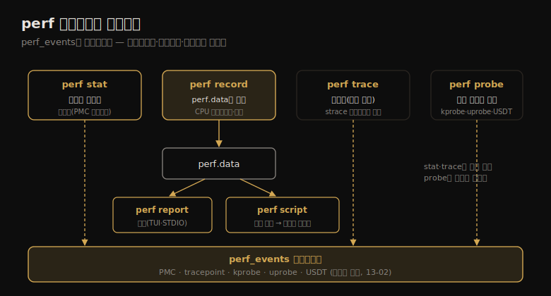

# perf (1) — 개요·서브커맨드·원라이너
---
> 이 노트는 13장의 출발점으로, perf(1)가 *리눅스 공식 프로파일러이자 멀티툴* 임을 잡습니다. perf_events 관측 서브시스템의 프론트엔드로, PMC로 시작해 tracepoint·kprobe·uprobe·USDT까지 아우르는 프로파일링·트레이싱·스크립팅 도구입니다.

perf(1)는 리눅스 커널 소스(tools/perf)에 있는 공식 프로파일러입니다 — perf_events(PCL·LPE) 서브시스템의 프론트엔드로, PMC(성능 모니터링 카운터) 능력으로 시작해 이벤트 기반 트레이싱 소스(tracepoint·kprobe·uprobe·USDT)까지 자랐습니다. 다른 트레이서보다 *CPU 분석* 에 특히 적합합니다 — CPU 스택 샘플링, 스케줄러 동작 추적, PMC로 마이크로아키텍처 수준(사이클 동작)을 봅니다. "어느 코드 경로가 CPU를 먹나?", "CPU가 메모리 로드/스토어에 stall됐나?", "스레드가 왜 CPU를 떠나나?", "디스크 I/O 패턴은?" 같은 질문에 답합니다.

> 이 노트는 13.1 서브커맨드 개요·13.2 원라이너를 다룹니다. perf의 능력이 서브커맨드로 어떻게 호출되는지, 그리고 카테고리별 원라이너(이벤트 나열·카운팅·프로파일링·정적/동적 트레이싱·리포팅)를 봅니다. 이벤트 소스는 13-02, 명령 상세는 13-03에서 다룹니다.


## 1. perf의 위치 — 공식 프로파일러이자 멀티툴

> perf(1)는 perf_events 서브시스템의 프론트엔드로, 프로파일링·트레이싱·스크립팅을 한데 묶은 멀티툴입니다. CPU 분석에 특히 적합하지만, tracepoint로 디스크 I/O·소프트웨어 함수 등 다른 대상도 분석합니다.

perf(1)는 특이한 도구입니다 — 리눅스 커널 소스 트리 안에 있는 크고 복잡한 유저 레벨 프로그램으로, 메인테이너 Arnaldo Carvalho de Melo가 "실험"이라 표현한 사례입니다. perf와 리눅스가 보조를 맞춰 함께 발전해 온 이점이 있었습니다.

perf(1)의 본업은 *멀티툴* 입니다 — 한 명령으로 프로파일링(샘플링)·트레이싱·스크립팅을 합니다. 강점은 **CPU 분석** 입니다.

| perf가 답하는 질문 | 방법 |
|--------------------|------|
| 어느 코드 경로가 CPU를 먹나? | CPU 스택 프로파일링(샘플링) |
| CPU가 메모리 로드/스토어에 stall됐나? | PMC(사이클·캐시 미스) |
| 스레드가 왜 CPU를 떠나나? | 스케줄러 동작 추적 |
| 디스크 I/O 패턴은? | block tracepoint 추적 |

CPU 분석에 특히 적합하지만, tracepoint·kprobe·uprobe·USDT로 디스크 I/O·소프트웨어 함수 등 다른 대상도 분석합니다.

> 핵심은 perf(1)가 *perf_events의 프론트엔드* 라는 점입니다 — 커널의 관측 서브시스템이 PMC·tracepoint·probe를 노출하고, perf(1)가 그것을 사람이 쓰는 명령으로 묶습니다. 13장은 perf(1) *자체* 에 집중하고, 특정 대상 분석은 앞 장들(6 CPU·8 파일시스템·9 디스크 등)에서 perf를 어떻게 쓰는지 보였습니다.


## 2. 서브커맨드 — record·report가 대표 흐름

> perf의 능력은 서브커맨드로 호출됩니다. 대표 흐름은 record(이벤트를 파일에 기록)와 report(파일 내용을 요약)입니다. stat(카운트)·script(샘플 출력)·trace(라이브 추적)·probe(동적 프로브 정의) 등 많은 서브커맨드가 있습니다.

perf(1)의 능력은 *서브커맨드* 로 호출됩니다. 서브커맨드가 perf_events 위에서 어떻게 맞물리는지를 한 장으로 정리하면 다음과 같습니다.



가장 흔한 흐름은 두 서브커맨드 조합입니다.

```
# perf record -F 99 -a -- sleep 30
[ perf record: Captured and wrote 48.916 MB perf.data (11880 samples) ]
# perf report --stdio
# Overhead  Command   Shared Object      Symbol
   21.10%  swapper   [kernel.vmlinux]   [k] native_safe_halt
    6.39%  mysqld    [kernel.vmlinux]   [k] _raw_spin_unlock_irqrest
```

이 예는 모든 CPU(`-a`)에서 99Hz로 30초 샘플링한 뒤 가장 자주 샘플된 함수를 보입니다.

주요 서브커맨드:

| 서브커맨드 | 설명 |
|-----------|------|
| record | 명령을 실행하고 프로파일을 perf.data에 기록 |
| report | perf.data를 읽어 프로파일 요약 |
| stat | 성능 카운터 통계 수집 |
| script | perf.data의 샘플을 출력(트레이스·커스텀 도구) |
| trace | 라이브 트레이서(기본 시스템 콜) |
| probe | 새 동적 tracepoint 정의(kprobe·uprobe·USDT) |
| list | 이벤트 유형 나열 |
| top | 실시간 화면 갱신 프로파일러 |
| sched | 스케줄러 속성(지연) 추적·측정 |
| kvm | KVM 게스트 추적·측정 |
| c2c | 캐시 라인 분석 |

> 서브커맨드의 핵심 흐름은 *record → report/script* 입니다 — record가 이벤트를 per-CPU 링 버퍼로 받아 perf.data에 저장하고, report가 요약하거나 script가 샘플을 나열합니다. stat은 파일 없이 카운트만, trace는 파일 없이 라이브 출력합니다. 인자 없이 perf를 실행하면 시스템의 전체 서브커맨드 목록이 나오니, 새 능력은 그렇게 확인합니다.


## 3. 원라이너 (1) — 나열·카운팅·프로파일링

> 원라이너는 perf의 능력을 예로 보여 줍니다. 이벤트 나열(perf list)·카운팅(perf stat)·프로파일링(perf record -F)이 기본입니다. 프로파일링은 보통 99Hz로 스택을 샘플링해, 어느 코드가 CPU를 먹는지를 봅니다.

원라이너는 perf의 능력을 예로 설명하는 효과적 방법입니다. (Linux 4.11+는 `-a`가 기본이라 생략 가능.)

**이벤트 나열:**

```
perf list                  # 알려진 모든 이벤트
perf list 'sched:*'        # sched tracepoint
perf probe -l              # 현재 가용한 동적 프로브
```

**카운팅(perf stat):**

```
perf stat command          # 명령의 PMC 통계
perf stat -a sleep 5       # 전체 시스템 5초
perf stat -e raw_syscalls:sys_enter -I 1000 -a   # 초당 syscall 수
perf stat -e 'block:*' -a sleep 10               # block I/O 이벤트
```

**프로파일링(perf record):**

```
perf record -F 99 command                  # 99Hz 온CPU 함수 샘플링
perf record -F 99 -a -g sleep 10           # 시스템 전역 스택 샘플링(frame pointer)
perf record -F 99 -p PID --call-graph dwarf sleep 10   # dwarf로 스택 언와인드
perf record -F 99 -a --call-graph lbr sleep 10         # LBR로 스택(Intel)
perf top -F 49 -ns comm,dso                 # 49Hz 라이브, top 프로세스·세그먼트
```

> 세 카테고리의 자리가 다릅니다 — `perf list` 는 *무엇을 잴 수 있나*, `perf stat` 은 *얼마나 자주 일어나나*(효율적, record 전 점검용), `perf record -F` 는 *어디서 CPU를 먹나*(스택 샘플링)입니다. 특히 stat으로 이벤트 빈도를 먼저 확인해, 비싼 record의 오버헤드를 가늠하는 게 좋은 순서입니다.


## 4. 원라이너 (2) — 정적/동적 트레이싱·리포팅

> 정적 트레이싱(tracepoint·USDT)은 perf record/trace로 이벤트를 잡고, 동적 트레이싱(kprobe·uprobe)은 perf probe로 프로브를 만든 뒤 잡습니다. 리포팅(perf report·script)은 perf.data를 요약하거나 샘플을 나열하며, 플레임 그래프도 생성합니다.

**정적 트레이싱:**

```
perf record -e sched:sched_process_exec -a              # 새 프로세스
perf record -e sched:sched_switch -a -g sleep 1         # 컨텍스트 전환+스택
perf record -e syscalls:sys_enter_connect -a -g         # connect() 호출+스택
perf record -e block:block_rq_issue --filter 'bytes >= 65536'   # 64KB+ 블록 요청
perf record -e sdt_node:http__server__request -a        # USDT(Node.js)
perf trace -e block:block_rq_issue                       # 라이브(파일 없이)
perf trace                                               # 시스템 콜 라이브
```

**동적 트레이싱(perf probe):**

```
perf probe --add tcp_sendmsg                # 커널 함수 진입 프로브
perf probe 'tcp_sendmsg bytes=%cx'          # 인자에 별칭(bytes)
perf record -e probe:tcp_sendmsg --filter 'bytes > 100'   # 필터로 추적
perf probe 'tcp_sendmsg%return $retval'     # 반환값 캡처(kretprobe)
perf probe -x /lib/.../libc.so.6 --add fopen   # 유저 레벨 함수(uprobe)
perf probe --del tcp_sendmsg                # 프로브 삭제
```

**리포팅:**

```
perf report                                 # ncurses TUI
perf report -n --stdio                      # 텍스트 리포트(카운트·%)
perf script --header                        # 모든 이벤트 나열(헤더 포함)
perf script report flamegraph               # 플레임 그래프 생성(Linux 5.8+)
perf annotate --stdio                        # 명령어 디스어셈블+%
```

> 정적과 동적의 핵심 차이는 *프로브를 먼저 만드느냐* 입니다 — tracepoint·USDT는 이미 있어 바로 record/trace하지만, kprobe·uprobe는 `perf probe` 로 *초기화한 뒤* "Tracepoint event"로 추적합니다(13-02). 리포팅은 report(요약)·script(샘플 나열)로 갈리고, script 출력은 플레임 그래프·FlameScope 같은 시각화의 입력이 됩니다(13-03).


## 학습 점검

> 이 노트의 핵심을 스스로 떠올려 봅니다. 답이 막히면 해당 섹션으로 돌아가 확인합니다.

- perf(1)가 perf_events의 프론트엔드라는 게 무슨 뜻이며, 왜 CPU 분석에 특히 적합한지 설명해 봅니다. (→ §1)
- record → report/script의 대표 흐름과, stat·trace가 그와 어떻게 다른지(파일 유무) 떠올려 봅니다. (→ §2)
- perf list·perf stat·perf record -F가 각각 무엇(잴 수 있나·얼마나·어디서)을 보며, stat으로 빈도를 먼저 보는 까닭을 말해 봅니다. (→ §3)
- 정적 트레이싱(tracepoint·USDT)과 동적 트레이싱(kprobe·uprobe)의 핵심 차이(프로브 초기화)를 설명해 봅니다. (→ §4)
- report와 script의 차이와, script 출력이 어떤 시각화의 입력이 되는지 떠올려 봅니다. (→ §4)