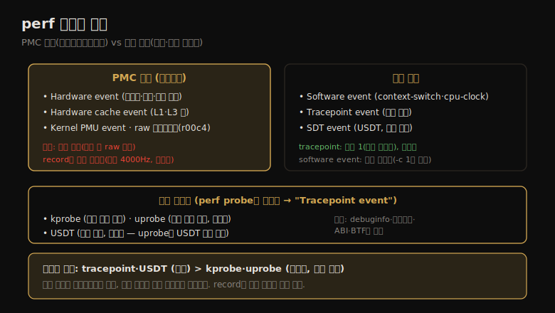

# perf (2) — 이벤트 소스
---
> 이 노트는 13.3~13.7 이벤트 소스를 다룹니다. perf가 계측하는 다섯 종류 — 하드웨어 이벤트(PMC)·소프트웨어 이벤트(커널 카운터)·tracepoint(커널 정적)·probe(kprobe·uprobe·USDT 동적·정적) — 와, 그 차이(특히 빈도 샘플링)를 봅니다.

perf가 계측하는 이벤트는 `perf list` 로 나열합니다 — 하드웨어(PMC)·소프트웨어(커널 카운터)·하드웨어 캐시·Kernel PMU·tracepoint(커널 정적)·SDT(유저 정적, USDT)·raw 하드웨어 등입니다. 핵심 구분 하나는 *빈도 샘플링* 입니다 — 하드웨어·소프트웨어 이벤트는 너무 자주 일어나 record 시 일부만 잡지만(기본 4000Hz), tracepoint는 모든 이벤트를 잡습니다.

> 이벤트 개요 → 하드웨어 이벤트(PMC·빈도 샘플링) → 소프트웨어 이벤트 → tracepoint → probe(kprobe·uprobe·USDT) 순으로 갑니다. 이벤트 소스가 04-02의 관측 소스(tracepoint·kprobe 등) 위에 서며, 13-03 명령이 이를 계측합니다.


## 1. 이벤트 개요 — perf list의 일곱 종류

> perf list는 일곱 종류 이벤트를 나열합니다 — 하드웨어(PMC)·소프트웨어(커널 카운터)·하드웨어 캐시·Kernel PMU·raw 하드웨어·tracepoint(커널 정적)·SDT(유저 정적). 동적 프로브를 만들면 "Tracepoint event"로 함께 나열됩니다.

perf 이벤트 소스를 PMC 기반과 추적 기반으로 나눠 한 장으로 정리하면 다음과 같습니다.



`perf list` 가 나열하는 이벤트 유형:

| 유형 | 의미 |
|------|------|
| Hardware event | 주로 프로세서 이벤트(PMC 구현) |
| Software event | 커널 카운터 이벤트 |
| Hardware cache event | 프로세서 캐시 이벤트(PMC) |
| Kernel PMU event | PMU(성능 모니터링 유닛) 이벤트(PMC) |
| cache·floating point... | 벤더 이벤트(PMC) + 간단한 설명 |
| Raw hardware event descriptor | raw 코드로 지정한 PMC |
| Tracepoint event | 커널 정적 계측 이벤트 |
| SDT event | 유저 레벨 정적 계측(USDT) |

`perf list` 는 검색 부분문자열을 받습니다 — `perf list mem_load_l3` 처럼 하면 그 문자열을 포함한 이벤트(여기선 하드웨어 PMC)와 간단한 설명·`(Precise event)`(PEBS 가능) 여부를 보입니다. tracepoint·SDT는 주로 정적 계측점이지만, 동적 프로브(kprobe 등)를 만들었으면 `probe:do_nanosleep` 같은 게 "Tracepoint event"로 함께 나열됩니다.

> 핵심은 *PMC 기반 이벤트(하드웨어·캐시·PMU·raw)와 추적 기반 이벤트(tracepoint·SDT)가 한 목록에 섞여 있다* 는 점입니다. PMC 이벤트는 마이크로아키텍처 수준(사이클·캐시)을, 추적 이벤트는 커널·유저 정적 계측점을 봅니다. 동적 프로브는 만든 뒤에야 목록에 "Tracepoint event"로 나타나(13-02 §5), perf의 동적/정적 통합 모델을 보입니다.


## 2. 하드웨어 이벤트 — PMC와 빈도 샘플링

> 하드웨어 이벤트는 보통 PMC로 구현되며, 프로세서별 raw 코드로 설정합니다(perf가 사람이 읽는 이름으로 매핑). record 시 기본 빈도 샘플링(4000Hz)이 적용돼 모든 이벤트를 잡지 않는데, 이게 안 보이는 함정입니다.

하드웨어 이벤트는 보통 PMC로 구현되며, 프로세서별 코드로 설정합니다 — 예를 들어 Intel의 branch instructions는 raw 디스크립터 `r00c4`(umask 0x0 + event select 0xc4)로 계측합니다. 이 코드는 프로세서 매뉴얼(Intel은 JSON으로도)에 있습니다. 외울 필요는 없고, perf가 사람이 읽는 매핑(예: `branch-instructions`)을 제공합니다. 단 매핑이 *틀릴 수* 있어(사람 이름이 엉뚱한 PMC로), 의심스러운 결과면 raw 디스크립터로 교차 확인합니다. 새 프로세서는 매핑이 아직 없을 수도 있어, 깊은 PMC는 raw 디스크립터로 전환해야 할 때가 있습니다.

**빈도 샘플링** 이 핵심 함정입니다. record로 PMC를 잴 때 기본 빈도가 쓰여 *모든 이벤트를 기록하지 않습니다*.

```
# perf record -vve cycles -a sleep 1
  { sample_period, sample_freq }   4000
  freq                             1
```

freq 1·sample_freq 4000은 CPU당 초당 약 4,000 이벤트를 잡도록 커널이 샘플링 속도를 조정한다는 뜻입니다 — cycles 같은 PMC는 초당 수십억 번 일어나 전부 기록하면 오버헤드가 막대하기 때문입니다. 문제는 *기본 출력(-vv 없이)이 빈도 샘플링 사용을 안 알려 줘*, 모든 이벤트를 기록한다고 오해할 수 있다는 점입니다. (이 빈도는 record에만 영향, stat은 전부 카운트.) `-F` 로 빈도를, `-c` 로 주기(period당 1개, overflow 샘플링)를 바꿉니다.

> 하드웨어 이벤트의 두 함정은 *매핑 오류* 와 *빈도 샘플링* 입니다 — 사람이 읽는 이름이 엉뚱한 PMC를 가리킬 수 있으니 의심 시 raw로 확인하고, record는 모든 이벤트가 아니라 4000Hz 샘플만 잡음을 기억합니다. 샘플 속도엔 상한(`kernel.perf_event_max_sample_rate`)과 CPU 사용률 상한(`kernel.perf_cpu_time_max_percent` 25%)이 있어, 커널이 스스로를 보호합니다(lost event 확인 필요).


## 3. 소프트웨어 이벤트 — 하드웨어에 매핑되나 소프트웨어로 계측

> 소프트웨어 이벤트는 보통 하드웨어 이벤트에 매핑되나 소프트웨어로 계측됩니다. 하드웨어처럼 기본 빈도 샘플링(4000Hz)이라 일부만 잡는데, 같은 대상의 tracepoint는 모든 이벤트를 잡는 차이가 있습니다.

소프트웨어 이벤트는 보통 하드웨어 이벤트에 매핑되나 *소프트웨어로 계측* 됩니다 — context-switches·cpu-clock 등입니다. 하드웨어처럼 기본 빈도 샘플링(4000Hz)이라 record 시 일부만 잡습니다.

같은 대상의 *소프트웨어 이벤트 vs tracepoint* 차이가 중요합니다.

```
# perf record -vve context-switches -a -- sleep 1
  { sample_period, sample_freq }   4000      # 빈도 샘플링(일부만)
  freq                             1

# perf record -vve sched:sched_switch -a sleep 1
  { sample_period, sample_freq }   1          # 주기 1(모든 이벤트)
```

context-switches(소프트웨어 이벤트)는 4000Hz 빈도 샘플링으로 *일부만* 잡지만, 같은 대상의 sched:sched_switch(tracepoint)는 주기 1로 *모든 이벤트* 를 잡습니다. 소프트웨어 이벤트도 `-c 1` 로 모든 이벤트를 잡게 할 수 있습니다.

> 핵심은 *기본 동작이 다르다* 는 점입니다 — 소프트웨어 이벤트는 빈도 샘플링(일부), tracepoint는 주기 1(전부)이 기본입니다. 모든 이벤트를 잡으려면 소프트웨어 이벤트에 `-c 1` 을 줍니다. 단 모든 이벤트 기록(특히 잦은 context switch)은 오버헤드가 크니, `perf stat` 으로 빈도를 먼저 확인합니다(13-03).


## 4. tracepoint — 커널 정적 계측

> tracepoint는 커널 정적 계측점으로, perf record로 잡아 perf script로 출력합니다. format 파일로 인자·포맷 문자열을 보고, --filter로 Boolean 식(예: bytes > 65536)으로 거를 수 있습니다.

tracepoint는 커널 정적 계측 이벤트입니다(04-02). 대표 사용:

```
# 시스템 전역 10초 추적 후 출력
perf record -e block:block_rq_issue -a sleep 10; perf script

# 인자·포맷 문자열(메타데이터) 보기
cat /sys/kernel/debug/tracing/events/block/block_rq_issue/format

# 65536바이트 초과 블록 I/O만 필터
perf record -e block:block_rq_issue --filter 'bytes > 65536' -a sleep 10
```

tracepoint는 안정적 인터페이스라 커널 버전 간 유지됩니다(04-02). `perf list` 는 초기화된 probe 이벤트(kprobe 등 동적)도 "Tracepoint event"로 보여 줘, tracepoint와 동적 프로브가 같은 추적 인터페이스를 공유함을 드러냅니다.

> tracepoint의 핵심은 *모든 이벤트를 잡고(주기 1) 인자를 필터링할 수 있다* 는 점입니다 — format 파일로 인자를 확인하고 `--filter` 로 거릅니다. 안정적 인터페이스라 우선 쓰며, tracepoint가 없는 영역만 다음 절의 동적 프로브로 내려갑니다.


## 5. probe — kprobe·uprobe·USDT

> probe 이벤트(kprobe·uprobe·USDT)는 동적이라 추적 전 perf probe로 초기화해야 합니다. kprobe는 커널 함수를, uprobe는 유저 함수를 동적 계측하고, USDT는 유저 정적 계측점입니다. 인자는 debuginfo·레지스터·BTF로 읽습니다.

perf는 kprobe·uprobe·USDT를 *probe event* 라 부릅니다 — *동적* 이라 추적 전 `perf probe` 로 초기화해야 하며, 초기화 후 "Tracepoint event"로 나열됩니다.

**kprobe**(커널 동적 계측, 04-02):

```
perf probe --add do_nanosleep       # 생성
perf record -e probe:do_nanosleep -a sleep 5
perf script
perf probe --del do_nanosleep       # 삭제
perf probe --add do_nanosleep%return   # 반환(kretprobe)
```

인자는 네 방법으로 읽습니다 — ① 커널 debuginfo(`--vars` 로 변수 나열) ② 동일 시스템에서 레지스터 위치 찾아 debuginfo 없는 시스템에 적용(`-nv` dry run) ③ 프로세서 ABI로 직접 ④ BTF(BPF type format, 더 흔히 가용). 반환값은 `$retval` 로 읽습니다.

**uprobe**(유저 동적 계측):

```
perf probe -x /lib/.../libc.so.6 --add fopen   # -x로 바이너리 지정
perf probe -x /lib/.../libc.so.6 --add 'fopen filename mode'   # 인자(debuginfo)
perf probe -x /lib/.../libc.so.6 --add 'fopen filename=+0(%di):string mode=%si:u8'
```

마지막 예의 문법 — `filename=`(별칭)·`%di`·`%si`(x86_64 첫 두 인자 레지스터)·`+0(...)`(오프셋 0 역참조)·`:string`·`:u8`(타입)입니다. uprobe는 바이너리를 직접 계측해 *소프트웨어 버전 간 불안정* 하니, 가능하면 USDT가 낫습니다.

**USDT**(유저 정적 계측, 안정적):

```
perf buildid-cache --add $(which node)   # 바이너리 인지
perf list | grep sdt_node                # SDT 이벤트 확인
perf probe sdt_node:http__server__request   # tracepoint로 초기화(uprobe 사용)
perf record -e sdt_node:http__server__request -a
```

> probe의 핵심은 *초기화 후 추적* 이고, 안정성 위계는 *USDT > kprobe/uprobe* 입니다 — USDT는 안정적 인터페이스, uprobe는 바이너리 직접 계측이라 불안정합니다. 인자 읽기는 debuginfo가 있으면 변수명으로, 없으면 레지스터·ABI·BTF로 합니다. 일부 USDT는 세마포어 증가가 필요한데(Linux 4.20+ 해결), 없으면 이벤트가 안 잡힙니다.


## 학습 점검

> 이 노트의 핵심을 스스로 떠올려 봅니다. 답이 막히면 해당 섹션으로 돌아가 확인합니다.

- perf list의 이벤트 유형 중 PMC 기반(하드웨어·캐시·PMU·raw)과 추적 기반(tracepoint·SDT)이 어떻게 다른지 설명해 봅니다. (→ §1)
- 하드웨어 이벤트의 두 함정(매핑 오류·빈도 샘플링)이 무엇이며, record가 모든 이벤트를 잡지 않는 까닭을 떠올려 봅니다. (→ §2)
- 소프트웨어 이벤트와 같은 대상 tracepoint의 기본 동작 차이(빈도 샘플링 vs 주기 1)를 말해 봅니다. (→ §3)
- tracepoint를 우선 쓰고 동적 프로브를 나중에 쓰는 까닭(안정성)과, --filter로 무엇을 하는지 설명해 봅니다. (→ §4)
- probe 이벤트가 추적 전 초기화가 필요한 까닭과, USDT가 uprobe보다 선호되는 까닭을 떠올려 봅니다. (→ §5)