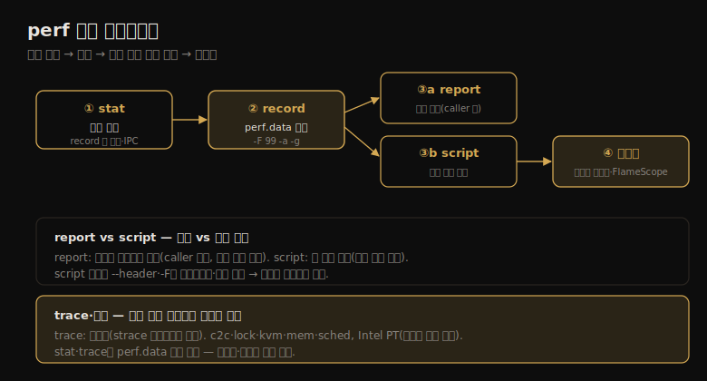

# perf (3) — 명령
---
> 이 노트는 13.8~13.14 명령을 다룹니다. 13-02의 이벤트 소스를 실제로 계측하는 명령들 — stat(카운트)·record(기록)·report(요약)·script(샘플 나열·플레임 그래프)·trace(라이브) — 와 기타 능력(c2c·kvm·Intel PT)을 봅니다.

13-02의 이벤트 소스(PMC·tracepoint·probe)를 실제로 계측하는 게 명령들입니다. stat은 이벤트를 카운트하고, record는 perf.data에 기록하며, report는 요약하고, script는 샘플을 나열(플레임 그래프 입력)하며, trace는 파일 없이 라이브 출력합니다.

> stat(카운트) → record(기록·CPU 프로파일링·스택 워킹) → report(TUI·STDIO 요약) → script(샘플 나열·플레임 그래프·트레이스 스크립트) → trace(라이브) → 기타·문서 순으로 갑니다.


## 1. perf stat — 이벤트 카운트

> perf stat은 이벤트를 카운트합니다 — 소프트웨어 이벤트는 커널에서, 하드웨어 이벤트는 PMC 레지스터로 효율적으로 셉니다. record 전 이벤트 빈도를 확인하기에 적합하고, -I로 인터벌·-A로 CPU별·--filter로 필터·shadow 통계(IPC 등)를 제공합니다.

명령들이 카운트에서 시각화까지 어떻게 파이프라인을 이루는지를 한 장으로 정리하면 다음과 같습니다.



`perf stat` 은 이벤트를 카운트합니다 — 소프트웨어 이벤트는 커널 컨텍스트에서, 하드웨어 이벤트는 PMC 레지스터로 *효율적* 으로 셉니다. 그래서 비싼 record 전에 이벤트 빈도를 확인하기에 적합합니다.

```
# perf stat -e sched:sched_switch -a -- sleep 1
             5,705      sched:sched_switch
       1.001892925 seconds time elapsed
```

주요 옵션 — `-a`(전체 CPU, 4.11+ 기본)·`-e event`·`--filter`·`-p PID`·`-t TID`·`-G cgroup`(컨테이너)·`-A`(CPU별)·`-I ms`(인터벌). 이벤트는 와일드카드(`sched:*`)와 다중 `-e` 를 받습니다. 이벤트 미지정 시 아키텍처 PMC가 기본입니다.

| 기능 | 예 |
|------|-----|
| 인터벌 통계 | `perf stat -e sched:sched_switch -a -I 1000` — 1초마다 카운트 |
| CPU별 균형 | `-A` — 논리 CPU별 델타(`--per-socket`·`--per-core`도) |
| 이벤트 필터 | `--filter 'prev_pid == 25467'` — Boolean 식이 참일 때만 카운트 |
| shadow 통계 | cycles+instructions → IPC 자동 출력(`2.23 insn per cycle`) |

> perf stat의 핵심은 *효율적 카운팅* 입니다 — PMC 레지스터·커널 카운터로 세서 record보다 가볍습니다. 그래서 "이 이벤트가 일어나긴 하나? 얼마나 자주?"를 record 전에 확인하는 데 씁니다. shadow 통계(특정 이벤트 조합 시 IPC 같은 파생 지표 자동 출력)가 마이크로아키텍처 분석을 돕습니다.


## 2. perf record — 이벤트 기록·CPU 프로파일링

> perf record는 이벤트를 perf.data에 기록합니다. 자주 쓰는 용도는 CPU 프로파일러 — 99Hz로 스택을 샘플링합니다. 이벤트 미지정 시 가장 정확한 CPU 프로파일링 메커니즘(precise event)을 자동 선택하고, --call-graph로 스택 워킹 방법을 고릅니다.

`perf record` 는 이벤트를 perf.data에 기록합니다 — per-CPU 링 버퍼로 커널에서 받아, 컨텍스트 전환 오버헤드를 줄이려 드물게 깨어나 읽습니다.

```
# perf record -e sched:sched_switch -a
[ perf record: Woken up 9 times to write data ]
[ perf record: Captured and wrote 6.060 MB perf.data (23526 samples) ]
```

**CPU 프로파일링** 이 잦은 용도입니다 — `perf record -F 99 -a -g -- sleep 30` 은 전체 CPU에서 99Hz로 30초 스택을 샘플링합니다. 이벤트 미지정 시 perf가 *가장 정확한 메커니즘* 을 자동 선택합니다.

| 메커니즘 | 의미 |
|----------|------|
| cycles:ppp | 사이클 빈도 샘플링, precise zero skid |
| cycles:pp | precise 요청 zero skid |
| cycles:p | precise 요청 constant skid |
| cycles | precise 없음 |
| cpu-clock | 소프트웨어 기반 CPU 빈도 샘플링 |

`:ppp`·`:pp`·`:p` 는 precise 이벤트 샘플링(Intel PEBS·AMD IBS)을 켭니다.

**스택 워킹** 은 `-g`(기본 frame pointer) 또는 `--call-graph` 로 고릅니다 — `dwarf`(debuginfo 기반)·`lbr`(Intel LBR, 보통 16프레임 한계)·`fp`(frame pointer). 스택이 깨지면(소프트웨어가 frame pointer를 안 지킴) 다른 방법이 통할 수 있습니다(05-03). `max-stack=N` 으로 이벤트별 깊이를 따로 줄 수 있습니다.

> perf record의 핵심은 *CPU 프로파일러* 로서의 용도와 *precise event 자동 선택* 입니다 — 이벤트를 안 주면 가장 정확한 사이클 샘플링(:ppp → cpu-clock 순)을 고릅니다. 스택이 깨지면 frame pointer 재컴파일(`-fno-omit-frame-pointer`)이나 dwarf/lbr 스택 워킹으로 우회합니다. 기록 후 report·script로 봅니다.


## 3. perf report — 프로파일 요약

> perf report는 perf.data를 요약합니다 — 대화형 TUI(기본) 또는 텍스트(--stdio)입니다. 스택 트레이스는 계층으로 병합돼, caller 순서(루트→이벤트 함수)로 보입니다. -n으로 샘플 카운트, -g로 콜그래프 표시를 조정합니다.

`perf report` 는 perf.data를 요약합니다 — `--tui`(대화형, 기본) 또는 `--stdio`(텍스트)입니다.

**TUI** 는 대화형으로 데이터를 탐색하며 함수·스레드를 선택해 상세를 봅니다.

```
# perf report
Overhead  Command   Shared Object      Symbol
  21.10%  swapper   [kernel.vmlinux]   [k] native_safe_halt
   6.39%  mysqld    [kernel.vmlinux]   [k] _raw_spin_unlock_irqrestor
```

**STDIO** 는 비대화형이라 파일 저장·공유(채팅·이메일·티켓)에 적합합니다. `-n` 으로 샘플 카운트 열을 더합니다. 스택 트레이스(`-g`)는 *계층으로 병합* 됩니다.

```
# perf report --stdio
    50.45%  mysqld  libpthread-2.27.so  [.] start_thread
            ---start_thread
               |--44.75%--pfs_spawn_thread
               |           --44.70%--handle_connection
```

이 표시는 루트 함수(왼쪽)에서 자식 함수(아래·오른쪽)로 가는 *caller* 순서입니다 — mysqld가 start_thread → pfs_spawn_thread → handle_connection을 호출했습니다. `-g callee` 로 뒤집으면 이벤트 함수가 왼쪽, 조상이 오른쪽입니다(Linux 4.4에서 caller가 기본이 됨).

> perf report의 핵심은 *스택 트레이스를 계층으로 병합해 보여 준다* 는 점입니다 — caller 순서(루트→이벤트)가 기본이고 callee로 뒤집을 수 있습니다. TUI는 탐색용, STDIO는 공유·저장용입니다. 요약으로 충분치 않으면(시간에 따른 패턴 등) script로 개별 샘플을 봅니다.


## 4. perf script — 샘플 나열·플레임 그래프

> perf script는 perf.data의 각 샘플을 출력해, 요약에서 사라질 시간 패턴을 봅니다. -F로 필드를, --header로 메타데이터를 지정합니다. 출력은 플레임 그래프·FlameScope 시각화의 입력이 되고, 트레이스 스크립트로 커스텀 자동화도 합니다.

`perf script` 는 기본으로 perf.data의 *각 샘플* 을 출력해, 요약에서 사라질 시간 패턴을 봅니다.

```
# perf script
   mysqld 8631 [000] 4142044.582702: 10101010 cpu-clock:pppH:
   c08fd9 _Z19close_thread_tablesP3THD+0x49 (/usr/sbin/mysqld)
```

기본 필드 — 프로세스명·스레드 ID·CPU ID·타임스탬프·period·이벤트명·이벤트 인자입니다. 일관된 출력(후처리용)을 위해 `-F` 로 필드를 지정하고(PID는 기본에 빠져 자주 추가), `--header` 로 메타데이터(시스템·perf 명령)를 포함합니다 — 나중에 필요할 정보가 많아 저장 시 꼭 넣습니다.

**플레임 그래프** — script 출력은 플레임 그래프 시각화의 입력입니다. 스택 트레이스를 시각화하며, CPU 프로파일뿐 아니라 컨텍스트 전환(스레드가 왜 CPU를 떠나나)·블록 I/O 생성(어느 코드가 디스크 I/O를 만드나) 같은 어떤 스택 모음도 시각화합니다. perf 내장 지원은 Linux 5.8+(`perf script report flamegraph`). **FlameScope** 는 서브초 오프셋 히트맵 + 플레임 그래프로 시간 변동을 봅니다(06-04·06-07).

**트레이스 스크립트** — `perf script -l` 로 가용 스크립트를 나열하고(syscall-counts-by-pid·failed-syscalls-by-pid 등), Perl·Python으로 추가 개발합니다. `stackcollapse` 는 콜그래프를 플레임 그래프용 짧은 형식으로 만듭니다.

> perf script의 핵심은 *개별 샘플 나열* 과 *시각화 입력* 입니다 — 요약(report)이 가리는 시간 패턴을 보고, 그 출력이 플레임 그래프·FlameScope의 입력이 됩니다. `--header` 와 `-F` 로 일관된 출력을 만들어 후처리·공유에 대비합니다 — 헤더가 나중에 필요할 시스템·명령 정보를 담습니다.


## 5. perf trace·기타 — 라이브 추적과 고급 능력

> perf trace는 파일 없이 라이브로 추적합니다(기본 시스템 콜, strace의 저오버헤드·시스템 전역 버전). 기타 능력으로 c2c(캐시 라인)·kvm·mem·sched와, Intel PT 같은 하드웨어 추적(per-instruction 분석)이 있습니다.

`perf trace` 는 파일 없이 *라이브* 추적합니다 — 기본은 시스템 콜로, strace(1)의 저오버헤드·시스템 전역 버전입니다(05-05). record와 비슷한 문법으로 어떤 이벤트든 봅니다.

```
# perf trace -e block:block_rq_issue,block:block_rq_complete
   0.000 auditd/391 block:block_rq_issue:259,0 WS 8192 () 16046032 + 16 [auditd]
   0.566 systemd-journa/28651 block:block_rq_complete:259,0 WS () 16046032 + 16 [0]
```

필터에 문자열 상수(커널 헤더에서 생성)를 쓸 수 있고(`--filter='flags==SHARED'`), perf가 가독성을 위해 포맷 문자열을 *beautify* 합니다(`prot: 1` → `prot: READ`). Linux 4.19부터 다른 syscall을 기본 추적 안 함(`--no-syscalls` 기본), 4.11부터 전체 CPU 기본, 5.5부터 필터 지원입니다.

**기타 서브커맨드** — c2c(캐시-투-캐시·false sharing)·kmem(커널 메모리 할당)·kvm(KVM 게스트)·lock(락)·mem(메모리 접근)·sched(스케줄러 통계)·script(커스텀 도구)입니다. **고급 능력** 으로 이벤트에서 BPF 프로그램 실행과, Intel PT·ARM CoreSight 같은 *하드웨어 추적*(per-instruction 분석)이 있습니다 — `perf record -e intel_pt/cyc/u date` 로 사용자 모드 사이클을 기록하고 `perf script --insn-trace --xed` 로 명령어를 어셈블리로 출력합니다(상세하고 verbose해서, date 하나에 266,105줄).

> perf trace의 핵심은 *라이브·저오버헤드* 입니다 — strace의 시스템 전역 대체로, 파일 없이 이벤트를 실시간 봅니다. 기타 능력은 perf가 단순 프로파일러를 넘어 *멀티툴* 임을 보입니다 — 캐시 false sharing(c2c), 락, KVM, 그리고 Intel PT로 명령어 단위 추적까지. 각 서브커맨드는 `perf-record(1)` 같은 man page와 KernelNewbies 체인지로그로 새 기능을 확인합니다.


## 학습 점검

> 이 노트의 핵심을 스스로 떠올려 봅니다. 답이 막히면 해당 섹션으로 돌아가 확인합니다.

- perf stat이 record보다 효율적인 까닭(PMC 레지스터·커널 카운터)과, record 전 stat으로 빈도를 보는 이유를 설명해 봅니다. (→ §1)
- perf record가 이벤트 미지정 시 어떤 메커니즘을 자동 선택하며, 스택이 깨질 때의 우회법(frame pointer 재컴파일·dwarf/lbr)을 떠올려 봅니다. (→ §2)
- perf report의 스택 트레이스 caller vs callee 순서 차이를 말해 봅니다. (→ §3)
- perf script가 report와 달리 무엇을 보여 주며(개별 샘플), 그 출력이 어떤 시각화의 입력이 되는지 설명해 봅니다. (→ §4)
- perf trace가 strace와 어떻게 다르며(라이브·저오버헤드·시스템 전역), Intel PT가 무엇을 가능하게 하는지 떠올려 봅니다. (→ §5)