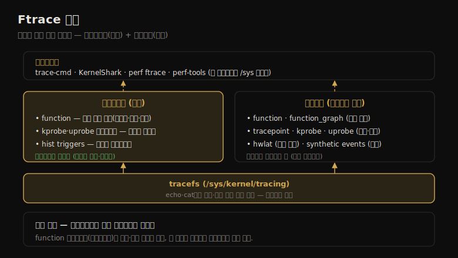

# Ftrace (1) — 개요·tracefs·프로파일러
---
> 이 노트는 14장의 출발점으로, Ftrace가 *리눅스 공식 트레이서이자 의존성 거의 없는 멀티툴* 임을 잡습니다. 추가 유저 프론트엔드 없이 셸만으로 쓸 수 있어, 저장 공간이 귀한 임베디드 리눅스에 특히 적합하고 서버에도 유용합니다.

Ftrace는 리눅스 공식 트레이서로, 여러 추적 유틸리티를 묶은 멀티툴입니다(Steven Rostedt 작, 2.6.27/2008 추가). *추가 유저 레벨 프론트엔드 없이* 쓸 수 있어 — 셸만 있으면 됩니다 — 저장 공간이 귀한 임베디드 리눅스에 특히 적합하고 서버에도 유용합니다. "어떤 커널 함수가 얼마나 자주 호출되나?", "어떤 코드 경로가 이 함수를 불렀나?", "이 커널 함수가 어떤 자식 함수를 부르나?", "선점 비활성 코드 경로가 일으킨 최대 지연은?" 같은 질문에 답합니다.

> 이 노트는 14.1 능력 개요·14.2 tracefs·14.3 function 프로파일러를 다룹니다. perf가 서브커맨드를 쓰는 것과 달리 Ftrace는 *프로파일러*(통계 요약)와 *트레이서*(이벤트별 상세)로 나뉩니다. 트레이서는 14-02, 프론트엔드는 14-03에서 다룹니다.


## 1. 능력 개요 — 프로파일러와 트레이서

> perf가 서브커맨드를 쓰는 것과 달리, Ftrace는 프로파일러(통계 요약: 카운트·히스토그램)와 트레이서(이벤트별 상세)로 나뉩니다. function 프로파일러로 커널 함수 통계를 빠르게 훑고, function_graph 트레이서로 자식 호출의 코드 흐름과 지연을 봅니다.

perf는 서브커맨드로 다른 기능을 호출하지만, Ftrace는 **프로파일러** 와 **트레이서** 로 나뉩니다 — 프로파일러는 통계 요약(카운트·히스토그램)을, 트레이서는 이벤트별 상세를 줍니다. Ftrace의 전체 구조를 한 장으로 정리하면 다음과 같습니다.



예로 funcgraph(8)은 function_graph 트레이서로 vfs_read()의 자식 호출을 보입니다.

```
# funcgraph vfs_read
 1)               |  vfs_read() {
 1)               |    rw_verify_area() {
 1)               |      security_file_permission() {
 1)   0.763 us    |            aa_file_perm();
 1)   8.416 us    |    }
```

둘째 열의 지속시간(us)으로 어느 자식 함수가 부모를 느리게 했는지 성능 분석을 합니다.

| 프로파일러 | 설명 |
|-----------|------|
| function | 커널 함수 통계(14-01 §3) |
| kprobe 프로파일러 | 활성 kprobe 카운트(14-02) |
| uprobe 프로파일러 | 활성 uprobe 카운트(14-02) |
| hist triggers | 이벤트의 커스텀 히스토그램(14-02) |

| 트레이서 | 설명 |
|----------|------|
| function | 커널 함수 호출 트레이서 |
| tracepoint·kprobe·uprobe | 정적·동적 계측(이벤트 트레이서) |
| function_graph | 자식 호출 계층 그래프 |
| wakeup·irqsoff·preemptoff | 스케줄러 지연·인터럽트/선점 비활성 지연 |
| hwlat | 하드웨어 지연 탐지(외부 교란) |
| nop | 다른 트레이서 비활성 |

> 핵심은 *프로파일러(요약)와 트레이서(상세)의 구분* 입니다 — function 프로파일러로 어떤 함수가 자주·느린지 빠르게 훑고(저오버헤드), 그다음 비싼 이벤트별 추적(트레이서)으로 좁혀 들어갑니다. `cat /sys/kernel/debug/tracing/available_tracers` 로 가용 트레이서를 나열합니다 — 이 tracefs 인터페이스가 Ftrace의 토대입니다(다음 절).


## 2. tracefs — Ftrace의 /sys 인터페이스

> Ftrace 능력의 인터페이스는 tracefs 파일 시스템(/sys/kernel/tracing 또는 /sys/kernel/debug/tracing)입니다. 제어·출력 파일을 echo·cat으로 직접 다뤄, 셸만으로 의존성 거의 없이 추적합니다. instance 디렉터리로 동시 사용자를 지원합니다.

Ftrace의 인터페이스는 *tracefs 파일 시스템* 입니다 — `/sys/kernel/tracing` 에 마운트되며(debugfs 마운트 시 `/sys/kernel/debug/tracing` 하위에도), `mount -t tracefs tracefs /sys/kernel/tracing` 으로 마운트합니다. 마운트 실패는 보통 커널이 Ftrace 설정(CONFIG_FTRACE 등) 없이 빌드된 탓입니다.

tracing 디렉터리의 주요 파일:

| 파일 | 설명 |
|------|------|
| available_tracers | 가용 트레이서 나열 |
| current_tracer | 현재 활성 트레이서 |
| function_profile_enabled | function 프로파일러 활성화 |
| available_filter_functions·set_ftrace_filter | 추적할 함수 나열·선택 |
| tracing_on | 출력 링 버퍼 on/off 스위치 |
| trace·trace_pipe | 트레이서 출력(링 버퍼) |
| trace_stat (dir) | function 프로파일러 출력 |
| kprobe_events·uprobe_events | kprobe·uprobe 설정 |
| events (dir) | 이벤트 트레이서 제어(tracepoint·kprobe·uprobe) |
| instances (dir) | 동시 사용자용 Ftrace 인스턴스 |

이 파일들을 echo·cat으로 직접 다룹니다 — 예를 들어 `cat current_tracer` 가 `nop`(미사용)을 보이고, `echo blk > current_tracer` 로 트레이서를 켭니다. 그래서 Ftrace는 *의존성이 거의 없습니다*(셸만 필요). 원래 동시 사용자를 지원 안 했지만, 나중에 *instances* 디렉터리로 각자 독립 추적하게 됐습니다.

> tracefs의 핵심은 *셸만으로 추적할 수 있다* 는 점입니다 — echo·cat으로 제어·출력 파일을 다뤄, 별도 도구 없이 임베디드 환경에서도 씁니다. 이 직접성이 Ftrace의 강점이자, 14-03 프론트엔드(trace-cmd·perf-tools)가 자동화하는 대상입니다 — 프론트엔드는 이 /sys 조작을 감싸 더 안전·간결하게 만듭니다.


## 3. function 프로파일러 — 커널 함수 통계

> function 프로파일러는 커널 함수 호출 통계(카운트·시간·평균)를 줘, 어떤 함수가 쓰이고 어느 게 느린지 탐색하기에 적합합니다. 오버헤드가 낮아 커널 코드 실행 이해의 출발점으로 쓰며, 필터로 추적 범위를 좁혀 오버헤드를 줄입니다.

function 프로파일러는 커널 함수 호출 통계를 줍니다 — 어떤 함수가 쓰이고 어느 게 느린지 탐색하기 좋습니다. 저오버헤드라 *커널 코드 실행 이해의 출발점* 으로 쓰며, CONFIG_FUNCTION_PROFILER=y가 필요합니다.

동작 원리는 *컴파일된 프로파일링 호출* 입니다 — 모든 커널 함수 시작에 `__fentry__()`(옛 mcount)가 있는데, 안 쓸 땐 빠른 nop 명령으로 대체되고 필요할 때만 호출로 전환돼 오버헤드 문제를 풉니다.

```
# cd /sys/kernel/debug/tracing
# echo 'tcp*' > set_ftrace_filter       # tcp로 시작하는 함수만
# echo 1 > function_profile_enabled
# sleep 10
# echo 0 > function_profile_enabled
# echo > set_ftrace_filter
# head trace_stat/function*
  Function          Hit       Time         Avg        s^2
  tcp_sendmsg       955912    2788479 us   2.917 us   3734541 us
  tcp_sendmsg_locked 955912   2248025 us   2.351 us   2600545 us
```

열은 함수명(Function)·호출 수(Hit)·총 시간(Time)·평균(Avg)·표준편차(s^2)입니다. 통계는 CPU별 `trace_stat/function*` 파일에 있습니다(프론트엔드가 시스템 전역으로 합침). 주의 — `0 >` 와 `0>` 는 다릅니다(후자는 fd 0 리다이렉트).

> function 프로파일러의 핵심은 *저오버헤드 출발점* 입니다 — 어떤 함수가 자주·느린지 빠르게 훑어, 비싼 이벤트별 추적(14-02 트레이서)으로 좁힐 대상을 찾습니다. 단 `set_ftrace_filter` 를 비우면 *모든 함수* 가 프로파일돼 오버헤드가 커지니, 필터로 범위를 좁히는 게 중요합니다. kprobe·uprobe 프로파일러도 같은 역할을 동적 프로브에 합니다(14-02).


## 학습 점검

> 이 노트의 핵심을 스스로 떠올려 봅니다. 답이 막히면 해당 섹션으로 돌아가 확인합니다.

- Ftrace가 perf와 달리 프로파일러와 트레이서로 나뉜다는 게 무슨 뜻이며, 각각 무엇(요약·상세)을 주는지 설명해 봅니다. (→ §1)
- tracefs가 무엇이며, echo·cat으로 추적할 수 있다는 게 왜 Ftrace를 임베디드에 적합하게 하는지 떠올려 봅니다. (→ §2)
- function 프로파일러가 어떻게 모든 함수에 호출을 넣고도 오버헤드 문제를 푸는지(nop 대체) 말해 봅니다. (→ §3)
- function 프로파일러를 출발점으로 쓰는 까닭과, set_ftrace_filter를 비우면 안 되는 이유를 설명해 봅니다. (→ §3)
- 프론트엔드가 tracefs의 무엇을 자동화하는지(/sys 조작)와, 동시 사용자를 어떻게 지원하는지(instances) 떠올려 봅니다. (→ §2)