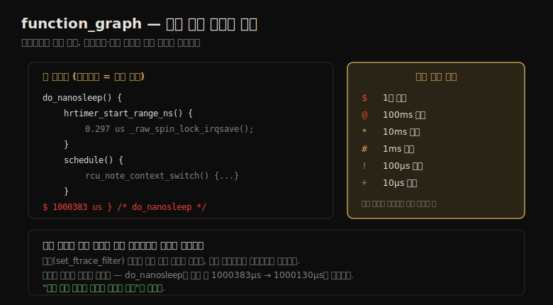

# Ftrace (2) — 트레이서
---
> 이 노트는 14.4~14.10 트레이서를 다룹니다. 이벤트별 상세를 주는 트레이서들 — function 트레이싱·tracepoint·kprobe·uprobe·function_graph·hwlat·hist triggers — 와, 그 정점인 synthetic events(커스텀 지연 히스토그램)를 봅니다.

14-01의 프로파일러가 *요약* 이라면 트레이서는 *이벤트별 상세* 입니다. function 트레이서는 커널 함수 호출의 순서·타임스탬프·책임 프로세스를, function_graph는 자식 호출 흐름과 지연을, tracepoint·kprobe·uprobe는 정적·동적 계측 이벤트를 봅니다. hist triggers는 이벤트의 커스텀 히스토그램을, synthetic events는 이벤트 간 시간 차로 지연 히스토그램을 만듭니다.

> function 트레이싱(trace·trace_pipe·옵션) → tracepoint(필터·트리거) → kprobe(인자·반환값·프로파일링) → uprobe → function_graph → hwlat → hist triggers(synthetic events) 순으로 갑니다.


## 1. function 트레이싱 — trace와 trace_pipe

> function 트레이서는 커널 함수 호출의 이벤트별 상세를 출력합니다 — 함수 순서·타임스탬프·책임 프로세스·부모 함수입니다. trace 파일(버퍼 스냅숏)이나 trace_pipe(소비형 라이브 스트림)로 읽고, 옵션으로 스택 트레이스 등 출력을 조정합니다.

function 트레이서는 커널 함수 호출의 이벤트별 상세를 출력합니다(프로파일링과 같은 계측 사용). 함수 순서·타임스탬프 패턴·책임 프로세스를 보지만, 오버헤드가 프로파일링보다 커서 *상대적으로 드문 함수*(초당 1,000회 미만)에 적합합니다 — 프로파일러로 빈도를 먼저 확인합니다.

```
# echo '*sleep' > set_ftrace_filter        # sleep으로 끝나는 함수
# echo function > current_tracer
# cat trace > /tmp/out.trace01.txt
# echo nop > current_tracer; echo > set_ftrace_filter
      multipathd-348 [001] .... 332762.532877: __x64_sys_nanosleep <-do_syscall_64
```

출력 필드 — 프로세스명-PID·CPU·플래그·타임스탬프·현재 함수·부모 함수입니다(`__x64_sys_nanosleep` 를 `do_syscall_64` 가 호출). 두 출력 인터페이스:

| 인터페이스 | 동작 |
|-----------|------|
| trace | 버퍼 스냅숏(읽어도 남음). `> trace` 로 비움 |
| trace_pipe | 끝없는 라이브 스트림(읽으면 소비). 저빈도 이벤트 관찰용 |

저빈도는 trace_pipe로 라이브 관찰, 고빈도는 trace를 파일로 저장 후 분석합니다. **옵션** 은 `trace_options` 나 `options/` 디렉터리로 출력을 조정합니다 — `irq-info`(플래그 열)·`stacktrace`·`userstacktrace`(커널·유저 스택 추가, 왜 호출됐는지 이해) 등입니다.

> function 트레이싱의 핵심은 *이벤트별 상세* 와 *두 출력 인터페이스* 입니다 — trace는 스냅숏(고빈도 저장용), trace_pipe는 라이브 스트림(저빈도 관찰용)입니다. 오버헤드가 커서 드문 함수에 쓰며, 빈도는 프로파일러로 먼저 확인합니다. stacktrace 옵션이 "왜 이 함수가 호출됐나"를 답합니다.


## 2. tracepoint·kprobe·uprobe — 이벤트 트레이서

> tracepoint(커널 정적)·kprobe(커널 동적)·uprobe(유저 동적)는 events 디렉터리에서 enable로 켜고, filter로 Boolean 식으로 거르고, trigger로 이벤트 발생 시 추가 동작(traceoff·snapshot 등)을 합니다. kprobe·uprobe는 인자·반환값을 검사합니다.

**tracepoint**(커널 정적 계측)는 `events/` 하위 디렉터리 구조로 제어합니다 — `echo 1 > events/block/block_rq_issue/enable` 로 켜고 trace_pipe로 봅니다. 각 이벤트 디렉터리에 enable·filter·format·trigger·hist·id가 있습니다.

| 제어 | 동작 |
|------|------|
| filter | Boolean 식이 참일 때만 기록(`bytes > 65536`). 연산자 ==·!=·<·~(glob)·&&·\|\| |
| trigger | 이벤트 발생 시 추가 동작 — traceon·traceoff·snapshot·stacktrace·enable/disable_event·hist |

trigger의 한 용도는 *에러 직전 이벤트* 보기입니다 — 에러 조건에 traceoff(이후 멈춤)나 snapshot(보존)을 걸고, `if` 로 필터와 결합합니다(`echo 'traceoff if bytes > 65536' > .../trigger`).

**kprobe**(커널 동적 계측)는 `kprobe_events` 에 특수 문법을 append해 만듭니다 — `echo 'p:brendan do_nanosleep' >> kprobe_events` 로 생성, `-:brendan` 으로 삭제합니다. function 트레이서와 달리 *인자·반환값을 검사* 합니다 — `hrtimer_sleeper=$arg1`(Linux 4.20+ 인자 별칭, 이전엔 `%di` 레지스터)로 인자를, kretprobe(`r:`)의 `$retval` 로 반환값을 봅니다.

**uprobe**(유저 동적 계측)는 `uprobe_events` 로 제어하는데, 커널이 유저 심볼 정보가 없어 *경로+오프셋* 을 줘야 합니다(`readelf -s` 로 오프셋 찾음). ⚠️ 명령 중간 오프셋을 잘못 쓰면 *대상 프로세스를 손상*(공유 텍스트면 모든 프로세스!)시키니, 저자는 이 인터페이스 대신 심볼 매핑을 처리하는 상위 트레이서(BCC·bpftrace)를 권합니다.

> 세 이벤트 트레이서의 공통 제어는 *enable·filter·trigger* 입니다 — events 디렉터리에서 켜고, Boolean 식으로 거르고, 발생 시 추가 동작을 합니다. tracepoint(정적·안정)와 kprobe/uprobe(동적)의 차이는 13-02와 같습니다 — kprobe·uprobe는 인자·반환값을 보지만, uprobe는 오프셋 실수 시 손상 위험이 있어 상위 도구가 안전합니다. 활성 kprobe·uprobe는 `kprobe_profile`·`uprobe_profile` 로 카운트를 봅니다.


## 3. function_graph — 자식 호출 흐름과 지연

> function_graph 트레이서는 함수의 콜 그래프를 출력해 코드 흐름을 드러냅니다 — 자식 함수와 들여쓰기로 호출 계층을, 함수별 지속시간으로 지연을 봅니다. 높은 지연엔 문자 기호($·@·* 등)가 붙어 주의를 끕니다.

function_graph 트레이서는 함수의 콜 그래프를 출력해 코드 흐름을 드러냅니다. 자식 호출 계층과 지연 기호를 한 장으로 정리하면 다음과 같습니다.



```
# echo do_nanosleep > set_graph_function
# echo function_graph > current_tracer
# cat trace_pipe
 1)               |  do_nanosleep() {
 1)               |    hrtimer_start_range_ns() {
 1)   0.297 us    |        _raw_spin_lock_irqsave();
 5) $ 1000383 us  |  } /* do_nanosleep */
```

자식 호출이 들여쓰기로 계층을 이루고(do_nanosleep → hrtimer_start_range_ns → ...), 왼쪽 열이 CPU와 함수별 지속시간을 보입니다. 높은 지연엔 *문자 기호* 가 붙습니다.

| 기호 | 임계 |
|------|------|
| $ | 1초 초과 |
| @ | 100ms 초과 |
| * | 10ms 초과 |
| # | 1ms 초과 |
| ! | 100μs 초과 |
| + | 10μs 초과 |

필터(set_ftrace_filter) 없이는 모든 자식 호출을 보지만 오버헤드가 지속시간을 부풀립니다 — 정확한 시간을 원하면 필터로 함수를 좁힙니다(do_nanosleep만 추적 시 1000383μs → 1000130μs). 옵션(funcgraph-cpu·funcgraph-proc·funcgraph-duration 등)으로 출력을 조정합니다.

> function_graph의 핵심은 *코드 흐름과 지연을 한눈에* 보여 준다는 점입니다 — 들여쓰기로 호출 계층을, 지속시간과 문자 기호로 높은 지연을 드러냅니다. 필터 없이는 전체 흐름을 보되 오버헤드가 시간을 부풀리니, 정확한 측정엔 필터로 좁힙니다. 이 흐름 추적이 "어느 자식 함수가 부모를 느리게 했나"의 출발점입니다(14장 첫 funcgraph 예).


## 4. hwlat — 하드웨어 지연 탐지

> hwlat은 특수 목적 트레이서로, 외부 하드웨어 이벤트(SMI·하이퍼바이저 교란)가 CPU 성능을 방해하는 것을 탐지합니다. 인터럽트를 끈 루프의 반복 시간을 재, 임계(10μs)를 넘는 가장 느린 반복을 보고합니다.

hwlat(하드웨어 지연 탐지기)은 특수 목적 트레이서입니다 — 커널·다른 도구엔 안 보이는 *외부 하드웨어 이벤트* 가 CPU 성능을 방해하는 것을 탐지합니다(SMI 이벤트·하이퍼바이저 교란, noisy neighbor 포함).

동작은 *인터럽트를 끈 채 코드 루프를 실험* 으로 돌려 각 반복 시간을 재고, CPU를 돌아가며 임계(10μs, `tracing_thresh` 로 설정)를 넘는 가장 느린 반복을 보고합니다.

```
# echo hwlat > current_tracer
# cat trace_pipe
  <...>-5820 [001] d... 354016.973699: #1 inner/outer(us): 2152/1933 ts:...
  <...>-5820 [000] d... 354017.985568: #2 inner/outer(us):   19/26 ts:...
```

`inner/outer(us)` 는 루프 *안*(inner)과 다음 반복으로 *넘어가는*(outer) 시간입니다 — 첫 줄의 2152μs는 임계(10μs)를 크게 넘어 외부 교란을 뜻합니다. 파라미터는 `hwlat_detector/` 의 width(루프 실행 시간)·window(실험 주기)입니다.

> hwlat의 핵심은 *외부 교란 탐지* 입니다 — 커널이 모르는 SMI·하이퍼바이저 교란을, 인터럽트 끈 루프의 반복 지연으로 잡습니다. ⚠️ 저자는 hwlat을 *관측 도구가 아니라 마이크로벤치마크* 로 분류합니다 — 실험 자체가 한 CPU를 width 동안 바쁘게(인터럽트 끈 채) 만들어 시스템을 교란하기 때문입니다.


## 5. hist triggers — 커스텀 히스토그램과 synthetic events

> hist triggers는 이벤트의 커스텀 히스토그램을 만듭니다 — 키별(PID·syscall ID·스택 트레이스) 카운트를 셉니다. synthetic events는 이벤트 간 시간 차로 지연 히스토그램을 만들어, BPF 없이 셸 스크립팅만으로 커스텀 지연 계산을 합니다.

hist triggers(Linux 4.7+, Tom Zanussi)는 이벤트의 *커스텀 히스토그램* 을 만듭니다 — 카운트를 하나 이상 컴포넌트로 분해합니다. 흐름: `echo 'hist:expression' > .../trigger` → sleep → `cat .../hist` → `echo '!hist:...'` 로 제거.

```
# echo 'hist:key=common_pid' > events/raw_syscalls/sys_enter/trigger
# cat events/raw_syscalls/sys_enter/hist
{ common_pid:      32396 } hitcount:     882604
```

키는 format 파일의 필드입니다 — common_pid·id(syscall ID) 등. **수정자(modifier)** 가 출력을 주석합니다 — `.execname`(PID→프로세스명)·`.syscall`(ID→이름). **다중 키**(`key=common_pid.execname,id`)로 여러 축 분해, **PID 필터**(`if common_pid==32396`)로 한 PID만, **스택 트레이스 키**(`key=stacktrace`)로 이벤트를 부른 코드 경로를 셉니다.

**synthetic events** 가 정점입니다 — 다른 이벤트로 트리거되는 이벤트를 만들어, 이벤트 인자를 조합합니다. 핵심 용도는 *커스텀 지연 히스토그램* 입니다 — 한 이벤트에서 타임스탬프를 저장(histogram 변수)하고 다른 이벤트에서 가져와 델타를 계산합니다.

```
# echo 'syscall_latency u64 lat_us; long id' >> synthetic_events
# echo 'hist:keys=common_pid:ts0=common_timestamp.usecs' >> .../sys_enter/trigger
# echo 'hist:keys=common_pid:lat_us=common_timestamp.usecs-$ts0:'\
    'onmatch(raw_syscalls.sys_enter).trace(syscall_latency,$lat_us,id)' >> .../sys_exit/trigger
```

sys_enter에서 ts0에 시각 저장 → sys_exit에서 `now-$ts0` 로 지연 계산 → onmatch로 같은 PID 짝 확인 → synthetic event 트리거입니다. 사실상 *미니 프로그램* 을 셸로 짜는 것입니다.

> hist triggers의 핵심은 *BPF 없이 커널에서 커스텀 집계·지연 계산을 한다* 는 점입니다 — 히스토그램 해시에 출력 외 값(타임스탬프)을 저장하고, 한 이벤트가 다른 이벤트의 값을 가져와 산술(델타)합니다. 저자는 Ftrace 진화를 "BPF가 필요했던 것을 hist triggers·synthetic events가 차례로 풀어 왔다"고 정리합니다 — 셸 스크립팅만으로 강력하고, 14-03 perf-tools의 미래 도구가 이를 활용합니다.


## 학습 점검

> 이 노트의 핵심을 스스로 떠올려 봅니다. 답이 막히면 해당 섹션으로 돌아가 확인합니다.

- function 트레이싱의 trace와 trace_pipe 차이(스냅숏 vs 소비형 라이브)와, 어느 빈도에 무엇을 쓰는지 설명해 봅니다. (→ §1)
- tracepoint·kprobe·uprobe의 공통 제어(enable·filter·trigger)와, uprobe가 손상 위험이 있어 상위 도구가 권장되는 까닭을 떠올려 봅니다. (→ §2)
- function_graph의 문자 기호($·@ 등)가 무엇을 뜻하며, 필터 없이 추적하면 왜 시간이 부풀려지는지 말해 봅니다. (→ §3)
- hwlat이 무엇을 탐지하며, 왜 관측 도구가 아니라 마이크로벤치마크로 분류되는지 설명해 봅니다. (→ §4)
- synthetic events가 BPF 없이 어떻게 커스텀 지연 히스토그램을 만드는지(타임스탬프 저장·델타·onmatch) 떠올려 봅니다. (→ §5)