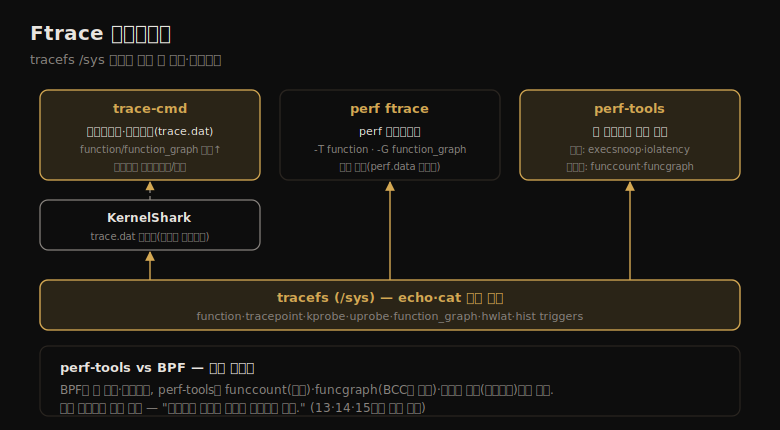

# Ftrace (3) — 프론트엔드
---
> 이 노트는 14.11~14.14 프론트엔드를 다룹니다. tracefs /sys 조작을 감싸 더 안전·간결하게 만드는 도구들 — trace-cmd(서브커맨드·바이너리 출력)·KernelShark(시각화)·perf ftrace(perf 서브커맨드)·perf-tools(셸 스크립트 도구 모음) — 를 봅니다.

14-01·14-02가 tracefs를 echo·cat으로 직접 다뤘다면, 프론트엔드는 그 /sys 조작을 *감싸* 더 안전·간결하게 만듭니다. trace-cmd는 서브커맨드·바이너리 출력 형식을, KernelShark는 시각화를, perf ftrace는 perf 서브커맨드를, perf-tools는 단일 목적·다목적 셸 스크립트 도구 모음을 줍니다.

> trace-cmd(서브커맨드·원라이너·function_graph·perf 비교) → KernelShark(시각화) → perf ftrace → perf-tools(단일 목적·다목적 도구·원라이너) 순으로 갑니다.


## 1. trace-cmd — Ftrace 공식 프론트엔드

> trace-cmd는 Steven Rostedt 등이 만든 오픈소스 Ftrace 프론트엔드로, 서브커맨드·옵션·바이너리 출력 형식을 줍니다. tracefs 직접 조작보다 간결하고 안전합니다(추적 상태 정리 자동). record→report 흐름으로 function·tracepoint 등을 추적합니다.

프론트엔드들이 tracefs 위에 어떻게 얹히는지를 한 장으로 정리하면 다음과 같습니다.



trace-cmd는 Steven Rostedt 등이 만든 오픈소스 Ftrace 프론트엔드입니다 — 서브커맨드·옵션·바이너리 출력 형식을 줍니다. function·function_graph 트레이서와 tracepoint·이미 설정된 kprobe/uprobe를 이벤트 소스로 씁니다.

```
# trace-cmd record -p function -l do_nanosleep sleep 10
# trace-cmd report
           sleep-21145 [001] 573259.213076: function: do_nanosleep
      multipathd-348   [001] 573259.523759: function: do_nanosleep
```

tracefs 직접 조작보다 *간결하고 안전* 합니다 — 많은 서브커맨드가 끝날 때 추적 상태를 자동 정리합니다.

| 서브커맨드 | 설명 |
|-----------|------|
| record | 추적해 trace.dat 파일에 기록 |
| report | trace.dat에서 추적 읽기 |
| stream | 추적해 stdout 출력 |
| list | 가용 추적 이벤트 나열 |
| stat | 커널 추적 서브시스템 상태 |
| profile | 커널 시간·지연 커스텀 리포트 |
| listen | 네트워크 추적 요청 수용 |

원라이너 예 — `trace-cmd list -t`(Ftrace 트레이서 나열)·`record -p function -l 'tcp_*'`(tcp_ 함수)·`record -p function_graph -g do_nanosleep`(자식 호출)·`record -e block_rq_issue -T`(스택 트레이스)·`record -e 'sched:*'`(전체 sched tracepoint)입니다. `-p`(plugin)는 Ftrace 트레이서를, `-l`(filter)·`-g`(graph function)는 함수를 지정합니다.

> trace-cmd의 핵심은 *tracefs를 안전·간결하게 감싼다* 는 점입니다 — 직접 echo·cat보다 짧고, 추적 상태를 자동 정리합니다. perf와 스타일이 비슷하지만(둘 다 record→report), trace-cmd는 *function·function_graph 트레이서 지원이 더 낫고*, perf는 PMC·타임드 샘플링을 가집니다. trace-cmd는 kprobe·uprobe·USDT를 *이미 생성된 것만* 추적하는 부분 지원입니다.


## 2. trace-cmd vs perf·KernelShark — 비교와 시각화

> trace-cmd와 perf는 능력이 겹치지만 갈립니다 — perf는 PMC·타임드 샘플링·USDT 완전 지원, trace-cmd는 function/function_graph 트레이서 지원이 낫고 네트워크 클라이언트/서버를 가집니다. KernelShark는 trace.dat을 시각화해 스레드 간 상호작용 문제를 식별합니다.

trace-cmd와 perf(13장)는 능력이 겹치지만 강점이 갈립니다.

| 속성 | perf | trace-cmd |
|------|------|-----------|
| 출력 파일 | perf.data | trace.dat |
| PMC·타임드 샘플링 | 가능 | 없음 |
| kprobe·uprobe·USDT | 가능 | 부분(이미 생성된 것만) |
| function·function_graph | 부분(ftrace 서브커맨드) | 가능 |
| 네트워크 클라이언트/서버 | 없음 | 가능 |
| 프론트엔드 | 다양 | KernelShark |

같은 tracepoint를 perf(`perf record -e ... ; perf script`)와 trace-cmd(`trace-cmd record -e ... ; trace-cmd report`)로 비슷하게 추적합니다. trace-cmd의 한 장점은 *function·function_graph 트레이서 지원이 낫다* 는 점입니다.

**KernelShark** 는 trace.dat의 시각적 UI입니다(Ftrace 창시자 Steven Rostedt 작, 현재 Qt). 스케줄러 tracepoint를 기록(`trace-cmd record -e 'sched:*'`)하고 `kernelshark` 로 봅니다 — 상단은 CPU별 타임라인(작업별 색), 하단은 이벤트 표입니다. 클릭·드래그로 줌, 우클릭으로 필터를 설정합니다. *스레드 간 상호작용이 일으킨 성능 문제* 를 식별하는 데 씁니다.

> trace-cmd vs perf의 핵심은 *강점이 갈린다* 는 점입니다 — perf는 PMC·샘플링·USDT 완전 지원, trace-cmd는 function/function_graph 트레이서 지원이 낫고 네트워크 추적을 가집니다. 둘은 경쟁이 아니라 *상호 검증* 에도 씁니다(한 도구가 깨졌는지 확인). KernelShark는 텍스트로 안 보이는 *스레드 간 상호작용* 을 시각화로 드러냅니다.


## 3. perf ftrace — perf의 Ftrace 서브커맨드

> perf ftrace는 perf(1)에서 function·function_graph 트레이서에 접근하는 서브커맨드입니다. -T로 function, -G로 function_graph를 씁니다. 단 perf.data와 통합 안 된 단순 래퍼라, stdout에 출력하고 다른 perf 능력과 결합하지 않습니다.

perf(1)(13장)는 ftrace 서브커맨드로 function·function_graph 트레이서에 접근합니다.

```
# perf ftrace -T do_nanosleep -a sleep 10      # function 트레이서
 1)  multipa-348   | $ 1000068 us  |  }
# perf ftrace -G do_nanosleep -a sleep 10      # function_graph 트레이서
 1)  sleep-22828   |               |  do_nanosleep() {
```

`-T` 가 function, `-G` 가 function_graph를 쓰고, `-p` 로 PID를 매칭합니다. 단 *단순 래퍼* 라 다른 perf 능력과 통합 안 됩니다 — stdout에 출력하고 perf.data를 안 씁니다.

> perf ftrace의 핵심은 *perf에서 Ftrace 트레이서에 닿는 다리* 라는 점입니다 — perf가 function/function_graph 트레이서를 "부분 지원"하는 게(14-03 §2 비교표) 이 서브커맨드입니다. 단 통합이 얕아(perf.data 미사용, stdout 출력) 본격 분석엔 trace-cmd나 perf-tools가 낫습니다.


## 4. perf-tools — Ftrace·perf 기반 도구 모음

> perf-tools는 저자가 만든 Ftrace·perf 기반 도구 모음으로, 대부분 tracefs /sys를 자동화하는 셸 스크립트입니다. 단일 목적 도구(execsnoop·iolatency 등)는 한 일을 잘하고, 다목적 도구(funccount·funcgraph 등)는 여러 이벤트 소스를 다룹니다.

perf-tools는 저자가 만든 오픈소스 Ftrace·perf 기반 도구 모음으로, Netflix 서버 기본 설치입니다 — 대부분 tracefs /sys 파일을 자동화하는 *셸 스크립트* 라 설치가 쉽고(의존성 적음) 각자 한 일을 잘합니다.

**단일 목적 도구** 는 한 일을 잘합니다(Unix 철학) — 기본 출력이 간결·충분해 옵션 없이 바로 씁니다.

| 도구 | 설명 |
|------|------|
| execsnoop | 새 프로세스(execve) 추적, 인자 포함 |
| opensnoop | open 계열 syscall의 파일명 추적 |
| iolatency | 디스크 I/O 지연 히스토그램 |
| iosnoop | 디스크 I/O 상세(지연 포함) 추적 |
| killsnoop·tcpretrans·cachestat·bitesize | kill 신호·TCP 재전송·페이지 캐시·I/O 크기 |

예 — execsnoop은 단명 프로세스(다른 도구엔 안 보임)를 추적하고, iolatency는 디스크 I/O 지연을 히스토그램으로 봅니다.

**다목적 도구** 는 여러 이벤트 소스를 다룹니다(perf·trace-cmd처럼 복잡).

| 도구 | 설명 |
|------|------|
| funccount | 커널 함수 호출 카운트 |
| funcgraph | 커널 함수의 자식 흐름 추적 |
| functrace·funcslower | 커널 함수 추적·임계 초과 추적 |
| kprobe·uprobe·tpoint | 동적·정적 계측 |
| syscount·perf-stat-hist | syscall 요약·커스텀 집계 |

원라이너 예 — `funccount 'tcp_*'`(TCP 함수 카운트)·`funcgraph do_nanosleep`(자식 흐름)·`funcslower vfs_read 10000`(10ms 초과)·`kprobe 'p:do_sys_open filename=+0($arg2):string'`(파일명 인자)·`uprobe p:bash:readline`(유저 함수)입니다.

> perf-tools의 핵심은 *Unix 철학의 셸 스크립트 도구* 입니다 — 단일 목적 도구는 옵션 없이 바로 쓰는 간결함을, 다목적 도구는 perf·trace-cmd 같은 유연함을 줍니다. iolatency가 BPF의 필요성을 설명합니다 — 이벤트를 유저 공간에서 후처리해 디스크 I/O(저빈도)엔 되지만, 네트워크·스케줄링(고빈도)엔 오버헤드가 과해 BPF가 커널에서 집계해 푼 문제입니다(15장).


## 5. perf-tools vs BCC/BPF — 언제 무엇을

> perf-tools 도구는 BCC/BPF 버전도 많지만(execsnoop·funccount 등), perf-tools의 장점이 있습니다 — funccount는 Ftrace 프로파일링이라 더 효율적, funcgraph는 BCC에 없음, 의존성이 적어 자원 제한 환경에 유용합니다.

저자는 BPF 없던 Linux 3.2 Netflix 클라우드용으로 perf-tools를 만들었고, 이후 많은 도구를 BPF로 다시 썼습니다 — perf-tools와 BCC 둘 다 execsnoop·opensnoop·funccount 등을 가집니다. BPF가 프로그래머빌리티·더 강력한 능력을 주지만(15장), perf-tools의 장점도 있습니다.

| 장점 | 이유 |
|------|------|
| funccount | Ftrace function 프로파일링이라 kprobe 기반 BCC보다 효율적·덜 제약 |
| funcgraph | function_graph 트레이싱이라 BCC엔 없음 |
| hist triggers | kprobe 기반 BPF보다 효율적인 미래 도구의 토대 |
| 의존성 | 셸·awk만 필요해 자원 제한 환경(임베디드)에 유용 |

저자는 BPF 도구로 BPF 도구의 문제를 디버깅할 때 perf-tools로 교차 검증하기도 합니다 — "트레이서 하나면 무슨 이벤트가 일어났는지 알고, 둘이면 하나가 깨졌음을 안다."

**문서** — 각 도구에 usage 메시지(`-h`)·man page·examples 파일이 있습니다. Ftrace 자체는 Linux 소스 `Documentation/trace/` 에 잘 문서화돼 있습니다(ftrace·kprobetrace·uprobetracer·events·histogram).

> perf-tools vs BCC/BPF의 핵심은 *언제 무엇을* 입니다 — BPF가 더 강력·유연하지만, perf-tools는 funccount(Ftrace 프로파일링 효율)·funcgraph(BCC에 없음)·의존성 적음(임베디드)에서 여전히 유용합니다. 둘은 경쟁이자 *상호 검증* 입니다 — 한 트레이서가 깨졌는지 다른 것으로 확인합니다. 이것이 13(perf)·14(Ftrace)·15(BPF) 추적 도구 묶음이 보완 관계인 까닭입니다.


## 학습 점검

> 이 노트의 핵심을 스스로 떠올려 봅니다. 답이 막히면 해당 섹션으로 돌아가 확인합니다.

- trace-cmd가 tracefs 직접 조작보다 나은 점(간결·안전·자동 정리)과, function 트레이서 지원에서 perf보다 나은 까닭을 설명해 봅니다. (→ §1)
- trace-cmd와 perf의 강점이 어떻게 갈리며(PMC vs function 트레이서), KernelShark가 무엇을 시각화하는지 떠올려 봅니다. (→ §2)
- perf ftrace가 무엇을 하며, 왜 단순 래퍼(perf.data 미사용)인지 말해 봅니다. (→ §3)
- perf-tools의 단일 목적 도구와 다목적 도구가 어떻게 다르며, iolatency가 BPF의 필요성을 어떻게 설명하는지 설명해 봅니다. (→ §4)
- perf-tools가 BPF 대비 여전히 유용한 경우(funccount·funcgraph·의존성)와, 트레이서 둘로 교차 검증하는 까닭을 떠올려 봅니다. (→ §5)