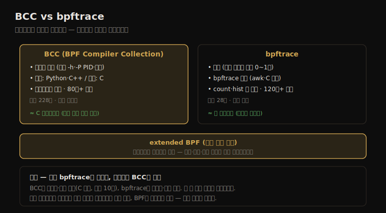

# BPF (1) — 개요·BCC vs bpftrace·BCC
---
> 이 노트는 15장의 출발점으로, extended BPF가 *프로그래밍 가능한 트레이서* 임을 잡습니다. 다른 트레이서는 모든 이벤트를 유저 공간에 덤프해 후처리하지만, BPF는 커널 컨텍스트에서 필터링·집계·지연 계산을 효율적으로 해, 운영 환경에 쓸 만한 도구를 만듭니다.

extended BPF는 트레이서에 프로그래밍 능력을 주는 커널 실행 환경입니다(03-03에서 소개). BPF를 다른 트레이서와 가르는 것은 *프로그래밍 가능* 하다는 점입니다 — 이벤트에서 유저 정의 프로그램을 실행해 필터링·정보 저장/조회·지연 계산·커널 내 집계·커스텀 요약을 합니다. 다른 트레이서가 모든 이벤트를 유저 공간에 덤프해 후처리해야 하는 반면, BPF는 그 처리를 *커널 컨텍스트에서 효율적* 으로 해, 안 그러면 오버헤드가 과해 운영에 못 쓸 도구를 실용화합니다.

> 이 노트는 15.1 BCC를 다룹니다. 두 프론트엔드(BCC·bpftrace)의 차이, BCC의 설치·도구 커버리지·단일/다목적 도구·원라이너를 봅니다. bpftrace 도구는 15-02, bpftrace 프로그래밍은 15-03에서 다룹니다.


## 1. BPF 개요 — 프로그래밍 가능한 트레이서

> BPF는 이벤트에서 유저 정의 프로그램을 실행해, 커널 컨텍스트에서 필터링·집계·지연 계산을 합니다. 두 프론트엔드 BCC(복잡한 도구)와 bpftrace(애드혹 커스텀 프로그램)가 있으며, 디스크 I/O 지연·스케줄러 지연·TCP 세션 같은 질문에 답합니다.

BPF 도구는 "디스크 I/O 지연을 히스토그램으로?", "스케줄러 지연이 문제를 일으킬 만큼 높나?", "앱이 파일시스템 지연을 겪나?", "어떤 TCP 세션이 얼마나 오래 일어나나?", "어떤 코드 경로가 얼마나 블록되나?" 같은 질문에 답합니다.

두 프론트엔드가 있습니다 — **BCC**(복잡한 도구에 적합)와 **bpftrace**(애드혹 커스텀 프로그램에 적합)입니다. 둘의 차이를 한 장으로 정리하면 다음과 같습니다.



| 특성 | BCC | bpftrace |
|------|-----|----------|
| 도구 사용 | 복잡한 옵션(-h·-P PID 등)·인자 | 단순(옵션 없거나 인자 0~1개) |
| 프로그래밍 언어 | 유저: Python·Lua·C++ / 커널: C | bpftrace |
| 프로그래밍 난이도 | 어려움 | 쉬움 |
| 이벤트별 출력 | 무엇이든 | 텍스트·JSON |
| 요약 유형 | 무엇이든 | count·min·max·sum·avg·히스토그램 |
| 라이브러리 지원 | 있음(Python import) | 없음 |
| 평균 프로그램 길이 | 228줄 | 28줄 |

Netflix는 둘 다 기본 설치합니다 — *BCC* 는 명령줄 분석 도구로(스토리지·네트워크·프로세스 실행), 일부는 대시보드가 자동 실행(스케줄러·디스크 지연 히트맵·off-CPU 플레임 그래프), tcplife 기반 데몬이 네트워크 이벤트를 상시 로깅합니다. *bpftrace* 는 커널·앱 병리 이해를 위한 커스텀 도구로 필요 시 개발합니다.

> 핵심은 *BPF가 프로그래밍 가능한 트레이서* 라는 점입니다 — 이벤트에서 프로그램을 실행해 커널에서 집계해, 다른 트레이서(13 perf·14 Ftrace)가 후처리해야 할 것을 효율적으로 처리합니다. BCC와 bpftrace는 C 프로그래밍과 셸 스크립팅의 관계 같습니다 — BCC는 복잡·강력(C 일부), bpftrace는 빠른 일회성(셸 스크립트 같음)입니다.


## 2. BCC — 설치와 도구 커버리지

> BCC(BPF Compiler Collection)는 고급 성능 분석 도구 모음이자 그것을 만드는 프레임워크입니다. 여러 배포판 패키지(bcc-tools 등)로 설치가 간단하고, Linux 4.4+(대부분 도구는 4.9+)가 필요합니다. 단일 목적·다목적 도구로 시스템 전반을 관측합니다.

BCC(BPF Compiler Collection)는 오픈소스 프로젝트로, 고급 성능 분석 도구 *모음* 이자 그것을 만드는 *프레임워크* 입니다(Brenden Blanco 작, 저자가 많은 추적 도구 개발).

예로 biolatency(8)은 디스크 I/O 지연을 2의 거듭제곱 히스토그램으로 보이고 I/O 플래그별로 쪼갭니다.

```
# biolatency.py -mF
flags = ReadAhead-Read
     msecs               : count     distribution
         0 -> 1          : 3031     |****************************************|
```

이 도구는 BPF로 *커널 공간에서 히스토그램을 요약* 해 효율적입니다 — 유저 공간은 이미 요약된 히스토그램(count 열)을 읽어 출력만 합니다.

**설치** 는 배포판 패키지로 간단합니다 — `bcc-tools`·`bpfcc-tools`·`bcc`(메인테이너마다 이름 다름)를 검색합니다. 소스 빌드도 가능하며, 커널 설정(CONFIG_BPF=y·CONFIG_BPF_SYSCALL=y·CONFIG_BPF_EVENTS=y)이 필요합니다. 일부 도구는 Linux 4.4+, 대부분은 4.9+가 필요합니다.

**도구 커버리지** 는 시스템 전반입니다 — 단일 목적 도구(단일 화살표)와 다목적 도구(좌측, 이중 화살표)로 CPU·메모리·파일시스템·디스크·네트워크를 관측합니다.

> BCC의 핵심은 *모음이자 프레임워크* 라는 점입니다 — 바로 쓰는 도구(biolatency 등)와, C로 BPF 프로그램을 짜는 토대를 함께 줍니다. biolatency가 BPF의 효율을 보입니다 — 히스토그램을 커널에서 요약해 유저 공간은 결과만 읽으니, 이벤트를 전부 덤프하는 방식(14장 iolatency)보다 오버헤드가 훨씬 낮습니다.


## 3. BCC — 단일 목적 도구

> 단일 목적 도구는 "한 일을 잘한다"는 Unix 철학을 따라, 기본 출력이 간결·충분해 옵션 없이 바로 씁니다. biolatency·execsnoop·opensnoop·tcplife·runqlat 등 80개 넘는 도구가 각 자원의 지연·이벤트를 관측합니다.

단일 목적 도구는 perf-tools(14장)와 같은 "한 일을 잘한다" 철학입니다 — 기본 출력이 간결·충분해 옵션 없이 바로 씁니다("그냥 biolatency 실행"). 옵션은 커스터마이즈용으로 존재합니다(biolatency -F로 I/O 플래그별 분해).

대표 단일 목적 도구(앞 장 참조):

| 도구 | 설명 | 장 |
|------|------|-----|
| biolatency·biotop·biosnoop | 블록 I/O 지연·프로세스별·상세 | 9.6 |
| execsnoop·opensnoop | 새 프로세스·open 계열 syscall | 5·8 |
| ext4dist·ext4slower (xfs·zfs·btrfs·nfs도) | FS 연산 지연·느린 연산 | 8.6 |
| cpudist·runqlat·runqlen·offcputime | CPU 시간·런큐 지연·off-CPU | 6·5 |
| drsnoop·memleak·oomkill | 메모리 reclaim·누수·OOM | 7 |
| tcplife·tcpretrans·tcptop | TCP 세션·재전송·처리량 | 10.6 |
| profile | 타임드 샘플링 CPU 프로파일 | 5.5 |

BCC 저장소에 80개 넘는 도구가 있습니다 — 각자 usage 메시지(-h)·man page·examples 파일을 가집니다.

> 단일 목적 도구의 핵심은 *간결함이 학습을 돕는다* 는 점입니다 — 옵션 없이 바로 실행해 잡음 없는 충분한 출력으로 문제를 풉니다. 이것이 perf-tools(14장)와 같은 설계 철학이고, 차이는 *BPF 기반이라 고빈도 이벤트도 커널 집계로 저오버헤드* 라는 점입니다 — perf-tools의 iolatency가 못 한 네트워크·스케줄링 추적을 BCC가 합니다.


## 4. BCC — 다목적 도구와 원라이너

> 다목적 도구(funccount·stackcount·trace·argdist)는 여러 이벤트 소스를 다뤄 perf처럼 강력하나 복잡합니다. 원라이너로 유용한 호출을 모아 두며, trace·argdist는 커스텀 한 줄 도구를 만드는 문법을 제공합니다.

다목적 도구는 여러 이벤트 소스를 다뤄 여러 역할을 합니다(perf처럼 강력하나 복잡).

| 도구 | 설명 |
|------|------|
| funccount | 커널/유저 함수 호출 카운트 |
| stackcount | 이벤트로 이어진 스택 트레이스 카운트 |
| trace | 필터로 임의 함수 추적 |
| argdist | 함수 인자값을 히스토그램·카운트로 |
| funcslower·funclatency | 느린 호출·지연 히스토그램 |

원라이너 예:

```
funccount 'tcp_*'                         # TCP 함수 카운트
stackcount t:block:block_rq_insert        # 블록 I/O 스택 카운트
trace 'do_sys_open "%s", arg2'            # open 함수의 파일명 추적
argdist -H 'r::vfs_read()'                # VFS 읽기 반환값(크기·에러) 히스토그램
```

예로 trace(8)은 do_sys_open()의 둘째 인자를 문자열로 출력합니다 — `trace 'do_sys_open "%s", arg2'` 가 ls의 /etc/ld.so.cache·libc.so.6 등 여는 파일을 보입니다. 문법은 printf(3)에서 영감받아 포맷 문자열+인자를 받습니다. trace·argdist는 *커스텀 한 줄 도구* 문법을 주며, bpftrace(15-02·15-03)가 이를 더 밀어 완전한 언어를 줍니다.

> 다목적 도구의 핵심은 *유연하나 복잡* 하다는 점입니다 — perf처럼 여러 이벤트를 다뤄 강력하지만 사용이 복잡합니다. **BCC vs bpftrace 선택** 이 15장 대주제입니다 — BCC는 커스텀·복잡 도구(C 제어, 개발이 10배 걸림), bpftrace는 일회성·짧은 도구입니다. 저자는 "먼저 bpftrace로 빠르게 개발하고, 필요하면 BCC로 포팅"을 권합니다 — C 프로그래밍 vs 셸 스크립팅의 관계입니다.


## 학습 점검

> 이 노트의 핵심을 스스로 떠올려 봅니다. 답이 막히면 해당 섹션으로 돌아가 확인합니다.

- BPF가 다른 트레이서와 다른 점(프로그래밍 가능·커널 집계)이 무엇이며, 왜 운영 환경에 쓸 만한 도구를 가능하게 하는지 설명해 봅니다. (→ §1)
- BCC와 bpftrace를 C 프로그래밍 vs 셸 스크립팅에 비유한 까닭과, 각각 어디에 적합한지 떠올려 봅니다. (→ §1)
- biolatency가 BPF의 효율을 어떻게 보이는지(커널에서 히스토그램 요약)와, perf-tools iolatency와의 차이를 말해 봅니다. (→ §2)
- 단일 목적 도구의 간결함이 왜 학습을 돕는지, 그리고 perf-tools와 같은 철학이되 무엇이 다른지(저오버헤드) 설명해 봅니다. (→ §3)
- 다목적 도구가 유연하나 복잡한 까닭과, 저자가 "bpftrace 먼저 개발 후 BCC 포팅"을 권하는 까닭을 떠올려 봅니다. (→ §4)