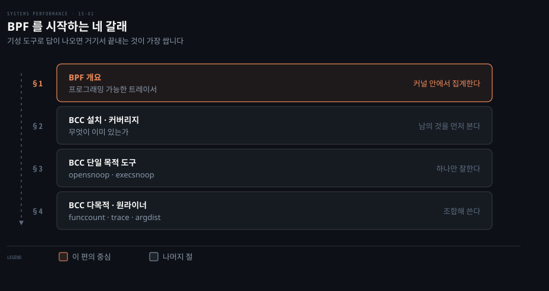
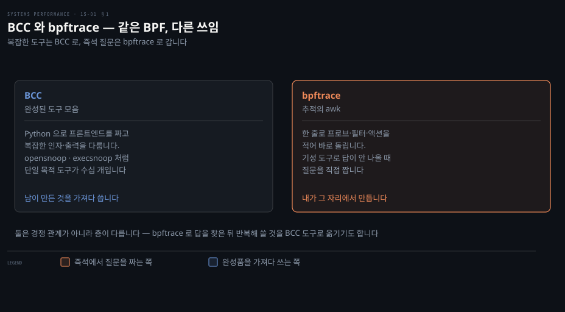

# BPF (1) — 개요·BCC vs bpftrace·BCC
---
> 이 노트는 15장의 출발점으로, extended BPF가 *프로그래밍 가능한 트레이서* 임을 잡습니다. 다른 트레이서는 모든 이벤트를 유저 공간에 덤프해 후처리하지만, BPF는 커널 컨텍스트에서 필터링·집계·지연 계산을 효율적으로 해, 운영 환경에 쓸 만한 도구를 만듭니다.

## 핵심 요약

> 이 편이 매달린 하나의 생각은 **BPF가 이벤트를 유저 공간으로 퍼 나르는 대신 커널 안에서 처리해, 운영 환경에서 못 쓰던 도구를 쓸 수 있게 만들었다는 것**입니다.

extended BPF는 트레이서에 프로그래밍 능력을 주는 커널 실행 환경입니다(03-03에서 소개). 다른 트레이서와 가르는 지점이 바로 *프로그래밍 가능* 하다는 점입니다. 이벤트가 발생하면 유저가 정의한 프로그램을 그 자리에서 실행합니다.

그 프로그램이 하는 일은 필터링, 정보 저장과 조회, 지연 계산, 커널 내 집계, 커스텀 요약입니다. 전부 커널 컨텍스트에서 끝납니다.

이것이 왜 중요한지는 대안과 비교하면 분명합니다. 다른 트레이서는 모든 이벤트를 유저 공간에 덤프한 뒤 후처리합니다. 초당 수십만 건이 오가는 자리에서는 그 자체가 감당이 안 됩니다. BPF는 요약만 올려 보내므로, 오버헤드 때문에 운영에 못 쓰던 도구가 실용화됩니다.


## 학습 목표

> 이 편을 덮은 뒤 스스로 할 수 있어야 하는 일을 먼저 적어 둡니다.

- BPF가 다른 트레이서와 무엇이 다른지 한 문장으로 답합니다.
- BCC와 bpftrace 중 어느 쪽을 언제 쓸지 고릅니다.
- BCC에 이미 있는 도구를 먼저 찾아보는 습관의 근거를 댑니다.
- 단일 목적 도구와 다목적 도구의 쓰임을 구분합니다.
- funccount·trace·argdist로 각각 어떤 질문에 답하는지 말합니다.



BPF가 무엇인지 세우고, 두 프론트엔드를 가른 뒤, BCC 도구를 단일 목적과 다목적으로 나눠 봅니다.


## 이 문서가 다루지 않는 것

> 뒤 편으로 넘긴 주제를 밝혀 둡니다.

- **bpftrace 도구와 원라이너** — 15-02가 다룹니다.
- **bpftrace 프로그래밍 문법** — 15-03이 다룹니다.
- **BPF 커널 내부와 검증기** — 3장이 다룹니다. 여기서는 쓰는 쪽만 봅니다.


## 1. BPF 개요 — 프로그래밍 가능한 트레이서

> BPF는 이벤트에서 유저 정의 프로그램을 실행해, 커널 컨텍스트에서 필터링·집계·지연 계산을 합니다. 프론트엔드는 둘이고, 복잡한 도구는 BCC 쪽이 애드혹 질문은 bpftrace 쪽이 맞습니다.



BPF 도구가 답하는 질문은 이런 것들입니다. 디스크 I/O 지연을 히스토그램으로 볼 수 있나. 스케줄러 지연이 문제를 일으킬 만큼 높은가. 앱이 파일 시스템 지연을 겪고 있나. 어떤 TCP 세션이 얼마나 오래 살아 있나. 어떤 코드 경로가 얼마나 블록되나.

프론트엔드는 **BCC** 와 **bpftrace** 둘입니다. BCC는 복잡한 도구에, bpftrace는 애드혹 커스텀 프로그램에 맞습니다.

| 특성 | BCC | bpftrace |
|------|-----|----------|
| 도구 사용 | 복잡한 옵션(-h·-P PID 등)·인자 | 단순(옵션 없거나 인자 0~1개) |
| 프로그래밍 언어 | 유저: Python·Lua·C++ / 커널: C | bpftrace |
| 프로그래밍 난이도 | 어려움 | 쉬움 |
| 이벤트별 출력 | 무엇이든 | 텍스트·JSON |
| 요약 유형 | 무엇이든 | count·min·max·sum·avg·히스토그램 |
| 라이브러리 지원 | 있음(Python import) | 없음 |
| 평균 프로그램 길이 | 228줄 | 28줄 |

Netflix는 둘 다 기본 설치합니다 — *BCC* 는 명령줄 분석 도구로(스토리지·네트워크·프로세스 실행), 일부는 대시보드가 자동 실행(스케줄러·디스크 지연 히트맵·off-CPU 플레임 그래프), tcplife 기반 데몬이 네트워크 이벤트를 상시 로깅합니다. *bpftrace* 는 커널·앱 병리 이해를 위한 커스텀 도구로 필요 시 개발합니다.

> 핵심은 *BPF가 프로그래밍 가능한 트레이서* 라는 점입니다 — 이벤트에서 프로그램을 실행해 커널에서 집계해, 다른 트레이서(13 perf·14 Ftrace)가 후처리해야 할 것을 효율적으로 처리합니다. BCC와 bpftrace는 C 프로그래밍과 셸 스크립팅의 관계 같습니다 — BCC는 복잡·강력(C 일부), bpftrace는 빠른 일회성(셸 스크립트 같음)입니다.


## 2. BCC — 설치와 도구 커버리지

> BCC(BPF Compiler Collection)는 고급 성능 분석 도구 모음이자 그것을 만드는 프레임워크입니다. 단일 목적 도구와 다목적 도구로 시스템 전반을 관측합니다.

설치는 배포판 패키지(`bcc-tools` 등)로 간단합니다. Linux 4.4 이상이 필요하고, 대부분의 도구는 4.9 이상을 요구합니다.

BCC(BPF Compiler Collection)는 오픈소스 프로젝트로, 고급 성능 분석 도구 *모음* 이자 그것을 만드는 *프레임워크* 입니다. Brenden Blanco가 만들었고, 이 책의 저자 Brendan Gregg가 개발을 도우며 추적 도구 다수를 작성했습니다.

예로 biolatency(8)은 디스크 I/O 지연을 2의 거듭제곱 히스토그램으로 보이고 I/O 플래그별로 쪼갭니다.

```bash
# biolatency.py -mF
flags = ReadAhead-Read
     msecs               : count     distribution
         0 -> 1          : 3031     |****************************************|
```

이 도구는 BPF로 *커널 공간에서 히스토그램을 요약* 해 효율적입니다 — 유저 공간은 이미 요약된 히스토그램(count 열)을 읽어 출력만 합니다.

**설치** 는 배포판 패키지로 간단합니다 — `bcc-tools`·`bpfcc-tools`·`bcc`(메인테이너마다 이름 다름)를 검색합니다. 소스 빌드도 가능하며, 커널 설정(CONFIG_BPF=y·CONFIG_BPF_SYSCALL=y·CONFIG_BPF_EVENTS=y)이 필요합니다. 일부 도구는 Linux 4.4+, 대부분은 4.9+가 필요합니다.

**도구 커버리지** 는 시스템 전반입니다 — 단일 목적 도구(단일 화살표)와 다목적 도구(좌측, 이중 화살표)로 CPU·메모리·파일시스템·디스크·네트워크를 관측합니다.

> BCC의 핵심은 *모음이자 프레임워크* 라는 점입니다 — 바로 쓰는 도구(biolatency 등)와, C로 BPF 프로그램을 짜는 토대를 함께 줍니다. biolatency가 BPF의 효율을 보입니다 — 히스토그램을 커널에서 요약해 유저 공간은 결과만 읽으니, 이벤트를 전부 덤프하는 방식(14장 iolatency)보다 오버헤드가 훨씬 낮습니다.


## 3. BCC — 단일 목적 도구

> 단일 목적 도구는 "한 일을 잘한다"는 Unix 철학을 따라, 기본 출력이 간결·충분해 옵션 없이 바로 씁니다. biolatency·execsnoop·opensnoop·tcplife·runqlat 등 80개 넘는 도구가 각 자원의 지연·이벤트를 관측합니다.

단일 목적 도구는 14장 perf-tools와 같은 "한 일을 잘한다" 철학을 따릅니다. 기본 출력이 간결하고 충분해서 옵션 없이 그냥 실행하면 됩니다. 옵션은 커스터마이즈가 필요할 때만 씁니다. `biolatency -F` 로 I/O 플래그별로 쪼개는 식입니다.

대표 단일 목적 도구(앞 장 참조):

| 도구 | 설명 | 장 |
|------|------|-----|
| biolatency·biotop·biosnoop | 블록 I/O 지연·프로세스별·상세 | 9.6 |
| execsnoop·opensnoop | 새 프로세스·open 계열 syscall | 5·8 |
| ext4dist·ext4slower (xfs·zfs·btrfs·nfs도) | FS 연산 지연·느린 연산 | 8.6 |
| cpudist·runqlat·runqlen·offcputime | CPU 시간·런큐 지연·off-CPU | 6·5 |
| drsnoop·memleak·oomkill | 메모리 reclaim·누수·OOM | 7 |
| tcplife·tcpretrans·tcptop | TCP 세션·재전송·처리량 | 10.6 |
| profile | 타임드 샘플링 CPU 프로파일 | 5.5 |

BCC 저장소에 80개 넘는 도구가 있습니다 — 각자 usage 메시지(-h)·man page·examples 파일을 가집니다.

> 단일 목적 도구의 핵심은 *간결함이 학습을 돕는다* 는 점입니다 — 옵션 없이 바로 실행해 잡음 없는 충분한 출력으로 문제를 풉니다. 이것이 perf-tools(14장)와 같은 설계 철학이고, 차이는 *BPF 기반이라 고빈도 이벤트도 커널 집계로 저오버헤드* 라는 점입니다 — perf-tools의 iolatency가 못 한 네트워크·스케줄링 추적을 BCC가 합니다.


## 4. BCC — 다목적 도구와 원라이너

> 다목적 도구(funccount·stackcount·trace·argdist)는 여러 이벤트 소스를 다뤄 perf처럼 강력하나 복잡합니다. 원라이너로 유용한 호출을 모아 두며, trace·argdist는 커스텀 한 줄 도구를 만드는 문법을 제공합니다.

다목적 도구는 여러 이벤트 소스를 다뤄 여러 역할을 합니다(perf처럼 강력하나 복잡).

| 도구 | 설명 |
|------|------|
| funccount | 커널/유저 함수 호출 카운트 |
| stackcount | 이벤트로 이어진 스택 트레이스 카운트 |
| trace | 필터로 임의 함수 추적 |
| argdist | 함수 인자값을 히스토그램·카운트로 |
| funcslower·funclatency | 느린 호출·지연 히스토그램 |

원라이너 예:

```bash
funccount 'tcp_*'                         # TCP 함수 카운트
stackcount t:block:block_rq_insert        # 블록 I/O 스택 카운트
trace 'do_sys_open "%s", arg2'            # open 함수의 파일명 추적
argdist -H 'r::vfs_read()'                # VFS 읽기 반환값(크기·에러) 히스토그램
```

예로 `trace(8)` 은 `do_sys_open()` 의 둘째 인자를 문자열로 출력합니다. `trace 'do_sys_open "%s", arg2'` 라고 쓰면 `ls` 가 여는 파일들이 보입니다. `/etc/ld.so.cache` 나 `libc.so.6` 같은 것들입니다.

문법은 `printf(3)` 에서 영감받아 포맷 문자열과 인자를 받습니다. `trace` 와 `argdist` 는 *커스텀 한 줄 도구* 를 만드는 문법을 주는 셈입니다.

> 다목적 도구의 핵심은 *유연하나 복잡* 하다는 점입니다 — perf처럼 여러 이벤트를 다뤄 강력하지만 사용이 복잡합니다. **BCC vs bpftrace 선택** 이 15장 대주제입니다 — BCC는 커스텀·복잡 도구(C 제어, 개발이 10배 걸림), bpftrace는 일회성·짧은 도구입니다. 권장 순서는 "먼저 bpftrace로 빠르게 개발하고, 필요하면 BCC로 포팅"입니다 — C 프로그래밍 vs 셸 스크립팅의 관계입니다.


## 학습 점검

> 이 노트의 핵심을 스스로 떠올려 봅니다. 답이 막히면 해당 섹션으로 돌아가 확인합니다.

- BPF가 다른 트레이서와 다른 점(프로그래밍 가능·커널 집계)이 무엇이며, 왜 운영 환경에 쓸 만한 도구를 가능하게 하는지 설명해 봅니다. (→ §1)
- BCC와 bpftrace를 C 프로그래밍 vs 셸 스크립팅에 비유한 까닭과, 각각 어디에 적합한지 떠올려 봅니다. (→ §1)
- biolatency가 BPF의 효율을 어떻게 보이는지(커널에서 히스토그램 요약)와, perf-tools iolatency와의 차이를 말해 봅니다. (→ §2)
- 단일 목적 도구의 간결함이 왜 학습을 돕는지, 그리고 perf-tools와 같은 철학이되 무엇이 다른지(저오버헤드) 설명해 봅니다. (→ §3)
- 다목적 도구가 유연하나 복잡한 까닭과, "bpftrace 먼저 개발 후 BCC 포팅"이 권장되는 까닭을 떠올려 봅니다. (→ §4)