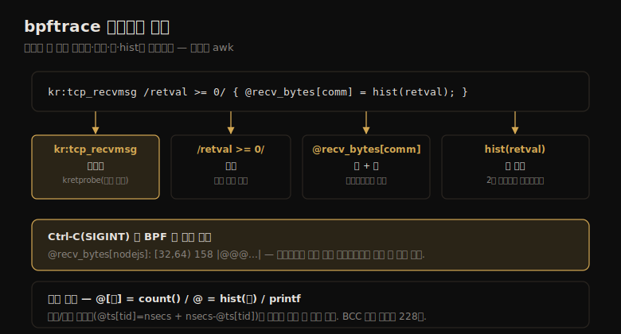

# BPF (2) — bpftrace 도구·원라이너
---
> 이 노트는 15.2.1~15.2.3 bpftrace 설치·도구·원라이너를 다룹니다. bpftrace는 BPF·BCC 위에 세운 트레이서로, 분석 도구 모음뿐 아니라 새 도구를 개발하는 고수준 언어를 줍니다 — awk의 추적 버전입니다.

bpftrace는 BPF·BCC 위에 세운 오픈소스 트레이서로, 성능 분석 도구 모음뿐 아니라 새 도구를 개발하는 *고수준 언어* 를 줍니다 — 단순·쉽게 설계된 *추적의 awk* 입니다(Alastair Robertson 작, 저자가 주요 기여자). awk가 입력 줄을 처리하는 프로그램 스탠자를 쓰듯, bpftrace는 입력 이벤트를 처리하는 스탠자를 씁니다.

> 이 노트는 bpftrace 설치·도구·원라이너를 다룹니다. 간결한 문법의 원라이너가 bpftrace 언어의 미니 예제이기도 합니다. 프로그래밍 언어 상세(프로브·함수·맵)는 15-03에서 다룹니다.


## 1. bpftrace 개요 — 추적의 awk

> bpftrace는 간결한 문법으로 프로브·필터·액션을 한 줄에 씁니다. kretprobe로 tcp_recvmsg()를 계측해 반환값(수신 크기)을 프로세스명별 히스토그램(@recv_bytes)에 담는 식으로, Ctrl-C 시 BPF 맵을 자동 출력합니다.

bpftrace의 한 원라이너가 TCP 수신 크기를 프로세스명별로 보입니다. 이 원라이너를 분해해 프로브·필터·맵·hist의 역할을 한 장으로 정리하면 다음과 같습니다.



```
# bpftrace -e 'kr:tcp_recvmsg /retval >= 0/ { @recv_bytes[comm] = hist(retval); }'
@recv_bytes[nodejs]:
[32, 64)             158 |@@@@@@@@@@@@@@@@@@@@@@@@@@@@@@@@@@@@@@@@@@@@@@@@@@@@|
[64, 128)            155 |@@@@@@@@@@@@@@@@@@@@@@@@@@@@@@@@@@@@@@@@@@@@@@@@@@@ |
```

이 한 줄이 — *kretprobe* 로 tcp_recvmsg()를 계측하고, 반환값이 양수일 때(필터 `/retval >= 0/`, 음수 에러 제외), `@recv_bytes` 라는 BPF *맵* 에 반환값 히스토그램을 프로세스명(comm) 키로 담습니다. Ctrl-C로 SIGINT를 받으면 종료하며 *BPF 맵을 자동 출력* 합니다.

**설치** 는 패키지로 간단합니다 — Ubuntu·Fedora·Debian·CentOS 등에 `bpftrace` 패키지가 있습니다(RHEL 8.2는 Technology Preview). Docker 이미지·의존성 없는 바이너리·소스 빌드도 있고, 커널 설정(CONFIG_BPF=y 등)과 Linux 4.9+가 필요합니다.

**도구** 는 bpftrace 저장소(30개 넘음)와 저자의 bpf-perf-tools-book 저장소(추가 다수)에 있습니다.

> bpftrace의 핵심은 *추적의 awk* 라는 점입니다 — 간결한 문법으로 프로브·필터·액션을 한 줄에 쓰고, 종료 시 맵을 자동 출력합니다. 위 한 줄이 보이듯, kretprobe·필터·맵·hist를 조합해 "수신 크기를 프로세스별 히스토그램으로"를 한 줄에 표현합니다 — BCC의 같은 도구가 228줄인 것과 대비됩니다(15-01).


## 2. 원라이너 — CPU·메모리·파일시스템

> 원라이너는 그 자체로 유용하면서 bpftrace 언어의 미니 예제입니다. tracepoint·kprobe로 새 프로세스·syscall·페이지 폴트·파일 열기·VFS 호출을 카운트하거나 히스토그램으로 봅니다.

원라이너는 유용하면서 bpftrace 언어의 미니 예제입니다(대상별 묶음).

**CPU:**

```
# 새 프로세스(인자 포함)
bpftrace -e 't:syscalls:sys_enter_execve { join(args->argv); }'
# 프로세스별 syscall 카운트
bpftrace -e 't:raw_syscalls:sys_enter { @[pid, comm] = count(); }'
# PID 189의 유저 스택 49Hz 샘플
bpftrace -e 'profile:hz:49 /pid == 189/ { @[ustack] = count(); }'
```

**메모리:**

```
# 힙 확장(brk) 코드 경로별 카운트
bpftrace -e 't:syscalls:sys_enter_brk { @[ustack, comm] = count(); }'
# 유저 페이지 폴트 스택별 카운트
bpftrace -e 't:exceptions:page_fault_user { @[ustack, comm] = count(); }'
```

**파일시스템:**

```
# openat으로 연 파일(프로세스명 포함)
bpftrace -e 't:syscalls:sys_enter_openat { printf("%s %s\n", comm, str(args->filename)); }'
# read() 읽은 바이트(에러 포함) 분포
bpftrace -e 't:syscalls:sys_exit_read { @ = hist(args->ret); }'
# VFS 호출 카운트
bpftrace -e 'kprobe:vfs_* { @[probe] = count(); }'
```

> 원라이너의 핵심은 *유용함 + 언어 학습* 입니다 — `@[키] = count()`(카운트)·`@ = hist(값)`(히스토그램)·`printf`(출력) 같은 패턴이 반복됩니다. tracepoint(안정적 인자 `args->`)와 kprobe(`vfs_*` 와일드카드)를 섞어, 13-02 perf 이벤트 소스를 bpftrace 문법으로 다룹니다.


## 3. 원라이너 — 디스크·네트워크·애플리케이션

> 디스크는 block tracepoint로 I/O 크기·스택·플래그를, 네트워크는 syscall·kprobe로 accept·송수신 바이트·TCP/UDP 크기를, 애플리케이션은 uprobe·tracepoint로 malloc·kill 신호를 봅니다.

**디스크:**

```
# 블록 I/O 크기 히스토그램
bpftrace -e 't:block:block_rq_issue { @bytes = hist(args->bytes); }'
# 블록 I/O 유발 유저 스택 카운트
bpftrace -e 't:block:block_rq_issue { @[ustack] = count(); }'
# 블록 I/O 유형 플래그별 카운트
bpftrace -e 't:block:block_rq_issue { @[args->rwbs] = count(); }'
```

**네트워크:**

```
# accept를 PID·프로세스명별 카운트
bpftrace -e 't:syscalls:sys_enter_accept* { @[pid, comm] = count(); }'
# 소켓 송수신 바이트를 PID·프로세스명별 합산
bpftrace -e 'kr:sock_sendmsg,kr:sock_recvmsg /retval > 0/ { @[pid, comm] = sum(retval); }'
# TCP 송신 바이트 히스토그램
bpftrace -e 'k:tcp_sendmsg { @send_bytes = hist(arg2); }'
```

**애플리케이션·커널:**

```
# malloc 요청 바이트를 유저 스택별 합산(고오버헤드)
bpftrace -e 'u:/lib/.../libc-2.27.so:malloc { @[ustack(5)] = sum(arg0); }'
# kill 신호(보낸 프로세스·대상 PID·신호 번호)
bpftrace -e 't:syscalls:sys_enter_kill { printf("%s -> PID %d SIG %d\n", comm, args->pid, args->sig); }'
# vfs_read 시간 측정 후 히스토그램
bpftrace -e 'k:vfs_read { @ts[tid] = nsecs; } kr:vfs_read /@ts[tid]/ { @ = hist(nsecs - @ts[tid]); delete(@ts[tid]); }'
```

> 원라이너의 핵심 패턴은 *시작/종료 프로브로 지연을 잰다* 는 점입니다 — 마지막 vfs_read 예처럼 kprobe(`@ts[tid] = nsecs`)와 kretprobe(`nsecs - @ts[tid]`)로 함수 지연을 히스토그램으로 만듭니다. 고빈도 이벤트(malloc·스케줄러)는 오버헤드가 크니, 가능하면 저빈도 이벤트로 문제를 풉니다 — uprobe·kprobe·tracepoint·USDT 모두 bpftrace 프로브로 쓸 수 있습니다(15-03).


## 학습 점검

> 이 노트의 핵심을 스스로 떠올려 봅니다. 답이 막히면 해당 섹션으로 돌아가 확인합니다.

- bpftrace가 "추적의 awk"라는 게 무슨 뜻이며, 한 원라이너가 어떻게 프로브·필터·맵·hist를 조합하는지 설명해 봅니다. (→ §1)
- bpftrace가 종료 시 무엇을 자동으로 하며(맵 출력), BCC의 같은 도구와 줄 수가 어떻게 다른지 떠올려 봅니다. (→ §1)
- 원라이너의 반복 패턴(`@[키]=count()`·`@=hist(값)`)이 무엇을 하며, tracepoint와 kprobe를 어떻게 섞어 쓰는지 말해 봅니다. (→ §2)
- 함수 지연을 재는 시작/종료 프로브 패턴(kprobe `@ts[tid]=nsecs` + kretprobe `nsecs-@ts[tid]`)을 설명해 봅니다. (→ §3)
- 고빈도 이벤트(malloc·스케줄러)를 추적할 때 주의할 점과, bpftrace가 쓸 수 있는 프로브 종류를 떠올려 봅니다. (→ §3)