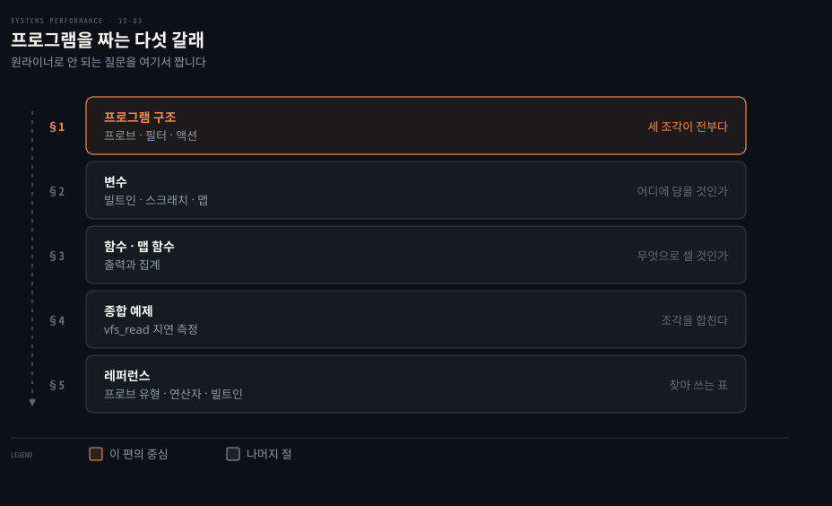
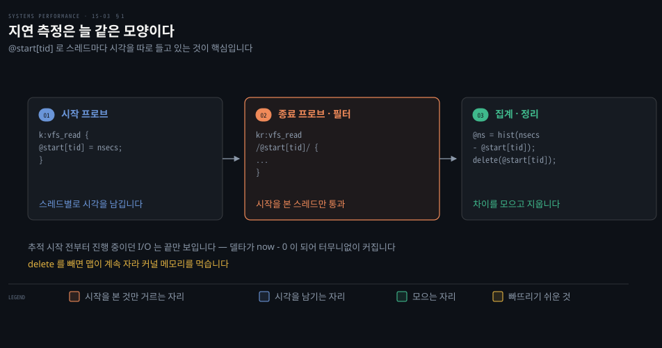

# BPF (3) — bpftrace 프로그래밍·레퍼런스
---
> 이 노트는 15.2.4~15.2.6 bpftrace 프로그래밍·레퍼런스를 다룹니다. bpftrace 언어(awk·C에서 영감)의 구조 — 프로브·필터·액션 — 와 변수(빌트인·스크래치·맵)·함수·맵 함수를 봅니다. vfs_read() 지연 측정 도구가 종합 예제입니다.

## 핵심 요약

> 이 편이 매달린 하나의 생각은 **지연을 재는 프로그램은 어느 계층을 재든 같은 모양이고, 그 모양은 시작에서 시각을 남기고 끝에서 차이를 집계하는 것**이라는 점입니다.

bpftrace 언어는 awk와 C에서, 그리고 DTrace·SystemTap 같은 트레이서에서 영감을 받았습니다. 프로그램은 *프로브 + 필터 + 액션* 의 연속입니다. 필터는 선택이고, 전체 모양은 awk의 `/패턴/ { 액션 }` 과 닮았습니다.

변수는 셋으로 나뉩니다. 빌트인은 읽기 전용 정보, `$` 로 시작하는 스크래치는 임시값, `@` 로 시작하는 맵은 BPF가 커널에 들고 있는 저장소입니다.

이 셋 중 맵이 핵심입니다. 스레드마다 시작 시각을 맵에 넣어 두었다가 끝에서 꺼내 빼는 것이 지연 측정의 기본형이고, 종합 예제도 그 형태입니다.


## 학습 목표

> 이 편을 덮은 뒤 스스로 할 수 있어야 하는 일을 먼저 적어 둡니다.

- 프로브·필터·액션으로 프로그램 한 편을 읽고 씁니다.
- 빌트인·스크래치·맵 변수를 구분해 알맞은 자리에 씁니다.
- 출력 함수와 집계 함수를 나눠 고릅니다.
- 지연 측정 프로그램을 시작·종료·집계 세 단계로 직접 짭니다.
- 필터와 `delete` 를 빼면 무엇이 잘못되는지 답합니다.



구조를 세우고 변수와 함수를 익힌 뒤, 종합 예제로 지연 측정을 완성합니다.


## 이 문서가 다루지 않는 것

> 앞 편으로 넘긴 주제를 밝혀 둡니다.

- **BPF 개요와 BCC 도구** — 15-01이 다룹니다.
- **자원별 원라이너 모음** — 15-02가 다룹니다.
- **BPF 검증기와 JIT 같은 커널 내부** — 3장이 다룹니다.


## 1. 프로그램 구조 — 프로브·필터·액션

> bpftrace 프로그램은 프로브 + (선택)필터 + 액션의 시리즈입니다 — `probe /filter/ { action }`. 프로브가 발동하면 필터가 참일 때 액션이 실행됩니다. awk의 `/패턴/ { 액션 }` 구조와 같고, BEGIN·END 특수 프로브도 있습니다.



bpftrace 프로그램은 두 방식으로 실행합니다. `bpftrace -e program` 은 원라이너이고, `bpftrace file.bt` 는 파일입니다. 어느 쪽이든 root 권한이 필요합니다. 구조는 *프로브 + 필터 + 액션* 의 연속이고 필터는 선택입니다.

```bash
probe /filter/ { action }
probe /filter/ { action }
```

프로브가 발동하면 필터(Boolean 식)가 참일 때 액션이 실행됩니다 — awk의 `/패턴/ { 액션 }` 과 같습니다. 여러 액션 블록이 어느 순서로든 실행될 수 있습니다.

**프로브 형식** 은 `type:identifier1[:identifier2]` 입니다. `kprobe:vfs_read` 처럼 커널 함수는 식별자가 하나이고, `uprobe:/bin/bash:readline` 처럼 유저 함수는 경로와 함수 이름이 함께 옵니다. `kprobe:vfs_*` 같은 와일드카드로 여러 프로브를 한 번에 걸 수도 있습니다.

**필터** 는 액션 실행을 게이트합니다. `/pid == 123/` 은 그 pid일 때만 돌고, `/pid/` 는 0이 아닐 때 도는 `/pid != 0/` 의 축약입니다. `/pid > 100 && pid < 1000/` 처럼 Boolean으로 묶을 수도 있습니다.

**액션** 은 세미콜론으로 구분한 문장들이고, 프로브가 걸릴 때마다 실행됩니다.

> 프로그램 구조의 핵심은 *awk를 닮은 프로브·필터·액션* 입니다 — 프로브가 발동하면 필터가 참일 때 액션이 실행됩니다. 와일드카드로 여러 프로브를 잡되 상한으로 과다 계측을 막고, BEGIN/END로 시작·끝 메시지를 출력합니다. 이 단순 구조가 bpftrace를 "추적의 awk"로 만듭니다(15-02).


## 2. 변수 — 빌트인·스크래치·맵

> 변수는 세 종류입니다 — 빌트인(pid·comm·nsecs 등 읽기 전용 정보), 스크래치(`$`, 액션 블록 내 임시), 맵(`@`, BPF 저장으로 액션 간 데이터 전달). 맵은 키를 줘 해시 테이블로 쓰며, `@start[tid] = nsecs` 가 흔한 패턴입니다.

변수는 세 종류입니다.

| 종류 | 접두 | 설명 |
|------|------|------|
| 빌트인 | (없음) | 읽기 전용 정보 — pid·comm·nsecs·curtask 등 |
| 스크래치 | `$` | 임시 계산용. 첫 할당에 이름·타입 정해짐, 해당 액션 블록 내만 |
| 맵 | `@` | BPF 맵 저장. 전역 저장·액션 간 데이터 전달 |

**스크래치 변수** 는 `$` 로 시작합니다. `$x = 1` 은 정수, `$y = "hello"` 는 문자열, `$z = (struct task_struct *)curtask` 는 포인터입니다. 첫 할당에서 타입이 정해지고, 그 액션 블록 안에서만 삽니다.

> **갱신 (2026-09)**: 0.22 부터 범위가 *블록* 단위로 좁아졌습니다. `if` 안에서 처음 만든 변수를 그 블록 바깥에서 쓰면 "Undefined or undeclared variable" 오류가 납니다.

**맵 변수** 는 `@` 로 시작하며 커널의 BPF 맵에 저장돼 프로브 사이를 넘나듭니다.

맵에 *키* 를 주면 해시 테이블(연관 배열)이 됩니다 — `@start[tid] = nsecs` 가 흔한 패턴으로, nsecs를 tid(스레드 ID) 키로 @start 맵에 저장해 스레드별 타임스탬프가 다른 스레드에 덮이지 않게 합니다. `@path[pid, $fd] = str(arg0)` 처럼 다중 키도 됩니다.

> 변수의 핵심은 *세 종류의 역할 분담* 입니다 — 빌트인은 정보 읽기, 스크래치(`$`)는 액션 내 임시 계산, 맵(`@`)은 액션 간·시간 간 데이터 전달입니다. 특히 `@start[tid] = nsecs` 패턴이 지연 측정의 토대입니다 — 한 프로브에서 타임스탬프를 tid 키로 저장하고 다른 프로브에서 델타를 계산합니다(다음 절 종합 예제).


## 3. 함수·맵 함수 — 출력과 집계

> 함수는 printf·str·exit 등 출력·계산을, 맵 함수는 count·sum·hist 등 통계 요약을 합니다. `@x = count()`(카운트)·`@y = sum($x)`(합)·`@z = hist($x)`(2의 거듭제곱 히스토그램)처럼 맵에 특수 객체를 할당하면 종료 시 자동 출력됩니다.

**함수** 는 출력과 계산을 맡습니다. `printf(fmt, ...)` 는 형식 출력, `str(char *)` 는 포인터를 문자열로, `exit()` 는 종료, `system()` 은 셸 명령입니다. 예를 들어 `printf("got: %llx %s\n", $x, str($x))` 는 같은 값을 16진수와 문자열로 나란히 찍습니다.

**맵 함수** 는 통계 요약을 합니다.

| 함수 | 동작 |
|------|------|
| count() | 발생 카운트(per-CPU 맵) |
| sum($x)·avg·min·max·stats | 합·평균·최소·최대·통계 |
| hist($x) | 2의 거듭제곱 히스토그램 |
| lhist($x, min, max, step) | 선형 히스토그램 |
| delete(@m[key]) | 키-값 쌍 삭제 |
| print(@m)·clear(@m)·zero(@m) | 맵 출력·전체 삭제·0으로 |

`@x = count()` 는 이벤트를 세고 출력 시 카운트를 보입니다(`@x++` 는 전역 정수 맵이라 동시 갱신 시 오차 가능). `@z = hist($x)` 는 히스토그램을, `delete(@start[tid])` 는 키-값을 삭제합니다. 맵은 *종료 시 자동 출력* 되므로 print()는 인터벌 출력 등에만 씁니다. 일부 함수(print·clear·zero·printf·system)는 *비동기* 입니다(커널이 큐잉, 잠시 후 유저 공간 처리).

> 함수·맵 함수의 핵심은 *커널에서 집계해 요약만 출력* 한다는 점입니다 — hist·count·sum이 BPF 맵에 통계를 모으고, 종료 시 자동 출력합니다. 이것이 15-01에서 본 BPF의 효율 — 이벤트를 전부 덤프하지 않고 커널에서 집계 — 의 실현입니다. 맵 이름을 `@us`·`@bytes` 처럼 의미 있게 지으면 출력에 단위가 붙어 자명해집니다.


## 4. 종합 예제 — vfs_read 지연 측정

> vfs_read 지연 측정 도구가 종합 예제입니다 — kprobe에서 시작 타임스탬프를 tid 키로 저장하고, kretprobe에서 델타를 계산해 히스토그램으로 만듭니다. 필터 `/@start[tid]/` 로 시작을 못 본 진행 중 호출의 오계산을 막습니다.

지금까지 문법으로 실용적 도구를 이해합니다 — vfsread.bt는 vfs_read() 지연을 마이크로초 히스토그램으로 출력합니다.

```bash
#!/usr/local/bin/bpftrace
// this program times vfs_read()
kprobe:vfs_read
{
        @start[tid] = nsecs;
}
kretprobe:vfs_read
/@start[tid]/
{
        $duration_us = (nsecs - @start[tid]) / 1000;
        @us = hist($duration_us);
        delete(@start[tid]);
}
```

동작은 이렇습니다. kprobe에서 시작 시각 `nsecs` 를 tid를 키로 `@start` 에 저장하고, kretprobe에서 그 차이를 계산합니다.

**필터 `/@start[tid]/` 가 중요합니다.** 시작 시각이 기록됐는지를 확인하는 장치입니다. 추적을 시작한 시점에 *이미 진행 중이던* vfs_read는 끝만 보이고 시작이 없습니다. 그러면 델타가 `now - 0` 이 되어 터무니없이 큰 값이 나옵니다.

출력은 `@us:` 히스토그램으로 마이크로초별 카운트를 보입니다. 맵 이름을 "us"로 해 단위를 출력에 포함했습니다. `@us[pid, comm] = hist(...)` 로 바꾸면 프로세스별 히스토그램이 됩니다 — iostat·vmstat의 고정 출력과 달리, bpftrace는 메트릭을 원하는 대로 쪼개고 다른 프로브의 메트릭으로 보강합니다.

> 종합 예제의 핵심은 *시작/종료 프로브 + tid 키 맵 + 필터* 패턴입니다 — 이것이 15-02 원라이너의 vfs_read 지연 측정을 파일로 정리한 형태입니다. 필터 `/@start[tid]/` 가 진행 중 호출의 오계산을 막는 게 핵심 디테일입니다. 이 패턴이 파일시스템·소켓 등 유형별 지연 분해로 확장됩니다(08-06 VFS 지연 추적).


## 5. 레퍼런스 — 프로브 유형·연산자·빌트인·함수

> 프로브 유형은 tracepoint·kprobe·uprobe·USDT·software·hardware·profile 등으로, 대부분 4장의 커널 기술 인터페이스입니다. 흐름 제어는 필터·삼항 연산자·if문·while 루프를, 빌트인 변수는 pid·comm·nsecs·args 등을 제공합니다.

**프로브 유형**(단축 별칭):

| 유형 | 단축 | 설명 |
|------|------|------|
| tracepoint | t | 커널 정적 계측 |
| usdt | U | 유저 정적 계측 |
| kprobe·kretprobe | k·kr | 커널 동적 함수·반환 |
| fentry·fexit | f·fr | 커널 동적(BPF 트램폴린·BTF 기반, 저오버헤드) |
| uprobe·uretprobe | u·ur | 유저 동적 함수·반환 |
| software·hardware | s·h | 커널 소프트웨어 이벤트·하드웨어 카운터(PMC) |
| profile | p | 타임드 샘플링 — 모든 CPU 에서 |
| interval | i | 타임드 보고 — 한 CPU 에서만 |
| watchpoint | w | 메모리 워치포인트 |
| BEGIN·END | | bpftrace 시작·끝 |

> **갱신 (2026-09)**: `fentry`/`fexit` 는 원서 출간 시점에 `kfunc`/`kretfunc` 였습니다. 커널이 이 지점을 부르는 이름과 맞추고, 별개 개념인 [BPF kfunc](https://docs.kernel.org/bpf/kfuncs.html) 와 헷갈리지 않도록 이름이 바뀌었습니다. 옛 이름도 호환을 위해 아직 동작합니다.

대부분 4장의 커널 기술(kprobe·uprobe·tracepoint·USDT·PMC) 인터페이스입니다. 프로브 빈도는 `bpftrace -e 'k:vfs_read { @ = count(); } interval:s:1 { exit(); }'` 로 측정하며, 지금 세대 컴퓨터에서는 초당 10만(kprobe·tracepoint) 미만이면 대체로 저빈도로 봅니다. 다만 이 선은 CPU 속도와 코어 수, 남은 여유, 프로브 계측 비용에 따라 달라집니다.

**흐름 제어** 는 넷입니다. 필터 `/filter/`, 삼항 연산자 `test ? a : b`, if문, 그리고 Linux 5.3부터 쓸 수 있는 while 루프입니다.

> **갱신 (2026-09)**: 지금 bpftrace 문서는 `while` 을 *deprecated* 로 표시하고 `for` 루프를 권합니다. `for` 가 경계를 증명하기 쉬워 BPF 검증기를 통과시키기 유리하기 때문입니다. `while` 은 앞으로 제거될 수 있습니다.

**연산자** 는 두 갈래입니다. Boolean 쪽이 `==`·`!=`·`>`·`<`·`&&`·`||` 이고, C에서 온 쪽이 `=`·`+`·`-`·`++`·`&`·`|`·`<<` 입니다.

**빌트인 변수** 는 읽기 전용 정보입니다.

| 갈래 | 변수 |
|------|------|
| 기본 | pid · tid · uid · comm · nsecs · cpu |
| 스택 | kstack · ustack |
| 인자 · 반환 | arg0~argN · args(구조체) · retval |
| 문맥 | func · probe · curtask |
| 위치 파라미터 | `$1` ~ `$N` |
| 그 밖 | username · elapsed · cgroup · sarg0~sargN(스택 기반 인자) |

정수는 모두 uint64 입니다. 그리고 이 변수들은 프로브가 걸린 *그 순간의* 스레드·프로브·함수·CPU 를 가리킵니다.

> **갱신 (2026-09)**: "모두 uint64" 는 지금은 맞지 않습니다. bpftrace 는 부호 있는·없는 여러 폭의 정수를 다루고, `pid`·`tid` 는 0.22 부터 `uint32` 입니다. 음수 반환값을 필터에 쓸 때 이 차이가 드러납니다.

> 레퍼런스의 핵심은 *프로브 유형이 4장 커널 기술의 인터페이스* 라는 점입니다 — tracepoint·kprobe·uprobe·USDT·PMC를 bpftrace 문법으로 통합해 다룹니다. fentry/fexit(옛 이름 kfunc/kretfunc)는 BPF 트램폴린·BTF 기반의 새 저오버헤드 인터페이스입니다. bpftrace는 13(perf)·14(Ftrace) 추적 도구 묶음의 정점으로, 프로그래밍 가능성과 커널 집계로 셋 중 가장 강력합니다 — 이로써 추적 도구 묶음(13~15)이 마무리됩니다.


## 학습 점검

> 이 노트의 핵심을 스스로 떠올려 봅니다. 답이 막히면 해당 섹션으로 돌아가 확인합니다.

- bpftrace 프로그램 구조(프로브·필터·액션)가 awk와 어떻게 닮았으며, 와일드카드 상한·BEGIN/END가 무엇을 하는지 설명해 봅니다. (→ §1)
- 변수 세 종류(빌트인·스크래치·맵)의 역할 분담과, `@start[tid] = nsecs` 패턴이 왜 지연 측정의 토대인지 떠올려 봅니다. (→ §2)
- 맵 함수(count·hist·sum)가 커널에서 무엇을 하며, 종료 시 자동 출력되는 게 왜 효율적인지 말해 봅니다. (→ §3)
- vfs_read 지연 측정에서 필터 `/@start[tid]/` 가 무엇(진행 중 호출의 오계산)을 막는지 설명해 봅니다. (→ §4)
- 프로브 유형이 4장 커널 기술과 어떻게 연결되며, bpftrace가 추적 도구 묶음(13~15)의 정점인 까닭을 떠올려 봅니다. (→ §5)