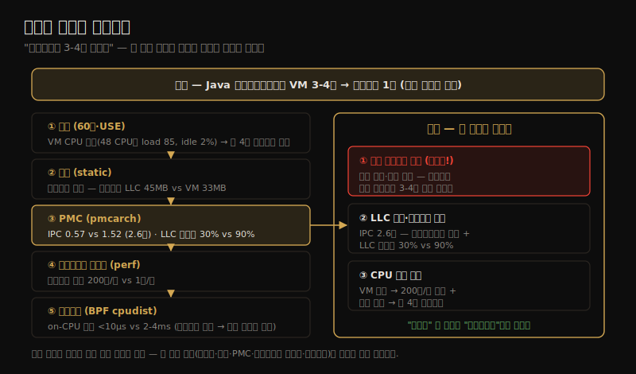

# 케이스 스터디 — 컨테이너가 3-4배 빠른 이유
---
> 이 노트는 16장(책의 마지막)으로, 새 기술이 아니라 *스토리텔링* 으로 도구·방법론이 실전에서 어떻게 적용되는지를 보입니다. Netflix 마이크로서비스가 컨테이너에서 3-4배 빨라진 미스터리를, 전문가가 단계별로 어떻게 사고하며 파고드는지 어깨 너머로 보는 케이스 스터디입니다.

16장은 실전 성능 이슈의 *이야기* 입니다 — 최초 보고에서 최종 해결까지. 의도는 새 기술 소개가 아니라, 도구·방법론이 실제 작업 환경에서 어떻게 쓰이는지를 *스토리텔링* 으로 보이는 것입니다. 실전 경험이 없는 입문자에게, 전문가가 문제에 어떻게 접근하고 *분석 중 무엇을 생각하며 왜 그러는지* 를 어깨 너머로 보여 줍니다. 최선의 접근법을 문서화한 게 아니라, *왜 그 접근을 택했는가* 입니다.

> 문제 제시 → 분석 전략 → 통계(60초·USE) → 설정 → PMC → 소프트웨어 이벤트 → 트레이싱 → 결론의 한 흐름으로 갑니다. 카운터·정적 설정·PMC·소프트웨어 이벤트·트레이싱이 차례로 단서를 주고 맞물려 결론에 이릅니다.

## 1. 문제 제시 — 너무 좋아서 믿기 어려운 결과

> Netflix 추천 마이크로서비스(Java)의 한 컴포넌트가 VM에서 컨테이너로 옮기자 요청 지연이 3-4초→1초로 3-4배 빨라졌습니다. 컨테이너 이점이라기엔 너무 커서, 이 차이가 영구적인지·다른 요인 때문인지 설명하는 게 과제입니다.

서비스 팀과 이야기해 마이크로서비스 세부를 파악했습니다 — 고객 추천을 계산하는 Java 앱으로, AWS EC2의 VM 인스턴스에서 돕니다. 두 컴포넌트로 구성됐는데, 그중 하나를 새 Netflix 컨테이너 플랫폼(Titus, 역시 EC2)에서 테스트 중이었습니다. 이 컴포넌트가 VM에선 요청 지연 3-4초였는데 컨테이너에선 1초 — *3-4배 빨라졌습니다*.

과제는 이 성능 차이를 설명하는 것입니다. 단순히 컨테이너 이동 덕이면 영구적 3-4배 이득을 기대할 수 있지만, 다른 요인이면 그게 무엇인지·영구적인지 이해할 가치가 있습니다. 어쩌면 다른 데도 더 크게 적용할 수 있습니다.

즉시 떠오른 가설 둘 — ① *격리 이점*: 한 컴포넌트만 따로 돌면 다른 컴포넌트와의 경합 없이 CPU 캐시를 통째로 써 캐시 적중률↑·성능↑ ② *bursting*: 컨테이너가 다른 컨테이너의 유휴 CPU를 빌려 씀.

이 장 전체의 분석 여정 — 도구 유형별 단서가 어떻게 맞물려 결론에 이르는지 — 을 한 장으로 정리하면 다음과 같습니다.

> 문제 제시의 핵심은 *"너무 좋아서 믿기 어렵다"는 신호* 입니다 — 3-4배는 컨테이너 이점치고 비정상이라 의심하고 조사합니다. 좋은 분석은 결과를 그냥 받아들이지 않고 "왜 이렇게 큰가, 영구적인가"를 묻습니다. 초기 가설(격리·bursting)을 세우되, 이후 단계에서 증거로 검증합니다 — 추측으로 결론짓지 않습니다.

## 2. 분석 전략 — 비교 분석의 이상적 조건

> 트래픽이 로드밸런서로 갈려 VM과 컨테이너에 동시에 로그인해 같은 명령을 같은 시각에 돌려 출력을 즉시 비교할 수 있었습니다. 컨테이너가 아니라 호스트 접근이 가능해 모든 도구·syscall을 쓸 수 있었던 게 분석을 크게 수월하게 했습니다.

트래픽이 로드밸런서(AWS ELB)로 처리돼, VM과 컨테이너에 트래픽을 갈라 *동시에 로그인* 할 수 있었습니다. 이것이 비교 분석의 *이상적 조건* 입니다 — 같은 분석 명령을 둘에 같은 시각(같은 트래픽 믹스·부하)에 돌려 출력을 즉시 비교합니다.

이 경우 컨테이너가 아니라 *컨테이너 호스트* 접근이 가능했습니다 — 어떤 분석 도구든 쓰고 그 도구가 어떤 syscall이든 할 권한이 있었습니다. 컨테이너 접근만 있었다면 관측 소스·커널 권한이 제한돼 훨씬 시간이 걸렸을 것입니다(직접 측정 대신 제한된 메트릭에서 추론). 일부 성능 이슈는 컨테이너 안에서만은 분석이 사실상 불가합니다(11장).

방법론은 *60초 체크리스트*(1장)와 *USE 메서드*(2장)로 시작해, 단서에 따라 *드릴다운 분석*(2장)으로 파고들 계획이었습니다.

> 분석 전략의 핵심은 *비교 분석의 조건* 입니다 — 같은 명령을 두 시스템에 동시에 돌려 출력을 나란히 비교하면 차이가 즉시 드러납니다. 또 11장의 교훈이 여기서 실증됩니다 — *호스트 접근* 이면 모든 도구·syscall을 쓸 수 있어 직접 측정하지만, 컨테이너 접근만이면 추론에 의존해 분석이 느려집니다. 그래서 호스트 접근 여부가 분석 난이도를 가릅니다.

## 3. 통계 — 60초·USE로 증상 포착

> uptime·mpstat 등 60초 체크리스트로 VM이 CPU 포화(48 CPU에 load 85, idle 2%)이고 컨테이너는 여유(64 CPU에 load 18, idle 78%)임을 확인했습니다. VM의 높은 %sys와 CPU 포화로 인한 대기가 약 4배 슬로다운과 크기가 맞아떨어졌습니다.

uptime(1)으로 load average부터 봤습니다 — VM은 85.09, 컨테이너는 17.94였습니다. 부하가 대체로 안정적인지(증가·감소·정상) 추세도 확인했습니다 — 클라우드는 불건전 인스턴스에서 부하를 자동 이전하므로, 문제 인스턴스에 로그인했더니 load가 0에 가까운 경우도 있습니다.

mpstat(1)으로 CPU 부하를 봤습니다.

| 지표 | VM(serverA) | 컨테이너(serverB) |
|------|-------------|-------------------|
| CPU 수 | 48 | 64 |
| idle | ~2% | ~78% |
| CPU 사용률(usr+sys) | 98% | 22% |
| %sys | ~8% | ~0.38% |

이 통계가 load average를 해석하게 했습니다 — CPU 기반이라면 VM은 CPU 포화에 깊이 들어갔고(load가 CPU 수의 거의 2배), 컨테이너는 저활용입니다. 또 이 프로세서는 코어당 하이퍼스레드 2개라 *50% 사용률을 넘으면 하이퍼스레드 코어 경합* 으로 성능이 저하되는데, VM은 그 영역에 깊이 들어갔습니다. VM의 높은 %sys(8% vs 0.38%)는 CPU 포화 시 커널 컨텍스트 전환 코드 경로일 수 있습니다.

vmstat·iostat·sar로 런큐 길이가 load average와 비슷하고(load가 CPU 기반 확인) 디스크·네트워크 I/O가 적음을 확인했습니다 — VM은 CPU 포화로 실행 가능 스레드가 차례를 기다리고, 컨테이너는 아닙니다.

> 통계의 핵심은 *60초·USE로 증상을 포착* 한 것입니다 — VM이 CPU 포화임을 확인했고, 크기도 맞습니다: 48 CPU에 load 85면 스레드가 약 77%(85/48-1) 시간을 대기하고, 이 대기를 없애면 약 4배 슬로다운(1/(1-0.77))입니다. 단 *아직 "왜 load가 높은가"를 설명 못 했습니다* — 크기는 맞아도 근본 원인은 더 파야 합니다. 좋은 분석은 "크기가 맞다"에서 멈추지 않습니다.

## 4. 설정·PMC — IPC와 LLC 적중률의 차이

> 정적 설정으로 두 프로세서가 다름을(컨테이너 LLC 45MB vs VM 33MB) 확인하고, PMC(pmcarch)로 IPC가 VM 0.57 vs 컨테이너 1.52(2.6배 차)임을 봤습니다. LLC 적중률이 VM 30% vs 컨테이너 90%로, VM 명령이 메모리 접근에 자주 stall돼 IPC가 낮았습니다.

CPU 이슈를 알았으니 *정적 성능 튜닝*(2·6장)으로 CPU 설정·한계를 확인했습니다. `/proc/cpuinfo` 로 프로세서 자체가 다름을 봤습니다 — 컨테이너 호스트는 기본 주파수가 약간 느리지만(2.30 vs 2.50GHz) *LLC가 훨씬 큼*(45 vs 33MB)이었습니다. 워크로드에 따라 캐시 크기 차이는 CPU 성능에 큰 차이를 냅니다.

PMC(성능 모니터링 카운터)로 CPU 사이클 성능을 설명했습니다 — `pmcarch`(6장)로 봤습니다.

| 지표 | VM | 컨테이너 |
|------|-----|---------|
| IPC(명령/사이클) | ~0.57 | ~1.52 (2.6배) |
| LLC 적중률 | ~30% | ~90% |

IPC가 2.6배 낮은 이유로 *하이퍼스레드 경합*(VM이 50% 넘게 사용)이 하나입니다. 더 큰 이유는 *LLC 적중률* — VM 30% vs 컨테이너 90%입니다. VM의 명령이 메인 메모리 접근에 자주 stall돼 IPC·명령 처리량(성능)이 떨어집니다. 낮은 LLC 적중률의 원인 셋 — ① 작은 LLC 크기(33 vs 45MB) ② 전체 워크로드 vs 서브컴포넌트(서브컴포넌트가 캐시에 더 잘 맞음) ③ CPU 포화로 인한 잦은 컨텍스트 전환·코드 경로 점프(캐시 압박↑).

> 설정·PMC의 핵심은 *IPC와 LLC 적중률로 슬로다운을 정량화* 한 것입니다 — IPC 2.6배 차이가 슬로다운의 2.6배를 설명합니다. PMC가 마이크로아키텍처 수준(사이클·캐시)을 직접 봐, "캐시가 안 맞아 느리다"는 가설을 *측정* 으로 바꿉니다. 마지막 원인(컨텍스트 전환)은 다음 단계(트레이싱)로 파고듭니다 — 단서가 다음 도구로 자연스럽게 이어집니다.

## 5. 소프트웨어 이벤트·트레이싱 — 컨텍스트 전환과 on-CPU 시간

> perf로 컨텍스트 전환율이 VM 200만/초 vs 컨테이너 1천/초임을, BCC cpudist로 on-CPU 시간이 VM <10μs vs 컨테이너 2-4ms임을 봤습니다. VM의 잦은 비자발적 컨텍스트 전환이 캐시 워밍업을 막아 성능을 떨어뜨렸습니다.

컨텍스트 전환을 조사하려 perf(1)로 시스템 전역 전환율을 셌습니다(소프트웨어 이벤트, 13장).

| 지표 | VM | 컨테이너 |
|------|-----|---------|
| 컨텍스트 전환율 | ~200만/초 | ~1천/초 |

높은 전환율은 CPU 캐시에 압박을 줍니다 — 다른 코드 경로(전환 관리 커널 코드·다른 프로세스)로 전환하기 때문입니다. 더 파려고 BPF 트레이싱(BCC cpudist 등, 15장)을 썼습니다.

**cpudist**(스레드의 on-CPU 지속시간):

| 시스템 | 전형적 on-CPU 시간 |
|--------|-------------------|
| VM | <10μs (자주 7μs 미만) |
| 컨테이너 | 2-4ms |

VM은 on-CPU 시간이 자주 7μs 미만으로 짧고, 다른 도구(stackcount·/proc/PID/status)로 *비자발적 컨텍스트 전환* 때문에 CPU를 떠남을 확인했습니다. 컨테이너는 비자발적 전환에 거의 방해받지 않았습니다.

> 소프트웨어 이벤트·트레이싱의 핵심은 *낮은 LLC 적중률의 한 원인을 직접 잡은 것* 입니다 — VM의 200만/초 비자발적 컨텍스트 전환이 스레드를 10μs 미만마다 CPU에서 쫓아내, *캐시가 현재 코드 경로에 워밍업할 시간을 안 줍니다*. 이것이 4장의 "LLC 적중률 30%"를 설명하는 메커니즘입니다 — perf(소프트웨어 이벤트)가 전환율을, BPF(트레이싱)가 on-CPU 시간을 줘 단서가 맞물립니다.

## 6. 결론 — 세 요인이 맞물린 성능 차이

> 성능 차이는 세 요인이 맞물린 결과였습니다 — ① 이웃 컨테이너 없음(캐시 독점, 영구적이지 않음) ② LLC 크기·워크로드 차이로 IPC 2.6배 ③ CPU 부하 차이로 약 4배 슬로다운. 이웃이 들어오면 3-4배 이득은 사라질 수 있습니다.

분석 결과 성능 이득의 이유는 셋이 맞물린 것이었습니다.

| 요인 | 내용 | 영구성 |
|------|------|--------|
| 이웃 컨테이너 없음 | 컨테이너 호스트가 그 컨테이너 하나만 돌아 CPU 캐시를 독점, 경합 없이 실행 | *비영구* — 운영에선 이웃이 norm, 3-4배 이득 사라질 수 있음 |
| LLC 크기·워크로드 차이 | IPC 2.6배 낮음(하이퍼스레드 경합 + LLC 적중률 30% vs 90%). LLC 작음·전체 워크로드·잦은 전환 | 일부 영구(LLC 크기), 일부 비영구 |
| CPU 부하 차이 | VM에 더 높은 부하 → CPU 포화(48 CPU에 load 85) → 200만/초 전환·런큐 지연 → 약 4배 슬로다운 | 부하 분배 문제 |

이 이슈들이 관측된 성능 차이를 설명합니다.

> 결론의 핵심은 *단일 원인이 아니라 세 요인이 맞물렸다* 는 점입니다 — 입문자가 흔히 "원인 하나"를 찾고 멈추지만, 실전은 *여러 기여 요인* 이 보통입니다. 특히 가장 중요한 발견은 *이웃 컨테이너 없음* 이 비영구적이라는 것 — 테스트에선 컨테이너에 유리했지만, 운영에서 이웃이 들어오면 3-4배 이득이 사라질 수 있습니다. 좋은 분석은 "왜 빠른가"뿐 아니라 *"이 이득이 지속되는가"* 까지 답합니다. 이것이 1번 문제 제시의 "영구적인가?"에 대한 답입니다.

## 학습 점검

> 이 노트의 핵심을 스스로 떠올려 봅니다. 답이 막히면 해당 섹션으로 돌아가 확인합니다.

- "3-4배 빠르다"가 왜 의심 신호이며, 좋은 분석이 결과를 그냥 받아들이지 않고 무엇을 묻는지 설명해 봅니다. (→ §1)
- 비교 분석의 이상적 조건이 무엇이며, 호스트 접근 vs 컨테이너 접근이 분석 난이도를 어떻게 가르는지 떠올려 봅니다. (→ §2)
- 60초·USE로 포착한 증상(VM CPU 포화)이 약 4배 슬로다운과 크기가 맞는데도, 왜 "크기가 맞다"에서 멈추면 안 되는지 말해 봅니다. (→ §3)
- PMC의 IPC와 LLC 적중률이 슬로다운을 어떻게 정량화하며, 낮은 LLC 적중률의 세 원인이 무엇인지 설명해 봅니다. (→ §4)
- 200만/초 비자발적 컨텍스트 전환이 어떻게 낮은 LLC 적중률을 만드는지(캐시 워밍업 방해), 그리고 세 요인 중 비영구적인 것이 무엇인지 떠올려 봅니다. (→ §5, §6)