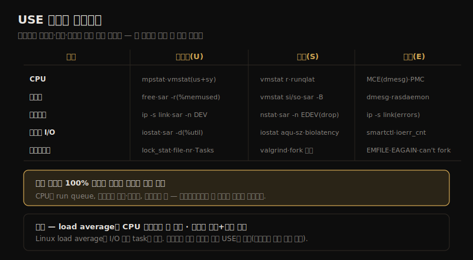

# 부록 — USE 메서드 체크리스트·sar 요약
---
> 이 노트는 부록 A·B로, 실무에서 곁에 두고 찾아보는 *치트시트* 입니다. USE 메서드(자원별 사용률·포화·에러)의 Linux 도구 매핑과, sar(1)의 옵션별 메트릭 요약을 한자리에 모았습니다. 본문 2장(방법론)·4장(관측 도구)에서 소개한 것을 빠르게 참조하는 용도입니다.

부록은 새 내용이 아니라 *빠른 참조* 입니다. USE 메서드는 자원마다 사용률·포화·에러를 점검해 시스템 건강을 확인하고 병목·에러를 찾는 방법인데(2장), 부록 A는 그 점검에 쓸 Linux 도구를 자원별로 매핑합니다. 부록 B는 sar(1)의 옵션별 메트릭을 요약해, "어느 메트릭이 어느 옵션 아래 있나"를 떠올리게 합니다.

> 성능 도구는 자주 개선·신설되니, 이 표는 *출발점* 으로 두고 갱신합니다. 또 자원 제어가 있는 환경(클라우드)에선 *각 자원 제어* 도 USE로 점검해야 합니다 — 하드웨어 한계 전에 자원 제어 한계에 먼저 닿을 수 있습니다.

## 1. USE 메서드 — 물리 자원 (CPU·메모리)

> CPU·메모리는 사용률·포화·에러를 각각 다른 도구로 봅니다. CPU 사용률은 mpstat·vmstat, 포화는 vmstat r·runqlat, 에러는 MCE(dmesg)입니다. 메모리 사용률은 free·sar -r, 포화는 vmstat si/so·sar -B(스캔), 에러는 dmesg·rasdaemon입니다.

USE 메서드를 자원별로 사용률·포화·에러 도구에 매핑한 매트릭스를 한 장으로 정리하면 다음과 같습니다.

USE 메서드를 물리 자원에 적용한 Linux 도구 매핑입니다(핵심만 발췌).

**CPU:**

| 유형 | 도구·메트릭 |
|------|-----------|
| 사용률 | `mpstat -P ALL 1`(per-CPU, idle 역) · `vmstat 1`(us+sy) · `top`(%CPU) · `pidstat 1` |
| 포화 | `vmstat 1`(r > CPU 수) · `sar -q`(runq-sz) · runqlat · runqlen |
| 에러 | MCE(`dmesg`·`ras-mc-ctl --summary`) · PMC 에러 이벤트(perf) · `ipmitool sel list` |

> 참고: load average(uptime)는 CPU 메트릭에 안 넣습니다 — Linux load average는 *uninterruptible I/O 상태* task도 포함하기 때문입니다.

**메모리 용량:**

| 유형 | 도구·메트릭 |
|------|-----------|
| 사용률 | `free -m` · `vmstat 1`(free·swap) · `sar -r`(%memused) · `slabtop`(kmem slab) · `top`(RES·VIRT) |
| 포화 | `vmstat 1`(si/so 스와핑) · `sar -B`(pgscank+pgscand 스캔) · `dmesg \| grep killed`(OOM) |
| 에러 | `dmesg` · rasdaemon·`ras-mc-ctl --summary`·`edac-util` · `dmidecode` · 실패한 malloc()의 동적 계측(bpftrace) |

> CPU·메모리의 핵심은 *사용률·포화·에러를 각각 다른 도구로 본다* 는 점입니다 — 한 도구가 셋을 다 주지 않습니다. 특히 포화 지표(CPU의 run queue, 메모리의 스캔·스와핑)가 100% 사용률 너머의 고통을 보여 줍니다(2장 USE). load average를 CPU에 안 쓰는 까닭(I/O 대기 포함)도 기억해 둘 함정입니다.

## 2. USE 메서드 — 물리 자원 (네트워크·스토리지)

> 네트워크 인터페이스는 사용률(ip -s link·sar -n DEV), 포화(nstat 재전송·sar -n EDEV drop), 에러(ip -s link errors)로 봅니다. 스토리지 I/O는 사용률(iostat %util), 포화(iostat 큐·biolatency), 에러(smartctl·/sys ioerr_cnt)로 봅니다.

**네트워크 인터페이스:**

| 유형 | 도구·메트릭 |
|------|-----------|
| 사용률 | `ip -s link`(RX/TX ÷ 최대 대역폭) · `sar -n DEV`(rx/tx kB/s) · `/proc/net/dev` |
| 포화 | `nstat`(TcpRetransSegs) · `sar -n EDEV`(*drop/s·*fifo/s) · `/proc/net/dev`(RX/TX drop) |
| 에러 | `ip -s link`(errors) · `sar -n EDEV` · `/sys/class/net/*/statistics/*error*` |

**스토리지 디바이스 I/O:**

| 유형 | 도구·메트릭 |
|------|-----------|
| 사용률 | `iostat -xz 1`(%util) · `sar -d`(%util) · iotop·biotop |
| 포화 | `iostat -xnz 1`(aqu-sz>1, 높은 await) · perf block tracepoint · biolatency |
| 에러 | `/sys/.../ioerr_cnt` · `smartctl` · bioerr · I/O 서브시스템 응답 코드 계측 |

**스토리지 용량:**

| 유형 | 도구·메트릭 |
|------|-----------|
| 사용률 | swap: `swapon -s`·`free` / 파일 시스템: `df -h` |
| 포화 | 꽉 차면 ENOSPC(꽉 차기 전엔 free block 알고리즘에 따라 성능 저하 가능) |
| 에러 | ENOSPC(strace·동적 계측) · `/var/log/messages` · 앱 로그 |

> 네트워크·스토리지의 핵심은 *드롭이 포화이자 에러 양쪽 지표* 라는 점입니다 — 패킷 드롭은 두 종류 이벤트(버퍼 가득참·물리 에러) 모두로 일어나기 때문입니다. 스토리지 용량 포화는 의미가 약합니다 — 꽉 차면 ENOSPC라 사용률(df) 점검이 더 유용합니다. 컨트롤러·인터커넥트(CPU·메모리·I/O 버스) 사용률은 보통 PMC(perf stat)로 봅니다.

## 3. USE 메서드 — 소프트웨어 자원

> 소프트웨어 자원(커널/유저 뮤텍스·태스크 용량·파일 디스크립터)도 USE로 봅니다. 뮤텍스는 lock_stat·valgrind, 태스크 용량은 threads-max·fork 실패, 파일 디스크립터는 file-nr ÷ file-max·EMFILE 에러로 점검합니다.

물리 자원뿐 아니라 *소프트웨어 자원* 도 USE로 점검합니다.

| 자원 | 유형 | 도구·메트릭 |
|------|------|-----------|
| 커널 뮤텍스 | 사용률·포화 | `/proc/lock_stat`(CONFIG_LOCK_STATS=y, holdtime·waittime) · 동적 계측(mlock.bt) · perf 프로파일링(스피닝) |
| 유저 뮤텍스 | 사용률·포화·에러 | `valgrind --tool=drd`(held time·contention·에러) · 동적 계측(pmlock.bt) |
| 태스크 용량 | 사용률 | `top`(Tasks) · `sysctl kernel.threads-max` |
| 태스크 용량 | 포화·에러 | 메모리 할당 블록(sar -B pgscan) · "can't fork()" 에러 · pthread_create EAGAIN |
| 파일 디스크립터 | 사용률 | system-wide: `sar -v`(file-nr ÷ file-max) / per-process: `/proc/PID/fd/* \| wc` ÷ `ulimit -n` |
| 파일 디스크립터 | 에러 | `strace` errno==EMFILE(open·accept 등) · `opensnoop -x` |

> 소프트웨어 자원의 핵심은 *하드웨어 한계 전에 닿는 한계* 라는 점입니다 — 뮤텍스 경합·태스크 수·파일 디스크립터는 CPU·메모리가 멀쩡해도 병목이 됩니다. 특히 유저 뮤텍스 계측은 함수가 잦아 오버헤드가 크니(앱이 2배 이상 느려질 수 있음) 주의합니다. 클라우드의 자원 제어도 이 "소프트웨어가 부과한 한계"와 같은 성격입니다.

## 4. sar 요약 — 옵션별 메트릭

> sar(1)는 옵션마다 다른 자원의 메트릭을 줍니다 — -u(CPU)·-r(메모리)·-B(페이징)·-d(디스크)·-n DEV/EDEV/TCP(네트워크) 등입니다. "어느 메트릭이 어느 옵션 아래 있나"를 떠올리는 치트시트입니다.

sar(1)의 옵션별 메트릭 요약입니다(굵게 = 자주 보는 핵심).

| 옵션 | 핵심 메트릭 | 설명 |
|------|-----------|------|
| -u | **%user %system** %iowait %steal %idle | CPU 사용률 |
| -u ALL | + %irq %soft %guest %gnice | CPU 사용률 확장 |
| -q | **runq-sz** plist-sz **ldavg-1** blocked | run queue·load average |
| -B | pgscank/s pgscand/s pgsteal/s **%vmeff** | 페이징 통계 |
| -r | kbmemfree **%memused** kbcached **%commit** | 메모리 사용률 |
| -S | kbswpfree **%swpused** | swap 사용률 |
| -W | **pswpin/s pswpout/s** | 스와핑 통계 |
| -v | dentunusd **file-nr** inode-nr | 커널 테이블 |
| -d | tps rkB/s wkB/s **await** aqu-sz **%util** | 디스크 통계 |
| -n DEV | rxkB/s txkB/s **%ifutil** | 네트워크 인터페이스 |
| -n EDEV | **rxerr/s txerr/s** rxdrop/s txdrop/s | 네트워크 에러 |
| -n TCP | active/s passive/s iseg/s oseg/s | TCP 통계 |
| -n ETCP | **retrans/s** estres/s | TCP 에러 |
| -n SOCK | totsck tcpsck **tcp-tw** | 소켓 통계 |

> sar 요약의 핵심은 *옵션과 메트릭의 매핑* 입니다 — sar는 자원마다 옵션이 갈려, `-d`(디스크 await·%util)·`-n EDEV`(네트워크 에러)·`-B`(페이징 스캔)처럼 USE 점검에 필요한 메트릭을 옵션으로 찾습니다. 일부 옵션은 커널 기능 활성화(huge pages 등)가, 일부 메트릭은 최신 sar 버전이 필요합니다. 이 표는 §1~3 USE 체크리스트와 짝을 이뤄 — USE가 "무엇을 볼지", sar가 "어느 옵션으로 볼지"를 줍니다.

## 학습 점검

> 이 노트의 핵심을 스스로 떠올려 봅니다. 답이 막히면 해당 섹션으로 돌아가 확인합니다.

- USE 메서드가 자원마다 무엇 셋(사용률·포화·에러)을 보며, 한 도구가 셋을 다 주지 않는다는 게 무슨 뜻인지 설명해 봅니다. (→ §1)
- load average를 CPU 메트릭에 안 쓰는 까닭(I/O 대기 포함)을 떠올려 봅니다. (→ §1)
- 패킷 드롭이 왜 포화이자 에러 양쪽 지표인지, 스토리지 용량 포화가 왜 의미가 약한지 말해 봅니다. (→ §2)
- 소프트웨어 자원(뮤텍스·태스크 용량·파일 디스크립터)이 하드웨어 한계 전에 닿는 한계라는 게 무슨 뜻인지 설명해 봅니다. (→ §3)
- sar의 디스크·네트워크 에러·페이징 메트릭이 각각 어느 옵션 아래 있는지, USE 체크리스트와 어떻게 짝을 이루는지 떠올려 봅니다. (→ §4)