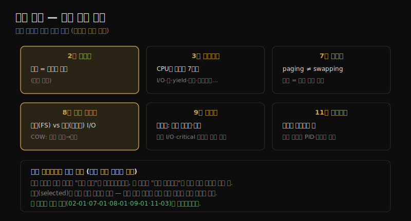

# 부록 — 연습 풀이
---
> 이 노트는 부록 D로, 책 각 장 연습문제 중 *선별된* 풀이입니다. 본문 학습 점검과 별개로, 핵심 개념을 Q&A로 다시 확인하는 용도입니다. 전체 풀이가 아니라 발췌이므로, 여기 없는 장(개념은 본문 학습 점검 참조)도 있습니다.

부록 D는 책의 각 장 연습문제 중 *선별된* 풀이입니다(원서도 "selected"라고 명시 — 전체 풀이는 강사용으로만 제공). 본문 노트의 `## 학습 점검` 이 *우리 노트* 의 자가질문이라면, 이 부록은 *원서 연습문제* 의 모범 답안을 핵심 개념 위주로 모은 것입니다. 장별 핵심 개념을 한 장으로 정리하면 다음과 같습니다.

> 방법론(2장)·운영체제(3장)·메모리(7장)·파일 시스템(8장)·디스크(9장)·클라우드(11장)의 선별 풀이를 장별로 정리합니다. 발췌라 모든 장이 있지는 않습니다.

## 1. 방법론·운영체제 (2·3장)

> 2장은 지연의 정의(무언가를 기다린 시간, 문맥에 따라 다름)를, 3장은 스레드가 CPU를 떠나는 이유(I/O·락 블록·yield·타임슬라이스 만료·선점·인터럽트·종료)를 묻습니다.

**Q(2장). 지연(latency)이란?**

A. 시간의 측정으로, 보통 *무언가가 끝나길 기다린 시간* 입니다. IT 업계에서는 문맥에 따라 다르게 쓰일 수 있습니다.

**Q(3장). 스레드가 CPU를 떠나는 이유를 나열하라.**

A. I/O에 블록 · 락에 블록 · yield 호출 · 타임슬라이스 만료 · 다른 스레드에 선점 · 디바이스 인터럽트 · 종료입니다.

> 두 풀이의 핵심은 *기본 용어·메커니즘의 정확한 정의* 입니다 — 지연은 "기다린 시간"이되 문맥 의존(03-01의 모드 전환 vs 컨텍스트 전환처럼)이고, 스레드가 CPU를 떠나는 일곱 이유는 스케줄러 동작(06-02)·블로킹 분석의 토대입니다. 이 이유들이 off-CPU 분석(왜 CPU를 떠났나)의 분류 축이 됩니다.

## 2. 메모리 (7장)

> 7장은 Linux에서 paging과 swapping의 차이(메모리 페이지 이동 vs swap 장치로의 이동)와, 메모리 사용률·포화의 정의(사용 중인 양 vs 메모리 크기 너머의 수요)를 묻습니다.

**Q. Linux 용어로 paging과 swapping의 차이는?**

A. paging은 *메모리 페이지의 이동* 이고, swapping은 *페이지를 swap 장치/파일로 오가는 이동* 입니다.

**Q. 메모리 사용률과 포화를 기술하라.**

A. 메모리 용량의 *사용률* 은 사용 중이라 가용하지 않은 양을, 총 사용 가능 메모리에 대해 잰 것입니다(파일 시스템 용량처럼 % 표현 가능). *포화* 는 메모리 크기를 넘어선 가용 메모리에 대한 수요로, 보통 이 수요를 채우려 메모리를 비우는 커널 루틴(스캔·reclaim)을 발동시킵니다.

> 메모리 풀이의 핵심은 *paging ≠ swapping*(Linux 한정)과 *포화 = 크기 너머의 수요* 입니다 — 07-01에서 봤듯 Linux는 프로세스 스와핑을 안 쓰고 페이징만 쓰며, "swapping"은 swap 장치 입출력을 가리킵니다. 포화는 사용률(쓰는 양)과 달리 *수요가 크기를 넘은 정도* 라, 스캔·OOM 같은 커널 반응으로 관측됩니다(07-03·07-04).

## 3. 파일 시스템·디스크 (8·9장)

> 8장은 논리 vs 물리 I/O(파일 시스템 인터페이스 vs 디스크)와 COW의 성능 이점(랜덤 쓰기를 순차로 묶음)을, 9장은 디스크 과부하 시 일어나는 일(높은 사용률·포화·지연 증가)을 묻습니다.

**Q(8장). 논리 I/O와 물리 I/O의 차이는?**

A. 논리 I/O는 *파일 시스템 인터페이스* 로의 I/O이고, 물리 I/O는 *스토리지 장치(디스크)* 로의 I/O입니다.

**Q(8장). 파일 시스템 copy-on-write가 어떻게 성능을 개선하나?**

A. 랜덤 쓰기를 새 위치에 쓸 수 있으므로, 그것들을 *묶어서*(I/O 크기를 키워) *순차로* 쓸 수 있습니다. 이 두 요인이 보통 성능을 개선합니다(스토리지 장치 유형에 따라).

**Q(9장). 디스크가 일로 과부하되면 무슨 일이 일어나며, 애플리케이션 성능에 미치는 영향은?**

A. 디스크가 지속적으로 높은 사용률(최대 100%)과 높은 포화(큐잉)로 돕니다. 큐잉 가능성(모델링 가능)으로 I/O 지연이 늘어납니다. 애플리케이션이 *동기 I/O*(읽기·동기 쓰기)를 하고 그게 *critical 코드 경로*(요청 처리 중)에서 일어나면, 늘어난 지연이 앱 성능을 해칩니다 — 비동기 백그라운드 작업이면 간접 영향만 줍니다. 보통 늘어난 I/O 지연의 *back pressure* 가 I/O 요청 속도를 억제해, 지연이 무한정 늘지는 않게 합니다.

> 세 풀이의 핵심은 *논리/물리 구분과 동기 I/O의 영향* 입니다 — 08-01의 논리 vs 물리 I/O가 8·9장을 잇는 축이고(파일 시스템 인터페이스 → 디스크), COW는 랜덤 쓰기를 순차로 바꿔 성능을 개선합니다(08-02). 9장 과부하의 핵심은 *동기 I/O가 critical 경로에 있을 때만* 앱이 직접 느려진다는 점 — 비동기면 간접 영향이고, back pressure가 지연 폭주를 막습니다(09-01).

## 4. 클라우드 (11장)

> 11장은 OS 가상화 게스트에서의 물리 시스템 관측성을 묻습니다 — 호스트 커널 구현에 따라 게스트가 모든 물리 자원의 고수준 메트릭을 보되, 다른 테넌트의 사용자 데이터(PID·프로세스명)는 커널이 차단합니다.

**Q. OS 가상화 게스트에서 물리 시스템 관측성을 기술하라.**

A. 호스트 커널 구현에 따라, 게스트는 모든 물리 자원(CPU·디스크 등)의 *고수준 메트릭* 을 보고, 다른 테넌트가 그것을 쓸 때를 알아챌 수 있습니다. 단 사용자 데이터를 누출하는 메트릭은 커널이 차단해야 합니다 — 예를 들어 CPU 사용률은 관측되지만(가령 50%), 그것을 일으킨 다른 테넌트의 PID·프로세스명은 안 보입니다.

> 클라우드 풀이의 핵심은 *고수준 메트릭은 보되 사용자 데이터는 차단* 입니다 — 11-03에서 봤듯 OS 가상화(컨테이너) 게스트는 시스템 전역 통계(CPU·디스크)가 호스트 것이 새어 나와(idle 컨테이너의 iostat이 바쁘게 나옴) 다른 테넌트 사용을 알아챌 수 있지만, 정보 유출 방지로 다른 테넌트의 프로세스 세부는 안 보입니다. 이것이 11장의 멀티테넌시·관측성 경계의 요약입니다.

## 학습 점검

> 이 노트의 핵심을 스스로 떠올려 봅니다. 답이 막히면 해당 섹션으로 돌아가 확인합니다.

- 지연의 정의와, 스레드가 CPU를 떠나는 일곱 이유를 나열해 봅니다. (→ §1)
- Linux에서 paging과 swapping의 차이, 그리고 메모리 사용률과 포화의 차이를 설명해 봅니다. (→ §2)
- 논리 I/O와 물리 I/O의 차이, COW가 랜덤 쓰기를 어떻게 성능 개선하는지 떠올려 봅니다. (→ §3)
- 디스크 과부하가 앱 성능을 *직접* 해치는 조건(동기 I/O·critical 경로)과, back pressure의 역할을 말해 봅니다. (→ §3)
- OS 가상화 게스트가 무엇은 보고(고수준 메트릭) 무엇은 못 보는지(다른 테넌트 PID·프로세스명) 설명해 봅니다. (→ §4)